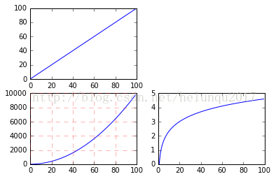

# Matplotlib
Matplotlib是Python最著名的2D绘图库，该库仿造Matlab提供了一整套相似的绘图函数，用于绘图和绘表，强大的数据可视化工具和做图库，适合交互式绘图，图形美观。

import matplotlib.pyplot as plt

%matplotlib inline #notebook中使用，用于显示  

## plt.figure
plt.figure定义一个图像窗口. 使用plt.plot画(x ,y)曲线. 使用plt.show显示图像
fig = plt.figure(figsize=(9,9)) #创建figure  
> figure(num=None, figsize=None, dpi=None, facecolor=None, edgecolor=None, frameon=True)
num:图像编号或名称，数字为编号 ，字符串为名称
figsize:指定figure的宽和高，单位为英寸；
dpi参数指定绘图对象的分辨率，即每英寸多少个像素，缺省值为80      1英寸等于2.5cm,A4纸是 21*30cm的纸张 
facecolor:背景颜色
edgecolor:边框颜色
frameon:是否显示边框

## plt.plot
plt.plot用来画曲线

	plt.figure(num=3, figsize=(8, 5),)
	plt.plot(x, y, color='red', linewidth=1.0, linestyle='--')
	plt.show()
	曲线的颜色属性(color)为红色;曲线的宽度(linewidth)为1.0；曲线的类型(linestyle)为虚线

## 设置坐标轴
	plt.xlim((-1, 2))  #设置x坐标轴范围：(-1, 2)
	plt.ylim((-2, 3))  #设置y坐标轴范围：(-2, 3)
	plt.xlabel('I am x')  #设置x坐标轴名称：’I am x’
	plt.ylabel('I am y')  #设置y坐标轴名称：’I am y’
	plt.xticks([]) #不显示刻度
	plt.xticks(np.linspace(-1, 2, 5)) #显示x轴的刻标，范围是(-1,2);个数是5
	# 设置刻度及对应的标签
	plt.yticks([-2, -1.8, -1, 1.22, 3],[r'$really\ bad$', r'$bad$', r'$normal$', r'$good$', r'$really\ good$'])
	ax = plt.gca()  #获取当前坐标轴信息
	ax.spines['right'].set_color('none') #设置边框：右侧边框，颜色：默认白色
	ax.spines['top'].set_color('none') #设置边框：上边框，颜色：默认白色
	ax.xaxis.set_ticks_position('bottom')  #设置x坐标刻度数字或名称的位置(top，bottom，both，default，none）
	#设置边框：x轴；使用.set_position设置边框位置：y=0的位置,位置所有属性：outward，axes，data）
	ax.spines['bottom'].set_position(('data', 0))  
	# 设置y坐标刻度数字或名称的位置：left.（所有位置：left，right，both，default，none）
	ax.yaxis.set_ticks_position('left')  
	# 设置边框：y轴；使用.set_position设置边框位置：x=0的位置；（位置所有属性：outward，axes，data）
	ax.spines['left'].set_position(('data',0))

## plt.legend
  
legend 图例就是为了帮我们展示出每个数据对应的图像名称  

	l1, = plt.plot(x, y1, label='linear line')
	l2, = plt.plot(x, y2, color='red', linewidth=1.0, linestyle='--', label='square line')
	#legend将要显示的信息来自于上面代码中的 label
	plt.legend(loc='upper right')
	loc参数选择：
	 'best' : 0,          
	 'upper right'  : 1,
	 'upper left'   : 2,
	 'lower left'   : 3,
	 'lower right'  : 4,
	 'right'        : 5,
	 'center left'  : 6,
	 'center right' : 7,
	 'lower center' : 8,
	 'upper center' : 9,
	 'center'       : 10,

## 注释/标注 plt.annotate和plt.text
    

	plt.annotate(r'$2x+1=%s$' % y0, xy=(x0, y0), xycoords='data', xytext=(+30, -30),textcoords='offset points', fontsize=16,
             arrowprops=dict(arrowstyle='->', connectionstyle="arc3,rad=.2"))
	其中参数xycoords='data' 是说基于数据的值来选位置, 
	xytext=(+30, -30) 和 textcoords='offset points' 对于标注位置的描述 和 xy 偏差值,
	arrowprops是对图中箭头类型的一些设置
	plt.text(-3.7, 3, r'$This\ is\ the\ some\ text. \mu\ \sigma_i\ \alpha_t$',fontdict={'size': 16, 'color': 'r'})
	其中-3.7, 3,是选取text的位置, 空格需要用到转字符\ ,fontdict设置文本字体

## plt.subplot创建子图
subplot创建单个子图,subplot可以规划figure划分为n个子图，但每条subplot命令只会创建一个子图
plt.subplot(221) #整个图像窗口分为2行2列, 当前位置为1   
plt.subplot(2,2,2) #将整个图像窗口分为2行2列, 当前位置为2       
> subplot(nrows,ncols,plot_number)
> nrows和ncols表示将画布分成（nrows*ncols）个小区域，每个小区域可以单独绘制图形；plot_number表示将图绘制在第plot_number个子区域。  

fig, ax = plt.subplots(2,2) # 其中参数分别代表子图的行数和列数，一共有 2x2 个图像。函数返回一个figure图像和一个子图ax的array列表  
> subplots和subplot功能相似

add_subplot新增子图  
> add_subplot的参数与subplots的相似  
> x = np.arange(0, 100)  
fig=plt.figure() #新建figure对象
ax1=fig.add_subplot(2,2,1)  #新建子图1      
ax1.plot(x, x) 
ax3=fig.add_subplot(2,2,3)  #新建子图3  
ax3.plot(x, x ** 2)
ax3.grid(color='r', linestyle='--', linewidth=1,alpha=0.3)
ax4=fig.add_subplot(2,2,4)  #新建子图4
ax4.plot(x, np.log(x))  
plt.show()  
  

## add_axes新增子区域  
> left, bottom, width, height = 0.1, 0.1, 0.8, 0.8 # figure的百分比,从figure 10%的位置开始绘制, 宽高是figure的80%  
ax1 = fig.add_axes([left, bottom, width, height])  
ax1.plot(x, y, 'r')
ax1.set_title('area1')
left, bottom, width, height = 0.2, 0.6, 0.25, 0.25 #新增区域ax2,嵌套在ax1内
ax2 = fig.add_axes([left, bottom, width, height]) # 获得绘制的句柄
ax2.plot(x,y, 'b')
ax2.set_title('area2')
plt.show() 
  

## plt.imshow显示图片
plt.imshow(image,cmap='gray') #将一个image显示在二维坐标轴上  
>matplotlib.pyplot.imshow(
    X, 
    cmap=None, 
    norm=None, 
    aspect=None, 
    interplotation=None, 
    alpha=None, 
    Vmin=None, 
    vmax= None, 
    origin=None, 
    extent=None, 
    shape=None, 
    filternorm=1, 
    filterrad=4.0, 
    imlim=None, 
    resample=None,
    url=None, 
    hold=None, 
    data=None, **kwargs)
常用参数:  
- X：类数组对象(array_like)，shape(n,m) 或者(n,m,3)或者(n,m,4)
    把X表示的图片显示在当前坐标轴中。X可以是类数组形式、或者PIL图片。如果X是类数组，它可以有如下3种情况&类型：    ·  MxN - 用来作图的类数组值：float类型 / INT类型   
· MxNx3 - RGB类数组值：float类型 / unit8类型 
· MxNx4 - RGBA类数组值：float类型 /  unit8类型
MxNx3和MxNx4的float类型类数组，取值范围限定为[0.0, 1.0]。MxN类数组是基于norm(采用标量对映射到标量方法作图)和cmap（将标准化标量映射为颜色）。
- interplotation：默认"None"，可用字符串类型命令设定
    可设定的字符串命令为：'none'，'nearest'，'bilinear'，'bicubic'，‘spline16', 'spline36', 'hanning', 'hamming', 'hermite'， 'kaiser'，'quadric'，'catrom'，'gaussian'，'bessel'，'mitchell'， 'sinc'，'lanczos'
如果"None"，默认rc image.interpolation。
如果是"none"，则在Agg，ps和pdf后端不进行插值。其他后端将会落到“最近”。  
不常用参数  
- cmap：默认"None"，可设为 “colormap"
    如果是“None”，默认rc值符合 image.cmap 。如果X是3-D，则cmap会被忽略，而采用 具体的RGB(A)值。
- aspect：默认"None"，可设为['aotu' / 'equal' / scalar]
    如果"None"，默认rc值符合image.aspect，
    如果"auto"，则改变图片的横纵比、以便适应坐标轴的横纵比，
    如果"equal"，同时extent为"None"，则改变坐标轴的横纵比、以便适应图片的；如果extent不为"None"，则改变坐标轴的横纵比、以便适应与之匹配，
- norm：默认"None"，可设为 Normalize
    “Normalize（标准化）”，将2-D的X浮点值转化到[0, 1]区间，再作为cmap的输入值；如果norm是"None"，则使用默认功能：normilize（标准化）/ 如果norm是比如"NoNorm"，X必须是直接指向camp的查询表的整数数组，
- vmin，vmax：默认"None"，可用标量类型命令设定
    vmin和vmax和规范(norm)一起使用来规范（normlize）亮度数据。注：如果你忽略一个norm实例，你的vmin和vmax设定将会被忽略。
- alpha：默认"None"，可用标量型命令设定
    alpha混合值，介于0（透明）和1（不透明）之间
- origin：默认"None"，可选- cmap：默认"None"，可设为 “colormap"
    如果是“None”，默认rc值符合 image.cmap 。如果X是3-D，则cmap会被忽略，而采用 具体的RGB(A)值。
- aspect：默认"None"，可设为['aotu' / 'equal' / scalar]
    如果"None"，默认rc值符合image.aspect，
    如果"auto"，则改变图片的横纵比、以便适应坐标轴的横纵比，
    如果"equal"，同时extent为"None"，则改变坐标轴的横纵比、以便适应图片的；如果extent不为"None"，则改变坐标轴的横纵比、以便适应与之匹配，
- norm：默认"None"，可设为 Normalize
    “Normalize（标准化）”，将2-D的X浮点值转化到[0, 1]区间，再作为cmap的输入值；如果norm是"None"，则使用默认功能：normilize（标准化）/ 如果norm是比如"NoNorm"，X必须是直接指向camp的查询表的整数数组，
- vmin，vmax：默认"None"，可用标量类型命令设定
    vmin和vmax和规范(norm)一起使用来规范（normlize）亮度数据。注：如果你忽略一个norm实例，你的vmin和vmax设定将会被忽略。
- alpha：默认"None"，可用标量型命令设定
    alpha混合值，介于0（透明）和1（不透明）之间
- origin：默认"None"，可选

## plt.scatter绘制散点图 
plt.scatter # 绘制散点图  
> scatter(x, y, s=None, c=None, marker=None, cmap=None, norm=None, vmin=None, vmax=None, alpha=None, linewidths=None, verts=None, edgecolors=None, hold=None, data=None, \*\*kwargs)  
> 参数(Parameters)说明：  
> x，y：array_like，shape（n，）
        输入数据  
    s：标量或array_like，shape（n，），可选
        大小以点数^ 2。默认是`rcParams ['lines.markersize'] ** 2`。    
    c：颜色，顺序或颜色顺序，可选，默认：'b'
        `c`可以是单个颜色格式的字符串，也可以是一系列颜色
        规范的长度为`N`，或一系列`N`数字
        使用通过kwargs指定的`cmap`和`norm`映射到颜色
        （见下文）。请注意，`c`不应该是单个数字RGB或
        RGBA序列，因为这与数组无法区分
        值将被彩色映射。 `c`可以是一个二维数组，其中的
        行是RGB或RGBA，但是，包括单个的情况
        行为所有点指定相同的颜色。    
    marker：`〜matplotlib.markers.MarkerStyle`，可选，默认值：'o'
        请参阅`〜matplotlib.markers`以获取有关不同的更多信息
        标记分散支持的样式。 `marker`可以是
        该类的实例或特定文本的简写
        标记。    
    cmap：`〜matplotlib.colors.Colormap`，可选，默认：无
        一个`〜matplotlib.colors.Colormap`实例或注册名称。
        `cmap`仅在`c`是浮点数组时使用。如果没有，
        默认为rc`image.cmap`。    
    norm：`〜matplotlib.colors.Normalize`，可选，默认：无
        `〜matplotlib.colors.Normalize`实例用于缩放
        亮度数据为0,1。`norm`只有在`c`是一个数组时才被使用
        彩车。如果`None'，则使用默认值：func：`normalize`。    
    vmin，vmax：标量，可选，默认值：无
        `vmin`和`vmax`与`norm`结合使用来标准化
        亮度数据。如果其中任何一个都是`无'，那么最小和最大的
        使用颜色数组。请注意，如果你通过一个“规范”实例，你的
        `vmin`和`vmax`的设置将被忽略。   
    alpha：标量，可选，默认值：无
        alpha混合值，介于0（透明）和1（不透明）之间，   
    linewidths：标量或array_like，可选，默认值：无
        如果无，则默认为（lines.linewidth，）。  
    verts：（x，y）的序列，可选
        如果`marker`为None，这些顶点将用于
        构建标记。标记的中心位于
        在（0,0）为标准化单位。整体标记重新调整
        由``s``完成。
     edgecolors ：颜色或颜色顺序，可选，默认值：无
        如果无，则默认为'face'
        如果'face'，边缘颜色将永远是相同的脸色。
        如果它是'none'，补丁边界不会被画下来。
        对于未填充的标记，“edgecolors”kwarg
        被忽视并被迫在内部“面对”。

## plt.bar 柱状图
	plt.bar(X, Y, facecolor='#9999ff', edgecolor='white')
	#facecolor设置主体颜色，edgecolor设置边框颜色为白色

## 3D图
进行 3D Plot 时除了导入 matplotlib ，还要额外添加一个模块，即 Axes 3D 3D 坐标轴显示  

	import numpy as np
	import matplotlib.pyplot as plt
	from mpl_toolkits.mplot3d import Axes3D
	fig = plt.figure()
	ax = Axes3D(fig)
	# X, Y value
	X = np.arange(-4, 4, 0.25)
	Y = np.arange(-4, 4, 0.25)
	X, Y = np.meshgrid(X, Y)    # x-y 平面的网格
	R = np.sqrt(X ** 2 + Y ** 2)
	# height value
	Z = np.sin(R)
	# rstride 和 cstride 分别代表 row 和 column 的跨度
	ax.plot_surface(X, Y, Z, rstride=1, cstride=1, cmap=plt.get_cmap('rainbow'))   
	# 添加 XY 平面的等高线
	ax.contourf(X, Y, Z, zdir='z', offset=-2, cmap=plt.get_cmap('rainbow'))

# matplotlib.pyplot.hist
画直方图
	plt.hist(data,bins=20)
	将最大值到最小值分为20段，计算每段数据出现的频率

# boxplot
箱型图（也称箱须图(Box-whiskerPlot）

## 参考
[莫烦python](https://morvanzhou.github.io/tutorials/data-manipulation/plt/4-3-plot-in-plot/)    

