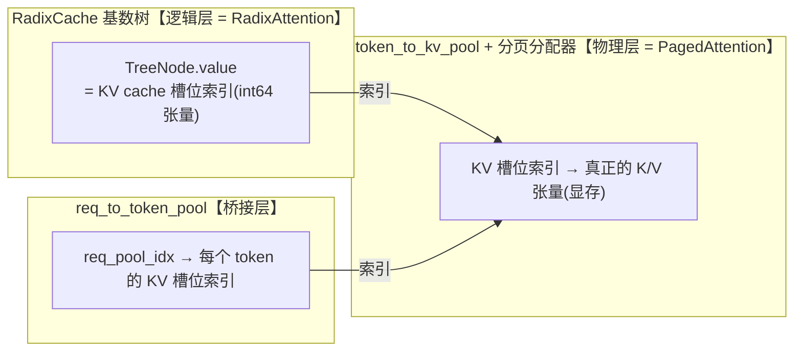
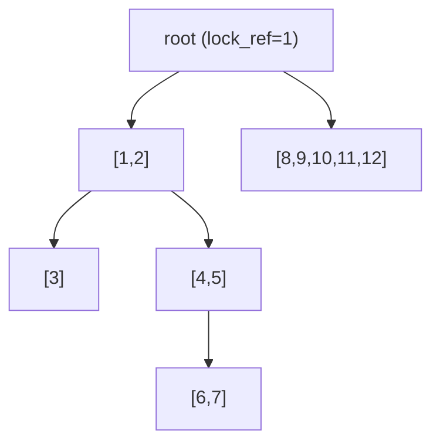
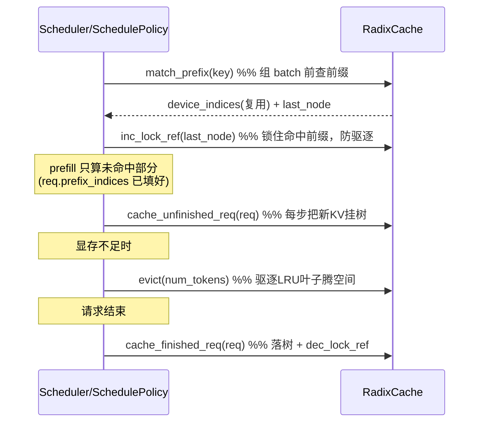

# SGLang RadixAttention 详解

> RadixAttention 是 SGLang 的招牌特性，用一棵**基数树（radix tree）**管理 KV 缓存，实现**跨请求的前缀自动复用（prefix caching）**。
> 核心实现：`python/sglang/srt/mem_cache/radix_cache.py`（`RadixKey` / `TreeNode` / `RadixCache`）。
> 本文行号基于当前 `main`，会随版本漂移，**以类名/方法名为准**。

---

## 一、它解决什么问题

LLM 推理里，很多请求共享相同前缀：
- 同一个 system prompt 下的大量对话
- few-shot 示例完全相同、只换最后一个问题
- 多轮对话里前几轮历史不变

这些相同前缀的 **KV cache 计算结果是完全一样的**。如果每个请求都重算一遍 prefill，就浪费了大量算力和显存。

**RadixAttention 的核心思想**：把所有请求的 token 序列组织成一棵基数树，相同前缀自然落在树上同一条路径；新请求进来时先在树上"查最长公共前缀"，命中的部分**直接复用已有的 KV cache，跳过重算**。

它和经典 PagedAttention 的关系：PagedAttention 解决"KV 显存如何分页存放不浪费"；RadixAttention 解决"哪些 KV 可以跨请求共享复用"。SGLang 两者都用——**完整对比见第九节**。

---

## 二、三层内存结构（先理解数据怎么存）

RadixAttention 不直接存 KV 张量，而是存**索引**。整体是三层映射：



> 这三层正好对应 **RadixAttention（逻辑层，管共享）** 与 **PagedAttention（物理层，管存储）** 的分工，二者的关系详见第九节。

- **`token_to_kv_pool`（token_to_kv_pool_allocator）**：真正存放每个 token 的 K/V 张量的显存池，按"槽位（slot）"分配。
- **`req_to_token_pool`**：把每个运行中请求（`req_pool_idx`）的第 i 个 token 映射到它在 KV 池里的槽位索引。
- **`RadixCache` 树**：每个 `TreeNode.value` 是一段 KV 槽位索引（`torch.int64` 张量）。一条从根到节点的路径 = 一段连续 token 序列 = 它们对应的一串 KV 槽位。

所以"复用前缀"本质是：**让新请求的这些 token 直接指向树上已有节点的 KV 槽位索引**，无需重新分配、重新计算。

---

## 三、三个核心数据结构（`radix_cache.py`）

### 3.1 `RadixKey`（约 56 行）—— 树的"键"

封装一段 token id 序列，外加几个关键能力：

| 字段 | 作用 |
| --- | --- |
| `token_ids` | token id 序列（`array("q")`，即 int64） |
| `extra_key` | **命名空间隔离**：LoRA id、cache salt 等。`extra_key` 不同的请求**绝不共享前缀**（见第七节） |
| `is_bigram` | EAGLE 投机解码用的 bigram 视图（相邻 token 配对） |
| `limit` | 逻辑截断，避免 O(n) 拷贝 |

关键方法：
- `match(other, page_size)`（158 行）：求与另一个 key 的**最长公共前缀长度**。用了**指数搜索 + 二分**（gallop），在 C 层做整段切片比较，避免逐 token 的 Python 循环——这是长前缀匹配快的关键。
- `child_key(page_size)`（194 行）：取前 `page_size` 个 token 作为子节点的字典 key（按 `extra_key` 命名空间隔离）。
- `page_aligned(page_size)`（132 行）：把长度向下取整到 `page_size` 的倍数。

### 3.2 `TreeNode`（约 222 行）—— 树的"节点"

| 字段 | 作用 |
| --- | --- |
| `children` | `defaultdict`，key 是 `child_key`，值是子节点 |
| `key` | 本节点代表的那段 `RadixKey`（一段 token） |
| `value` | 对应的 KV 槽位索引张量；`value is None` 表示已被驱逐（`evicted`） |
| `lock_ref` | **引用计数锁**：>0 表示有请求正在用，不可被驱逐（见第六节） |
| `last_access_time` | LRU 驱逐用的时间戳 |
| `priority` | 优先级感知驱逐用 |
| `host_value` / `host_ref_counter` | HiCache 分层：备份到 host(CPU) 内存的索引（见第八节） |
| `hash_value` | 各 page 的 SHA256，用于持久化存储/事件 |

### 3.3 `RadixCache`（约 285 行）—— 树本体

继承 `BasePrefixCache`（统一接口）和 `KVCacheEventMixin`（KV 事件）。持有 `req_to_token_pool` 和 `token_to_kv_pool_allocator`，根节点 `root_node` 的 `lock_ref=1`（永不驱逐）。

---

## 四、核心操作 1：`match_prefix` —— 查最长公共前缀

入口：`match_prefix(params)`（358 行）→ `_match_prefix_helper`（643 行）。

```python
def _match_prefix_helper(self, node, key):
    child_key = key.child_key(self.page_size)
    value = []
    while len(key) > 0 and child_key in node.children:
        child = node.children[child_key]
        prefix_len = child.key.match(key, page_size=self.page_size)
        if prefix_len < len(child.key):
            # 命中落在某节点中间 → 把该节点从中间“劈开”
            new_node = self._split_node(child.key, child, prefix_len)
            value.append(new_node.value)
            node = new_node
            break
        else:
            # 整段命中 → 继续往下匹配剩余 key
            value.append(child.value)
            node = child
            key = key[prefix_len:]
            child_key = key.child_key(self.page_size)
    return value, node
```

要点：
- 沿树逐段下行，把命中的各节点 `value`（KV 槽位索引）收集起来，最后 `torch.cat` 成一条完整的复用索引。
- **节点劈裂 `_split_node`（669 行）**：如果匹配在某个节点的中间结束，就把这个节点从断点处一分为二，暴露出精确边界。这不复制 KV 数据，只是细化树结构，让后续匹配更精准。
- 返回 `MatchResult`：`device_indices`（可复用的 KV 索引）+ `last_device_node`（命中路径的末端节点）。

调度侧的调用：`srt/managers/schedule_policy.py:match_prefix_for_req`（85 行）为每个等待请求查前缀，把结果写进 `req.prefix_indices`，prefill 时这部分就不用重算了。

---

## 五、核心操作 2：`insert` —— 把新算出的 KV 挂上树

入口：`insert(params)`（418 行）→ `_insert_helper`（699 行）。

逻辑与 match 类似：沿树下行匹配已有前缀，匹配不上的剩余部分，新建一个 `TreeNode` 挂上去，`value` 指向这段新 token 的 KV 槽位索引。返回**已存在的前缀长度** `prefix_len`。

请求生命周期里有两个时机调用：

| 方法 | 时机 | 行为 |
| --- | --- | --- |
| `cache_unfinished_req`（485 行） | 一个 batch step 跑完、请求还没结束 | 把已生成部分插入树，更新 `req.prefix_indices` / `req.last_node`，并把重复的 KV 槽位释放掉 |
| `cache_finished_req`（438 行） | 请求结束 | 插入完整序列，释放重复及不对齐的尾部，解锁 `req.last_node` |

关键细节（`cache_unfinished_req`）：插入后会重新 `match_prefix` 拿到树里"权威"的索引，把 `req_to_token_pool` 里该请求的映射改成指向树上的共享索引，从而真正实现"多个请求指向同一份 KV"。重复分配的槽位通过 `token_to_kv_pool_allocator.free(...)` 还回去。

---

## 六、核心操作 3：驱逐与锁（显存不够时怎么办）

KV 显存有限，树会越长越大。当需要空间时，调度器调用 `evict`。

### 6.1 `lock_ref` 引用计数：保护正在使用的前缀

- `inc_lock_ref(node)`（587 行）：从该节点一路到根，每个节点 `lock_ref += 1`。被锁住的部分从"可驱逐"转为"受保护"（`evictable_size_` → `protected_size_`）。
- `dec_lock_ref(node)`（602 行）：反向解锁。
- 正在被某个运行请求引用的前缀路径 `lock_ref > 0`，**绝不会被驱逐**，避免把别人正在用的 KV 删掉。

### 6.2 `evict`：基于策略的叶子驱逐（558 行）

```python
def evict(self, params):
    leaves = list(self.evictable_leaves)             # 只从“可驱逐叶子”里选
    eviction_heap = [(strategy.get_priority(n), n) for n in leaves]
    heapq.heapify(eviction_heap)                     # 小顶堆
    num_evicted = 0
    while num_evicted < num_tokens and eviction_heap:
        _, x = heapq.heappop(eviction_heap)          # 取优先级最低的叶子
        self.token_to_kv_pool_allocator.free(x.value)  # 释放它的 KV 显存
        num_evicted += len(x.value)
        self._delete_leaf(x)
        # 父节点变叶子且没被锁 → 也可能被驱逐
        if len(x.parent.children) == 0 and x.parent.lock_ref == 0:
            heapq.heappush(eviction_heap, (strategy.get_priority(x.parent), x.parent))
```

要点：
- 只驱逐**叶子节点**（`evictable_leaves` 集合维护，`_update_leaf_status` 实时更新），保证驱逐子节点后父节点才可能成为新叶子，从叶往根逐步回收。
- 默认策略是 **LRU**（按 `last_access_time`），`TreeNode.__lt__` 比较的就是访问时间；也支持优先级感知策略（`eviction_policy` / `get_eviction_strategy`）。
- `evictable_size()` / `protected_size()` 给调度器判断当前还能回收多少。

---

## 七、一个完整例子（树长什么样）

依次插入 4 个序列（`__main__` 里就有类似演示）：

```
insert [1,2,3]
insert [1,2,4,5]
insert [1,2,4,5,6,7]
insert [8,9,10,11,12]
```

形成的树（root 下两条分支，`[1,2]` 被共享）：



此时 `match_prefix([1,2,3,13,14])`：
- 沿 `[1,2] → [3]` 命中前 3 个 token（`[1,2,3]`），返回这 3 个 token 的 KV 索引。
- 第 4 个 token `13` 在树上无分支 → 匹配停止。
- 新请求只需对 `13,14` 做 prefill，前 3 个 token 直接复用，省掉重算。

如果命中落在节点中间（比如 match `[1,2,4]`，只命中 `[4,5]` 的一半），`_split_node` 会把 `[4,5]` 劈成 `[4]` 和 `[5]`，精确暴露边界。

---

## 八、进阶机制

### 8.1 `page_size`：分页对齐

当 `page_size > 1`（配合分页 KV 分配器），key 会 `page_aligned` 向下取整，`child_key` 以一页为单位。匹配/插入都以 page 为粒度，尾部不足一页的部分单独处理（`cache_protected_len` 字段就是为了正确释放这种"半页"尾巴，见 530 行注释）。

### 8.2 `extra_key`：命名空间隔离

`match_prefix` 的注释（358 行）说明：`extra_key` 不同的请求**永不共享前缀节点**。典型用途：
- 隔离不同 **LoRA / adapter** 的 KV 缓存
- 不同 **cache salt / 版本 / RAG 上下文**，故意不让它们串味

`_check_compatible` 会强制 `extra_key` 一致才允许匹配。

### 8.3 EAGLE bigram（投机解码）

`is_eagle=True` 时走 bigram 视图：相邻 token 配对 `(t_i, t_{i+1})` 作为逻辑单元。`maybe_to_bigram_view`（138 行）O(1) 翻转标志位即可，无需物化成 tuple 列表。

### 8.4 HiCache：分层缓存（host / 远程存储）

`TreeNode` 的 `host_value` / `host_ref_counter` / `hash_value` 支撑**多级缓存**：显存放不下的热数据可以备份到 host(CPU) 内存甚至远程存储（Mooncake/HF3FS 等），命中后再换回显存。相关实现：`hiradix_cache.py`、`hicache_storage.py`、`storage/` 目录。`hash_value`（各 page 的 SHA256）是持久化和去重的依据。

### 8.5 其它变体

`mem_cache/` 下还有针对不同场景的实现，接口统一在 `base_prefix_cache.py`：
- `swa_radix_cache.py` — sliding window attention
- `mamba_radix_cache.py` / `hi_mamba_radix_cache.py` — Mamba/混合架构
- `radix_cache_cpp.py` / `cpp_radix_tree/` — C++ 加速版
- `chunk_cache.py` — 不做前缀复用的简单分块缓存（基线）

---

## 九、RadixAttention 与 PagedAttention 的关系

这两个词常被并列提及，但它们解决的是**两个不同维度**的问题，不是二选一，而是在 SGLang 里**一上一下两层协作**。

### 9.1 一句话本质

> **PagedAttention 解决"KV 在显存里怎么存"（物理层）；RadixAttention 解决"哪些 KV 可以跨请求共享复用"（逻辑层）。** SGLang 把 RadixAttention 叠在分页分配器之上同时用。

### 9.2 各自解决的问题不同

| | PagedAttention | RadixAttention |
| --- | --- | --- |
| 解决什么 | KV 显存的**碎片化** | 相同前缀的**重复计算/重复存储** |
| 思路类比 | 操作系统**虚拟内存分页** | **基数树前缀共享** |
| 关注点 | KV 物理上放在哪、怎么不浪费 | 哪段 KV 逻辑上能被复用 |
| 粒度 | 固定大小的 page（块） | 任意长度的前缀路径 |
| 收益 | 显存利用率高、支持非连续存储 | 跳过重复 prefill、省算力省显存 |

### 9.3 在 SGLang 里是分层叠加的

对应第二节的三层内存模型：

- **RadixCache 在逻辑层**（`radix_cache.py`）：不碰真正的 KV 张量，只管理**槽位索引（int64）**。`TreeNode.value` 就是一段 KV 槽位索引。
- **Paged allocator 在物理层**（`allocator/paged.py` 的 `PagedTokenToKVPoolAllocator`）：按 page 管理这些槽位的分配与回收。
- 二者通过**"槽位索引"这套共同货币**对接：RadixCache 复用前缀就是复用索引；驱逐节点时调用 `token_to_kv_pool_allocator.free(node.value)` 把索引以整页还回分页池。

### 9.4 `page_size` 是连接两者的关键参数

RadixCache 里到处出现的 `page_size`，正是分页的块大小：

- **`page_size = 1`（token 级，SGLang 经典模式）**：每 token 独立成槽，前缀可在**任意 token 边界**共享，`RadixKey.match` 返回精确匹配长度。
- **`page_size > 1`（真正分页，类似 vLLM block）**：
  - RadixCache 端：`key.page_aligned(page_size)` 把 key 向下取整到整页，`child_key` 以一页为单位（`radix_cache.py:132/194`）→ 共享只能发生在 **page 边界**。
  - Allocator 端：`alloc` 返回页对齐连续索引，`alloc_extend` / `alloc_decode` 用 Triton kernel 按页扩展，`free` 以整页回收（`paged.py:122/145/234`）。

代码里的 `cache_protected_len`（`radix_cache.py:530` 注释）就是处理 `page_size>1` 时"末尾不足一页的半页 KV"——不进树共享但要正确释放，正是分页粒度与前缀共享粒度交界处的细节。

### 9.5 "PagedAttention" 的两层含义

这个词其实指两件相关的事，SGLang 都涉及：

1. **分页内存管理**（上面讲的）：对应 `PagedTokenToKVPoolAllocator`。
2. **分页 attention kernel**：attention 计算要能从**非连续的分页 KV 布局**按索引读取 K/V，在 `srt/layers/attention/`（FlashInfer / Triton 等 backend）里实现，按 `req_to_token` 给出的槽位索引 gather KV。

RadixAttention 复用前缀后，复用来的 KV 索引被写回 `req_to_token_pool`，attention kernel 照常按索引读取——**对 kernel 而言，复用来的 KV 和新算的 KV 没有区别**，这正是两者能无缝叠加的原因。

### 9.6 与 vLLM 的对比（帮助定位）

- vLLM：以 **PagedAttention + block 级 prefix caching**（按 block 哈希共享）为主，共享粒度固定在 block 边界。
- SGLang：以 **RadixAttention（树形、支持节点劈裂 `_split_node` 精化边界、可在任意/页边界共享）** 为核心，底层同样用分页分配器做物理管理。

换句话说：vLLM 的前缀缓存是 PagedAttention 的附加能力；SGLang 把前缀共享提升为一等公民（RadixAttention），分页只是它的物理后端。

### 9.7 小结

```
PagedAttention（物理层）：KV 怎么存 —— 分页、抗碎片、非连续布局
        ▲  通过“KV 槽位索引”对接
        │
RadixAttention（逻辑层）：KV 怎么共享 —— 基数树、最长前缀复用、跳过重算

二者由 page_size 串起：
  page_size=1  → token 级共享（SGLang 经典）
  page_size>1  → page 级共享（与分页对齐，类 vLLM block）
```

它们不是竞争关系：RadixAttention 决定"复用谁"，PagedAttention 决定"存哪里、怎么不浪费"。

---

## 十、与调度器的协作（请求视角）

把 RadixAttention 放回"一条请求的旅程"里：



对应代码：
- 查前缀：`schedule_policy.py:match_prefix_for_req`（85 行）→ `req.prefix_indices`
- 加锁/解锁：`schedule_policy.py` 的 `_req_inc_lock_ref`（669 行）等
- 落树：scheduler 在 `process_batch_result` 路径调用 `cache_unfinished_req` / `cache_finished_req`

---

## 十一、一句话总结

> RadixAttention 用一棵基数树把所有请求的 token 序列组织起来，节点存的是 KV 缓存槽位索引而非张量本身；新请求通过 `match_prefix` 找最长公共前缀直接复用 KV、跳过重算（`_split_node` 精化边界），通过 `insert` 把新算的 KV 挂树，通过 `lock_ref` 保护在用前缀、通过 LRU `evict` 回收叶子腾显存。配合 `page_size` 分页、`extra_key` 隔离、EAGLE bigram、HiCache 分层，构成 SGLang 高吞吐的核心。

---

## 关键代码速查

| 主题 | 文件 | 类/方法（行号） |
| --- | --- | --- |
| 树键 | `mem_cache/radix_cache.py` | `RadixKey`（56）、`match`（158）、`child_key`（194） |
| 树节点 | `mem_cache/radix_cache.py` | `TreeNode`（222） |
| 树本体 | `mem_cache/radix_cache.py` | `RadixCache`（285） |
| 查前缀 | `mem_cache/radix_cache.py` | `match_prefix`（358）、`_match_prefix_helper`（643）、`_split_node`（669） |
| 插入 | `mem_cache/radix_cache.py` | `insert`（418）、`_insert_helper`（699） |
| 请求落树 | `mem_cache/radix_cache.py` | `cache_unfinished_req`（485）、`cache_finished_req`（438） |
| 锁与驱逐 | `mem_cache/radix_cache.py` | `inc_lock_ref`（587）、`dec_lock_ref`（602）、`evict`（558） |
| 统一接口 | `mem_cache/base_prefix_cache.py` | `BasePrefixCache` / `MatchPrefixParams` / `InsertParams` |
| 调度协作 | `managers/schedule_policy.py` | `match_prefix_for_req`（85） |
| 分层/持久化 | `mem_cache/hiradix_cache.py`、`hicache_storage.py`、`storage/` | HiCache |
