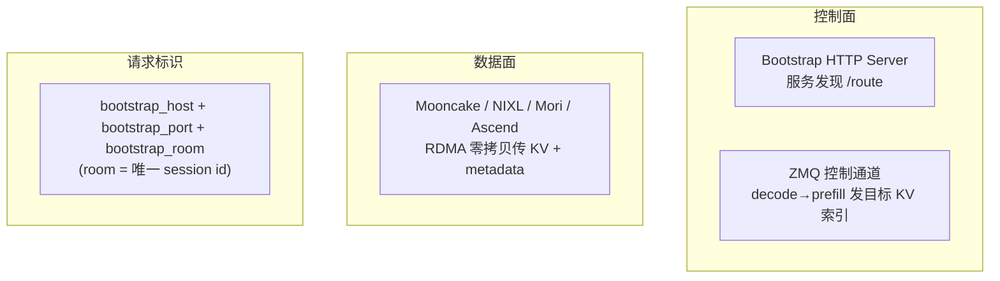
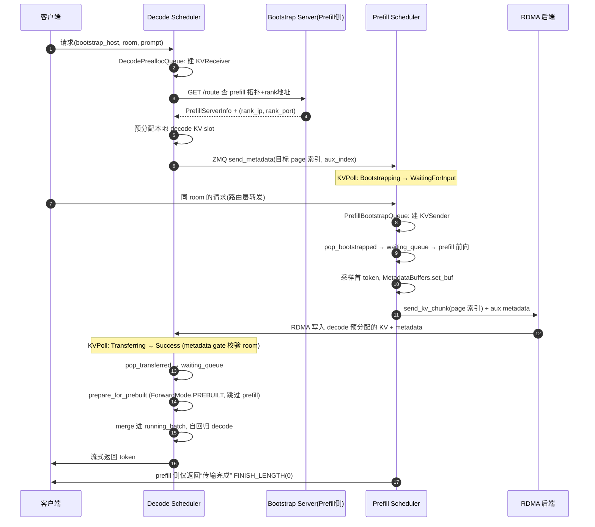

# SGLang PD 分离详解

> PD 分离把 LLM 推理的两个阶段——**Prefill（处理 prompt、算 KV、出首 token）**和 **Decode（自回归逐 token 生成）**——拆到**不同的实例/GPU 集群**上运行，各自独立扩缩容、独立优化，通过高速网络（RDMA）传输 KV cache 衔接。
> 核心目录：`python/sglang/srt/disaggregation/`。行号会漂移，**以类名/方法名为准**。

---

## 一、为什么要分离 Prefill 和 Decode

Prefill 和 Decode 的计算特性截然相反：

| | Prefill（prompt 处理） | Decode（逐 token 生成） |
| --- | --- | --- |
| 计算特性 | **算力受限**（compute-bound）：一次处理整个 prompt | **访存受限**（memory-bound）：每步只算 1 个 token |
| 批处理 | 少量长序列就能打满算力 | 需要大 batch 才能提高利用率 |
| 延迟指标 | TTFT（首 token 延迟） | TPOT / ITL（token 间延迟） |
| 理想配置 | 高算力、可少卡 | 大显存放 KV、大 batch |

如果混在一台机器上跑（unified），两种负载会互相干扰：一个大 prefill 会**阻塞**正在 decode 的请求，拉高 TPOT；反之为了低 TPOT 又难以喂饱 prefill。

**PD 分离的收益**：
- 两类实例**独立配比与扩缩容**（比如 2 台 prefill + 8 台 decode）。
- 各自用最优的并行策略、batch 策略、CUDA graph 配置。
- prefill 的突发不再抖动 decode 的延迟。

代价是：需要把 prefill 算出的 **KV cache 跨机器传输**给 decode，这就是 PD 分离工程上的核心难点，SGLang 用 RDMA（Mooncake / NIXL 等）解决。

---

## 二、三个角色与总体架构

| 角色 | 启动方式 | 职责 |
| --- | --- | --- |
| **Prefill Server** | `--disaggregation-mode prefill` | 接 prompt，做 extend/prefill 前向，采样**第一个 token**，把 KV + 首 token metadata 发给 decode |
| **Decode Server** | `--disaggregation-mode decode` | 接带 `bootstrap_room` 的请求，预分配本地 KV，握手后告诉 prefill 目标地址，收 KV，**跳过 prefill 前向**直接 decode |
| **Bootstrap Server** | 随 Prefill 侧 TokenizerManager 自动启动（HTTP，默认端口 8998） | 服务发现：prefill 各 rank 注册 `(ip, port)`，decode 查询拓扑并建立连接 |

三层协议栈：



---

## 三、一条请求的完整流转（主线）

这是理解 PD 分离最重要的一张图。注意：**请求先到 Decode，再由 Decode 反向驱动 Prefill**（decode 先预分配好接收空间，prefill 才知道往哪写）。



一句话主线：

> 客户端把带 `bootstrap_room` 的请求发给 **Decode**；Decode 经 Bootstrap 发现 Prefill 地址、预分配本地 KV 后，通过 **ZMQ 控制面**把目标 page 索引发给 Prefill；Prefill 完成 extend 后通过 **RDMA 数据面**把 KV + 首 token 写进 Decode 预分配 slot；Decode 构造 **Prebuilt batch** 跳过 prefill 前向，直接进入 autoregressive decode 并流式输出。

---

## 四、状态机：请求经历哪些状态

KV 传输状态 `KVPoll`（`base/conn.py:76`）：

```
Failed=0, Bootstrapping=1, WaitingForInput=2, Transferring=3, Success=4
```

**Prefill 侧 sender**：
```
Bootstrapping        ← create_sender（等 decode 来握手）
    ↓ decode 的 send_metadata 到达
WaitingForInput      ← finalize_bootstrap（sender.init 拿到目标地址）
    ↓ send_kv_chunk 开始
Transferring
    ↓ RDMA 完成
Success              ← process_disagg_prefill_inflight_queue（释放 KV, 结束）
```

**Decode 侧 receiver**：
```
Bootstrapping        ← create receiver
    ↓ init() 查到 prefill info
WaitingForInput      ← 预分配完成, send_metadata 发出
    ↓ prefill 开始 RDMA
Transferring
    ↓ KV + metadata 落地
Success              ← pop_transferred → waiting_queue
```

两个关键的一致性机制（`utils.py`）：
- **Metadata gate**（`_apply_metadata_gate`，`utils.py:78`）：decode 即使 poll 到 `Success`，若 metadata buffer 里的 `bootstrap_room` 还是 0（数据没真正落地），就降级回 `Transferring`，防止提前 commit。
- **跨 TP 同步**（`poll_and_all_reduce`，`utils.py:96`）：对所有 TP rank 的 poll 结果做 `MIN` all-reduce，保证所有 rank 步调一致推进（避免部分 rank 抢跑）。

---

## 五、Prefill 侧实现（`prefill.py`）

### 5.1 关键类

| 类/方法 | 行号 | 作用 |
| --- | --- | --- |
| `PrefillBootstrapQueue` | 102 | 管理 bootstrap 中的请求：建 sender、poll 状态、完成后移入 waiting_queue |
| `create_sender` | 228 | 按 backend 建 `req.disagg_kv_sender` |
| `finalize_bootstrap` | 264 | 握手完成后分配 metadata buffer，`sender.init(num_pages, aux_index)` |
| `pop_bootstrapped` | 309 | poll sender，`WaitingForInput` 的请求出队进 waiting |
| `SchedulerDisaggregationPrefillMixin` | 393 | prefill event loop、KV 发送、inflight poll |
| `send_kv_chunk` | 919 | 把算好的 KV page 索引发给 decode |
| `process_batch_result_disagg_prefill` | 509 | prefill 完成后入 inflight queue 并触发发送 |
| `process_disagg_prefill_inflight_queue` | 682 | poll 传输完成，释放 KV，结束 prefill 侧请求 |

### 5.2 握手（bootstrap）

1. `create_sender` 建 sender，状态 `Bootstrapping`。
2. decode 的 `send_metadata` 到达后，sender poll 变 `WaitingForInput`。
3. `pop_bootstrapped` 检测到后 `finalize_bootstrap`：拿 decode 已有前缀长度 `pop_decode_prefix_len()`（**只传 delta**，decode 已缓存的前缀不重复传），分配 metadata buffer，`sender.init(num_pages, metadata_buffer_index)`。

```python
def finalize_bootstrap(self, req):
    decode_prefix_len = req.disagg_kv_sender.pop_decode_prefix_len()
    req.start_send_idx = decode_prefix_len
    num_kv_indices_to_send = num_kv_indices - decode_prefix_len
    num_pages = kv_to_page_num(num_kv_indices_to_send, page_size)
    req.disagg_kv_sender.init(num_pages, req.metadata_buffer_index)
```

> **Optimistic prefill**（`optimistic_prefill_retries>0`）：允许在 bootstrap 还没完成时就乐观地做 forward，失败再 `optimistic_release_and_requeue`，隐藏握手延迟。

### 5.3 发送 KV

prefill 前向完成后 `process_batch_result_disagg_prefill`：append 首 token → 入 inflight queue → `send_kv_chunk(req, last_chunk=True)`。

`send_kv_chunk`（919）：从 `req_to_token_pool` 取 `[start_send_idx, end_idx)` 的 KV 索引；支持 chunked prefill 分块发送；**最后一块**时 `MetadataBuffers.set_buf(req)` 写入首 token / logprob / spec 状态，然后 `sender.send(page_indices, state_indices)`。

### 5.4 Prefill Event Loop（`event_loop_normal_disagg_prefill`，428）

```python
while True:
    recv_reqs = self.request_receiver.recv_requests()
    self.process_input_requests(recv_reqs)
    self.waiting_queue.extend(self.disagg_prefill_bootstrap_queue.pop_bootstrapped())
    batch = self.get_next_disagg_prefill_batch_to_run()
    if batch:
        result = self.run_batch(batch)
        self.process_batch_result(batch, result)   # → 触发 send_kv_chunk
    self.process_disagg_prefill_inflight_queue()     # poll 传输完成
```

---

## 六、Decode 侧实现（`decode.py` 等）

### 6.1 关键类

| 类/方法 | 文件:行号 | 作用 |
| --- | --- | --- |
| `DecodeReqToTokenPool` | `decode.py:105` | 比标准 pool 多 `pre_alloc_size`，容纳预分配+传输中的请求 |
| `DecodeRequest` | `decode.py:249` | 包装 `Req` + `kv_receiver` + metadata/hicache 状态 |
| `DecodePreallocQueue` | `decode.py:271` | 握手、预分配 KV、发 metadata、移入 transfer queue |
| `DecodeTransferQueue` | `decode.py:1434` | poll KV 传输、commit metadata、移入 waiting_queue |
| `SchedulerDisaggregationDecodeMixin` | `decode.py:1744` | decode event loop、Prebuilt batch 构造 |
| `prepare_for_prebuilt` | `decode_schedule_batch_mixin.py:24` | 跳过 extend 前向，直接填 decode batch 元数据 |
| `DecodeHiCache*Mixin` | `decode_hicache_mixin.py` | decode 侧 radix/HiCache 优化 |

### 6.2 三段队列流水线

decode 侧请求依次经过三个队列（`process_decode_queue`，`decode.py:1937` 周期性推进）：

1. **PreallocQueue（预分配）**：
   - 建 `kv_receiver` → 握手（poll → `WaitingForInput`）。
   - `pop_preallocated`（764）：做内存预算检查（含 radix cache 前缀匹配、`num_reserved_decode_tokens` 预留），`_pre_alloc()` 分配 `req_pool_idx` + KV pages，然后 `kv_receiver.send_metadata(page_indices, metadata_buffer_index, state_indices, decode_prefix_len)`。**只请求 delta 索引**（decode 已有前缀不重复传）。

2. **TransferQueue（传输中）**：
   - `pop_transferred`（1617）：poll → `Success` 后 `_commit_transfer_to_req` 从 `MetadataBuffers` 读首 token、cached_tokens、logprob、spec hidden states，释放 receiver，请求进 `waiting_queue`。

3. **WaitingQueue → RunningBatch（Prebuilt）**：
   - `get_new_prebuilt_batch` + `prepare_for_prebuilt`：设 `ForwardMode.PREBUILT`，**跳过 prefill kernel**，merge 进 `running_batch` 正常 decode。

### 6.3 Decode 侧的优化开关

- `disaggregation_decode_enable_radix_cache`：decode 侧也建 radix cache，命中的前缀无需 prefill 重传，减少 KV 传输量。
- `disaggregation_decode_enable_offload_kvcache`：decode KV 异步 offload 到 HiCache 存储层。

---

## 七、KV 传输后端（`base/conn.py` + 各 backend）

### 7.1 抽象接口（`base/conn.py`）

| 类 | 行号 | 核心方法 |
| --- | --- | --- |
| `KVArgs` | 35 | KV/aux/state buffer 指针、page_size、PP 层范围、IB 设备等 |
| `BaseKVManager` | 84 | `register_to_bootstrap()` |
| `BaseKVSender` | 102 | `init()` / `send()` / `poll()` / `failure_exception()` |
| `BaseKVReceiver` | 158 | `init()` / `send_metadata()` / `poll()` / `clear()` / `abort()` |
| `BaseKVBootstrapServer` | 218 | HTTP bootstrap 服务抽象 |
| `KVPoll` | 76 | 状态常量（见第四节） |
| `StateType` | 17 | 非标准 KV 状态：MAMBA / SWA / DSA / SWA_RING（混合架构 / 稀疏注意力等） |

### 7.2 后端实现（`get_kv_class` 工厂，`utils.py:422`）

| Backend | 枚举 | 文件 | 定位 |
| --- | --- | --- | --- |
| **mooncake** | `MOONCAKE` | `mooncake/conn.py` | **默认**，Mooncake Transfer Engine + IB RDMA，最成熟 |
| mooncake_tcp | — | mooncake 变体 | TCP 传输（无 IB 环境） |
| **nixl** | `NIXL` | `nixl/conn.py` | NVIDIA NIXL 传输库 |
| **mori** | `MORI` | `mori/conn.py` | Mori IOEngine RDMA |
| **ascend** | `ASCEND` | `ascend/conn.py` | 华为 NPU，继承 Mooncake 架构换 `AscendTransferEngine` |
| **fake** | `FAKE` | `fake/conn.py` | 测试/warmup，无真实传输，poll 直接 Success |

公共层 `common/conn.py` 的 `CommonKVManager` / `CommonKVSender` / `CommonKVReceiver` / `CommonKVBootstrapServer` 封装了 ZMQ socket、rank 映射、bootstrap HTTP（`PUT/GET /route`）等通用逻辑，各后端只需实现真正的数据搬运。

### 7.3 Bootstrap Server 服务发现

- **Prefill 注册**（`register_to_bootstrap`，`common/conn.py:389`）：每个 prefill rank 把 `attn_tp_size`、`rank_ip`、`rank_port`、`page_size` 等 `PUT /route` 到 bootstrap。
- **Decode 发现**：先 `GET /route`（不带 rank）拿并行拓扑 `PrefillServerInfo`（TP/CP/DP/PP 大小），再按目标 rank `GET /route?...` 拿具体 `(rank_ip, rank_port)` 建 ZMQ 连接。
- **启动位置**：仅 prefill 模式的 TokenizerManager 调用 `start_disagg_service`（`managers/disagg_service.py`）。

### 7.4 MetadataBuffers：传的不只是 KV（`utils.py:197`）

除了 KV cache 本体，还有一块 `MetadataBuffers` 随 RDMA 传给 decode（`set_buf` 在 prefill 侧写，`get_buf` 在 decode 侧读）：

- `output_ids`：prefill 采样的**第一个 token**（decode 从它开始生成）。
- `cached_tokens`：缓存命中计数；slot 4-6 复用来传多模态 token 计数（image/audio/video）。
- `output_token_logprobs_*` / `output_top_logprobs_*`：logprob 信息。
- `output_topk_p` / `output_topk_index` / `output_hidden_states`：**PD + 投机解码**时，把 draft 需要的 hidden/topk 一起传过去。
- `bootstrap_room`：用于 decode 侧校验 metadata 是否真的落地（metadata gate）。

为满足 RDMA 最小 64 字节对齐，很多字段 padding 到 16 宽。

---

## 八、调度器集成（`scheduler.py`）

### 8.1 Mixin 与初始化

Scheduler 混入 `SchedulerDisaggregationDecodeMixin` 和 `SchedulerDisaggregationPrefillMixin`（`scheduler.py:292`）。`init_disaggregation`（约 1080）按模式创建对应队列：
- Decode：`MetadataBuffers` + `DecodeTransferQueue` + `DecodePreallocQueue`。
- Prefill：`MetadataBuffers` + `PrefillBootstrapQueue` + `disagg_prefill_inflight_queue`。

### 8.2 请求入队分流（`_add_request_to_queue`，约 2219）

```python
elif self.disaggregation_mode == DisaggregationMode.PREFILL:
    self.disagg_prefill_bootstrap_queue.add(req, ...)
elif self.disaggregation_mode == DisaggregationMode.DECODE:
    self.disagg_decode_prealloc_queue.add(req, is_retracted=is_retracted)
```

### 8.3 Event Loop 分发（`dispatch_event_loop`，约 3982）

```python
if disaggregation_mode == NULL:
    ...   # normal / overlap / pp / pdmux
elif disaggregation_mode == PREFILL:
    event_loop_pp_disagg_prefill / overlap / normal
elif disaggregation_mode == DECODE:
    event_loop_pp_disagg_decode / overlap / normal
```

即：普通模式和 PD 模式走**完全不同的 event loop**，PD 各自还分 overlap / pp 变体。

---

## 九、配置参数（`server_args.py:862`+）

| 参数 | CLI | 默认 | 含义 |
| --- | --- | --- | --- |
| `disaggregation_mode` | `--disaggregation-mode` | `null` | `null` / `prefill` / `decode` |
| `disaggregation_transfer_backend` | `--disaggregation-transfer-backend` | `mooncake` | KV 传输后端 |
| `disaggregation_bootstrap_port` | `--disaggregation-bootstrap-port` | `8998` | Prefill bootstrap HTTP 端口 |
| `disaggregation_ib_device` | `--disaggregation-ib-device` | 自动 | IB 设备（可单个/列表/JSON 映射） |
| `disaggregation_decode_enable_radix_cache` | `--disaggregation-decode-enable-radix-cache` | False | decode 侧 radix cache，减少重复 KV 传输 |
| `disaggregation_decode_enable_offload_kvcache` | 同名 | False | decode KV 异步 offload（需 hicache） |
| `num_reserved_decode_tokens` | `--num-reserved-decode-tokens` | 512 | 预分配时每请求预留的 decode token 数 |
| `disaggregation_decode_polling_interval` | 同名 | — | decode poll prealloc/transfer 的间隔（迭代数） |
| `optimistic_prefill_retries` | `--optimistic-prefill-retries` | — | prefill bootstrap 未完成时乐观 forward 的重试次数 |

相关环境变量（非 CLI）：`SGLANG_DISAGGREGATION_BOOTSTRAP_TIMEOUT`、`SGLANG_DISAGGREGATION_WAITING_TIMEOUT`、`SGLANG_DISAGG_STAGING_BUFFER`（TP 不匹配时的 staging）、`SGLANG_DISAGGREGATION_HEARTBEAT_*`（decode 对 prefill 心跳）。

### 启动示例（概念性）

```bash
# Prefill 实例
python -m sglang.launch_server --model-path <model> \
  --disaggregation-mode prefill \
  --disaggregation-transfer-backend mooncake \
  --disaggregation-bootstrap-port 8998 --host <prefill_ip>

# Decode 实例
python -m sglang.launch_server --model-path <model> \
  --disaggregation-mode decode \
  --disaggregation-transfer-backend mooncake --host <decode_ip>
```

实际部署通常前面还有一个 **PD-aware 路由层**（Rust router / sgl-router），负责给请求分配 `bootstrap_room`、把同一请求路由到配对的 prefill 和 decode。

---

## 十、EPD：多模态 Encoder 分离（延伸）

在 PD 之外，多模态还可再拆出 **Encoder** 一段（Encoder-Prefill-Decode 三段分离）：

- `--encoder-only`：独立启动只跑 vision/audio encoder 的 server（`encode_server.py`），产出 embedding。
- `--language-only`：VLM 只加载 LLM 部分，通过 `encode_receiver.py` 的 `MMReceiver` 拉取 encoder 输出。
- encoder 有自己的 bootstrap（默认端口 8997）。多模态 token 计数通过前面提到的 `MetadataBuffers` slot 4-6 传给 decode。
- `encoder_only` 与 `disaggregation_mode prefill/decode` **互斥**。

---

## 十一、一句话总结

> SGLang 的 PD 分离把 compute-bound 的 prefill 和 memory-bound 的 decode 拆到不同实例，各自独立扩缩容与调优；请求先到 decode 预分配 KV 并经 bootstrap 发现 prefill，通过 ZMQ 控制面下发目标索引，prefill 前向后经 Mooncake/NIXL 等 RDMA 把 KV 与首 token metadata 零拷贝写入 decode 预分配 slot，decode 以 PREBUILT 模式跳过 prefill 直接生成。整套流程由 `KVPoll` 状态机、metadata gate 与跨 TP all-reduce 保证一致性，并在 scheduler 里走独立的 disagg event loop。

---

## 关键代码速查

| 主题 | 文件 | 类/方法（行号） |
| --- | --- | --- |
| 模式/状态枚举 | `disaggregation/utils.py` | `DisaggregationMode`（35）、`TransferBackend`（384）、`poll_and_all_reduce`（96）、`MetadataBuffers`（197） |
| 抽象接口 | `disaggregation/base/conn.py` | `KVPoll`（76）、`BaseKVSender`（102）、`BaseKVReceiver`（158） |
| Prefill | `disaggregation/prefill.py` | `PrefillBootstrapQueue`（102）、`finalize_bootstrap`（264）、`send_kv_chunk`（919）、`event_loop_normal_disagg_prefill`（428） |
| Decode | `disaggregation/decode.py` | `DecodePreallocQueue`（271）、`pop_preallocated`（764）、`DecodeTransferQueue`（1434）、`pop_transferred`（1617） |
| Prebuilt batch | `disaggregation/decode_schedule_batch_mixin.py` | `prepare_for_prebuilt`（24） |
| 公共连接/bootstrap | `disaggregation/common/conn.py` | `CommonKVManager`（108）、`register_to_bootstrap`（389）、`CommonKVBootstrapServer`（1201） |
| 默认 RDMA 后端 | `disaggregation/mooncake/conn.py` | `MooncakeKVSender.send`（1677）、`MooncakeKVReceiver.send_metadata`（1826） |
| 后端工厂 | `disaggregation/utils.py` | `get_kv_class`（422） |
| bootstrap 启动 | `managers/disagg_service.py` | `start_disagg_service`（21） |
| 调度集成 | `managers/scheduler.py` | `init_disaggregation`（1080）、`_add_request_to_queue`（2219）、`dispatch_event_loop`（3982） |
| Encoder 分离 | `disaggregation/encode_server.py`、`encode_receiver.py` | `EncoderBootstrapServer` |
| 配置 | `srt/server_args.py` | `disaggregation_*`（862+） |
