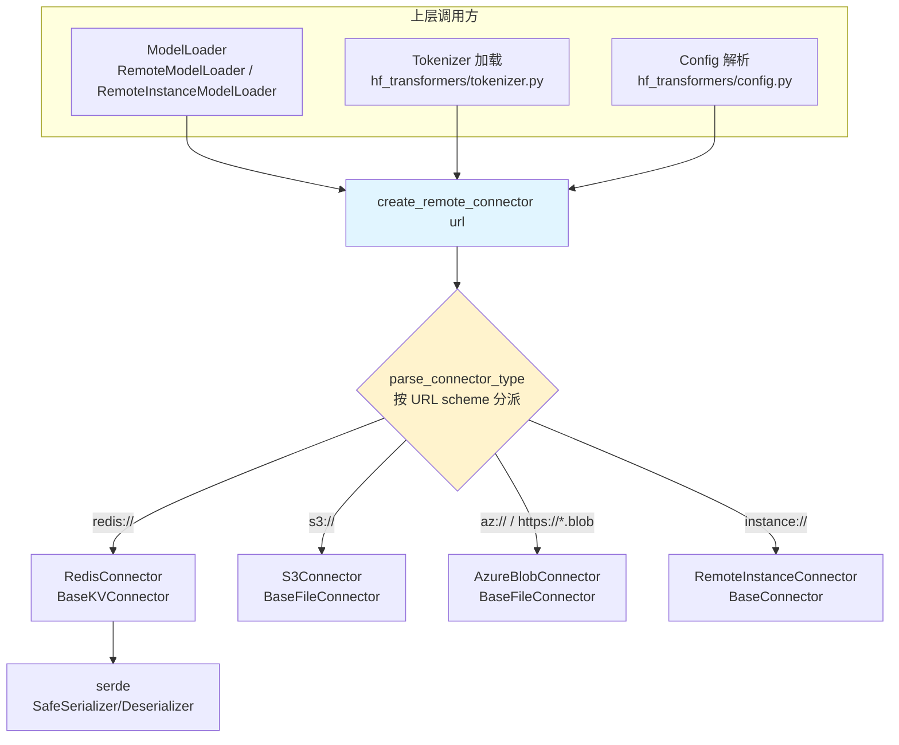

# SGLang Connector 详解

> 本文档基于 `python/sglang/srt/connector/` 目录源码，详细介绍 SGLang 中 **Connector（连接器）** 机制的设计动机、抽象接口、各类实现以及它在权重/配置加载链路中的使用方式。

---

## 一、Connector 是什么，解决什么问题

在标准场景下，SGLang 加载模型时的 `model_path` 是一个**本地目录**（HuggingFace 格式），里面存放 `config.json`、`tokenizer.json`、`*.safetensors` 等文件。但在生产环境中，模型往往不放在本地磁盘，而是放在：

- **对象存储**：S3、Azure Blob Storage
- **KV 数据库**：Redis（把权重张量当成 KV 值存起来）
- **另一台正在运行的推理实例**：直接通过 NCCL / RDMA 从一个"种子实例"把显存里的权重传过来（热更新 / 快速扩容）

Connector 就是为了**统一屏蔽这些远程数据源的差异**而设计的一层抽象。它把"从 `s3://...`、`redis://...`、`instance://...` 这样的 URL 拉取权重和配置文件"这件事，抽象成一组统一接口，使得上层的 **ModelLoader、Tokenizer、Config 解析**代码无需关心底层到底是哪种存储。

一句话概括：

> **Connector = 远程模型数据源（对象存储 / KV 库 / 远程实例）的统一读写抽象层。**

它和用于 KV cache 迁移的 **PD 分离 KV Transfer** 是两个不同的东西——Connector 关注的是**模型权重与配置文件的加载**，不是推理过程中的 KV cache。

---

## 二、模块结构总览

```
python/sglang/srt/connector/
├── __init__.py            # 工厂函数 create_remote_connector + 类型枚举 ConnectorType
├── base_connector.py      # 三个抽象基类：BaseConnector / BaseKVConnector / BaseFileConnector
├── s3.py                  # S3Connector（对象存储，文件型）
├── azure.py               # AzureBlobConnector（对象存储，文件型，懒加载 blobfile）
├── redis.py               # RedisConnector（KV 型）
├── remote_instance.py     # RemoteInstanceConnector（从远程实例走 NCCL 传权重）
├── utils.py               # pull_files_from_db / parse_model_name 等辅助函数
└── serde/                 # 张量序列化/反序列化（KV 存储需要）
    ├── __init__.py        # create_serde 工厂
    ├── serde.py           # Serializer / Deserializer 抽象基类
    └── safe_serde.py      # 基于 safetensors 的实现
```

整体分层如下：



---

## 三、URL 约定

Connector 全部以 **URL scheme** 来区分类型，格式约定在 `BaseConnector` 的文档字符串里：

```
# 文件型连接器（如 S3、Azure）：
<connector_type>://<path>/<filename>

# KV 型连接器（如 Redis）：
<connector_type>://<host>:<port>/<model_name>/keys/<key>
<connector_type>://<host>:<port>/<model_name>/files/<filename>
```

判断一个字符串是不是"远程 URL"，以及取出它的 scheme，靠 `python/sglang/srt/utils/common.py` 里的两个函数：

```python
def is_remote_url(url: Union[str, Path]) -> bool:
    """
    Check if the URL is a remote URL of the format:
    <connector_type>://<host>:<port>/<model_name>
    """
    if isinstance(url, Path):
        return False

    pattern = r"(.+)://(.*)"
    m = re.match(pattern, url)
    return m is not None


def parse_connector_type(url: str) -> str:
    """
    Parse the connector type from the URL of the format:
    <connector_type>://<path>
    """
    pattern = r"(.+)://(.*)"
    m = re.match(pattern, url)
    if m is None:
        return ""

    return m.group(1)
```

即：只要匹配 `xxx://yyy` 就算远程 URL，`xxx` 就是 connector type。

---

## 四、抽象基类：三种连接器形态

`base_connector.py` 定义了整个模块的接口契约，分三层。

### 4.1 `BaseConnector` —— 所有连接器的根

```python
class BaseConnector(ABC):
    """
    For fs connector such as s3:
    <connector_type>://<path>/<filename>

    For kv connector such as redis:
    <connector_type>://<host>:<port>/<model_name>/keys/<key>
    <connector_type://<host>:<port>/<model_name>/files/<filename>
    """

    def __init__(self, url: str):
        self.url = url
        self.closed = False
        self.local_dir = tempfile.mkdtemp()
        for sig in (signal.SIGINT, signal.SIGTERM):
            existing_handler = signal.getsignal(sig)
            signal.signal(sig, self._close_by_signal(existing_handler))

    def get_local_dir(self):
        return self.local_dir

    @abstractmethod
    def weight_iterator(
        self, rank: int = 0
    ) -> Generator[Tuple[str, torch.Tensor], None, None]:
        raise NotImplementedError()

    @abstractmethod
    def pull_files(
        self,
        allow_pattern: Optional[List[str]] = None,
        ignore_pattern: Optional[List[str]] = None,
    ) -> None:
        raise NotImplementedError()
```

关键设计点：

1. **本地临时目录 `self.local_dir`**：构造时用 `tempfile.mkdtemp()` 建一个临时目录。像 config、tokenizer 这些**非权重文件**，会先被 `pull_files()` 下载到这个目录，然后上层就把它当作一个普通本地 HF 目录来用。
2. **信号处理 + 上下文管理器 + `__del__`**：注册了 `SIGINT/SIGTERM` 处理器，并实现了 `__enter__/__exit__/__del__`，确保进程退出或异常时会 `close()`，把临时目录 `shutil.rmtree` 清理掉，避免磁盘泄漏。
3. **两个核心抽象方法**：
   - `weight_iterator(rank)`：**流式**产出 `(权重名, 张量)`，供 ModelLoader 逐个加载权重（省内存，不用先落盘）。
   - `pull_files(allow/ignore_pattern)`：把远端文件**下载到 `local_dir`**，用 fnmatch 模式过滤。

### 4.2 `BaseKVConnector` —— 键值型（如 Redis）

```python
class BaseKVConnector(BaseConnector):

    @abstractmethod
    def get(self, key: str) -> Optional[torch.Tensor]:
        raise NotImplementedError()

    @abstractmethod
    def getstr(self, key: str) -> Optional[str]:
        raise NotImplementedError()

    @abstractmethod
    def set(self, key: str, obj: torch.Tensor) -> None:
        raise NotImplementedError()

    @abstractmethod
    def setstr(self, key: str, obj: str) -> None:
        raise NotImplementedError()

    @abstractmethod
    def list(self, prefix: str) -> List[str]:
        raise NotImplementedError()
```

KV 型连接器把权重张量当成键值对存储，所以额外定义了：
- `get / set`：读写**张量**（需要 serde 序列化，见第六节）。
- `getstr / setstr`：读写**字符串**（用于 config/tokenizer 这类文本文件）。
- `list(prefix)`：按前缀列出所有 key。

### 4.3 `BaseFileConnector` —— 文件型（如 S3、Azure）

```python
class BaseFileConnector(BaseConnector):
    """
    List full file names from remote fs path and filter by allow pattern.
    ...
    """

    @abstractmethod
    def glob(self, allow_pattern: str) -> List[str]:
        raise NotImplementedError()
```

文件型连接器面向"目录/文件"语义，只额外要求实现 `glob(pattern)`——按通配符列出远端文件路径。

---

## 五、四种具体实现

### 5.1 S3Connector（文件型）

`s3.py`，基于 `boto3`。核心逻辑：

- `glob(allow_pattern)`：调用 `list_objects_v2` 列桶内对象，用 fnmatch 过滤，返回 `s3://bucket/key` 列表。
- `pull_files(...)`：把匹配的文件逐个 `download_file` 到 `self.local_dir`，保持相对目录结构。用于拉 config / tokenizer。
- `weight_iterator(rank)`：**只支持 safetensors**。用 `glob(["*.safetensors"])` 找到权重文件后，交给 `runai_safetensors_weights_iterator` 做流式加载（RunAI Model Streamer，边下载边加载）。

```python
    def weight_iterator(
        self, rank: int = 0
    ) -> Generator[Tuple[str, torch.Tensor], None, None]:
        from sglang.srt.model_loader.weight_utils import (
            runai_safetensors_weights_iterator,
        )

        # only support safetensor files now
        hf_weights_files = self.glob(allow_pattern=["*.safetensors"])
        return runai_safetensors_weights_iterator(hf_weights_files)
```

### 5.2 AzureBlobConnector（文件型）

`azure.py`，基于第三方 `blobfile` 包（**懒加载**——只有真正用到 Azure URL 时才 import，见 `__init__.py` 里的 `_is_azure_blob_url` 判断）。它同时支持两种 URL：

- `az://<account>/<container>/<path>`
- `https://<account>.blob.core.windows.net/<container>/<path>`

认证走 `blobfile` 自带的 Azure 凭证链（环境变量 / az CLI / 托管身份）。

它与 S3 最大的不同：`weight_iterator` 需要**先把 `*.safetensors` 全部下载到本地**，再交给 `runai_safetensors_weights_iterator`，因为 `blobfile` 没有兼容 runai_model_streamer 的流式 safetensors 读取器。

```python
def _is_azure_blob_url(url: str, connector_type: str) -> bool:
    """Detect Azure Blob Storage URLs.

    Matches ``az://...`` URLs and ``https://<account>.blob.core.windows.net/...``
    URLs, which are the two forms accepted by the ``blobfile`` library.
    """
    if connector_type == "az":
        return True
    return connector_type == "https" and ".blob.core.windows.net" in url
```

### 5.3 RedisConnector（KV 型）

`redis.py`，基于 `redis` 包。它把模型的每个权重张量存成 Redis 的一个 key：

- key 组织形式：`{model_name}/keys/rank_{rank}/{权重名}`（权重）、`{model_name}/files/{文件名}`（配置文件）。
- `get / set`：用 serde（默认 `"safe"`，即 safetensors）在张量 ↔ bytes 之间转换后读写。
- `getstr / setstr`：直接读写 UTF-8 字符串。
- `list(prefix)`：用 `SCAN` 游标遍历匹配 `prefix*` 的所有 key。
- `weight_iterator(rank)`：列出该 rank 下所有权重 key，逐个 `get` 并去掉前缀后 yield。

```python
    def weight_iterator(
        self, rank: int = 0
    ) -> Generator[Tuple[str, bytes], None, None]:
        keys = self.list(f"{self.model_name}/keys/rank_{rank}/")
        for key in keys:
            val = self.get(key)
            key = key.removeprefix(f"{self.model_name}/keys/rank_{rank}/")
            yield key, val

    def pull_files(
        self,
        allow_pattern: Optional[List[str]] = None,
        ignore_pattern: Optional[List[str]] = None,
    ) -> None:
        pull_files_from_db(self, self.model_name, allow_pattern, ignore_pattern)
```

注意 KV 型连接器对 rank 敏感（`rank_{rank}`），因为在张量并行（TP）下每张卡只存/取自己那一份分片权重。

### 5.4 RemoteInstanceConnector（实例型）

`remote_instance.py`，这是最特殊的一种——它**不涉及磁盘或数据库**，而是从**另一台正在运行的 SGLang 实例（种子实例）** 直接把显存里的权重通过 **NCCL 集合通信**传过来。典型用途：RLHF 训练中权重热更新、快速扩容新副本。

- URL 形如 `instance://<master_ip>:<port>`，且**只支持 cuda / npu 设备**。
- `build_group(...)`：用 `init_custom_process_group` 建一个自定义 NCCL 进程组（种子实例是 rank 0，新实例是 rank 1），随后用 `broadcast` 类操作接收权重。
- `pull_files / weight_iterator`：都是 **no-op（空实现）**，仅仅为了满足 `BaseConnector` 接口一致性——因为它的权重传输逻辑走的是 ModelLoader 里专门的 NCCL / transfer engine 路径，而不是这两个通用方法。

```python
class RemoteInstanceConnector(BaseConnector):

    def __init__(self, url: str, device: torch.device = "cpu"):
        assert (
            device.type == "cuda" or device.type == "npu"
        ), "RemoteInstanceConnector only supports cuda device."
        super().__init__(url)
        self.url = url
        self.device = device
```

---

## 六、serde：张量的序列化 / 反序列化

只有 **KV 型连接器（Redis）** 需要 serde——因为 KV 库存的是字节流，必须把 `torch.Tensor` 序列化成 bytes 存进去，取出时再反序列化。文件型（S3/Azure）直接操作 safetensors 文件，不需要这一层。

抽象接口在 `serde/serde.py`：`Serializer.to_bytes(t)` 和 `Deserializer.from_bytes(bs)`。

当前唯一实现是基于 **safetensors** 的 `SafeSerializer / SafeDeserializer`：

```python
class SafeSerializer(Serializer):

    def __init__(self):
        super().__init__()

    def to_bytes(self, t: torch.Tensor) -> bytes:
        return save({"tensor_bytes": t.cpu().contiguous()})


class SafeDeserializer(Deserializer):

    def __init__(self):
        # TODO: dtype options
        super().__init__(torch.float32)

    def from_bytes_normal(self, b: Union[bytearray, bytes]) -> torch.Tensor:
        return load(bytes(b))["tensor_bytes"]

    def from_bytes(self, b: Union[bytearray, bytes]) -> torch.Tensor:
        return self.from_bytes_normal(b)
```

通过工厂 `create_serde("safe")` 获取，`RedisConnector.__init__` 里就是这么用的（`self.s, self.d = create_serde("safe")`）。序列化时会先 `.cpu().contiguous()` 保证在 CPU 上且内存连续。代码注释注明 serde 类型和 dtype 未来会做成可配置。

---

## 七、工厂函数与类型识别

### 7.1 `create_remote_connector` —— 按 URL 分派

这是所有上层代码创建连接器的**唯一入口**：

```python
def create_remote_connector(url, device=None, **kwargs) -> BaseConnector:
    connector_type = parse_connector_type(url)
    if connector_type == "redis":
        return RedisConnector(url)
    elif connector_type == "s3":
        return S3Connector(url)
    elif connector_type == "instance":
        return RemoteInstanceConnector(url, device)
    elif _is_azure_blob_url(url, connector_type):
        # Imported lazily so the optional ``blobfile`` dependency is only
        # required when an Azure URL is actually used.
        from sglang.srt.connector.azure import AzureBlobConnector

        return AzureBlobConnector(url)
    else:
        raise ValueError(f"Invalid connector type: {url}")
```

### 7.2 `ConnectorType` 与 `get_connector_type`

上层拿到连接器实例后，用 `get_connector_type` 判断它属于哪一大类，从而走不同的加载分支：

```python
def get_connector_type(client: BaseConnector) -> ConnectorType:
    if isinstance(client, BaseKVConnector):
        return ConnectorType.KV
    if isinstance(client, BaseFileConnector):
        return ConnectorType.FS
    if isinstance(client, RemoteInstanceConnector):
        return ConnectorType.INSTANCE

    raise ValueError(f"Invalid connector type: {client}")
```

三种类型：`FS`（文件系统）、`KV`（键值）、`INSTANCE`（远程实例）。

---

## 八、Connector 在加载链路中的三处使用

### 8.1 加载 Tokenizer

`utils/hf_transformers/tokenizer.py`：如果 tokenizer 名字是远程 URL，就拉取**非权重文件**到本地临时目录，再把这个目录当作本地 tokenizer 路径。

```python
    tokenizer_name = resolve_runai_obj_uri(tokenizer_name)

    if is_remote_url(tokenizer_name):
        # BaseConnector implements __del__() to clean up the local dir.
        # Since config files need to exist all the time, so we DO NOT use
        # with statement to avoid closing the client.
        client = create_remote_connector(tokenizer_name)
        client.pull_files(ignore_pattern=["*.pt", "*.safetensors", "*.bin"])
        tokenizer_name = client.get_local_dir()
```

注意这里**故意不用 `with` 语句**，因为 config 文件需要一直存在；`with` 会在退出时触发 `close()` 删掉临时目录。`ignore_pattern` 排除了所有权重文件，只拉配置文本。

### 8.2 加载 Config

`utils/hf_transformers/config.py` 中逻辑几乎一致——远程 URL 时拉取配置文件到本地目录后再解析：

```python
    if is_remote_url(model):
        client = create_remote_connector(model)
        client.pull_files(ignore_pattern=["*.pt", "*.safetensors", "*.bin"])
        model = client.get_local_dir()
```

### 8.3 加载权重（核心）

`model_loader/loader.py` 里有两个专门的 Loader 使用 Connector：

**（1）`RemoteModelLoader`（`load_format == REMOTE`）** —— 从 S3 / Azure / Redis 加载权重：

```python
            with create_remote_connector(
                model_weights, device=device_config.device
            ) as client:
                connector_type = get_connector_type(client)
                if connector_type == ConnectorType.KV:
                    self._load_model_from_remote_kv(model, model_config, client)
                elif connector_type == ConnectorType.FS:
                    self._load_model_from_remote_fs(
                        model, client, model_config, device_config
                    )
```

- KV 分支：用 `client.weight_iterator(rank)` 逐个把张量 `copy_` 进模型参数（`_load_model_from_remote_kv`）。
- FS 分支：把 `weight_iterator()` 直接喂给 `model.load_weights(...)`（`_load_model_from_remote_fs`）。

它还提供一个静态方法 `save_model(model, model_path, url)`：把当前模型的 state_dict 和配置文件写回到 KV 连接器（Redis），方便"先把 HF 模型转存到 Redis，之后从 Redis 秒级加载"。

**（2）`RemoteInstanceModelLoader`（`load_format == REMOTE_INSTANCE`）** —— 从另一个运行中的实例传权重：

```python
            model_weights = f"instance://{load_config.remote_instance_weight_loader_seed_instance_ip}:{load_config.remote_instance_weight_loader_send_weights_group_ports[load_config.tp_rank]}"
            with create_remote_connector(model_weights, device_config.device) as client:
                connector_type = get_connector_type(client)
                if connector_type == ConnectorType.INSTANCE:
                    self.load_model_from_remote_instance_by_nccl(
                        ...
                    )
```

这条路径下连接器主要负责 `build_group()` 建 NCCL 组，实际的权重 broadcast 由 loader 的 `load_model_from_remote_instance_by_nccl` 完成。它还有一条基于 **transfer engine（RDMA）** 的替代路径。

---

## 九、辅助函数 `pull_files_from_db`

KV 连接器的 `pull_files` 都委托给 `utils.py` 里的这个函数——它把 `{model_name}/files/` 前缀下的所有文件用 `getstr` 取出后写到本地目录：

```python
def pull_files_from_db(
    connector: BaseConnector,
    model_name: str,
    allow_pattern: Optional[list[str]] = None,
    ignore_pattern: Optional[list[str]] = None,
) -> None:
    prefix = f"{model_name}/files/"
    local_dir = connector.get_local_dir()
    files = connector.list(prefix)

    for file in files:
        destination_file = os.path.join(local_dir, file.removeprefix(prefix))
        local_dir = Path(destination_file).parent
        os.makedirs(local_dir, exist_ok=True)
        with open(destination_file, "wb") as f:
            f.write(connector.getstr(file).encode("utf-8"))
```

---

## 十、相关 Server Args（远程实例加载）

`RemoteInstanceConnector` 相关配置集中在 `server_args.py`：

| 参数 | 含义 |
| --- | --- |
| `remote_instance_weight_loader_seed_instance_ip` | 种子实例（提供权重的一方）IP |
| `remote_instance_weight_loader_seed_instance_service_port` | 种子实例服务端口 |
| `remote_instance_weight_loader_send_weights_group_ports` | 每个 TP rank 用于建组的端口列表 |
| `remote_instance_weight_loader_backend` | 传输后端：`nccl` / `transfer_engine` / `modelexpress` |
| `remote_instance_weight_loader_start_seed_via_transfer_engine` | 是否用 transfer engine 启动种子 |

而 S3 / Azure / Redis 加载则通过 `--load-format remote`（对应 `LoadFormat.REMOTE`）配合把 `model_path` 设成对应 URL 来触发。

---

## 十一、总结与扩展指引

### 核心要点

1. **定位**：Connector 是**模型权重 + 配置文件**的远程数据源统一抽象，不涉及推理时的 KV cache。
2. **三种形态**：`BaseKVConnector`（Redis）、`BaseFileConnector`（S3 / Azure）、以及特殊的 `RemoteInstanceConnector`（实例间 NCCL/RDMA 传权重）。
3. **统一入口**：所有创建都走 `create_remote_connector(url)`，按 URL scheme 分派；用 `get_connector_type` 反查类别决定加载分支。
4. **两条读取路径**：
   - `weight_iterator()`：流式产出张量，直接喂给 ModelLoader，省内存。
   - `pull_files()`：把 config/tokenizer 等非权重文件落到临时目录，当作本地 HF 目录使用。
5. **serde**：只有 KV 型需要，负责张量 ↔ bytes，当前基于 safetensors。
6. **生命周期**：临时目录 + 信号处理 + 上下文管理器，确保退出时清理干净。

### 如何新增一个 Connector（例如 GCS / OSS）

1. 在 `connector/` 下新建 `gcs.py`，继承合适的基类（对象存储选 `BaseFileConnector`）。
2. 实现抽象方法：文件型实现 `glob / pull_files / weight_iterator`；KV 型实现 `get/set/getstr/setstr/list/weight_iterator/pull_files`。
3. 在 `__init__.py` 的 `create_remote_connector` 中，为新的 URL scheme（如 `gcs`）添加分派分支；可选做**懒加载 import**（像 Azure 那样），避免强依赖第三方 SDK。
4. 若是 KV 型且需要新的序列化方式，在 `serde/` 中新增 `Serializer/Deserializer` 实现并注册进 `create_serde`。
5. 权重最好支持 `runai_safetensors_weights_iterator` 之类的流式加载以省内存。

### 关键文件速查

| 文件 | 职责 |
| --- | --- |
| `connector/__init__.py` | 工厂 `create_remote_connector`、`ConnectorType`、`get_connector_type` |
| `connector/base_connector.py` | 三个抽象基类 + 生命周期管理 |
| `connector/s3.py` / `azure.py` | 对象存储文件型实现 |
| `connector/redis.py` | KV 型实现 |
| `connector/remote_instance.py` | 实例间 NCCL 传权重 |
| `connector/serde/*` | 张量序列化/反序列化 |
| `connector/utils.py` | `pull_files_from_db` / `parse_model_name` |
| `model_loader/loader.py` | `RemoteModelLoader` / `RemoteInstanceModelLoader` 消费方 |
| `utils/hf_transformers/{tokenizer,config}.py` | tokenizer/config 远程加载消费方 |
| `utils/common.py` | `is_remote_url` / `parse_connector_type` |
