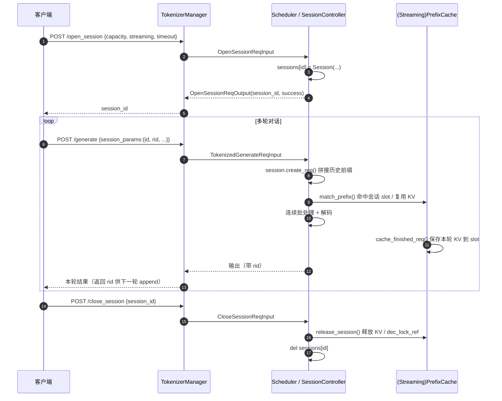

# SGLang 会话管理详解

> 本文档基于 `python/sglang/srt/session/` 源码，详细介绍 SGLang 的 **会话管理（Session Management）** 机制：让"多轮对话/连续续写"能在服务端复用上一轮的 KV cache，避免每轮把历史重新 prefill。

---

## 一、为什么需要会话管理

典型多轮对话/agent 场景：

```
轮次1: [系统提示 + Q1]                   → A1
轮次2: [系统提示 + Q1 + A1 + Q2]          → A2
轮次3: [系统提示 + Q1 + A1 + A2 + Q3]     → A3
...
```

如果每轮都作为独立请求发来，服务端每次都要把越来越长的前缀**重新 prefill**。虽然 RadixAttention 的前缀缓存能自动命中一部分，但它依赖于：
1. 前缀 KV 还没被 LRU 淘汰；
2. 客户端每次把完整历史都重新发上来。

**会话（Session）机制**提供了一条更强、更显式的路径：

- 服务端为一个会话**保留**上一轮请求的 token 序列与 KV 状态；
- 下一轮请求只需带上会话 id 和"要接着哪个请求（rid）续写"，服务端自动把历史拼在前面；
- KV cache 被会话**锁住**（`lock_ref`），保证不被淘汰；
- 支持分支（branching）、回溯（replace/offset）、丢弃历史输出等高级操作。

这对于 **agent 树搜索、多轮对话、交互式续写、Realtime 流式语音** 等场景尤其重要。

## 二、核心数据结构

会话管理代码集中在两个文件：

- `python/sglang/srt/session/session_controller.py`：`Session` / `SessionReqNode` / `SessionController`（通用会话，支持分支）。
- `python/sglang/srt/session/streaming_session.py`：`StreamingSession` / `SessionSlot`（流式会话的 KV 保存/恢复，包在 prefix cache 外层）。

### 2.1 `SessionReqNode` —— 会话内的请求树节点

一个会话里的多次请求组织成一棵**树**（支持分支），每个节点是一次请求：

```python
class SessionReqNode:
    def __init__(self, req, parent=None, children=None):
        self.req = req
        self.parent = parent
        if parent is not None:
            parent.children.append(self)
        self.children = [] if not children else children
```

- 父子关系表达"从某个请求的输出继续续写"。
- `replace` 一个中间节点时，会 `clear_children` 把它下面的分支全部作废（并 `FINISH_ABORT` 掉未完成的请求）。
- `__str__` 能把整棵树打印成缩进结构，便于调试。

### 2.2 `Session` —— 一个会话的运行时状态

```python
class Session:
    def __init__(self, capacity_of_str_len, session_id=None,
                 streaming=False, timeout=None):
        self.session_id = session_id if session_id is not None else uuid.uuid4().hex
        self.capacity_of_str_len = capacity_of_str_len
        self.streaming = streaming          # 是否为"流式会话"（低开销、仅追加）
        self.timeout = timeout              # 空闲超时自动关闭
        self.last_active_time = time.monotonic()
        self.req_nodes: Dict[str, SessionReqNode] = {}   # rid -> 节点
        self.close_on_finish = False        # 延迟关闭标记
        self._inflight = False              # 流式会话：是否有请求正在处理
        # 流式会话的 token 数组"已提交"长度，用于回滚被 abort 的轮次
        self.committed_origin_len = None
        self.committed_unpadded_len = None
        self.committed_fill_len = None
```

关键字段：
- `req_nodes`：`rid → SessionReqNode`，即会话内所有请求的树。
- `streaming`：决定走"通用分支模式"还是"流式追加模式"（见第三节）。
- `timeout` + `last_active_time`：空闲超时回收。
- `committed_*`：流式会话下，记录上一次成功完成时各 token 数组的长度，作为**回滚点**——若某轮请求在 `finish_req` 之前被 abort，下一轮可以把推测性追加的 token 裁回这个长度，保证历史一致。

### 2.3 `SessionController` —— 全局会话管理器

Scheduler 持有一个 `SessionController`（见 `scheduler.py` 中 `self.session_controller = SessionController(self.tree_cache)`），负责：

- `open()` / `close()`：开/关会话；
- `get()` / `__contains__()`：按 id 查找；
- `maybe_reap()`：定期（默认每秒）回收**超时**会话和**延迟关闭**会话；
- `adjust_mm_offsets()`：会话请求拼接了历史前缀，需要把新一轮多模态 token 的 offset 整体平移。

```python
class SessionController:
    def __init__(self, tree_cache):
        self.sessions: Dict[str, Session] = {}
        self._last_reap_time = 0.0
        self.tree_cache = tree_cache   # 关闭会话时用它 release_session 释放 KV
```

## 三、两种会话模式

### 3.1 通用模式（非流式，支持分支/回溯）

由 `Session.create_req()` 处理，`SessionParams` 提供以下能力（定义在 `io_struct.py`）：

```python
class SessionParams:
    id: Optional[str] = None          # 会话 id
    rid: Optional[str] = None         # 接着哪个请求续写（父节点 rid）
    offset: Optional[int] = None      # 从历史的某个位置截断后再拼新输入
    replace: Optional[bool] = None    # 替换某个请求（作废其子分支）
    drop_previous_output: Optional[bool] = None  # 丢弃上一轮的输出，只保留输入
```

拼接逻辑（`_concat_token_arrays`）：

$$
\text{new\_input\_ids} = \underbrace{\text{last\_req.origin\_input\_ids} + \text{last\_req.output}}_{\text{历史}} \;[\,:\text{offset}\,] \; + \; \text{req.input\_ids}
$$

- `rid` 指定父请求，新请求的 token = 父请求的输入 + 父请求的输出 + 本轮输入。
- `drop_previous_output=True`：只拼父请求的**输入**，丢掉它的输出。
- `offset`：在拼好的历史里截断到 offset，再接本轮输入（可用于"回退 N 个 token 重写"）。
- `replace=True`：把指定 `rid` 节点作废（连同其所有子分支），用新请求替换——实现"重新生成/回溯"。

这套设计天然支持**树状分支**：从同一个父请求可以派生多个子请求（不同采样/不同追问），每个分支复用同一段前缀 KV。

### 3.2 流式模式（streaming，低开销、仅追加）

流式会话（`open_session(streaming=True)`）为 **Realtime 语音、逐段追加** 等场景优化，约束更严但开销更低：

- **只允许简单追加**：不支持 `replace`、`offset`、`drop_previous_output`（`create_req` 会直接 abort 并报错）。
- **同一时刻只能有一个 in-flight 请求**（`_inflight` 标志）。
- **KV 就地复用**：通过 `StreamingSession` + `SessionSlot`，把上一轮的 KV pool 状态直接"存槽/取槽"，下一轮几乎零拷贝地在原 KV 上继续追加。

`create_req` 里流式与非流式的分派：

```python
if self.streaming:
    if self._inflight:
        abort = True; abort_message = "Streaming session already has an active request."
    elif session_params.replace:
        abort = True; abort_message = "Streaming sessions do not support replace."
    ...
    elif self.req_nodes:
        [last_req_node] = self.req_nodes.values()   # 流式会话只有一个节点
        last_req = last_req_node.req
```

流式会话的 token 数组还能**就地共享**（`_share_token_arrays`）：直接在上一轮的 `origin_input_ids` array 上先裁回 `committed_*` 长度（愈合被 abort 的轮次），再 extend 上一轮输出和本轮输入，省去一次完整拷贝。

## 四、流式会话的 KV 保存/恢复：`StreamingSession` + `SessionSlot`

`streaming_session.py` 的 `StreamingSession` 是一个**包在任意 `BasePrefixCache` 外层的装饰器**（也支持内嵌到 `UnifiedRadixCache`）。它的核心职责：在两轮请求之间，把 KV pool 状态**存进 slot**、下一轮再**恢复到新请求**。

### 4.1 `SessionSlot` —— 轮次之间的 KV 状态快照

```python
@dataclass
class SessionSlot:
    virtual_node: _VirtualNode        # 哨兵节点，用于区分"会话锁"和"真实 radix 树锁"
    req_pool_idx: Optional[int] = None    # 占用的 req pool 槽位
    kv_committed_len: int = 0             # 已提交的 KV 长度
    kv_allocated_len: int = 0             # 已分配的 KV 长度
    last_node: Any = None                 # 首轮请求在 radix 树上的节点（关闭时 dec_lock_ref）
    cache_protected_len: int = 0          # 被 radix 树保护（锁住）的前缀长度
    # SWA / Mamba 混合模型的额外状态 ...
```

- 一轮请求完成时，`save_from_req()` 把 `req` 的 KV 状态搬进 slot，并**把 req 上的指针全部置空**（所有权转移给 slot，避免后续 alloc/free 误判导致泄漏）。
- 下一轮请求进来时，`restore_to_req()` 把 slot 的状态搬回新 req，于是新 req 直接"接管"了上一轮的 KV，只需在末尾 `alloc_for_extend` 追加本轮新增部分。

### 4.2 与 prefix cache 的组合契约

`StreamingSession` 用统一的 `try_handle_*` 模式与内层缓存组合：

```python
def match_prefix(self, params):
    result = self.try_match_prefix(params)   # 命中活跃 session slot 就走会话路径
    if result is not None:
        return result
    return self.inner.match_prefix(params)   # 否则回退到内层（如 RadixCache）
```

- `try_match_prefix`：若请求命中活跃 slot，则 `restore_to_req` 恢复 KV，把 `req_to_token` 里已有的前缀索引直接返回，并**释放被推测解码/回缩留下的孤儿尾部**（`_free_tail`），无需重新 prefill。
- `try_cache_finished_req`：一轮成功完成 → `save_from_req` 存槽；若中途 abort → `release_session` 把该会话 KV 全部释放，下一轮从头 prefill。
- `_VirtualNode` 哨兵 + `try_inc_lock_ref/try_dec_lock_ref`：会话内部的"锁"是 no-op（KV 由 slot 显式持有），只有真正落到 radix 树的锁才转发给内层。

### 4.3 KV 记账

因为会话 slot 持有的 KV **不在 radix 树的可淘汰统计里**，`StreamingSession` 提供了一组 `session_held_*` 方法（`session_held_tokens` / `session_held_swa_tokens` / `session_held_mamba_slots` 等），让调度器在做显存余量检查时把这些"被会话锁住的 token"正确计入，避免超分配。

## 五、会话生命周期



### 5.1 打开会话

HTTP 端点 `/open_session`（`http_server.py`）→ `TokenizerManager.open_session` → Scheduler `open_session` → `SessionController.open`。若 id 冲突或为 None 则返回失败。

引擎侧 API（`entrypoints/engine.py`）：

```python
session_id = engine.open_session(
    capacity_of_str_len=1000,
    streaming=False,        # True 走低开销流式路径
    timeout=None,           # 秒；空闲超过该值自动关闭
)
```

### 5.2 追加请求

每轮 `/generate` 带 `session_params`。Scheduler 的 `handle_generate_request` 分三路（见 `scheduler.py`）：

```python
session_id = recv_req.session_params.id if recv_req.session_params else None
if session_id is None:
    # 普通请求
elif session_id in self.session_controller and not closing:
    # 会话请求：session.create_req() 拼历史
    req = session.create_req(recv_req, self.tokenizer, vocab_size, eos_token_ids=...)
else:
    # 会话不存在 / 正在关闭 → abort 报错
```

响应的 `meta_info["id"]` 就是本轮请求的 rid，客户端把它作为下一轮的 `session_params.rid` 即可实现续写。

### 5.3 关闭会话（含延迟关闭）

`SessionController.close` → `_close`。关键点：**若流式会话还有 in-flight 请求正在解码，不能立即释放 KV**（会破坏调度器），于是标记 `close_on_finish=True` 延迟到请求完成后再由 `maybe_reap` 回收：

```python
if has_unfinished_request:
    session.close_on_finish = True   # 延迟关闭
    return
# 否则立即释放：释放多模态特征、release_session 释放 KV、删除会话
self.tree_cache.release_session(session_id)
del self.sessions[session_id]
```

### 5.4 超时回收

Scheduler 每个 loop 调 `self.session_controller.maybe_reap(now)`（默认 1 秒一次），关闭超时会话和"延迟关闭且请求已完成"的会话：

```python
def maybe_reap(self, now, interval=1.0):
    if now - self._last_reap_time > interval:
        self._last_reap_time = now
        # 完成延迟关闭
        for sid in [...close_on_finish and all_finished...]:
            self._close(sid)
        # 关闭超时会话
        for sid in [...is_timed_out()...]:
            self._close(sid)
```

## 六、会话请求的多模态特征保留

普通请求结束后会立即清理多模态特征；但**会话请求**要为下一轮保留：

```python
# scheduler.py, cache_finished_req 附近
if req.session:
    # 会话请求：保留 mm_inputs 供下一轮复用
    ...
else:
    # 非会话请求：清理特征和 mm_inputs
    req.multimodal_inputs = None
```

特征一直存活到会话关闭时才由 `_close` 里的 `mm.release_features()` 统一释放。同时 `adjust_mm_offsets` 会把新一轮 mm token 的 offset 按拼接的前缀长度平移。

## 七、API 速查

### 7.1 HTTP 端点

| 端点 | 说明 |
| --- | --- |
| `POST /open_session` | 打开会话，body: `{capacity_of_str_len, session_id?, streaming?, timeout?}`，返回 session_id |
| `POST /close_session` | 关闭会话，body: `{session_id}` |
| `POST /generate` | 带 `session_params: {id, rid, offset?, replace?, drop_previous_output?}` 即为会话请求 |

### 7.2 引擎 API（`sglang.Engine`）

```python
engine = sgl.Engine(model_path=...)
sid = engine.open_session(capacity_of_str_len=1000, streaming=False, timeout=600)
# 每轮 generate 传 session_params={"id": sid, "rid": last_rid, ...}
engine.close_session(sid)
```

### 7.3 会话请求参数 `SessionParams`

| 字段 | 含义 |
| --- | --- |
| `id` | 会话 id |
| `rid` | 接着哪个历史请求续写（父节点）；None 表示新分支/首轮 |
| `offset` | 拼好历史后截断到该位置再接新输入（回退重写） |
| `replace` | 替换指定 rid 的请求，作废其子分支（重新生成） |
| `drop_previous_output` | 只保留父请求的输入，丢弃其输出 |

### 7.4 相关配置

- `open_session` 的 `streaming`：是否走低开销流式路径（Realtime 常用）。
- `open_session` 的 `timeout`：空闲超时自动回收。

## 八、总结

1. **定位**：跨多次 HTTP 请求复用历史 KV，服务端自动拼接上下文。
2. **两种模式**：通用模式（`Session`，支持分支/replace/offset，请求组织成树）；流式模式（`StreamingSession`+`SessionSlot`，仅追加、单 in-flight、KV 就地复用，低开销）。
3. **生命周期**：`open → 多轮 generate（带 session_params）→ close`，支持超时回收和"in-flight 时延迟关闭"。
4. **KV 记账**：会话锁住的 KV 通过 `lock_ref` / `SessionSlot` 保护不被淘汰，并经 `session_held_*` 计入显存余量检查。
5. **多模态**：会话请求保留特征到会话关闭，offset 随前缀平移。

### 关键文件速查

| 文件 | 职责 |
| --- | --- |
| `srt/session/session_controller.py` | `Session` / `SessionReqNode` / `SessionController`（通用会话、分支、生命周期） |
| `srt/session/streaming_session.py` | `StreamingSession` / `SessionSlot`（流式会话 KV 存取、记账） |
| `srt/managers/scheduler.py` | `handle_generate_request` 三路分派、`open/close_session`、`maybe_reap` |
| `srt/managers/io_struct.py` | `SessionParams` / `OpenSessionReqInput` / `CloseSessionReqInput` |
| `srt/entrypoints/engine.py` | 引擎侧 `open_session` / `close_session` |
| `srt/entrypoints/http_server.py` | `/open_session` / `/close_session` HTTP 端点 |


