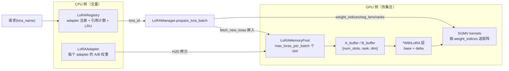
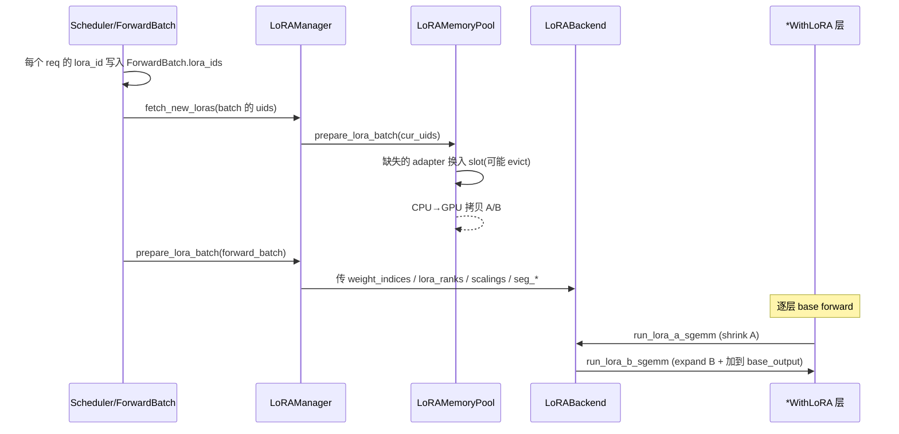

# SGLang 多 LoRA（Multi-LoRA Batching）详解

> 多 LoRA 让**同一个 batch 里同时服务多个不同 LoRA adapter** 的请求：base 模型权重只加载一份，不同请求用各自 adapter 的低秩 A/B 矩阵，在一次前向里通过分组矩阵乘（SGMV）各算各的 delta。
> 核心目录：`python/sglang/srt/lora/`（实验目录 `trtllm_lora_temp/` 不在本文范围）。设计思想源自 **S-LoRA / Punica**。
> 行号基于当前 `main`，会漂移，**以类名/方法名为准**。

---

## 一、核心思想：一个 batch 里多个 adapter 如何共存

LoRA 的数学形式：对某个线性层，输出 = 基座输出 + 低秩增量

$$ y = W_0 x + \frac{\alpha}{r} B (A x) $$

其中 $W_0$ 是冻结的 base 权重，$A \in \mathbb{R}^{r \times \text{in}}$、$B \in \mathbb{R}^{\text{out} \times r}$ 是该 adapter 的低秩矩阵（秩 $r$ 很小，如 8/16/64），$\alpha/r$ 是 scaling。

**多 LoRA batching 的关键洞察**：
- **base 权重全 batch 共享**，只算一次 $W_0 x$。
- batch 里每个请求（乃至每个 token）可能用**不同 adapter**，各自的 $B(Ax)$ 不同。
- 把"每个 token 用哪个 adapter"编码成 `weight_indices`，用 **分组/分段矩阵乘（Segmented Gemm, SGMV）** 在一个 kernel 里为不同 token 选不同的 A/B 矩阵。

于是一个 batch 里几十个不同 adapter 的请求可以**一起前向**，而不需要为每个 adapter 单独跑一遍，这就是高吞吐多租户 LoRA serving 的基础。



---

## 二、三层结构

| 层 | 职责 | 关键文件 |
| --- | --- | --- |
| **注册层** | 哪些 adapter 已加载、请求引用计数、CPU 侧 LRU | `lora_registry.py`（`LoRARegistry`） |
| **CPU 权重** | 每个 adapter 的 A/B 全量存在 CPU | `lora.py`（`LoRAAdapter`）、`lora_config.py`（`LoRAConfig`） |
| **GPU 池** | 每 batch 最多 `max_loras_per_batch` 个 slot，按需换入换出 | `mem_pool.py`（`LoRAMemoryPool`） |

统筹这三层的是 **`LoRAManager`**（`lora_manager.py`）。

---

## 三、请求生命周期与一次前向

### 3.1 一个请求怎么带上 adapter

推理请求通过两种方式指定 adapter：

- **原生 API**：请求体里 `lora_path` 字段（`io_struct.py:204`）。⚠️ 命名有历史包袱，这里传的其实是**注册名 `lora_name`**，不是文件路径。
- **OpenAI 兼容 API**：`model` 字段用 `base-model:adapter-name` 语法（`openai/protocol.py:319`，解析在 `serving_base._parse_model_parameter`）。`model` 里的 adapter 优先级高于显式 `lora_path`。

TokenizerManager 侧（`tokenizer_manager.py`）：
1. `_validate_and_resolve_lora` 校验 `enable_lora`。
2. `_resolve_lora_path`：若该 adapter 曾被 CPU LRU 卸载，自动 reload。
3. `lora_registry.acquire(name)` → 拿到全局唯一 `lora_id` 写进请求，引用计数 +1。
4. 请求结束 `lora_registry.release`，引用归零后才允许真正卸载。

### 3.2 一次前向的 LoRA 流程



对应代码（`forward_batch_info.py:787`）：

```python
if model_runner.server_args.enable_lora:
    if not model_runner.server_args.enable_lora_overlap_loading:
        model_runner.lora_manager.fetch_new_loras(set(ret.lora_ids))
    model_runner.lora_manager.prepare_lora_batch(ret)
```

`prepare_lora_batch`（`lora_manager.py:319`）为每个请求查 `uid → buffer_id`，构建三个关键数组：

```python
weight_indices = [0] * len(forward_batch.lora_ids)     # 每个 req/seg 用哪个 slot
lora_ranks = [0] * self.max_loras_per_batch            # 每个 slot 的秩
scalings = [0] * self.max_loras_per_batch              # 每个 slot 的 α/r
for i, uid in enumerate(forward_batch.lora_ids):
    weight_indices[i] = self.memory_pool.get_buffer_id(uid)
    lora = self.loras[uid]
    lora_ranks[weight_indices[i]] = lora.config.r
    scalings[weight_indices[i]] = lora.scaling
```

> `uid=None` 表示**纯 base 请求**，占 slot 0，rank=0 时 kernel 直接 no-op（不加任何 delta）。

---

## 四、LoRA 内存池：换入换出（`mem_pool.py`）

`LoRAMemoryPool`（`mem_pool.py:132`）管理有限的 GPU slot：

### 4.1 Buffer 布局

- **slot 数 = `max_loras_per_batch`**（默认 8），即一个 batch 最多同时容纳 8 个 distinct adapter。
- `A_buffer`：`[num_slots, max_rank * stack, in_dim]`（stacked 模块如 qkv 的 `stack=3`）。
- `B_buffer`：`[num_slots, out_dim, max_rank]`；MoE 为 4D `[num_slots, num_experts, rank, dim]`。
- embedding / lm_head 有独立的 buffer。

### 4.2 换入换出（`prepare_lora_batch`，`mem_pool.py:674`）

对 batch 需要的每个 uid：
1. `mark_used`（更新 LRU 顺序）。
2. 若不在 pool → 找 slot：
   - 优先空 slot（`EMPTY_SLOT`）。
   - pool 满 → `eviction_policy.select_victim` 选牺牲者，**跳过**当前 batch 仍需要的 uid 和 pinned adapter，优先淘汰真实 LoRA、最后才动 base（`None`）。
3. `load_lora_weight_to_buffer`：CPU→GPU 拷贝，按 TP/MoE 切分。

关键点：**A/B tensor 的指针在 init 时就绑定到各 LoRA 层（`update_lora_info` 只调一次），之后只改 slot 内容、指针不变**，这样 CUDA graph 才能复用。

### 4.3 驱逐策略（`eviction_policy.py`）

| 类 | 策略 |
| --- | --- |
| `LRUEvictionPolicy` | **默认**，淘汰最久未用 |
| `FIFOEvictionPolicy` | 按插入顺序 |

由 `--lora-eviction-policy` 选择。注意这是 **GPU pool 的驱逐**，与 `LoRARegistry` 里 **CPU 侧的 `max_loaded_loras` LRU** 是两套独立机制。

### 4.4 两个协作组件

- **`LoRADrainer`（`lora_drainer.py`）**：不管显存，管**调度公平性**。当 running batch 已占满 `max_loras_per_batch` 且某等待 adapter 超时（`--lora-drain-wait-threshold`），把某个 running adapter 标记为 draining，让它跑完自然释放 slot，避免新 adapter 饿死。`can_schedule` 被 scheduler 调用。
- **`LoRAOverlapLoader`（`lora_overlap_loader.py`）**：`--enable-lora-overlap-loading` 时，在**独立 CUDA stream** 上异步把 adapter 换入 GPU，与计算重叠，隐藏 H2D 拷贝延迟。

---

## 五、哪些层被 LoRA 包装（`layers.py` / `utils.py`）

### 5.1 层替换

`get_lora_layer`（`layers.py:1181`）把 base 模型里的这些层换成带 LoRA 的版本：

| base 层 | LoRA 版 |
| --- | --- |
| `QKVParallelLinear` | `QKVParallelLinearWithLoRA` |
| `MergedColumnParallelLinear`（gate_up） | `MergedColumnParallelLinearWithLoRA` |
| `ColumnParallelLinear` | `ColumnParallelLinearWithLoRA` |
| `RowParallelLinear`（o_proj / down） | `RowParallelLinearWithLoRA` |
| `VocabParallelEmbedding` | `VocabParallelEmbeddingWithLoRA` |
| `ParallelLMHead` | `ParallelLMHeadWithLoRA` |
| `FusedMoE` | `FusedMoEWithLoRA` |

### 5.2 目标模块归一化（`utils.py:229`）

PEFT 的原始名会被归一化，并记录"堆叠倍数"（`get_stacked_multiply`）：

| PEFT 名 | 归一化名 | 堆叠倍数 |
| --- | --- | --- |
| q/k/v_proj | `qkv_proj` | 3 |
| gate/up_proj | `gate_up_proj` | 2 |
| o_proj | `o_proj` | 1 |
| MoE w1/w3、w2 | `gate_up_proj_moe` / `down_proj_moe` | 2 / 1 |

`--lora-target-modules all` 会触发 `auto_detect_lora_target_modules`（`utils.py:360`）自动扫描 base 模型可 LoRA 化的层。

### 5.3 forward：base + delta 相加

以 ColumnParallel 为例（`layers.py:451`）：

```python
def apply_lora(self, base_output, x):
    lora_a_output = self.lora_backend.run_lora_a_sgemm(x, self.A_buffer)       # shrink: x @ A^T
    lora_output = self.lora_backend.run_lora_b_sgemm(                          # expand: @ B^T + base
        x=lora_a_output, weights=self.B_buffer,
        output_offset=self.output_offset, base_output=base_output,
    )
    return lora_output
```

- **QKV**：`run_qkv_lora`，A shrink 后用融合 kernel 一次算 q/k/v 三段 B。
- **Gate+Up**：`run_gate_up_lora`，gate/up 两段融合。
- **RowParallel（o_proj/down）**：TP>1 时先 all-reduce 再 expand。

---

## 六、计算后端与 SGMV（`backend/`）

### 6.1 后端接口 `BaseLoRABackend`（`base_backend.py`）

| 方法 | 语义 |
| --- | --- |
| `run_lora_a_sgemm` | **Shrink**：`(s, in) → (s, rank)`（或 `s, stack*rank`） |
| `run_lora_b_sgemm` | **Expand**：`(s, rank) → (s, out)` 并 **fused add** 到 base_output |
| `run_qkv_lora` / `run_gate_up_lora` | 融合 expand |
| `prepare_lora_batch` | 构建 `LoRABatchInfo` |

### 6.2 后端实现

| 名称 | 类 | 定位 |
| --- | --- | --- |
| **`csgmv`（当前默认）** | `ChunkedSgmvLoRABackend` | Punica SGMV + **固定 chunk 分段**，倾斜负载下减少 kernel launch；会按 adapter **gather 重排 token** 再切 chunk |
| `triton` | `TritonLoRABackend` | 原生 Triton SGMV；decode 时按 adapter 排序 token 合并 segment |
| `torch_native` | `TorchNativeLoRABackend` | PyTorch 参考实现 |
| `ascend` | `AscendLoRABackend` | NPU `sgmv_shrink/expand` |

由 `--lora-backend` 选择（`backend/lora_registry.py`）。

### 6.3 SGMV（Segmented Gemm）思路

核心是**分段矩阵乘**：把 batch 的 token 按"用哪个 adapter"分成若干 segment，每个 segment 用同一个 A/B 矩阵。

1. **Shrink (A)**：`(seg_tokens, in) → (seg_tokens, rank)`。
2. **Expand (B)**：`(seg_tokens, rank) → (seg_tokens, out)`，乘 scaling 后加到 base output。
3. **选矩阵**：kernel 内 `w_index = weight_indices[seg]`，从 `A_buffer[w_index]` / `B_buffer[w_index]` 读该 adapter 的矩阵；`lora_ranks[w_index]==0` 则跳过。

---

## 七、Triton 内核（`triton_ops/`）

| 内核 | 作用 |
| --- | --- |
| `sgemm_lora_a.py` | Shrink：每 segment 按 `weight_indices[batch_id]` 选 A，`rank==0` 直接 return |
| `sgemm_lora_b.py` | Expand：选 B，`partial_sum *= scaling`，写回 `base_output` |
| `qkv_lora_b.py` | 融合 Q/K/V expand，3D grid `(pid, qkv_id, batch_id)` 一次算三段 |
| `gate_up_lora_b.py` | 融合 Gate/Up expand |
| `chunked_sgmv_shrink/expand.py` | csgmv 后端专用 |
| `embedding_lora_a.py` | vocab 查表式 A |
| `fused_moe_lora_kernel.py` | MoE 专家 LoRA |

Shrink kernel 的核心（`sgemm_lora_a.py:57`）体现了"按 segment 选权重"：

```python
batch_id = tl.program_id(axis=1)
w_index = tl.load(weight_indices + batch_id)     # 这一段用哪个 adapter slot
rank = tl.load(lora_ranks + w_index)
if rank == 0:                                    # base 请求，跳过
    return
N = tl.minimum(N, rank * stack_num)
```

---

## 八、Batch 元数据：记录"每个 token 用哪个 adapter"

核心数据结构 `LoRABatchInfo`（`utils.py:27`），forward 时传给 kernel：

| 字段 | 含义 |
| --- | --- |
| `weight_indices` | `(num_segments,)` 每个 segment 用哪个 **pool slot** |
| `seg_indptr` / `seg_lens` | 每段 token 的边界 / 长度 |
| `lora_ranks` | `(max_loras_per_batch,)` 每个 slot 的秩 |
| `scalings` | `(max_loras_per_batch,)` 每个 slot 的 α/r |
| `permutation` | `(num_tokens,)` csgmv/triton decode 的 token 重排索引 |
| `req_seg_indptr` / `req_weight_indices` | 按 **request** 粒度（MoE virtual experts 需要） |
| `moe_lora_info.token_lora_mapping` | `(num_tokens,)` 每 token 的 adapter slot；-1=无 LoRA |

**两种 segmentation 粒度**：
- **triton**：prefill 时 num_segments = batch_size（每 req 一段）；decode 时按 adapter 排序合并。
- **csgmv**：req 内按 chunk 切、跨 adapter 合并，段数可能远大于 batch_size。

不同 forward mode 的 seg_lens 由 `generate_sequence_lengths`（`utils.py:432`）给出：decode 每 req 1 个 token；target_verify 每 req `draft_token_num`；extend 用 `extend_seq_lens`。

---

## 九、动态加载/卸载 API

| 端点 | 文件 | Body |
| --- | --- | --- |
| `POST /load_lora_adapter` | `http_server.py:1444` | `lora_name`, `lora_path`, `pinned` |
| `POST /load_lora_adapter_from_tensors` | `http_server.py:1462` | `lora_name`, `config_dict`, `serialized_tensors` |
| `POST /unload_lora_adapter` | `http_server.py:1477` | `lora_name` |

加载链路：
```
POST /load_lora_adapter
  → tokenizer_control_mixin.load_lora_adapter
  → communicator → scheduler → tp_worker → model_runner.load_lora_adapter
  → LoRAManager.load_lora_adapter（读 LoRAConfig → 构造 LoRAAdapter，权重先留 CPU）
```

卸载：`registry.unregister → wait_for_unload（等引用归零）→ backend unload`。GPU slot 不立即清，等下次 eviction 覆盖。CPU 侧超过 `max_loaded_loras` 时按 LRU 卸载最久未用 adapter。

---

## 十、配置参数（`server_args.py`）

| 参数 | 默认 | 含义 |
| --- | --- | --- |
| `--enable-lora` | 由 `--lora-paths` 推断 | 开启 LoRA |
| `--lora-paths` | None | 启动预加载，`NAME=PATH` 或 JSON |
| `--max-loras-per-batch` | **8** | **GPU pool slot 数** = 一个 batch 最多 distinct adapter |
| `--max-loaded-loras` | None | **CPU** 最多同时 loaded adapter 数（LRU） |
| `--max-lora-rank` | 从 adapter 推断 | pool 中秩上限 |
| `--lora-target-modules` | None | 应用 LoRA 的模块；可 `all` |
| `--lora-backend` | **csgmv** | `csgmv` / `triton` / `torch_native` / `ascend` |
| `--lora-eviction-policy` | **lru** | GPU pool 驱逐：`lru` / `fifo` |
| `--max-lora-chunk-size` | 16 | csgmv chunk 上限 |
| `--enable-lora-overlap-loading` | False | 异步 H2D 与计算重叠 |
| `--lora-drain-wait-threshold` | 0.0 | >0 启用 `LoRADrainer`（秒） |
| `--lora-strict-loading` | False | 权重名不匹配则 fail |
| `--lora-use-virtual-experts` | False | MoE virtual experts LoRA |

校验：`check_lora_server_args`（overlap loading 要求 `max_loaded_loras ≤ 2 * max_loras_per_batch`）。

### 启动示例

```bash
python -m sglang.launch_server --model-path meta-llama/Llama-3.1-8B-Instruct \
  --enable-lora \
  --lora-paths adapter1=/path/to/lora1 adapter2=/path/to/lora2 \
  --max-loras-per-batch 8 --lora-backend csgmv
```

请求里用 `"lora_path": "adapter1"`（原生）或 `"model": "...:adapter1"`（OpenAI）指定。

---

## 十一、一句话总结

> SGLang 多 LoRA 让 base 权重全 batch 共享、每个请求的 adapter 低秩矩阵按需驻留在 `LoRAMemoryPool` 的有限 slot 里（LRU/FIFO 换入换出，可 pin、可 overlap 异步加载、可用 drainer 保调度公平）；`LoRAManager.prepare_lora_batch` 把"每个 segment/token 用哪个 slot"编码成 `weight_indices` + `lora_ranks`，交给 SGMV 后端（默认 csgmv）用分段 shrink(A)/expand(B) 的 Triton kernel，在一次前向里为不同 adapter 的 token 各算各的 delta 并加回 base 输出——从而在同一 batch 内高吞吐地多租户服务任意多个 LoRA。

---

## 关键代码速查

| 主题 | 文件 | 类/方法（行号） |
| --- | --- | --- |
| 统筹管理 | `lora/lora_manager.py` | `LoRAManager`（56）、`prepare_lora_batch`（319）、`fetch_new_loras`（303）、`load_lora_adapter`（165） |
| 内存池 | `lora/mem_pool.py` | `LoRAMemoryPool`（132）、`prepare_lora_batch`（674） |
| 驱逐 | `lora/eviction_policy.py` | `LRUEvictionPolicy`（47）、`FIFOEvictionPolicy`（90） |
| 调度公平/重叠 | `lora/lora_drainer.py`、`lora/lora_overlap_loader.py` | `LoRADrainer`（46）、`LoRAOverlapLoader`（21） |
| 注册/生命周期 | `lora/lora_registry.py`、`lora/lora.py`、`lora/lora_config.py` | `LoRARegistry`（64）、`LoRARef`（26）、`LoRAAdapter`（54）、`LoRAConfig`（25） |
| 层替换 | `lora/layers.py` | `get_lora_layer`（1181）、各 `*WithLoRA` |
| 归一化/元数据 | `lora/utils.py` | `LoRABatchInfo`（27）、`get_normalized_target_modules`（229）、`get_stacked_multiply`（282） |
| 后端 | `lora/backend/base_backend.py`、`backend/*` | `BaseLoRABackend`、`ChunkedSgmvLoRABackend`、`TritonLoRABackend` |
| Triton 内核 | `lora/triton_ops/` | `sgemm_lora_a`、`sgemm_lora_b`、`qkv_lora_b`、`gate_up_lora_b` |
| forward 集成 | `model_executor/forward_batch_info.py` | fetch+prepare（787） |
| HTTP API | `entrypoints/http_server.py` | `/load_lora_adapter`（1444）、`/unload_lora_adapter`（1477） |
| 请求字段 | `managers/io_struct.py`、`entrypoints/openai/protocol.py` | `lora_path`（204）、`model:adapter`（319） |
| 配置 | `srt/server_args.py` | `lora_*`（571+） |
