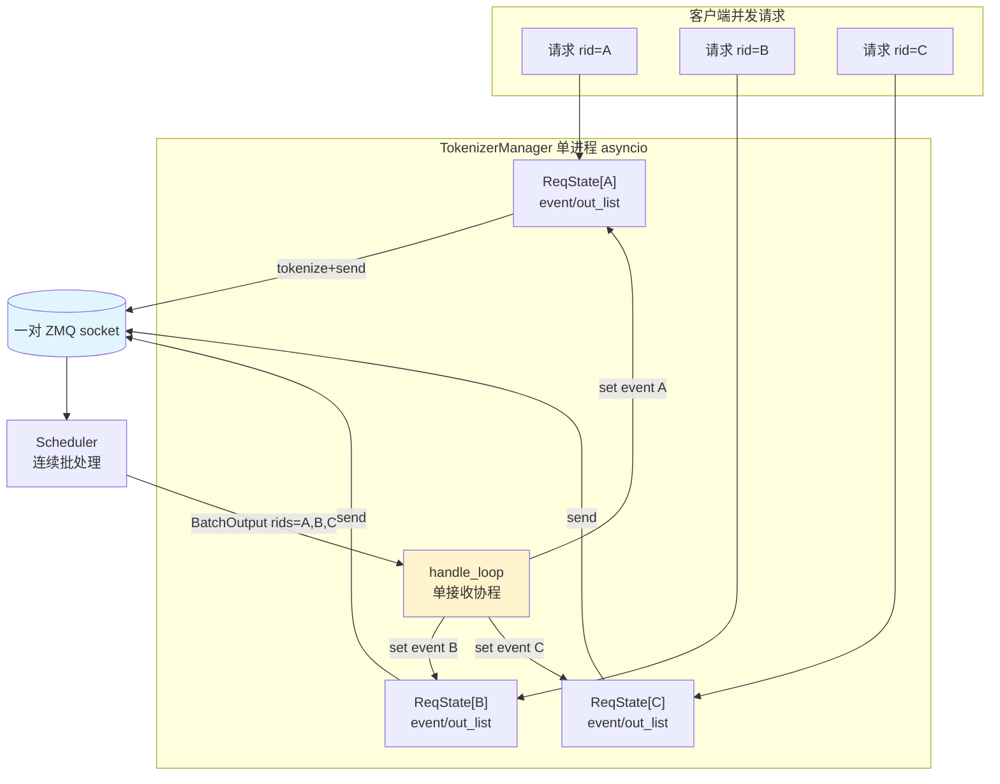

# SGLang 多路复用详解

> 本文档基于 `python/sglang/srt/managers/` 源码，详细介绍 SGLang 的**多路复用（Multiplexing）**机制：单个 SGLang 服务如何在一套通信通道上同时服务成百上千个并发请求/会话。
>
> 相关文档：多轮对话如何跨请求复用历史 KV，见 `SGLang_会话管理详解.md`。多路复用是"空间维度"上的复用（跨请求），会话管理是"时间维度"上的复用（跨轮次），二者正交、可同时生效。

---

## 一、概览：多路复用分两层

SGLang 是三进程架构（`TokenizerManager` ↔ `Scheduler` ↔ `DetokenizerManager`，经 ZMQ 通信）。要让一个进程/一套 ZMQ 通道服务海量并发请求，多路复用其实分两层：

| 层次 | 位置 | 复用什么 | 机制 |
| --- | --- | --- | --- |
| **请求级（I/O 复用）** | `TokenizerManager` | 一对 ZMQ socket 承载所有请求的收发 | `rid_to_state` + `asyncio.Event` + 单接收协程解复用 |
| **批级（计算复用）** | `Scheduler` | 一次 GPU 前向服务多个请求 | 连续批处理（continuous batching）+ RadixAttention |

下面分别展开。

## 二、请求级多路复用：一套通道服务海量并发

一个自然的问题：成千上万个并发 HTTP 请求，如何共用**一对 ZMQ socket** 而互不串扰？答案是 **TokenizerManager 里基于 `rid`（request id）的异步多路复用**。

### 2.1 `ReqState` + `rid_to_state`：每个在途请求一个"信箱"

`tokenizer_manager.py`：

```python
@dataclass
class ReqState:
    out_list: List[Dict]        # 累积的输出分片
    finished: bool
    event: asyncio.Event        # 有新输出时唤醒等待的协程
    obj: Union[GenerateReqInput, EmbeddingReqInput]
    ...

# TokenizerManager 里：
self.rid_to_state: Dict[str, ReqState] = {}    # rid -> 该请求的状态信箱
```

每个进来的请求分配唯一 `rid`，在 `rid_to_state` 里建一个 `ReqState`，内含一个 `asyncio.Event` 作为"有新数据"的信号。

### 2.2 发送端：每个请求独立协程

`generate_request` 是一个 async generator。它 tokenize 后把请求发给 scheduler，然后 `await` 自己的 `ReqState.event`：

```python
async def _wait_one_response(self, obj, request=None):
    state = self.rid_to_state[obj.rid]
    while True:
        await asyncio.wait_for(state.event.wait(), timeout=...)
        out_list = state.out_list
        state.out_list = []
        state.event.clear()
        # yield 出这一批增量输出
        ...
        if finished:
            break
```

成百上千个这样的协程可以同时挂起在各自的 `event.wait()` 上，由 asyncio 事件循环统一调度——这就是"多路复用"的并发基础。

### 2.3 接收端：单循环按 rid 解复用（demux）

`handle_loop` 是**唯一**一个从 scheduler 侧读输出的协程。它把一批输出按 `rid` 分发到对应的 `ReqState`，并 `set()` 唤醒对应协程：

```python
async def handle_loop(self):
    while True:
        recv_obj = await self.recv_from_detokenizer.recv_pyobj()
        if isinstance(recv_obj, (BatchStrOutput, BatchEmbeddingOutput, BatchTokenIDOutput)):
            await self._handle_batch_output(recv_obj)   # 按 rid 分发
        else:
            self._result_dispatcher(recv_obj)           # 控制类消息按类型分发

async def _handle_batch_output(self, recv_obj):
    for i, rid in enumerate(recv_obj.rids):     # 一条消息里携带整批请求的输出
        state = self.rid_to_state.get(rid)
        ...
        state.out_list.append(out_dict)
        state.event.set()                        # 唤醒该 rid 的等待协程
```

要点：
- Scheduler 一次返回的是**一整批**（`recv_obj.rids` 是这批所有请求的 rid 列表），因为它是连续批处理的。TokenizerManager 把这批结果**拆开**分给各请求。
- 控制类消息（`AbortReq`、`OpenSessionReqOutput`、权重更新结果等）走 `TypeBasedDispatcher`（`init_request_dispatcher` 注册），按类型而非 rid 分发。

### 2.4 多路复用示意图



## 三、批级多路复用：Scheduler 的连续批处理

真正把多个请求"混在一起算"的是 Scheduler 的**连续批处理（continuous batching）**：

- 每个 step，调度器从等待队列里挑选一批请求组成 `ScheduleBatch`，一次前向把它们**拼成一个大 batch** 送进模型；
- prefill 和 decode 请求可以混合；不同请求长度不同，靠 attention backend 的变长支持（`seq_lens`、page table）处理；
- 请求可随时加入/离开 batch（完成即移除、新请求即插入），无需等整批结束——这正是"连续"批处理相对"静态"批处理的优势；
- 配合 RadixAttention，多个请求间**共享的前缀 KV 只存一份**（跨请求的空间复用）。

因此，多路复用在 SGLang 里其实分两层：
1. **TokenizerManager 层**：rid + asyncio 事件，负责请求的**接入与结果分发**（I/O 复用）；
2. **Scheduler 层**：连续批处理 + RadixAttention，负责请求在**GPU 计算上的复用**（算力/显存复用）。

## 四、会话 × 多路复用：如何协同

多个会话的多轮请求是**并发**进入系统的，它们同样被多路复用地处理：

- 每个会话的每一轮请求都有独立 `rid` 和 `ReqState`，在 TokenizerManager 层被独立追踪；
- 在 Scheduler 层，不同会话的请求可以出现在**同一个连续批**里一起前向；
- 会话锁住的 KV（radix 树 `lock_ref` 或 `SessionSlot`）保证它在多个批次之间不被淘汰，从而下一轮命中；
- 流式会话额外约束"同会话同时只有一个 in-flight 请求"，但**不同会话之间仍然完全并发**。

（会话机制的细节见 `SGLang_会话管理详解.md`。）

## 五、相关配置

- `--batch-notify-size`（`server_args`）：TokenizerManager 批量唤醒等待协程的阈值，影响多路复用下的通知开销。

## 六、总结

1. **请求级（I/O）**：TokenizerManager 用 `rid_to_state` + `asyncio.Event`，让海量并发请求共用一对 ZMQ socket；`handle_loop` 单协程按 rid 把批输出解复用给各请求协程。
2. **批级（计算）**：Scheduler 连续批处理把不同请求拼成一个大 batch 前向，配合 RadixAttention 跨请求共享前缀 KV。
3. **协同**：多个会话的多轮请求天然并发，被两层复用机制同时处理。

### 关键文件速查

| 文件 | 职责 |
| --- | --- |
| `srt/managers/tokenizer_manager.py` | `ReqState` / `rid_to_state` / `handle_loop`（请求级多路复用、按 rid 解复用） |
| `srt/managers/scheduler.py` | 连续批处理调度（批级计算复用） |
| `srt/managers/io_struct.py` | `BatchStrOutput` / `BatchTokenIDOutput` 等批输出结构（含 `rids`） |

> 多轮对话如何跨请求复用历史 KV，请见配套文档 `SGLang_会话管理详解.md`。
