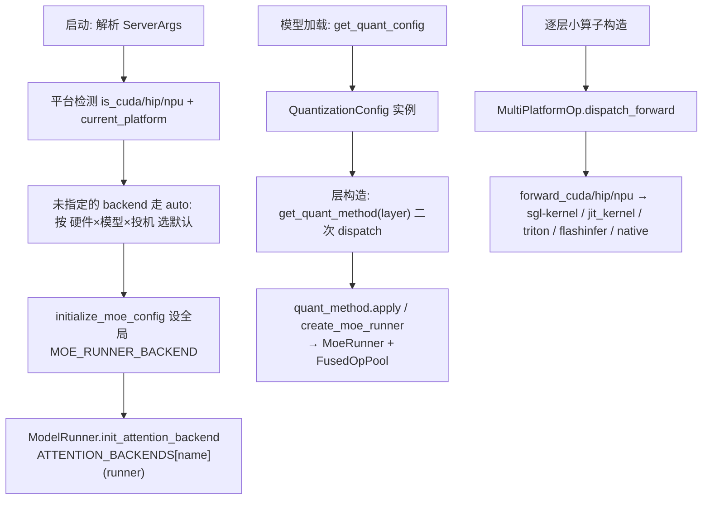
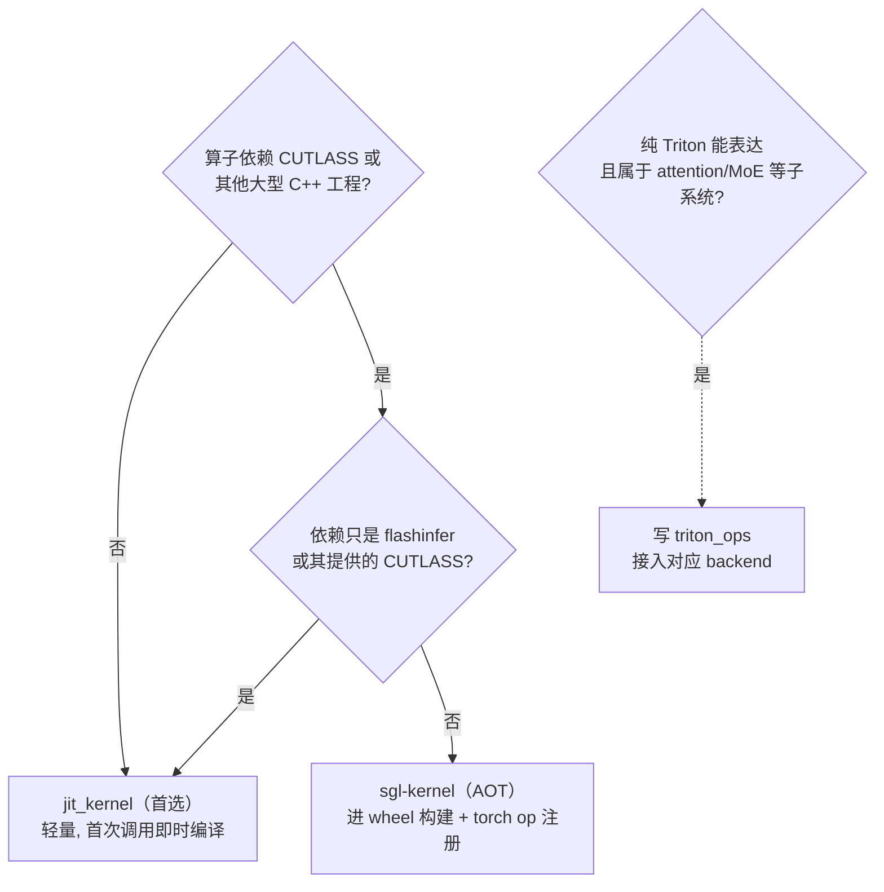

# SGLang 算子选择机制 & 如何自定义/优化算子

> 本文分两大部分：
> **上篇**——SGLang 运行时是**怎么为同一个逻辑算子挑选具体实现**的（按硬件平台 + 用户配置 + 模型类型）。
> **下篇**——如果你要**优化某个算子并接入 SGLang**，该走哪条路、怎么实现。

---

# 上篇：SGLang 如何选择算子

SGLang 的算子选择有**两条并行主线**：

| 主线 | 对象 | 机制 | 何时决定 |
| --- | --- | --- | --- |
| **A. 逐层小算子** | RMSNorm / SiluAndMul / RoPE 等 | `MultiPlatformOp` 按平台分发 + import 期绑定 kernel 源 | 进程启动 / 层构造时 |
| **B. 子系统 backend** | Attention / MoE / 量化 / 采样 / 语法 | `ServerArgs` 默认值 + registry 查表实例化 | 启动参数解析 + 模型加载时 |

先理解一个前提：SGLang 的算子实现来自**四个来源**，选择就是在它们之间做决策。

| 来源 | 调用方式 | 典型用途 |
| --- | --- | --- |
| **sgl-kernel（AOT）** | `from sgl_kernel import rmsnorm` / `torch.ops.sgl_kernel.*` | 预编译进 wheel 的高性能 CUDA/HIP/CPU kernel |
| **jit_kernel（JIT）** | `from sglang.jit_kernel.xxx import ...` | 首次调用时即时编译的轻量 CUDA kernel |
| **triton_ops** | `srt/layers/**/triton_ops/` | Triton 写的 kernel（attention、MoE 等） |
| **外部库** | flashinfer / vllm ops / aiter / torch_npu 等 | 复用成熟第三方 kernel |

---

## 一、逐层小算子：`MultiPlatformOp` 平台分发

### 1.1 基类

**文件**：`python/sglang/srt/layers/utils/multi_platform.py`，类 `MultiPlatformOp`（26 行）。

它继承 `nn.Module`，在 `__init__` 里就把 `forward` 绑定到具体平台方法：

```python
def __init__(self):
    super().__init__()
    self._forward_method = self.dispatch_forward()   # 构造时就选好

def forward(self, *args, **kwargs):
    return self._forward_method(*args, **kwargs)      # 运行时直接调，无分支开销

def dispatch_forward(self):
    if current_platform.is_out_of_tree():             # OOT 插件平台优先
        ...
    if _is_cuda:   return self.forward_cuda
    elif _is_hip:  return self.forward_hip
    elif _is_cpu and _is_cpu_amx_available: return self.forward_cpu
    elif _is_npu:  return self.forward_npu
    elif _is_xpu:  return self.forward_xpu
    elif _is_musa: return self.forward_musa
    else:          return self.forward_native
```

要点：
- 子类实现 `forward_cuda` / `forward_hip` / `forward_npu` / `forward_native` 等；未实现的默认回退（如 `forward_hip` 默认调 `forward_cuda`，`forward_npu` / `forward_xpu` / `forward_cpu` 默认调 `forward_native`）。
- `_is_cuda` 等是**模块加载时一次性算好的常量**（17-23 行），分发决策 **O(1)**，不在热路径里反复判断。
- **torch.compile 模式**：`enter_torch_compile`（44 行）会临时把 `_forward_method` 切到 `forward_native`（MoE/TopK 有特殊规则），让编译器看到纯 PyTorch 实现。
- **OOT（out-of-tree）平台**：第三方硬件插件可用 `register_oot_forward` 注册自己的实现，无需改核心代码。

### 1.2 平台检测工具

定义在 `python/sglang/srt/utils/common.py`：`is_cuda()`（152 行）、`is_hip()`（129）、`is_npu()`（172）、`is_cpu()`（204）、`is_xpu()`、`is_musa()`、`is_flashinfer_available()`（337）、`cpu_has_amx_support()` 等。更高层的抽象是 `srt/platforms/` 的 `current_platform` 单例（支持 OOT 插件发现）。

### 1.3 import 期"选 kernel 源" + 运行期"选平台方法"

真正的选择分**两步**，以 `RMSNorm`（`srt/layers/layernorm.py`）为例：

**第 1 步（import 期）**：文件顶部按平台把 kernel 符号导进来（layernorm.py:47+）：

```python
_is_cuda = is_cuda()
if _is_cuda or _is_xpu or _is_musa:
    if _is_flashinfer_available:
        try:
            import flashinfer.norm
            @register_custom_op(...)        # 包成 torch.ops.sglang.* 供 compile
            def layernorm(...): ...
        except (ImportError, AttributeError):
            _flashinfer_layernorm_available = False
    from sgl_kernel import fused_add_rmsnorm, rmsnorm, ...   # AOT
elif _is_hip:
    try:
        from vllm._custom_ops import fused_add_rms_norm, rms_norm
    except ImportError:
        _has_vllm_rms_norm = False
if _is_cuda:
    from sglang.jit_kernel.norm import fused_add_rmsnorm as _jit_fused_add_rmsnorm  # JIT
```

**第 2 步（运行期）**：`MultiPlatformOp` 把 `forward` 分发到 `forward_cuda` / `forward_hip` / ...，方法内部再按"是否有 residual、是否 batch-invariant、head_size 是否受支持"等条件在 sgl-kernel / jit_kernel / 外部库 / native 之间**二次选择**：

```python
def forward_cuda(self, x, residual=None):
    if batch_invariant_mode or ...:          # 特殊模式 → 纯 native
        return self.forward_native(x, residual)
    if residual is not None:
        return fused_add_rmsnorm(...)         # sgl-kernel 融合 kernel
    return rmsnorm(...)                        # sgl-kernel
```

`SiluAndMul`（`srt/layers/activation.py`）、`RotaryEmbedding`（`srt/layers/rotary_embedding/base.py`）是同样的两步套路。

### 1.4 `custom_op.py` 是什么（别混淆）

`srt/utils/custom_op.py` 里的 `register_custom_op` / `CustomOpWrapper` **不是** 平台分发基类，而是把 Python 函数注册成 `torch.ops.sglang.*` 以供 **torch.compile / dynamo** 追踪的工具（常用来包装 flashinfer 等外部 kernel）。平台分发的正主是 `MultiPlatformOp`。

---

## 二、子系统 backend：ServerArgs 默认值 + Registry 查表

大块子系统（attention、MoE、量化）不走 `MultiPlatformOp`，而是 **"参数决定名字 → 注册表查工厂 → 实例化"**。

### 2.1 Attention backend

**支持的取值**（`server_args.py:180+`）：`flashinfer`、`fa3`/`fa4`、`triton`、`flashmla`、`trtllm_mla`、`trtllm_mha`、`cutlass_mla`、`aiter`、`ascend`、`torch_native`、`flex_attention` 等。

**注册表**（`srt/layers/attention/attention_registry.py`）：

```python
ATTENTION_BACKENDS = {}
def register_attention_backend(name):
    def decorator(fn):
        ATTENTION_BACKENDS[name] = fn      # name → factory(runner)->Backend
        return fn
    return decorator
```

**实例化**（`model_runner.py`，`_get_attention_backend` / `_get_attention_backend_from_str`，2405+）：
```python
full_attention_backend = ATTENTION_BACKENDS[backend_str](self)   # 查表 + 建实例
return attn_backend_wrapper(self, full_attention_backend)         # 混合模型再包一层
```
prefill 和 decode 可用不同 backend（`HybridAttnBackend`）。

**默认自动选择**（`server_args.py` 的 `_get_default_attn_backend`，2924+）：用户没指定时，按"MHA/MLA × 硬件架构 × 是否投机"给默认值，例如：
- MHA + Hopper → `fa3`；MHA + SM100 → `trtllm_mha`；MHA + 其他 + flashinfer 可用 → `flashinfer`；否则 `triton`。
- MLA + Hopper → `fa3`；MLA + SM100 → `flashinfer`；MLA + HIP → `aiter`。

所有 backend 实现统一继承 `AttentionBackend`（`srt/layers/attention/base_attn_backend.py`），`forward` 按 `ForwardMode` 分发到 `forward_decode` / `forward_extend`。

### 2.2 MoE runner backend

**取值**（`--moe-runner-backend`，`server_args.py:231+`）：`auto`、`triton`、`triton_kernel`、`deep_gemm`、`flashinfer_trtllm`、`flashinfer_cutlass`、`flashinfer_mxfp4`、`cutlass`、`aiter`、`marlin` 等。

**全局初始化**：`initialize_moe_config`（`srt/layers/moe/utils.py:262`）把 `MOE_RUNNER_BACKEND` 设好（scheduler 启动时调用）。

**实例化**：`MoeRunner.__init__`（`srt/layers/moe/moe_runner/runner.py:27`）按 backend 选 `runner_core`（`TritonRunnerCore` / `DeepGemmRunnerCore` / `AiterRunnerCore` …）；端到端融合路径走 `FusedOpPool.get_fused_func(...)`（`moe_runner/base.py`，用 `@register_fused_func("none","flashinfer_trtllm")` 之类注册）。

**auto 的二次决策**在量化方法里，如 `Fp8MoEMethod.create_moe_runner`（`quantization/fp8.py:1769`）：deep_gemm 可用则 DEEP_GEMM，HIP+aiter 则 AITER，否则 TRITON。

### 2.3 量化方法

**注册表**（`srt/layers/quantization/__init__.py`）：`BASE_QUANTIZATION_METHODS`（72+）含 `fp8`、`awq`、`gptq`、`w8a8_int8`、`mxfp4`、`modelopt_fp4` 等；按平台条件扩展（HIP/CUDA 加 mxfp4、NPU 覆盖 gptq）。`get_quantization_config(name)` 查表。

**从 CLI 到 kernel**：`--quantization` → `ModelConfig.quantization`（也会从 HF `quantization_config` 自动检测）→ 加载时 `get_quant_config` 实例化 `QuantizationConfig` → **层构造时** `layer.quant_method = quant_config.get_quant_method(layer, prefix)`（`srt/layers/linear.py:176`）→ `quant_method.apply()` 真正调 sgl-kernel/deep_gemm/flashinfer/triton 的量化 kernel。

`get_quant_method` 是**关键的二次 dispatch**：同一个 `fp8`，给 `LinearBase` 返回 `Fp8LinearMethod`、给 `FusedMoE` 按 runner backend 返回 `Fp8MoEMethod` / Marlin / FlashInfer 变体、给 `RadixAttention` 返回 `Fp8KVCacheMethod`。

### 2.4 其它可选 backend 参数（`server_args.py`）

| 参数 | 默认 | 说明 |
| --- | --- | --- |
| `--attention-backend` / `--prefill-attention-backend` / `--decode-attention-backend` | auto | attention |
| `--moe-runner-backend` / `--moe-a2a-backend` | auto / none | MoE |
| `--quantization` | None | 量化 |
| `--sampling-backend` | flashinfer→pytorch | 采样 |
| `--grammar-backend` | xgrammar | 结构化输出 |
| `--lora-backend` | csgmv | LoRA |
| `--mamba-backend` / `--linear-attn-backend` | triton | 线性/Mamba 注意力 |
| `--fp8-gemm-backend` / `--fp4-gemm-backend` | auto | 量化 GEMM |
| `--mm-attention-backend` | None | 多模态 ViT attention |

### 2.5 选择流程全景



---

# 下篇：如何自定义/优化一个算子

假设你 profiling 后发现某个算子是瓶颈，想写一个更快的 kernel 接进 SGLang。决策顺序如下。

## 三、先决定走哪条路



- **`jit_kernel`（默认首选）**：kernel **不依赖** CUTLASS/大型 C++ 工程时用它。轻量、迭代快、首次使用时编译。（依赖 flashinfer 或其自带 CUTLASS 也可用 JIT。）
- **`sgl-kernel`（AOT）**：**依赖** CUTLASS 或大型 C++ 工程，或需要进 wheel 构建 / 参与 torch op 注册流程时用它。
- **Triton 内核**：如果用 Triton 就能高效表达，且属于 attention/MoE/LoRA 等已有子系统，直接在对应目录写 `triton_ops` 并接入该子系统的 backend。

> 仓库里有两份配套 skill 可直接照抄：`.claude/skills/add-jit-kernel/SKILL.md` 和 `.claude/skills/add-sgl-kernel/SKILL.md`。

## 四、路径 A：JIT kernel（推荐，轻量）

以"element-wise scale：`scale(x, factor) = x * factor`"为例，需要新增 4 个文件。

### 4.1 CUDA kernel（`python/sglang/jit_kernel/csrc/`）

新建 `jit_kernel/csrc/elementwise/scale.cuh`。**优先用项目封装**（在 `jit_kernel/include/sgl_kernel/`）而非裸 CUDA：

- `TensorMatcher` / `SymbolicSize` / `SymbolicDevice`（`tensor.h`）——统一做 shape/dtype/device 校验，不要手写检查。
- `LaunchKernel`（`utils.cuh`）——RAII 启动器，自动解析 stream + 检查 CUDA 错误，支持 `.enable_pdl(...)`。
- `AlignedVector`（`vec.cuh`）——128-bit 向量化访存。
- `fp16_t` / `bf16_t` / `fp32_t`、`dtype_trait<T>`、`device::math::` 等类型/数学封装。
- 每个 `#include <sgl_kernel/...>` 加一行 `// For ...` 注释说明用途（JIT 风格约定）。

核心是一个模板 kernel + 一个 launcher（用 `TensorMatcher` 校验、选向量宽度、`LaunchKernel` 发射）。

### 4.2 Python 包装（`jit_kernel/scale.py`）

```python
from sglang.jit_kernel.utils import cache_once, is_arch_support_pdl, load_jit, make_cpp_args

@cache_once                                     # 不要用 functools.lru_cache（与 torch.compile 冲突）
def _jit_scale_module(dtype):
    args = make_cpp_args(dtype, is_arch_support_pdl())
    return load_jit(
        "scale", *args,
        cuda_files=["elementwise/scale.cuh"],
        cuda_wrappers=[("scale", f"scale<{args}>")],
    )

def scale(src, factor, out=None):
    if src.dtype not in (torch.float16, torch.bfloat16, torch.float32):
        raise RuntimeError(...)
    if out is None:
        out = torch.empty_like(src)
    _jit_scale_module(src.dtype).scale(out, src, factor)
    return out
```

要点：`load_jit` 的首参构成唯一构建标记（同标记复用同一编译产物）；只把**编译期特化项**（如 dtype、是否 PDL）放进标记，`factor` 这类运行期标量直接传；Python 包装保持薄，只校验 JIT/FFI 层不会自己拦截的基本前提。

### 4.3 测试 + benchmark（必需）

- 测试放 `test/registered/jit/test_scale.py`，**模块级**写字面量 `register_cuda_ci(est_time=30, suite="base-b-kernel-unit-1-gpu-large")`（`run_suite.py` 靠 AST 静态解析，不能用计算值/包装）。
- benchmark 放 `test/registered/jit/benchmark/bench_scale.py`，用项目的 `marker` 框架（`@marker.parametrize` + `@marker.benchmark` + `marker.do_bench`），**不要**直接用 `triton.testing`。

跑 CI 方式：
```bash
cd test && python3 run_suite.py --hw cuda --suite base-b-kernel-unit-1-gpu-large
```

## 五、路径 B：sgl-kernel（AOT，重量级）

依赖 CUTLASS 或需进 wheel 时走这条。以同样的 `scale` 为例，通常要动这些文件：

| 文件 | 动作 |
| --- | --- |
| `sgl-kernel/csrc/elementwise/scale.cu` | 实现 kernel + launcher（用 `at::Tensor`、`TORCH_CHECK`、`DISPATCH_PYTORCH_DTYPE_TO_CTYPE_FLOAT_FP16`、`at::cuda::getCurrentCUDAStream()`） |
| `sgl-kernel/include/sgl_kernel_ops.h` | 加 C++ 声明 |
| `sgl-kernel/csrc/common_extension.cc` | `TORCH_LIBRARY_FRAGMENT` 里 `m.def(...schema...)` + `m.impl("scale", torch::kCUDA, &scale)` |
| `sgl-kernel/CMakeLists.txt` | 把 `csrc/elementwise/scale.cu` 加进 `SOURCES`（**按字母序**） |
| `sgl-kernel/python/sgl_kernel/elementwise.py` + `__init__.py` | Python 包装 `torch.ops.sgl_kernel.scale.default(...)` 并 re-export |
| `sgl-kernel/tests/test_scale.py` | 测试（pytest） |
| `sgl-kernel/benchmark/bench_scale.py` | benchmark（`triton.testing`） |

构建与验证：
```bash
cd sgl-kernel && make build -j16
pytest sgl-kernel/tests/test_scale.py -q
python sgl-kernel/benchmark/bench_scale.py
```
torch schema 里 `Tensor!` 表示 in-place/可变输出；schema 对 torch.compile 很重要。CMake 的 `SOURCES` 漏加会导致链接期符号未定义。

## 六、把新算子接进模型/层（让它真正被用上）

写完 kernel 只是第一步，还要让 SGLang 在合适平台调用它。两种情况：

### 6.1 替换一个已有的 `MultiPlatformOp` 算子

若你优化的是 RMSNorm/activation/RoPE 这类：在对应 layer 文件里，
1. import 期把你的新 kernel 符号按平台导入（`if _is_cuda: from sglang.jit_kernel.xxx import ...`）。
2. 在 `forward_cuda`（或对应平台方法）里，用你的 kernel 替换/新增分支，保留 `forward_native` 作为 fallback。
3. 保证 native 路径与 kernel 路径**数值一致**（测试里 `torch.testing.assert_close`）。

### 6.2 接入子系统 backend（attention / MoE / 量化）

用对应的注册装饰器把你的实现挂进注册表，再用 CLI 参数选中它：
- Attention：`@register_attention_backend("my_backend")` 定义 factory，然后 `--attention-backend my_backend`。必要时用 `add_attention_backend_choices` 扩展 CLI choices。
- MoE fused path：`@register_fused_func(a2a, runner)`。
- 量化：在 `quantization/__init__.py` 注册新的 `QuantizationConfig`，其 `get_quant_method` 返回你的 method。

这样就无需改核心调度代码，靠 registry + 参数即可切换到你的算子。

## 七、优化算子的通用建议

1. **先量化瓶颈再动手**：用 profiler（仓库有 `.claude/skills/generate-profile`、`llm-torch-profiler-analysis` 等 skill）确认这个算子确实是瓶颈、是访存受限还是算力受限，别凭感觉优化。
2. **访存受限算子**：优先向量化访存（`AlignedVector` 128-bit）、算子融合（如 `fused_add_rmsnorm` 把 residual add 融进 norm）、减少 kernel launch。benchmark 关注 GB/s。
3. **算力受限算子**：关注 tensor core 利用率、tiling、量化；benchmark 关注 TFLOPs（marker 里可关掉带宽列）。
4. **永远保留 `forward_native`**：作为正确性基准和不支持平台的 fallback，测试对比二者数值。
5. **注意 CUDA graph 兼容**：热路径算子多数会被 CUDA graph 捕获，避免在 forward 里做同步（`.cpu()` / `.item()`）、动态 shape 分配。
6. **PDL / fast-math 是可选加分项**：`enable_pdl`、`--use_fast_math`（有精度权衡）在 profiling 证明有收益时再开。

---

## 一句话总结

> SGLang 的算子选择分两层：**逐层小算子**靠 `MultiPlatformOp` 在构造时按 `_is_cuda/_is_hip/...` 绑定 `forward_*`，并在 import 期就选好 sgl-kernel / jit_kernel / triton / flashinfer 的 kernel 源；**子系统 backend（attention/MoE/量化）**靠 `ServerArgs` 的默认值（按硬件×模型×投机自动选）+ 各自的 registry（`ATTENTION_BACKENDS` / `FusedOpPool` / `QUANTIZATION_METHODS`）查表实例化，量化再经 `get_quant_method` 二次 dispatch。要自定义/优化算子：不依赖 CUTLASS 走轻量 `jit_kernel`，依赖 CUTLASS/进 wheel 走 `sgl-kernel`（都必须配测试 + benchmark），最后通过替换 `MultiPlatformOp` 的平台方法或用注册装饰器 + CLI 参数把它接进 SGLang。

---

## 关键代码 & 文档速查

| 主题 | 位置 |
| --- | --- |
| 平台分发基类 | `srt/layers/utils/multi_platform.py`（`MultiPlatformOp`，26/109） |
| 平台检测 | `srt/utils/common.py`（`is_cuda`152/`is_hip`129/`is_npu`172…）、`srt/platforms/`（`current_platform`） |
| torch.compile op 注册 | `srt/utils/custom_op.py`（`register_custom_op`、`CustomOpWrapper`） |
| 算子示例 | `srt/layers/layernorm.py`、`activation.py`、`rotary_embedding/base.py` |
| Attention 注册/选择 | `srt/layers/attention/attention_registry.py`、`model_runner.py`（`_get_attention_backend`2405）、`server_args.py`（`_get_default_attn_backend`2924） |
| Attention 基类 | `srt/layers/attention/base_attn_backend.py`（`AttentionBackend`） |
| MoE backend | `srt/layers/moe/utils.py`（`initialize_moe_config`262）、`moe_runner/runner.py`（`MoeRunner`27）、`moe_runner/base.py`（`FusedOpPool`） |
| 量化 | `srt/layers/quantization/__init__.py`、`base_config.py`（`get_quant_method`）、`fp8.py`（`create_moe_runner`1769） |
| 配置参数 | `srt/server_args.py`（Kernel backend 段 5879+） |
| JIT kernel 教程 | `.claude/skills/add-jit-kernel/SKILL.md`、`docs/developer_guide/development_jit_kernel_guide.md` |
| AOT kernel 教程 | `.claude/skills/add-sgl-kernel/SKILL.md`、`sgl-kernel/README.md` |
| JIT 封装头文件 | `python/sglang/jit_kernel/include/sgl_kernel/`（`tensor.h`/`utils.cuh`/`vec.cuh`…） |
| CI 运行器 | `test/run_suite.py`、`python/sglang/test/ci/ci_register.py` |
