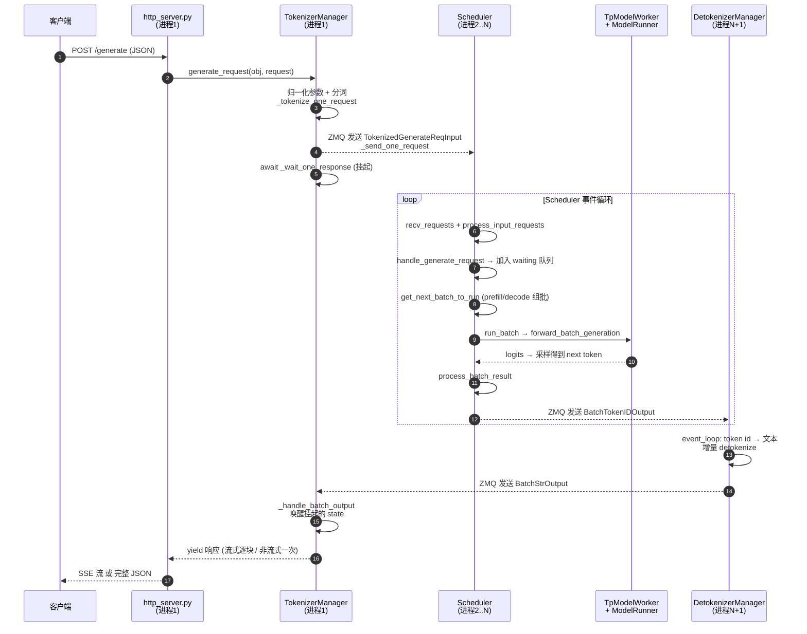
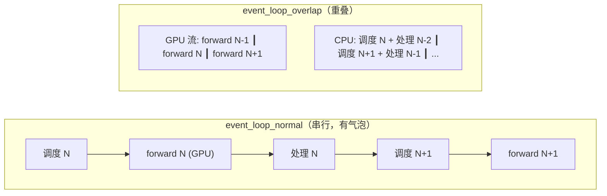

# SGLang：一条请求的旅程

> 本文以一个最常见的请求 `POST /generate`（非流式 / 流式皆覆盖）为主线，追踪它从进入服务到返回结果的完整代码路径。
> 所有文件路径相对仓库根目录；行号基于当前 `main`，可能随版本小幅漂移，**以函数名为准**。
> 涉及三个进程：**前端/TokenizerManager** → **Scheduler** → **DetokenizerManager**，彼此通过 ZMQ 通信。

---

## 全景时序图



---

## 第 0 站：服务启动（前置背景）

在请求到来前，进程拓扑已搭好：

- `python/sglang/launch_server.py` → `run_server()` → 默认走 `srt/entrypoints/http_server.py:launch_server()`（约 2461 行）
- `launch_server` 内部会：
  - 启动 `TokenizerManager`（前端，asyncio，跑在主进程）
  - fork 出 N 个 `Scheduler` 子进程（每个 TP rank 一个）
  - fork 出 `DetokenizerManager` 进程
  - 建立三者之间的 ZMQ socket（`recv_from_tokenizer` / `send_to_detokenizer` / `send_to_tokenizer` 等）
- 也可走编程式入口 `srt/entrypoints/engine.py` 的 `Engine.__init__`（199 行），逻辑相同。

---

## 第 1 站：HTTP 入口（进程 1）

**文件**：`srt/entrypoints/http_server.py`，`generate_request`（803 行）

```python
@app.api_route("/generate", methods=["POST", "PUT"])
async def generate_request(obj: GenerateReqInput, request: Request):
    if obj.stream:
        # 流式：包成 SSE，逐块 yield "data: {...}\n\n"
        return StreamingResponse(stream_results(), media_type="text/event-stream", ...)
    else:
        # 非流式：只取生成器的第一个（也是唯一的最终）结果
        ret = await _global_state.tokenizer_manager.generate_request(obj, request).__anext__()
        return orjson_response(ret)
```

要点：
- 请求体被 FastAPI 解析成 `GenerateReqInput`（定义在 `srt/managers/io_struct.py`）。
- 不论流式与否，都调用同一个 `tokenizer_manager.generate_request(...)`，它是一个**异步生成器**。
- 流式：`async for` 持续取结果；非流式：`.__anext__()` 取最终结果。

---

## 第 2 站：分词与下发（进程 1，TokenizerManager）

**文件**：`srt/managers/tokenizer_manager.py`，`generate_request`（575 行）

关键步骤（按代码顺序）：

1. `auto_create_handle_loop()` — 首次调用时拉起后台协程 `_handle_loop`，负责接收来自 Detokenizer 的输出。
2. `obj.normalize_batch_and_arguments()` — 归一化参数（单条/批量、采样参数等）。
3. `_init_req_state(obj, request)` — 为该请求创建一个 `ReqState`，登记到 `self.rid_to_state[rid]`（rid = 请求唯一 id）。
4. 单条请求路径（`obj.is_single`）：
   ```python
   tokenized_obj = await self._tokenize_one_request(obj)   # 770 行：文本 → input_ids
   self._send_one_request(tokenized_obj)                   # 1307 行：ZMQ 发往 Scheduler
   async for response in self._wait_one_response(obj, request):  # 1413 行：挂起等待结果
       yield response
   ```

要点：
- `_tokenize_one_request` 把文本变成 token id，产出 `TokenizedGenerateReqInput`。
- `_send_one_request` 通过 ZMQ（`send_to_scheduler`）把请求发给 Scheduler 进程。
- `_wait_one_response` 在 `ReqState` 的 event 上 `await`，**协程在此挂起**，直到后台 `_handle_loop` 收到该 rid 的输出后唤醒它。

> 进程边界：到这里请求离开前端进程，通过 ZMQ 进入 Scheduler。

---

## 第 3 站：调度核心（进程 2..N，Scheduler）

**文件**：`srt/managers/scheduler.py`

### 3.1 主循环

`event_loop_normal`（1472 行）或 `event_loop_overlap`（1499 行，CPU/GPU 重叠优化，默认）：

```python
def event_loop_normal(self):
    while True:
        recv_reqs = self.request_receiver.recv_requests()   # 从 ZMQ 收请求
        self.process_input_requests(recv_reqs)              # 1591 行：分发处理
        batch = self.get_next_batch_to_run()                # 2468 行：组装下一个 batch
        self.cur_batch = batch
        if batch:
            result = self.run_batch(batch)                  # 3056 行：跑模型
            self.process_batch_result(batch, result)        # 3278 行：处理输出
        else:
            self.on_idle()
        self.last_batch = batch
```

### 3.2 收到请求 → 入队

`process_input_requests`（1591 行）按类型分发；生成类请求进入 `handle_generate_request`（1962 行）：
- 构造内部 `Req` 对象（`srt/managers/schedule_batch.py`）。
- 做前缀缓存匹配（RadixAttention）后，加入 **waiting queue**。

### 3.3 组批：连续批处理的核心

`get_next_batch_to_run`（2468 行）每一轮决定这次跑什么：
- 优先尝试 `get_new_batch_prefill`（2613 行）：从 waiting 队列取请求做 **prefill**（含 chunked prefill、前缀复用、KV 分配）。
- 否则 `update_running_batch`（2906 行）：对正在生成的请求做一步 **decode**。
- 内存不足时按 `schedule_policy.py` 策略**抢占**（retract）部分请求。

> 这就是 continuous batching：prefill 与 decode 请求动态混合，未完成的请求每轮回到 running batch 继续。

### 3.4 跑模型

`run_batch`（3056 行）→ `TpModelWorker.forward_batch_generation`（`srt/managers/tp_worker.py:65`）→ `ModelRunner`（`srt/model_executor/model_runner.py`）：
- 构造 `ForwardBatch`，调用具体模型 `srt/models/*.py` 的 `forward`。
- attention 走 `srt/layers/attention/` 的 backend（FlashInfer/Triton 等），可能用 CUDA Graph。
- 得到 logits 后采样（`srt/sampling/`）出下一个 token。

### 3.5 处理结果 → 下发输出

`process_batch_result`（3278 行）：
- 把采样得到的 token 写回各 `Req`，更新/释放 KV 缓存。
- 判断是否结束（EOS / 长度上限 / stop 串）。
- 通过 ZMQ `send_to_detokenizer` 发出 `BatchTokenIDOutput`（每一步都发，支撑流式）。

> 进程边界：输出离开 Scheduler，进入 Detokenizer。

---

## 第 4 站：反分词（进程 N+1，DetokenizerManager）

**文件**：`srt/managers/detokenizer_manager.py`，`event_loop`（159 行）

```python
def event_loop(self):
    while True:
        recv_obj = self.recv_from_scheduler.recv_pyobj()   # 收 BatchTokenIDOutput
        output = self.handle_...(recv_obj)                 # token id → 文本（增量 detokenize）
        self.send_to_tokenizer.send_pyobj(output)          # 发回前端：BatchStrOutput
```

要点：
- 维护每个请求的 detokenize 状态，做**增量解码**（处理多字节字符、stop 串裁剪 `trim_matched_stop`，169 行）。
- 产出 `BatchStrOutput`（含文本）发回前端进程。

> 进程边界：输出回到前端进程。注意是回到 TokenizerManager，再由它返回客户端，而非直连。

---

## 第 5 站：唤醒与返回（进程 1，TokenizerManager）

后台协程 `_handle_loop` → `_handle_batch_output`（1827 行）：
- 按 `rid` 找到挂起的 `ReqState`（`self.rid_to_state`）。
- 组装 `meta_info`（finish_reason、prompt_tokens、logprob、负载信息等）和输出文本。
- 把结果写入该 state 并 **set event**，唤醒第 2 站挂起的 `_wait_one_response`。

于是：
- `_wait_one_response` 拿到结果 → `yield` 给 `generate_request` → `yield` 给 HTTP 层。
- **流式**：每来一块就 yield 一次，HTTP 层包成 `data: {...}\n\n` 推给客户端；结束时发 `data: [DONE]`。
- **非流式**：HTTP 层 `.__anext__()` 取最终聚合结果，一次性 `orjson_response` 返回。

---

## 进阶：`event_loop_overlap` 的 CPU/GPU 重叠机制

第 3 站默认跑的其实是 `event_loop_overlap`（`scheduler.py:1499`），而不是更易读的 `event_loop_normal`。这是 SGLang "Zero-Overhead Batch Scheduler" 的核心，值得单独展开。

### 1. 为什么需要重叠：先看 normal 的"气泡"

`event_loop_normal` 每一轮是**严格串行**的：

```
组批(CPU) → 启动 forward(GPU) → 阻塞等结果(GPU→CPU 同步) → 处理结果(CPU) → 下一轮组批(CPU) ...
```

问题在于：
- GPU 跑 forward 时，CPU 在干等。
- CPU 做调度（收请求、组 batch、分配 KV、准备 metadata、采样后处理）时，GPU 在干等。
- 每轮结尾要把"新生成的 token"从 GPU 同步回 CPU（D2H），这个同步点会制造**气泡（bubble）**。

对 decode 这种每步计算量很小、调度开销占比很高的场景，气泡会严重拉低吞吐。

### 2. 核心思想：让第 N 轮的 GPU 计算和第 N+1 轮的 CPU 调度并行



关键是 `event_loop_overlap` 把**结果处理延后了一轮**：本轮先启动 batch N 的 forward，再去处理 batch N-1 的结果（它的 GPU 计算已经在上一轮 CPU 调度期间算完了）。

### 3. 循环结构（含"延后一轮"模式）

```python
def event_loop_overlap(self):
    self.result_queue = deque()                       # 存"已启动但还没处理结果"的 batch

    def pop_and_process():
        tmp_batch, tmp_result = self.result_queue.popleft()
        self.process_batch_result(tmp_batch, tmp_result)   # 处理上一轮的结果

    while True:
        recv_reqs = self.request_receiver.recv_requests()
        self.process_input_requests(recv_reqs)             # CPU: 收新请求

        if self._war_barrier_enabled:                      # WAR 屏障，见第 5 点
            self.schedule_stream.wait_stream(self.forward_stream)

        batch = self.get_next_batch_to_run()               # CPU: 组本轮 batch N
        # 启动本轮 forward（异步，不阻塞 CPU）
        if batch:
            batch_result = self.run_batch(batch)
            self.result_queue.append((batch.copy(), batch_result))

        # 处理上一轮 batch (N-1) 的结果——它的 GPU 计算此时已完成
        if self.last_batch:
            if not disable_overlap_for_batch:
                pop_and_process()

        if self.is_generation:
            self.launch_batch_sample_if_needed(batch_result)  # 本轮采样
        self.last_batch = batch
```

要点：
- `result_queue` 里始终压着"上一轮的 batch+结果"，所以任意时刻：**GPU 在算 forward(N)，CPU 在处理 result(N-1) 并准备 schedule(N+1)**，两者重叠。
- `batch.copy()`：因为 live batch 对象下一轮会被改写，存进队列的必须是快照。

### 4. 难点与解法：FutureMap（GPU 上的占位/中继）

最大的障碍：组 batch N+1（decode）需要 batch N 刚生成的 token 作为输入，但那个 token 还在 GPU 上、没同步回 CPU。如果强行同步就又有气泡了。

SGLang 的解法是 **`FutureMap`**（`srt/managers/overlap_utils.py`）：调度时**根本不读 token 的真实值**，而是用 GPU 上一块按 `req_pool_idx` 索引的缓冲区做中继，依赖关系全程在 GPU 上闭环：

| 方法 | 时机 | 作用 |
| --- | --- | --- |
| `stash(indices, payload)` | forward/采样后 | 把采样出的 token 写进 GPU 缓冲 `output_tokens_buf[indices]` |
| `resolve_forward_inputs(batch, future_map)` | 下一轮 forward 入口 | 直接在 GPU 上 `batch.input_ids = output_tokens_buf[req_pool_indices]`，**无需 CPU 参与** |
| `publish(indices, new_seq_lens)` | forward 后 | 把新的 `seq_lens` 写进 `new_seq_lens_buf`，让 attention/调度的元数据能推进 |
| `resolve_seq_lens_cpu(batch)` | 需要 CPU 侧序列长度时 | 用私有 D2H 流 + event，把 seq_lens 拷到 pinned buffer，避免同步主调度流 |

一句话：**CPU 调度只摆"占位索引"，真实 token 的"写入→读取"完全发生在 GPU 缓冲区里**，从而把 D2H 同步彻底移出关键路径。

### 5. 两条 CUDA 流 + 同步屏障

- `self.schedule_stream`（`scheduler.py:1459`，priority 0）：调度相关的 GPU 操作。
- `self.forward_stream` / `self.forward_stream_ctx`（`scheduler.py:1241`）：模型 forward。
- 两条流独立，才能让 forward 与下一轮调度准备并行。
- **WAR 屏障**（write-after-read，`_war_barrier_enabled`）：本轮调度要往共享 GPU 缓冲（如 `output_tokens_buf`）写之前，必须等上一轮 forward 把这些缓冲**读完**，否则会覆盖掉还在被读的数据。代码即 `schedule_stream.wait_stream(forward_stream)`。
- forward 启动前则 `forward_stream.wait_stream(schedule_stream)`，保证 forward 看到调度准备好的输入。
- 结果的 D2H 拷贝用 `copy_to_cpu()` 异步发起，并用 `copy_done` event 标记完成；下一轮 `process_batch_result` 读 CPU 值前会等这个 event，从而把 D2H 也移出关键路径。

### 6. 什么时候会临时关掉重叠

`is_disable_overlap_for_batch`（`scheduler.py:1557`）会在两种情况退化为串行处理：
- **连续两个 prefill batch**：为改善首 token 延迟（TTFT），由 `SGLANG_DISABLE_CONSECUTIVE_PREFILL_OVERLAP` 控制。
- **overlap + 投机解码 + grammar 约束**同时存在：目前尚不支持，需关闭重叠以保证 grammar 同步。

### 一句话总结重叠机制

> `event_loop_overlap` 把"处理上一轮结果"延后一轮执行，使 **GPU 算 forward(N)** 与 **CPU 处理 result(N-1)+调度 schedule(N+1)** 并行；跨轮的 token / seq_lens 依赖通过 GPU 上的 `FutureMap` 缓冲中继，配合 `schedule_stream` / `forward_stream` 双流和 WAR 屏障做同步，从而消除 normal 循环里的 CPU/GPU 气泡。

---

## 一句话总结这条链路

> `http_server.generate_request` 收请求 → `TokenizerManager` 分词并 ZMQ 下发后挂起 → `Scheduler` 事件循环里组批（continuous batching + RadixAttention）→ `run_batch` 经 `TpModelWorker/ModelRunner` 跑模型采样 → `process_batch_result` 把 token 通过 ZMQ 发给 `DetokenizerManager` 反分词 → `BatchStrOutput` 回到 `TokenizerManager` 唤醒挂起协程 → HTTP 层流式或一次性返回客户端。

---

## 关键文件速查表

| 站点 | 文件 | 关键函数（行号） |
| --- | --- | --- |
| HTTP 入口 | `srt/entrypoints/http_server.py` | `generate_request` (803) |
| 分词下发 | `srt/managers/tokenizer_manager.py` | `generate_request` (575)、`_tokenize_one_request` (770)、`_send_one_request` (1307)、`_wait_one_response` (1413) |
| 调度主循环 | `srt/managers/scheduler.py` | `event_loop_normal` (1472)、`event_loop_overlap` (1499) |
| 请求入队 | `srt/managers/scheduler.py` | `process_input_requests` (1591)、`handle_generate_request` (1962) |
| 组批 | `srt/managers/scheduler.py` | `get_next_batch_to_run` (2468)、`get_new_batch_prefill` (2613)、`update_running_batch` (2906) |
| 跑模型 | `srt/managers/scheduler.py` → `tp_worker.py` → `model_executor/model_runner.py` | `run_batch` (3056)、`forward_batch_generation` (65) |
| 处理结果 | `srt/managers/scheduler.py` | `process_batch_result` (3278) |
| 反分词 | `srt/managers/detokenizer_manager.py` | `event_loop` (159) |
| 唤醒返回 | `srt/managers/tokenizer_manager.py` | `_handle_batch_output` (1827) |
| 消息结构 | `srt/managers/io_struct.py` | `GenerateReqInput` / `TokenizedGenerateReqInput` / `BatchTokenIDOutput` / `BatchStrOutput` |

---

## 调试建议

想亲眼看清这条链路，在以下位置打断点单步跟一个真实请求最有效：

1. `tokenizer_manager.py: _send_one_request` — 确认请求被分词并下发。
2. `scheduler.py: get_next_batch_to_run` 和 `run_batch` — 观察组批与模型调用。
3. `scheduler.py: process_batch_result` — 看每一步 token 如何产出与下发。
4. `tokenizer_manager.py: _handle_batch_output` — 看结果如何回流唤醒协程。
