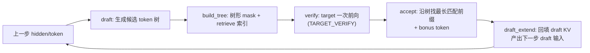

# SGLang 投机解码（Speculative Decoding）详解

> 投机解码通过"**小模型/廉价方法先猜一串 token，大模型一次性并行验证**"来加速自回归解码：一次 target 前向可能产出多个 token，从而降低单 token 的平摊延迟。
> SGLang 目前统一走 **Spec V2** 架构，支持 EAGLE / EAGLE3 / STANDALONE / FROZEN_KV_MTP / DFLASH / NGRAM / MULTI_LAYER_EAGLE 等算法，并可插件注册自定义算法。
> 核心目录：`python/sglang/srt/speculative/`。行号基于当前 `main`，会漂移，**以类名/方法名为准**。

---

## 一、为什么能加速：draft → verify → accept 范式

普通自回归解码每步只出 1 个 token，GPU 在 decode 阶段严重**访存受限**（算力用不满）。投机解码的思路：

1. **Draft（草稿）**：用廉价方式猜出未来 `k` 个候选 token（甚至一棵候选树）。
2. **Verify（验证）**：把这些候选 token**一次性**喂给 target 大模型并行前向（一次 forward 拿到所有候选位置的 logits）。
3. **Accept（接受）**：逐位比对，接受与 target 采样一致的**最长前缀**，其余丢弃；末尾再"白送"一个 target 采样的 **bonus token**。

只要平均接受长度 > 1，就等于一次 target 前向出了多个 token。**正确性无损**：接受判定保证最终分布等价于 target 模型自己解码（贪心逐位相等 / 采样用 rejection sampling）。



---

## 二、算法总览与分发（`spec_info.py`）

### 2.1 `SpeculativeAlgorithm` 枚举（`spec_info.py:28`）

```python
class SpeculativeAlgorithm(Enum):
    DFLASH = auto()
    EAGLE = auto()
    EAGLE3 = auto()
    FROZEN_KV_MTP = auto()
    STANDALONE = auto()
    NGRAM = auto()
    NONE = auto()
```

一组 `is_*()` 谓词供全局分发（scheduler / model_runner 用它避免 isinstance）：`is_eagle()`、`is_eagle3()`、`is_dflash()`、`is_ngram()`、`is_standalone()`、`is_frozen_kv_mtp()` 等。注意 `is_eagle()` 目前把 `FROZEN_KV_MTP` 也算进去。

### 2.2 Worker 工厂（`create_worker`，`spec_info.py:172`）

按算法返回对应 worker 类（全部是 V2 worker，即使关闭 overlap 也由 scheduler 同步驱动）：

| 算法 | Worker 类 | 文件 |
| --- | --- | --- |
| EAGLE / EAGLE3 | `EAGLEWorkerV2` | `eagle_worker_v2.py` |
| EAGLE + `--enable-multi-layer-eagle` | `MultiLayerEagleWorkerV2` | `multi_layer_eagle_worker_v2.py` |
| STANDALONE | `StandaloneWorkerV2` | `standalone_worker_v2.py` |
| FROZEN_KV_MTP | `FrozenKVMTPWorkerV2` | `frozen_kv_mtp_worker_v2.py` |
| DFLASH | `DFlashWorkerV2` | `dflash_worker_v2.py` |
| NGRAM | `NGRAMWorker` | `ngram_worker.py` |

### 2.3 插件注册（`spec_registry.py`）

第三方算法可用 `@SpeculativeAlgorithm.register("MY_SPEC", ...)` 装饰一个 `factory(server_args) -> WorkerClass` 注册。`from_string` 会先查枚举、再查注册表；`CustomSpecAlgo` 鸭子类型实现同样的 `is_*()` / `create_worker` 接口。`NEXTN` 是保留别名（→ EAGLE）。

---

## 三、Worker 接口（`base_spec_worker.py`）

### 3.1 `BaseSpecWorker`（`base_spec_worker.py:267`）

| 成员 | 说明 |
| --- | --- |
| `target_worker`（abstract property） | 目标大模型的 `TpModelWorker` |
| `draft_worker`（abstract property） | 草稿侧 worker；**NGRAM 为 `None`** |
| `spec_v2_attn_backends` | overlap 时决定是否需要把 `seq_lens_cpu` 做 D2H |
| `clear_cache_pool()`（abstract） | 清缓存（EAGLE 与 target 共享 KV pool，多为 no-op） |
| `on_verify_complete_cpu()` / `activate_step_by_batch()` | adaptive spec 的 hook（默认 no-op） |

> 注意：`forward_batch_generation` / `verify` **不在**基类里，由各 worker 自己实现。

### 3.2 `EagleDraftWorkerBase`（`base_spec_worker.py:69`）

EAGLE 家族草稿 worker 的基类，两个抽象方法 `draft()` / `draft_extend()`，并已实现通用的 `prepare_for_draft()`（分配 draft cache 槽、构造 `ForwardBatch`，L171）和 `prepare_for_draft_extend()`（verify 后回填的 forward 准备，L91）。

`page_size>1 && topk>1` 时还有个精细处理 `duplicate_prefix_tail_to_draft_branches()`（L22）：把 prefix 的"半页尾"复制到每个分支的首页空洞里，保证整页读取一致。

---

## 四、EAGLE：核心算法深入

EAGLE 用一个**轻量 draft 模型**，输入 target 上一步的 **hidden states**，自回归地展开一棵候选 token 树，再交给 target 一次验证。

### 4.1 三个关键数据结构（`eagle_info.py`）

| 结构 | 行号 | 作用 |
| --- | --- | --- |
| `EagleDraftInput` | 154 | draft 阶段输入：`topk_p` / `topk_index`（每 req 的 top-k 候选，形状 `(b, topk)`）、`hidden_states`（每 req 一个 hidden）、`bonus_tokens`（上轮接受链末尾 target 采样的 token，作为本轮树 root） |
| `EagleVerifyInput` | 29 | verify 阶段输入：`draft_token`（展平的候选）、`custom_mask`（**树形 attention mask**）、`positions`、`retrieve_index` / `retrieve_next_token` / `retrieve_next_sibling`（树结构索引）、`spec_steps` / `topk` / `draft_token_num` |
| `EagleDraftExtendInput` | 284 | draft_extend 阶段：携带 target hidden + 接受计数，用于沿接受路径写满 draft KV |

### 4.2 Draft 阶段：多步 top-k 展开成树

入口 `EAGLEWorkerV2` 的 draft 路径 → `draft_forward()`（`eagle_worker_v2.py:526`）：

```python
for i in range(self.speculative_num_steps):
    input_ids, hidden_states, scores, tree_info = select_top_k_tokens(
        i, topk_p, topk_index, hidden_states, scores, self.topk
    )
    if i == self.speculative_num_steps - 1:
        break
    # draft 模型再前向一步，得到下一层候选
    logits_output = self.draft_runner.forward(forward_batch).logits_output
    topk_p, topk_index = fast_topk(probs, self.topk, dim=-1)
    hidden_states = logits_output.hidden_states
    forward_batch.positions.add_(1)
```

- 第 0 步：从上轮的 `topk_index` 展开 `topk` 条分支（`spec_utils._select_top_k_tokens_first`）。
- 后续步：用**累积 score**（`scores × topk_p`）在 `topk²` 个候选里再选 `topk`，逐层加深（`_select_top_k_tokens_later`）。
- 共展开 `speculative_num_steps` 层，形成一棵宽度 `topk`、深度 `num_steps` 的候选树。
- `organize_draft_results()`（`eagle_utils.py:71`）按累积 score 取 top `(num_draft_tokens - 1)` 个节点（root bonus 另算）。

### 4.3 建树：树形 mask 与 retrieve 索引

`build_tree_kernel_efficient()`（`eagle_utils.py:101`）调用 `sgl_kernel` 生成：

- **`custom_mask`（树形 attention mask）**：每个 draft token 只能"看到"它在树上的祖先 + 已有前缀 KV，不能看到别的分支。这样 target 一次前向就能对整棵树并行打分而各分支互不串扰。`TreeMaskMode` 有 `FULL_MASK` / `QLEN_ONLY` / `QLEN_ONLY_BITPACKING` 三种压缩程度。
- **`retrieve_next_token[i]`**：节点 i 的第一个子节点索引（-1 表示叶子）。
- **`retrieve_next_sibling[i]`**：节点 i 的兄弟节点索引。
- **`retrieve_index`**：把展平的 `draft_token` 数组索引映射回树节点。

这三个 retrieve 数组本质是**用数组表示的多叉树**，accept 阶段靠它们 DFS 遍历。

### 4.4 Verify 阶段：target 一次并行前向

入口 `EAGLEWorkerV2.verify()`（`eagle_worker_v2.py:1322`）：

1. `eagle_prepare_for_verify()`（`eagle_utils.py:281`）：设 `ForwardMode.TARGET_VERIFY`，`batch.input_ids = verify_input.draft_token`，分配 verify 的 KV 槽。
2. `target_worker.forward_batch_generation(..., is_verify=True)`：target 模型带树形 mask 前向。**注意**：verify 时 `tp_worker` 只做 forward 拿 logits，**不采样**（`tp_worker.py:505` 附近），采样/接受交给 spec worker。
3. 树形 mask 通过 `EagleVerifyInput.generate_attn_arg_prefill()`（`eagle_info.py:94`）传给 FlashInfer 等 attention backend。

### 4.5 Accept 阶段：最长前缀 + bonus token

核心 `eagle_sample()`（`eagle_utils.py:357`）：

- **贪心**（默认）：`verify_tree_greedy`（`sgl_kernel`）沿 `retrieve_*` 树 DFS，找 target argmax 与 draft 一致的最长路径。
- **采样**：`tree_speculative_sampling_target_only`，用 `speculative_accept_threshold_single` / `_acc` 两个阈值做接受判定（rejection sampling，保证分布无损）。
- **接受语义**：`num_correct_drafts` = 接受的 draft token 数；返回 `accept_lens = num_correct_drafts + 1`（**含 bonus**）。
- **Bonus token**：verify 后 target 在接受链末尾额外采样出的 1 个 token，用 `fill_bonus_tokens` Triton kernel（`triton_ops/eagle.py:6`）填入。它成为下一轮 draft 树的 root。

### 4.6 Draft Extend：回填 draft KV，衔接下一轮

`_draft_extend_for_decode()`（`eagle_worker_v2.py:730`）：用接受路径上的 target hidden states，让 draft 模型沿接受路径把 draft KV 写满，并产出下一轮的完整 `EagleDraftInput`（新的 `topk_p/index/hidden`）。这样下一轮 draft 无需从头再来。

### 4.7 一次 decode 的完整编排（`forward_batch_generation`，`eagle_worker_v2.py:962`）

```
Prefill/Extend: target forward → _draft_extend_for_prefill → 产出首个 next_draft_input
Decode:
   activate_step_by_batch
   → draft(batch)             → EagleVerifyInput（候选树）
   → verify(batch)            → 接受结果 + bonus + next_draft_input 雏形
   → [overlap] on_publish(new_seq_lens)   ← 重叠栅栏
   → _draft_extend_for_decode → 完整 EagleDraftInput
   （num_steps=0 退化为普通 decode：_build_trivial_verify_input）
```

---

## 五、其它算法：与 EAGLE 的差异

### 5.1 EAGLE3

在 EAGLE 基础上，draft 模型消费 target 的**多层 aux hidden states 拼接**（而非单层），`get_draft_hidden_dim()`（`eagle_utils.py:264`）按 `eagle_aux_hidden_state_layer_ids` 数量放大 hidden 维度。通常不共享 target 的 embedding/lm_head，内置 hot vocab（忽略 `speculative_token_map`）。EAGLE3 + DP attention 需要 `draft_tp_context`。

### 5.2 STANDALONE

也走 EAGLE 的 draft/verify/accept 流程，但 draft 模型是**独立的普通小模型**：不共享 target 的 embedding/lm_head，也**不消费 target hidden states**（`CaptureHiddenMode.NULL`）。适合用一个现成小模型给大模型做草稿。

### 5.3 FROZEN_KV_MTP

Draft 侧**只读 target 的 KV、没有自己的 KV pool**；它的"draft extend"不是模型前向，只是选出最后接受的 token + hidden 作为下一轮种子。开销更低的 MTP（multi-token prediction）变体。

### 5.4 DFLASH
与 EAGLE 的根本差异在于 draft 形态：

| 维度 | EAGLE | DFLASH |
| --- | --- | --- |
| Draft 形态 | top-k 多步**树** | 固定长度**线性 block**（`speculative_dflash_block_size`） |
| Draft 输入 | target hidden → draft 模型逐步 | target hidden **materialize 进 draft KV** + 一段 MASK token block |
| Verify mask | 树形 `custom_mask` + retrieve | **标准 causal**（`custom_mask=None`） |
| num_steps / topk | 可 >1 | 强制为 1 |
| Draft 前向模式 | `DECODE` 多步 | 也用 `TARGET_VERIFY`（block 一次性） |

正因 DFLASH 的 draft 前向本身就是"固定长度 block 的 verify 形态"，只有它的 `supports_target_verify_for_draft()` 返回 `True`（`spec_info.py:118`）——这让 draft 的 `ModelRunner` 可以用 `TARGET_VERIFY` 形状去 capture CUDA graph（`model_runner.py:2664` 附近），而 EAGLE 的 draft runner 若跑 `TARGET_VERIFY` 会直接报错。

### 5.5 NGRAM

**不需要 draft 模型**（`draft_worker = None`）。draft 来自 CPU 侧的 **n-gram 语料匹配**：

1. 维护一个 n-gram 语料库（`cpp_ngram/`，底层 C++ trie / suffix automaton）。
2. `_prepare_draft_tokens()`（`ngram_worker.py:209`）取每个 req 最近若干 token，用 `ngram_corpus.batch_get()` 从语料里 BFS 匹配出候选 draft 树。
3. verify / accept **复用 EAGLE 的 `eagle_sample()`**。
4. 每轮把新生成的 token 流 `batch_put` 回语料库。
5. `has_draft_kv()` 返回 `False`（它没有 draft KV，树只活在 verify mask 里）。

适合有大量重复模式的场景（代码、结构化输出等），零额外显存的 draft 模型。

### 5.6 MULTI_LAYER_EAGLE

`--enable-multi-layer-eagle` 启用，用**多个 draft runner** 串成多层 MTP，要求 `num_draft_tokens == num_steps + 1`，维护 `req_to_hidden_states_pool` 存每步 hidden。

---

## 六、与调度器 / overlap 的配合

### 6.1 run_batch 里的分发（`scheduler.py`）

第 3 站的 `run_batch`（`scheduler.py:3056`）里，spec 与非 spec 走不同分支。overlap 模式下（约 3080–3143）：

```python
fwd_kwargs = (
    {"on_publish": partial(self.future_map.publish, future_indices)}
    if not batch.spec_algorithm.is_none()
    else {}
)
batch_result = self.model_worker.forward_batch_generation(batch, **fwd_kwargs)
# 存下一轮 draft 输入
self.future_map.stash(future_indices, batch_result.next_draft_input)
batch.input_ids = None
batch.spec_info = batch_result.next_draft_input
batch.spec_info.future_indices = future_indices
```

- **`on_publish`**：spec worker 在 **verify 结束、draft_extend 开始之间**回调它发布 `new_seq_lens`，让下一轮调度准备能和 draft_extend 重叠（见《一条请求的旅程》里 `event_loop_overlap` 与 `FutureMap` 那节）。
- **`future_map.stash(next_draft_input)`**：把 `EagleDraftInput`（topk_p/index/hidden/bonus）通过 GPU 缓冲中继到下一轮，`resolve_forward_inputs` 时恢复。
- `FutureMap` 里专门有 spec extras 的中继（`_resolve_spec_extras`：`verified_id` / `topk` / `hidden_states` / `bonus_tokens`）。

### 6.2 target verify 在 TpModelWorker 里

`tp_worker.py`（约 467–507）：`is_verify=True` 时只 forward 出 logits、**不 sample**；采样与接受由 spec worker 的 `eagle_sample` 完成。

---

## 七、与 CUDA Graph 的配合

投机解码里有多个非标准 forward 形状，各自有 graph runner：

| Runner | 文件 | 捕获对象 |
| --- | --- | --- |
| `EAGLEDraftCudaGraphRunner` | `eagle_draft_cuda_graph_runner.py` | `num_steps>1` 的多步 `draft_forward`，replay 返回 `(parent_list, top_scores_index, draft_tokens)` |
| `EAGLEDraftExtendCudaGraphRunner` | `eagle_draft_extend_cuda_graph_runner.py` | verify 后的 `DRAFT_EXTEND_V2` 前向 |
| multi-layer / frozen_kv_mtp 变体 | 对应 `*_cuda_graph_runner.py` | 各自的 draft/extend 形状 |

（verify 阶段是 `TARGET_VERIFY` 定长 extend，由 target 的常规 decode/prefill graph 覆盖。）

---

## 八、配置参数（`server_args.py:612`+）

### 8.1 通用 / EAGLE 家族

| 参数 | 默认 | 含义 |
| --- | --- | --- |
| `speculative_algorithm` | `None` | `EAGLE` / `EAGLE3` / `NEXTN` / `STANDALONE` / `NGRAM` / `DFLASH` |
| `speculative_draft_model_path` | `None` | draft 模型权重路径 |
| `speculative_num_steps` | auto | draft 展开步数（树深度） |
| `speculative_eagle_topk` | auto | 每步 top-k 分支数（树宽度） |
| `speculative_num_draft_tokens` | auto | verify 树节点数（含 root）；`topk=1` 时自动 = `num_steps+1` |
| `speculative_accept_threshold_single` | `1.0` | 单 token 接受概率阈值（采样模式） |
| `speculative_accept_threshold_acc` | `1.0` | 累积接受阈值 |
| `speculative_token_map` | `None` | EAGLE 小词表（EAGLE3 忽略） |
| `speculative_attention_mode` | `"prefill"` | verify/draft_extend 用 prefill 还是 decode backend |
| `speculative_draft_attention_backend` | `None` | draft 专用 attention backend |
| `speculative_draft_window_size` | `None` | EAGLE-3 / DFLASH 滑窗 |
| `speculative_dflash_block_size` | `None` | DFLASH block 大小（= num_draft_tokens 的别名） |
| `speculative_draft_model_quantization` | 继承 target | draft 量化 |

**auto 默认**（`arg_groups/speculative_hook.py`）：Llama 系 ≈ `(steps, topk, draft_tokens)=(5,4,8)`；DeepSeek MTP / STANDALONE ≈ `(3,1,4)`。

### 8.2 NGRAM 专属

`speculative_ngram_min/max_bfs_breadth`（1/10）、`speculative_ngram_match_type`（`BFS`/`PROB`）、`speculative_ngram_max_trie_depth`（18）、`speculative_ngram_capacity`（10M）、以及外部语料 `speculative_ngram_external_corpus_path` 等。

### 8.3 Adaptive

`speculative_adaptive`（默认 False）+ `speculative_adaptive_config`：按 batch size 动态调整 `num_steps`（batch 大时草稿收益下降，减少步数）。对应 `adaptive_spec_params.py` / `adaptive_runtime_state.py` 和 worker 的 `activate_step_by_batch` / `on_verify_complete_cpu` hook。

### 8.4 启动示例

```bash
# EAGLE3
python -m sglang.launch_server --model-path <target> \
  --speculative-algorithm EAGLE3 \
  --speculative-draft-model-path <eagle3-draft> \
  --speculative-num-steps 5 --speculative-eagle-topk 4 \
  --speculative-num-draft-tokens 8

# NGRAM（无需 draft 模型）
python -m sglang.launch_server --model-path <target> \
  --speculative-algorithm NGRAM --speculative-num-draft-tokens 8
```

---

## 九、一句话总结

> SGLang 投机解码统一在 Spec V2 架构下：每步先 **draft**（EAGLE 用小模型+target hidden 展开 top-k 候选树 / DFLASH 出线性 block / NGRAM 用语料匹配），再 **build_tree** 生成树形 attention mask 与 retrieve 索引，让 target 一次 **verify** 并行打分，然后 **accept** 最长匹配前缀并补一个 bonus token，最后 **draft_extend** 回填 draft KV 衔接下一轮；整条链路通过 `FutureMap` 与 `on_publish` 融入 overlap 调度，多种非标准 forward 形状各配 CUDA graph runner。核心是"一次 target 前向出多个 token 且分布无损"。

---

## 关键代码速查

| 主题 | 文件 | 类/方法（行号） |
| --- | --- | --- |
| 算法枚举/分发 | `speculative/spec_info.py` | `SpeculativeAlgorithm`（28）、`create_worker`（172） |
| 插件注册 | `speculative/spec_registry.py` | `register_algorithm`（186）、`CustomSpecAlgo`（24） |
| Worker 基类 | `speculative/base_spec_worker.py` | `BaseSpecWorker`（267）、`EagleDraftWorkerBase`（69） |
| EAGLE worker | `speculative/eagle_worker_v2.py` | `draft_forward`（526）、`verify`（1322）、`forward_batch_generation`（962）、`_draft_extend_for_decode`（730） |
| EAGLE 数据结构 | `speculative/eagle_info.py` | `EagleVerifyInput`（29）、`EagleDraftInput`（154）、`EagleDraftExtendInput`（284） |
| 建树 / 接受 | `speculative/eagle_utils.py` | `build_tree_kernel_efficient`（101）、`eagle_sample`（357）、`organize_draft_results`（71） |
| top-k 展开 | `speculative/spec_utils.py` | `_select_top_k_tokens_first`（183）、`_select_top_k_tokens_later`（204） |
| DFLASH | `speculative/dflash_worker_v2.py`、`dflash_utils.py` | `DFlashWorkerV2`（64） |
| NGRAM | `speculative/ngram_worker.py`、`cpp_ngram/` | `NGRAMWorker`、`_prepare_draft_tokens`（209） |
| Triton 内核 | `speculative/triton_ops/eagle.py` | `fill_bonus_tokens`（6） |
| CUDA graph | `speculative/eagle_draft_cuda_graph_runner.py`、`eagle_draft_extend_cuda_graph_runner.py` | — |
| 调度驱动 | `managers/scheduler.py` | `run_batch`（3056，overlap 分支 3080+） |
| overlap 中继 | `managers/overlap_utils.py` | `FutureMap._resolve_spec_extras`（198） |
| 配置参数 | `srt/server_args.py` | `speculative_*`（612+） |
