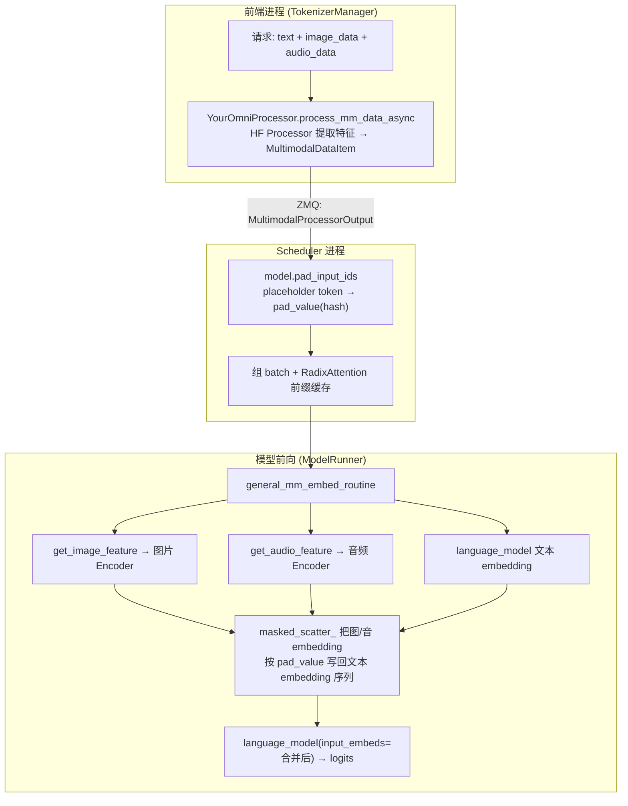

# SGLang：添加自定义 Omni 模型指南

> 目标：在 SGLang 中接入一个**同时支持图片和音频输入**的 Omni 模型，包含自定义的音频特征提取、音频 Encoder、图片 Encoder。
> 本文基于当前 `main` 源码，所有路径相对仓库根目录；行号会随版本漂移，**以类名/函数名为准**。
> 三个可直接参考的现有实现：
> - **Gemma3n**（最简单，强烈建议照着抄）：`srt/models/gemma3n_mm.py` + `srt/multimodal/processors/gemma3n.py`
> - **MiniCPM-O**（token-pair 模式 + Whisper 音频）：`srt/models/minicpmo.py` + `srt/multimodal/processors/minicpm.py`
> - **Qwen3-Omni-MoE**（继承 VL + 独立 audio tower）：`srt/models/qwen3_omni_moe.py` + `srt/multimodal/processors/qwen_vl.py`

---

## 一、整体架构：Omni 数据流五层



**核心思想**：
1. Processor 把图片/音频变成 `MultimodalDataItem`（特征 tensor + 元数据），并在文本里把每个图片/音频展开成若干 **placeholder token**。
2. Scheduler 用 `pad_input_ids` 把这些 placeholder 替换成基于特征 hash 的 `pad_value`（用于前缀缓存对齐）。
3. 前向时 `general_mm_embed_routine` 调你的 `get_image_feature` / `get_audio_feature` 得到 encoder 输出，再按 `pad_value` 的位置 `masked_scatter_` 进文本 embedding，最后喂给 language model。

你要写的就是这条链路上的 **4 个文件**：Config、Model、Processor、注册。

---

## 二、你需要改/加的文件清单

| # | 文件 | 作用 | 必需 |
| --- | --- | --- | --- |
| 1 | `srt/configs/your_omni.py` | 模型配置（若 HF transformers 未内置） | 视情况 |
| 2 | `srt/models/your_omni.py` | 模型实现：language + vision tower + audio tower | ✅ |
| 3 | `srt/multimodal/processors/your_omni.py` | 特征提取 + 组装 `MultimodalDataItem` | ✅ |
| 4 | `srt/configs/model_config.py` | 把架构名加入多模态白名单 | ✅ |

注册是**自动扫描**的，不需要手动改注册表（详见第六节）。

---

## 三、模型实现（`srt/models/your_omni.py`）

参照 `gemma3n_mm.py`。模型类需要实现 5 个多模态相关方法。

### 3.1 类骨架

```python
from typing import List, Optional
import torch
from torch import nn

from sglang.srt.managers.mm_utils import (
    MultiModalityDataPaddingPatternMultimodalTokens,
    general_mm_embed_routine,
)
from sglang.srt.managers.schedule_batch import (
    Modality,
    MultimodalDataItem,
    MultimodalInputs,
)
from sglang.srt.model_executor.forward_batch_info import ForwardBatch
from sglang.srt.utils import flatten_nested_list


class YourOmniForConditionalGeneration(nn.Module):
    def __init__(self, config, quant_config=None, prefix: str = ""):
        super().__init__()
        self.config = config

        # 1) 图片 Encoder（vision tower）
        self.vision_tower = YourVisionEncoder(config.vision_config, quant_config)
        # 2) 音频 Encoder（audio tower）
        self.audio_tower = YourAudioEncoder(config.audio_config, quant_config)
        # 3) 可选：把 encoder 输出投影到 LLM 维度的 projector
        self.audio_projector = YourProjector(config)
        self.vision_projector = YourProjector(config)
        # 4) 语言模型（通常复用 SGLang 已有的 LLM，如 Qwen2/Llama/Gemma 文本部分）
        self.language_model = YourTextModel(config.text_config, quant_config)

    # ---- 多模态必需方法 ----

    def get_input_embeddings(self) -> nn.Embedding:
        return self.language_model.get_input_embeddings()

    def pad_input_ids(self, input_ids: List[int], mm_inputs: MultimodalInputs) -> List[int]:
        # 重复-token 模式（Qwen/Gemma 风格）。MiniCPM 用 TokenPairs 模式，见第五节。
        pattern = MultiModalityDataPaddingPatternMultimodalTokens()
        return pattern.pad_input_tokens(input_ids, mm_inputs)

    def get_image_feature(self, items: List[MultimodalDataItem]) -> torch.Tensor:
        pixel_values = flatten_nested_list([item.feature for item in items])
        pixel_values = torch.cat(pixel_values, dim=0).to(
            device=self.vision_tower.device, dtype=self.language_model.dtype()
        )
        vision_out = self.vision_tower(pixel_values)           # 图片 Encoder 前向
        # 返回形状必须能展平成 (总图片 token 数, hidden) 以便 scatter
        return self.vision_projector(vision_out)

    def get_audio_feature(self, items: List[MultimodalDataItem]) -> torch.Tensor:
        # item.feature 通常是 HF FeatureExtractor 产出的 log-mel (input_features)
        input_features = flatten_nested_list([item.feature for item in items])
        # 若有 mask/lens，从 item 上读取（见 3.3）
        feats, masks = [], []
        for f, item in zip(input_features, items):
            f = f.unsqueeze(0) if f.dim() == 2 else f
            feats.append(f.to(device=self.audio_tower.device, dtype=self.language_model.dtype()))
            masks.append(item.feature_attention_mask)          # 动态属性，见 3.3
        audio_out = self.audio_tower(torch.cat(feats), masks)  # 音频 Encoder 前向
        return self.audio_projector(audio_out)

    def forward(
        self,
        input_ids: torch.Tensor,
        positions: torch.Tensor,
        forward_batch: ForwardBatch,
        **kwargs,
    ) -> torch.Tensor:
        return general_mm_embed_routine(
            input_ids=input_ids,
            forward_batch=forward_batch,
            language_model=self.language_model,
            data_embedding_funcs={
                Modality.IMAGE: self.get_image_feature,
                Modality.AUDIO: self.get_audio_feature,
            },
            positions=positions,
        )

    def load_weights(self, weights):
        # 把 HF checkpoint 权重映射到上面各子模块，参考现有模型的 load_weights
        ...


EntryClass = YourOmniForConditionalGeneration
```

### 3.2 `general_mm_embed_routine` 是合并 embedding 的核心

定义在 `srt/managers/mm_utils.py`（`general_mm_embed_routine`，约 1023 行；底层 `embed_mm_inputs` 约 782 行）。它会：
1. 从 `forward_batch` 收集各 `Modality` 的 `MultimodalDataItem`。
2. 调用你在 `data_embedding_funcs` 里登记的 `get_image_feature` / `get_audio_feature`（也可不传 mapping、改传 `multimodal_model=self`，它会按 `get_{modality}_feature` 命名约定自动找方法）。
3. 用每个 item 的 `pad_value` 生成 mask，`masked_scatter_` 把多模态 embedding 写入文本 embedding 序列对应位置。
4. 调 `language_model(input_ids=None, input_embeds=合并结果)` 得到 hidden states。

> 关键约束：`get_*_feature` 返回的 token 总数，必须和 `pad_input_ids` 为该模态展开的 placeholder token 数**严格一致**，否则 scatter 会维度不匹配。

### 3.3 `MultimodalDataItem` 字段怎么读（`srt/managers/schedule_batch.py`）

一个 item = 一张图 / 一段音频。常用字段（约 251–265 行）：

| 字段 | 含义 |
| --- | --- |
| `modality` | `Modality.IMAGE` / `Modality.AUDIO` |
| `feature` | 原始特征（图片 `pixel_values`；音频 log-mel `input_features` / `audio_features`） |
| `precomputed_embeddings` | 若已是最终 embedding，可直接用，跳过 encoder |
| `model_specific_data` | dict，放模型特有元数据；可通过 `item.xxx` 动态访问 |
| `offsets` / `pad_value` | placeholder 在序列里的位置与 hash 值（RadixAttention 用） |

音频常见的 `model_specific_data` 键：`input_features_mask`、`feature_attention_mask`、`audio_feature_lens`。Processor 写入后，模型侧用 `item.feature_attention_mask` 直接读（`__getattr__` 会代理到 `model_specific_data`）。

---

## 四、Processor 实现（`srt/multimodal/processors/your_omni.py`）

参照 `gemma3n.py`，这是最简洁的范本。

```python
from typing import Dict, List, Optional, Union

from sglang.srt.managers.multimodal_processor import (
    BaseMultimodalProcessor as SGLangBaseProcessor,
)
from sglang.srt.managers.schedule_batch import MultimodalProcessorOutput
from sglang.srt.models.your_omni import YourOmniForConditionalGeneration
from sglang.srt.multimodal.processors.base_processor import MultimodalSpecialTokens


class YourOmniProcessor(SGLangBaseProcessor):
    # 关键：用模型类对象关联（其 __name__ 必须出现在 HF config 的 architectures 里）
    models = [YourOmniForConditionalGeneration]

    def __init__(self, hf_config, server_args, _processor, *args, **kwargs):
        super().__init__(hf_config, server_args, _processor, *args, **kwargs)
        # 声明图片/音频的 placeholder token 及其 token_id
        self.mm_tokens = MultimodalSpecialTokens(
            image_token="<image>",
            image_token_id=hf_config.image_token_id,
            audio_token="<audio>",
            audio_token_id=hf_config.audio_token_id,
        ).build(_processor)

    async def process_mm_data_async(
        self,
        image_data: Optional[List[Union[str, bytes, Dict]]] = None,
        audio_data: Optional[List[Union[str, bytes, Dict]]] = None,
        input_text: str = "",
        request_obj=None,
        *args,
        **kwargs,
    ):
        # 1) 加载原始图片/音频（按 prompt 中的 special token 对齐）
        base_output = await self.load_mm_data(
            prompt=input_text,
            image_data=image_data,
            audio_data=audio_data,
            multimodal_tokens=self.mm_tokens,
        )

        # 2) 调 HF AutoProcessor 提特征 + 展开 placeholder + 组 MultimodalDataItem
        mm_items, input_ids, _ = self.process_and_combine_mm_data(
            base_output, self.mm_tokens
        )

        # 3) 返回给 Scheduler
        return MultimodalProcessorOutput(
            input_ids=input_ids.tolist(),
            mm_items=mm_items,
            im_token_id=self.mm_tokens.image_token_id,
            audio_token_id=self.mm_tokens.audio_token_id,
        )
```

### 4.1 三个关键基类方法（`base_processor.py`）

| 方法 | 行号 | 作用 |
| --- | --- | --- |
| `load_mm_data` | ~784 | 解析 prompt，按 special token 加载 raw 图片/音频（音频走 `load_audio`） |
| `process_mm_data` | ~401 | 调 HF `AutoProcessor.__call__(text=, images=, audio=)` 得到 `pixel_values` / `input_features` |
| `process_and_combine_mm_data` | ~1292 | 展开 placeholder + 把 HF 输出装进 `MultimodalDataItem` |

### 4.2 音频特征提取的真相

**SGLang 不自己算 mel 谱图**，它分两段：

1. **原始 PCM 加载**：`srt/utils/common.py` 的 `load_audio()`（~801 行），默认重采样到 **16000 Hz、单声道**，支持 URL / base64 / 文件 / bytes。
2. **mel / log-mel / input_features**：交给 **HF 的 FeatureExtractor**（如 `WhisperFeatureExtractor`），在 `process_mm_data` 调 `AutoProcessor` 时完成。产物字段名（如 `input_features`、`feature_attention_mask`）会被基类的 `ATTR_NAME_TO_MODALITY` 表（~215 行）自动识别为 `Modality.AUDIO` 并塞进 item。

> 所以"自定义音频特征提取"通常有两条路：
> - **路 A（推荐）**：用你模型配套的 HF Processor/FeatureExtractor，SGLang 自动接住其输出字段。
> - **路 B（自定义）**：如果 HF 字段名不标准，在你的 `process_mm_data_async` 里手动构造 `MultimodalDataItem(feature=..., model_specific_data={...}, modality=Modality.AUDIO)`，参考 MiniCPM 的 `minicpm.py`（~275 行）。也可参考 `phi4mm.py` 把 HF 的非标准 key 映射成 SGLang 标准 key。

### 4.3 `MultimodalSpecialTokens` 要点

- `image_token` / `audio_token` 是 prompt 里用来占位的字符串；`*_token_id` 是其在 tokenizer 里的 id。
- `.build(_processor)` 会根据 processor 补全正则等内部状态。
- 这些 token 决定了 `pad_input_ids` 在哪些位置 scatter 多模态 embedding。

---

## 五、Padding 模式：两种风格选其一

定义在 `srt/managers/mm_utils.py`：

| 模式 | 类 | 适用 | placeholder 形态 |
| --- | --- | --- | --- |
| 重复 token | `MultiModalityDataPaddingPatternMultimodalTokens` | Qwen / Gemma3n / 多数模型 | 单个 token 重复 N 次（N=特征 token 数） |
| token 对 | `MultiModalityDataPaddingPatternTokenPairs` | MiniCPM-O | `<start> ... <end>` 包裹一段 |

在 `pad_input_ids` 里选用对应 pattern 即可（见第三节骨架）。token-pair 模式还需在 Processor/模型里设置 start/end token id（MiniCPM 例子在 `minicpmo.py` ~1519 行）。

---

## 六、注册（基本是自动的）

### 6.1 模型注册 — 自动扫描

`srt/models/registry.py` 启动时扫描 `sglang.srt.models` 包，读取每个模块的 `EntryClass`。
**你只需在文件末尾写**：

```python
EntryClass = YourOmniForConditionalGeneration
```

key 是类的 `__name__`，必须与 HF `config.json` 里 `architectures[0]` 一致。

### 6.2 Processor 注册 — 自动扫描

`srt/managers/multimodal_processor.py` 的 `import_processors()` 会扫描 `sglang.srt.multimodal.processors` 包，把每个 `BaseMultimodalProcessor` 子类的 `models` 列表映射到该 Processor。
**你只需保证**：文件放在 `processors/` 目录下，且类里有 `models = [YourOmniForConditionalGeneration]`。

运行时匹配逻辑：`hf_config.architectures` 里的类名 == Processor `models` 中某个类的 `__name__`。

### 6.3 多模态白名单 — 需手动加一行

`srt/configs/model_config.py` 的 `multimodal_model_archs`（~1534 行）：把 `"YourOmniForConditionalGeneration"` 加进去，确保 `is_multimodal` 判定为真。

---

## 七、配置（`srt/configs/your_omni.py`，按需）

- 如果 HF transformers 已内置该模型 config，直接用，无需新建。
- 否则参照 `srt/configs/qwen3_omni.py`：顶层 config 嵌套 `vision_config` / `audio_config` / `text_config`（或 Qwen-Omni 风格的 `thinker_config` 再嵌套三者）。
- `model_config.py` 的判定（~302–325 行）：
  - `is_multimodal`：在白名单或有 vision/audio sub-config
  - `is_audio_understandable_model`：顶层有 `audio_config`（或 `thinker_config.audio_config`）
  - `is_image_understandable_model`：有 `vision_config`
- 若用 remote-code 的自定义 HF Processor，可用 `srt/multimodal/customized_mm_processor_utils.py` 的 `@register_customized_processor(...)` 装饰 config 类。

---

## 八、完整开发清单（照做即可）

```
[ ] 1. (可选) srt/configs/your_omni.py
        └─ vision_config + audio_config + text_config

[ ] 2. srt/models/your_omni.py
        ├─ __init__: vision_tower + audio_tower + projector + language_model
        ├─ get_input_embeddings()
        ├─ pad_input_ids(input_ids, mm_inputs)        # 选 padding 模式
        ├─ get_image_feature(items) -> Tensor         # 图片 Encoder
        ├─ get_audio_feature(items) -> Tensor         # 音频 Encoder
        ├─ forward(...): general_mm_embed_routine(...)
        ├─ load_weights(weights)
        └─ EntryClass = YourOmniForConditionalGeneration

[ ] 3. srt/multimodal/processors/your_omni.py
        ├─ models = [YourOmniForConditionalGeneration]
        ├─ __init__: MultimodalSpecialTokens(image/audio token + id)
        └─ process_mm_data_async(): load_mm_data → process_and_combine_mm_data
                                     → MultimodalProcessorOutput

[ ] 4. srt/configs/model_config.py
        └─ multimodal_model_archs 加 "YourOmniForConditionalGeneration"

[ ] 5. 音频特征
        ├─ 优先复用 HF FeatureExtractor（mel → input_features）
        ├─ 确认字段名在 base_processor.ATTR_NAME_TO_MODALITY 中
        └─ 非标准字段：在 Processor 手动构造 MultimodalDataItem 或做 key 映射
```

---

## 九、验证与调试

### 9.1 起服务

```bash
python -m sglang.launch_server --model-path <your-omni-ckpt> --trust-remote-code
```

发一个带图片 + 音频的请求（OpenAI 兼容接口 `/v1/chat/completions`，content 里带 `image_url` 和 `audio_url`）。

### 9.2 关键断点（按数据流顺序）

| 位置 | 看什么 |
| --- | --- |
| `your_omni.py: process_mm_data_async` | 特征是否正确提取，`MultimodalDataItem` 字段是否齐全 |
| `your_omni.py: pad_input_ids`（模型） | placeholder 数量是否等于特征 token 数 |
| `mm_utils.py: embed_mm_inputs` | scatter 是否维度匹配（最常见的报错点） |
| `your_omni.py: get_audio_feature` / `get_image_feature` | encoder 输出形状是否对 |

### 9.3 最常见的坑

1. **token 数不匹配**：`get_*_feature` 返回的 token 数 ≠ `pad_input_ids` 展开的 placeholder 数 → scatter 维度报错。先核对每张图/每段音频展开了多少 token。
2. **dtype / device 不一致**：encoder 在不同 device 或 dtype，记得 `.to(device=..., dtype=self.language_model.dtype())`。
3. **音频字段名不被识别**：HF 输出的字段不在 `ATTR_NAME_TO_MODALITY` 里 → item 拿不到特征。手动构造 item 或做 key 映射。
4. **architectures 不一致**：模型类名、`EntryClass`、Processor 的 `models`、HF config 的 `architectures`、白名单，**五处类名必须完全一致**。
5. **音频采样率**：`load_audio` 默认 16kHz，若你的 FeatureExtractor 期望别的采样率需注意。

---

## 十、三个参考实现速查

| 关注点 | 看这个文件 |
| --- | --- |
| 最简单的图+音 Omni 模板 | `srt/models/gemma3n_mm.py`、`srt/multimodal/processors/gemma3n.py` |
| 手动构造 `MultimodalDataItem` / token-pair / Whisper 音频 | `srt/models/minicpmo.py`、`srt/multimodal/processors/minicpm.py` |
| 继承 VL 模型 + 独立 audio tower + M-RoPE | `srt/models/qwen3_omni_moe.py`、`srt/multimodal/processors/qwen_vl.py` |
| HF 非标准字段 key 映射 | `srt/multimodal/processors/phi4mm.py` |
| embedding 合并核心 | `srt/managers/mm_utils.py`（`general_mm_embed_routine` / `embed_mm_inputs`） |
| 多模态数据结构 | `srt/managers/schedule_batch.py`（`MultimodalDataItem` / `MultimodalInputs` / `Modality`） |
| 音频原始加载 | `srt/utils/common.py`（`load_audio`） |
