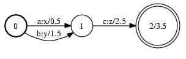

# openfst笔记

OpenFst 库是一个 C++ 模板库。从 C++ 中，包含`<fst/fstlib.h>`在安装包含目录中并链接到`libfst.so`安装库目录中。所有的类和函数都在`fst`命名空间中

## openfst示例



上图可以通过以下C++代码创建

```cpp
// 向量 FST 是一个通用的可变 FST 
StdVectorFst fst;

// 将状态 0 添加到最初为空的 FST 并使其成为开始状态。
fst.AddState();   // 第一个状态将是状态 0（由 AddState 返回） 
fst.SetStart(0);  // arg 是状态 ID

// 添加两个状态 0 的弧。
// Arc 构造函数 args: ilabel, olabel, weight, dest 状态 ID。
fst.AddArc(0, StdArc(1, 1, 0.5, 1));  // 第一个参数是 src 状态 ID
fst.AddArc(0, StdArc(2, 2, 1.5, 1)); 

// 添加状态 1 及其弧。 
fst.AddState();
fst.AddArc(1, StdArc(3, 3, 2.5, 2));

// 添加状态 2 并设置其最终权重。 
fst.AddState();
fst.SetFinal(2, 3.5);  // 第一个参数是状态 ID，第二个参数是权重

// 我们可以将这个 FST 保存到一个文件中
fst.Write("binary.fst");
```

## 数据结构

openfst中跳转弧（Arc）数据结构如下

```cpp
struct StdArc {
 typedef int Label;
 typedef TropicalWeight Weight;  // using TropicalWeight = TropicalWeightTpl<float>;
 typedef int StateId; 
 
 Label ilabel;  // 输入标签，int类型
 Label olabel;  // 输出标签，int类型
 Weight weight;  // 权重，float类型
 StateId nextstate; // 下一个状态，int类型
};
```

fst访问

```cpp
template <class F>
class StateIterator {
  typedef typename F::Arc Arc;
  typedef typename Arc::StateId StateId;

 public:
  StateIterator(const &F fst); 
  // End of iterator? 
  bool Done() const; 
  // Current state ID (when !Done) 
  StateId Value() const; 
  // Advance to next state (when !Done) 
  void Next(); 
  // Return to initial position 
  void Reset();
};
```


```cpp
typedef StdArc::StateId StateId;

// 获取初始状态; if == kNoState => empty FST. 
StateId initial_state = fst.Start();

// 获取状态i的最终状态; if == Weight::Zero() => non-final. 
Weight weight = fst.Final(i);
// 使用迭代器遍历 FSTs 所有状态. 
for (StateIterator<StdFst> siter(fst); !siter.Done(); siter.Next()) 
  StateId state_id = siter.Value();
// 使用迭代器遍历状态i的所有弧 
for (ArcIterator<StdFst> aiter(fst, i); !aiter.Done(); aiter.Next())
  const StdArc &arc = aiter.Value();
// 使用迭代器遍历状态i输入标签为l的所有弧 
Matcher<StdFst> matcher(fst, MATCH_INPUT);
matcher.SetState(i);
if (matcher.Find(l)) 
  for (; !matcher.Done(); matcher.Next())
     const StdArc &arc = matcher.Value();
```

- `VectorFst<Arc>`: 一个通用的可变 FST
- `ConstFst<Arc>`: 一个通用的扩展的、不可变的 FST
- `ComposeFst<Arc>`：两个 FST 的未扩展延迟组合


```shell
# 从文本文件创建二进制 Fst。 文本 FST 必须先转换为二进制 FST 文件，然后才能被 OpenFst 库使用。
# 符号标签将使用符号表文件转换为整数。 
$ fstcompile --isymbols=isyms.txt --osymbols=osyms.txt text.fst binary.fst

# 同上，但符号表与 FST 一起存储。 
$ fstcompile --isymbols=isyms.txt --osymbols=osyms.txt --keep_isymbols --keep_osymbols text.fst binary.fst

# 将二进制fst转换为文本格式
$ fstprint --isymbols=isyms.txt --osymbols=osyms.txt binary.fst text.fst


# 获取fst的摘要信息
$ fstinfo binary.fst

# fstdraw 将fst输出成Graphviz软件定义的图格式（dot格式）以便可视化。通过dot命令转为ps格式，然后可以由ps2pdf命令转为pdf文档
$ fstdraw --isymbols=isyms.txt --osymbols=osyms.txt binary.fst binary.dot
$ dot -Tps binary.dot >binary.ps

$ fstdraw HCLG.fst | dot -Tps | ps2pdf - HCLG.pdf
$ fstdraw --isymbols=words.txt --osymbols=words.txt G.fst | dot -Tjpg > fst.jpg

# 将fst类型转换为const类型
$ fstconvert --fst_type=const --fst_align=true in.ofst out.ofst

# 对fst进行压缩
$ fstcompress --gzip=true out.fst out_compr.fst

# 组合多个fst文件到一个fst
$ fstunion man.fst Mars.fst | fstunion - Martian.fst | fstclosure >lexicon.fst

# 删除non-determinism和non-minimality
$ fstrmepsilon lexicon.fst | fstdeterminize | fstminimize >lexicon_opt.fst
```

