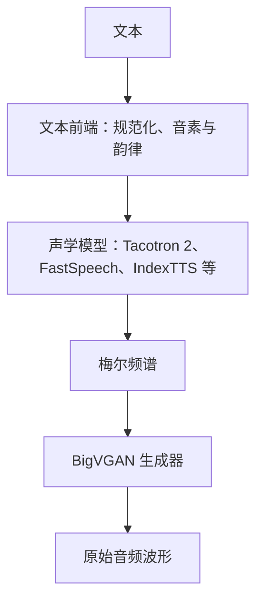
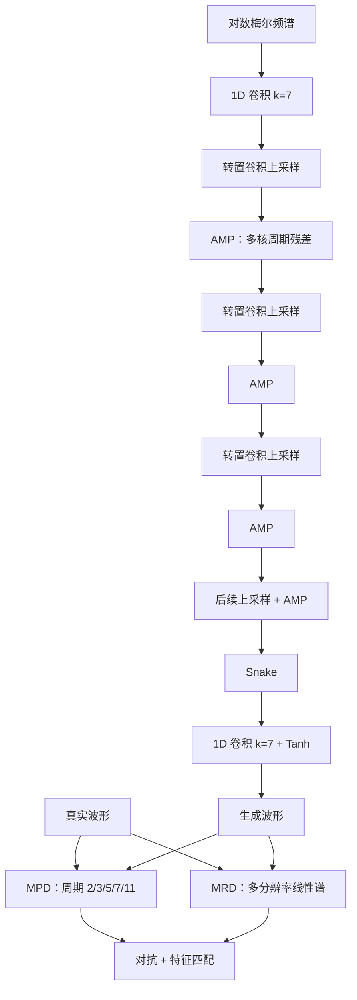
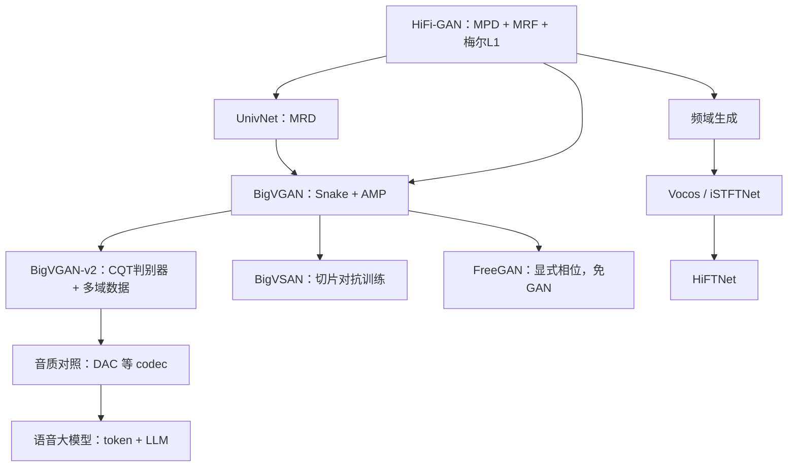

# BigVGAN 完整介绍

> 本文系统介绍 BigVGAN 的技术背景、周期激活与抗混叠原理、生成器 AMP 模块、判别器与训练目标、base/large 与 v2 配置、原论文实验、官方 v2 评测、技术演进、应用场景、工程实践及当前选型价值。若无特别说明，“BigVGAN”指 Lee、Ping、Ginsburg、Catanzaro、Yoon 在 ICLR 2023 提出的通用神经声码器；“BigVGAN-v2”指 NVIDIA 于 2024 年在同一仓库发布的后续检查点与训练配方，不是另一篇独立会议论文。

---

## 1. 概述

BigVGAN 是首尔大学与 NVIDIA 合作提出的生成对抗网络（GAN）神经声码器，论文全称为 *BigVGAN: A Universal Neural Vocoder with Large-Scale Training*，正式发表于 ICLR 2023。名称里的 “Big” 指当时少见的 112M 级 GAN 波形生成器；“VGAN” 是论文给出的 **Big Vocoding GAN**，不是 “Voice GAN”。它接收梅尔频谱，一次前向传播并行输出原始波形，不按采样点自回归，也不维护可逆流。

相对 HiFi-GAN，BigVGAN 把问题从“固定说话人、干净录音上接近真人”推进到“不微调也能覆盖未见说话人、语言、录制环境和部分非语音音频”。设计可以概括为三点：

1. **周期激活（Snake）**：在生成器里用可学习频率的周期非线性，代替只提供局部非线性、却缺少周期归纳偏置的 Leaky ReLU。
2. **抗混叠多周期组合（Anti-aliased Multi-Periodicity Composition，AMP）**：用多支路扩张卷积拟合不同周期成分，并在每次非线性前后做低通滤波，减轻离散网格上的高频伪影。
3. **大规模 GAN 训练**：把生成器扩到 14M（BigVGAN-base）和 112M（BigVGAN），同时处理判别器早崩、梯度爆炸和过度正则化带来的相位失配。

v1 只在 LibriTTS 的完整训练集上学习干净英语语音，却能在歌声、乐器、笑声和带噪声的未见语言上保持可用质量。这不是“模型自己会做语音克隆或多语 TTS”，而是：给定一张域外梅尔，它仍能把频谱较忠实地渲染成波形。

2024 年 7 月，同一官方仓库发布 BigVGAN-v2；9 月的 v2.4 把预训练权重更新到 500 万步，并标明这是 v2 检查点的最终发布。v2 换用多尺度子带常数 Q 变换判别器（MS-SB-CQTD）和多尺度梅尔损失，训练数据扩大到官方所说的 100 倍以上（多语言语音、环境声、乐器），并提供最高 44 kHz、512 倍上采样的检查点，以及融合上采样与激活的 CUDA 核。

今天，BigVGAN 及其 v2 检查点仍是开源 TTS 里最常见的通用波形后端之一。Vocos、HiFTNet、免 GAN 的相位预测方案，以及 EnCodec、DAC、X-Codec 一类离散编解码器，已经从效率、训练稳定性和语音大模型接口上分流了部分场景。理解 BigVGAN，重点不再是把它写成“唯一的 SOTA 声码器”，而是看清周期偏置、抗混叠和大规模数据各自解决了什么问题。

---

## 2. 技术背景与模型定位

### 2.1 BigVGAN 之前的神经声码器

神经声码器要把低时间分辨率的声学表示还原成高时间分辨率波形。以 24 kHz、hop size 256 为例，每秒约 94 帧梅尔要展开成 24,000 个采样。2016—2021 年间，主流方案大致分为四类。

| 路线 | 代表模型 | 生成方式 | 主要优势 | 主要问题 |
|---|---|---|---|---|
| 自回归 | WaveNet、WaveRNN | 逐点预测下一个采样 | 音质高 | 串行依赖使推理很慢 |
| 流模型 | WaveGlow、WaveFlow | 并行可逆变换 | 可并行，目标清晰 | 架构约束强，参数和显存成本高 |
| 早期 GAN | MelGAN、Parallel WaveGAN、HiFi-GAN | 前馈一次输出波形 | 快、无需似然或教师 | 域外、多说话人和高频细节仍不稳 |
| 扩散 | DiffWave、WaveGrad | 多步去噪 | 训练较稳 | 推理要多次前向 |

HiFi-GAN 已经证明：多周期判别器（MPD）、多感受野融合（MRF）和梅尔 L1 可以把 GAN 声码器推到接近真人的听感，并在 GPU 上大幅超实时。UnivNet 再用多分辨率判别器（MRD）从线性谱上约束频谱结构。即便如此，这些模型多在中等规模、较干净的语音上训练。换到未见说话人、不同房间、歌声或乐器时，高频谐波容易断裂，周期误差和混叠伪影会明显起来。

BigVGAN 的判断是：继续只改判别器不够。语音和音乐波形本身就是多周期信号的叠加；若生成器激活没有周期偏置，网络只能靠扩张卷积“碰巧”学出谐波。Leaky ReLU 在训练域内可以工作，对训练中没见过的频率范围外推很差。与此同时，非线性会在连续时间意义下制造高于奈奎斯特频率的细节，落到离散网格上就变成混叠。AMP 同时处理这两件事。

### 2.2 它在两阶段 TTS 中的位置

原版 BigVGAN 不是完整的文本转语音模型，而是两阶段系统的后半段：

不同模块负责的问题不同：

- 文本前端决定读什么、如何切分和发音；
- 声学模型决定时长、音高走势、停顿、能量和大部分音色、情感线索；
- BigVGAN 根据梅尔条件补全相位与采样级细节，把频谱渲染为可播放波形。

因此，漏字、重复、停顿失控、情感不对，通常不是声码器单独造成的；金属音、嘶声、周期毛刺、发闷、棋盘纹和频谱口径不匹配，则更常与声码器或梅尔配置有关。IndexTTS2 一类系统可以把 BigVGAN-v2 接在语义到梅尔模块之后，但其中文、英文 WER 和情感相似度是整条链路的指标，不能写成声码器分数。

### 2.3 它是确定性的条件波形生成器

设输入梅尔频谱为 $\mathbf{s}$，真实波形为 $\mathbf{x}$。生成器学习

$$
\hat{\mathbf{x}}=G(\mathbf{s})
$$

它不显式估计归一化密度 $p(\mathbf{x}\mid\mathbf{s})$，也不向生成器额外注入随机噪声。相同权重、相同梅尔和相同数值环境下，输出基本确定。

梅尔频谱丢失了相位和部分高频细节，从信息论上说，梅尔到波形并非严格一一对应。BigVGAN 并不是找回唯一“正确相位”，而是在训练分布、周期偏置和判别器约束下，生成一个听感合理、重新计算梅尔后接近输入的波形。

它也不是神经编解码器。EnCodec、DAC、X-Codec 把波形压成离散 token，供语言模型直接预测；BigVGAN 的接口始终是连续梅尔。NVIDIA 2026 年的 Nemotron-Labs-Audex 使用 X-Codec2 和 Vocos 做语音 token 的编解码，不应写成“基于 BigVGAN 的语音大模型”。

### 2.4 不应混淆的几组名称

| 名称 | 年份 | 含义 |
|---|---:|---|
| BigVGAN-base | 2022/2023 | 论文中的 14M 生成器，上采样 $[8,8,2,2]$，通道 512 |
| BigVGAN（large） | 2022/2023 | 论文中的 112M 生成器，上采样 $[4,4,2,2,2,2]$，通道 1536 |
| BigVGAN-v2 | 2024 | 官方仓库发布的后续配方与检查点，不是 ICLR 续篇论文 |
| HiFi-GAN V1/V2/V3 | 2020 | Kakao 声码器的三档配置，与 BigVGAN-v2 无关 |
| HiFi-GAN-2 | 2021 | Adobe/Princeton 的语音增强工作，不是声码器版本 |

14M 与 112M 是 **v1 论文里的两档生成器**，不是 v2 才把通道从 512 扩到 1536。v2 的 44 kHz、512 倍上采样检查点参数量约为 122M。

---

## 3. 数学原理与训练目标

### 3.1 沿用 HiFi-GAN 的三类损失，替换一条判别器

v1 的训练目标与 HiFi-GAN 相同，唯一结构性改动是把多尺度时域判别器（MSD）换成 UnivNet 的多分辨率谱判别器（MRD）。生成器仍同时接受：

- 最小二乘对抗损失；
- 判别器特征匹配损失；
- 梅尔频谱 L1 重建损失。

MPD 含 5 个子判别器，周期为 $[2,3,5,7,11]$；MRD 含 3 个子判别器，STFT 配置为

$$
(n_{\mathrm{fft}},\ \mathrm{hop},\ \mathrm{win})
\in
\{(1024,120,600),\ (2048,240,1200),\ (512,50,240)\}
$$

训练时在这 8 个子判别器上求和。判别器只看波形，不直接接收梅尔；条件和内容一致性主要由梅尔重建损失保证。

### 3.2 最小二乘对抗损失

对第 $k$ 个子判别器 $D_k$，判别器希望真实波形得分接近 1，生成波形得分接近 0：

$$
\mathcal{L}_{\mathrm{Adv}}(D_k;G)
=
\mathbb{E}_{(\mathbf{x},\mathbf{s})}
\left[
\left(D_k(\mathbf{x})-1\right)^2
+
D_k\bigl(G(\mathbf{s})\bigr)^2
\right]
$$

生成器则让生成波形得分接近 1：

$$
\mathcal{L}_{\mathrm{Adv}}(G;D_k)
=
\mathbb{E}_{\mathbf{s}}
\left[
\bigl(D_k(G(\mathbf{s}))-1\bigr)^2
\right]
$$

最小二乘形式在样本已被判为“假”时仍能提供连续梯度，适合这一配置。BigVGAN 没有改回 MelGAN 的 hinge GAN。

### 3.3 梅尔频谱重建损失

仅靠无条件判别器，生成器可能产生“像真实语音、却不完全对应输入梅尔”的波形。因此从生成波形重新提取梅尔：

$$
\mathcal{L}_{\mathrm{Mel}}(G)
=
\mathbb{E}_{(\mathbf{x},\mathbf{s})}
\left[
\left\|
\phi(\mathbf{x})-\phi\bigl(G(\mathbf{s})\bigr)
\right\|_1
\right]
$$

其中 $\phi$ 是波形到梅尔频谱的变换。它从训练早期提供密集梯度，并约束音素内容、谱包络和能量。

v1 使用的是**单尺度梅尔 L1**，不是 Parallel WaveGAN 的多分辨率 STFT 损失。多尺度梅尔损失是 v2 才加入的。

### 3.4 特征匹配损失

判别器各层中间特征包含从细粒度纹理到较长模式的表示。特征匹配让真实与生成波形在这些表示上接近：

$$
\mathcal{L}_{\mathrm{FM}}(G;D_k)
=
\mathbb{E}_{(\mathbf{x},\mathbf{s})}
\left[
\sum_{i=1}^{T_k}
\frac{1}{N_i}
\left\|
D_k^{(i)}(\mathbf{x})
-
D_k^{(i)}\bigl(G(\mathbf{s})\bigr)
\right\|_1
\right]
$$

$D_k^{(i)}$ 是第 $k$ 个子判别器的第 $i$ 层特征，$N_i$ 是该层单元数。它可视为由判别器在线学习的多层感知距离。

### 3.5 v1 的最终目标

$$
\mathcal{L}_G
=
\sum_{k=1}^{8}
\left[
\mathcal{L}_{\mathrm{Adv}}(G;D_k)
+
\lambda_{\mathrm{fm}}\mathcal{L}_{\mathrm{FM}}(G;D_k)
\right]
+
\lambda_{\mathrm{mel}}\mathcal{L}_{\mathrm{Mel}}(G)
$$

$$
\mathcal{L}_D
=
\sum_{k=1}^{8}
\mathcal{L}_{\mathrm{Adv}}(D_k;G)
$$

权重与 HiFi-GAN 相同：

$$
\lambda_{\mathrm{fm}}=2,\qquad
\lambda_{\mathrm{mel}}=45
$$

| 损失 | 直接约束 | 主要作用 |
|---|---|---|
| LSGAN | 局部真假判断 | 提升波形真实感与高频细节 |
| 特征匹配 | 判别器各层表示 | 稳定训练，匹配多层模式 |
| 梅尔 L1 | 重新提取的梅尔 | 保证条件一致性和频谱保真 |

把 45 理解成“梅尔损失比其他项重要 45 倍”并不准确，三类损失的原始数值尺度不同。

### 3.6 Snake：把周期写进激活

音频波形在有声段接近周期信号的叠加。HiFi-GAN 的周期归纳偏置主要放在判别器（MPD）；生成器内部仍用 Leaky ReLU。BigVGAN 认为，生成器也需要能表示

$$
x \mapsto x + \text{周期扰动}
$$

这类函数。它采用 Liu 等人提出的 Snake 激活：

$$
f_\alpha(x)
=
x + \frac{1}{\alpha}\sin^2(\alpha x)
$$

$\alpha$ 是**逐通道可学习**的频率参数：$\alpha$ 越大，扰动振荡越快。$\sin^2(\cdot)$ 使导数

$$
f_\alpha'(x)=1+\sin(2\alpha x)\ge 0
$$

从而保持单调非减，优化比直接使用 $\sin$ 更稳。

论文观察到：只用 Leaky ReLU 时，模型在训练域（较干净的朗读语音）可以合成得不错，换到未见录音环境、非语音发声和乐器时，高频谐波会明显变差。Snake 把“波形由多个周期成分组成”变成生成器的函数形式，而不是完全交给数据去拟合。

官方发布的预训练权重进一步使用 **SnakeBeta**，并把参数放到对数域。SnakeBeta 把幅度和频率拆开：

$$
f_{a,b}(x)
=
x + \frac{1}{b}\sin^2(a x)
$$

$a$、$b$ 仍逐通道可学。论文主实验写的是原始 Snake；复现官方检查点时应按配置文件使用 SnakeBeta，不要混用后再对比听感。

### 3.7 抗混叠激活

Snake 可以在连续时间里制造任意高频。网络输出却是离散采样序列。高于奈奎斯特频率的分量折回到可表示频带，就会变成与内容无关的周期性毛刺。这与 StyleGAN3 指出的“非线性导致混叠”是同一类问题。

BigVGAN 把每次 Snake 包成抗混叠非线性：

1. 沿时间维把特征上采样 2 倍，并接 Kaiser 窗 sinc 低通；
2. 在更高采样率上做 Snake；
3. 再低通并 2 倍下采样，回到原分辨率。

低通截止取当前特征采样率的一半对应频率。设当前宽度对应采样率 $s$、倍率 $m=2$，截止为 $s/(2m)$；Kaiser 窗长 $n=6m$，形状参数按 Oppenheim & Schafer 的经验公式由过渡带宽度近似。上采样用转置卷积实现同一组滤波核，下采样用普通卷积。

必须分清两套“上采样”：

- **生成器级上采样**：转置卷积按 $[8,8,2,2]$ 或 $[4,4,2,2,2,2]$ 把梅尔帧拉到波形长度；
- **激活级 2 倍上/下采样**：只发生在 AMP 残差层内部，用来安全地施加非线性。

把 AMP 写成“先 8 倍上采样再 Snake 再下采样”会把两级混在一起。论文还试过把生成器级转置卷积也改成抗混叠上采样，大规模训练会早崩，因此最终只抗混叠激活，不上采样层。

### 3.8 v2 对损失和判别器的补充

BigVGAN-v2 没有新的会议论文系统报告消融。按官方仓库和 NVIDIA 技术博客，可核实的改动是：

- 使用 Gu 等人提出的 **多尺度子带 CQT 判别器（MS-SB-CQTD）**，在常数 Q 变换域按子带审查谐波结构；
- 使用 Vocos / DAC 路线中的 **多尺度梅尔谱损失**，在多个 FFT 分辨率上做梅尔 L1，而不只依赖单一 hop 的重建。

官方表述没有逐条声明“MPD 已被删除”。生成器仍是 AMP 骨架。讨论 v2 时，应把它看成训练目标与数据配方的升级，而不是另一套从零发明的网络。

---

## 4. 核心网络架构

### 4.1 总体结构

下图以 BigVGAN-base 的四级上采样为例。112M 模型改成六级，但总倍率仍是 256。

训练结束后丢弃全部判别器。部署成本只由生成器决定。论文报告的 14.01M / 112.4M 和合成速度，都是生成器口径。

### 4.2 生成器：逐级上采样

生成器是非因果、全卷积网络，骨架直接来自 HiFi-GAN，残差块换成 AMP。

1. 输入约为 $[B,C_{\mathrm{mel}},T_{\mathrm{mel}}]$。论文主实验 $C_{\mathrm{mel}}=100$。
2. 核大小为 7 的 1D 卷积把梅尔投影到 $h$ 个通道。
3. $N$ 个转置卷积逐级上采样，第 $i$ 级倍率为 $u_i$，通道大致减半。
4. 每次上采样后接一组 AMP 残差块。
5. 最后经 Snake、核大小为 7 的 1D 卷积和 Tanh，输出单通道 $[-1,1]$ 波形。

总上采样倍率必须等于 hop size。论文 24 kHz 配置 hop 为 256，因此

$$
\prod_i u_i = 256
$$

生成器没有 U-Net 式编码器—解码器，也没有额外噪声输入。残差连接位于 AMP 内部。

### 4.3 AMP：抗混叠多周期组合

AMP 对应 HiFi-GAN 的 MRF：同一分辨率上并行多个残差块，再把输出相加。差别在于激活和滤波。

每个上采样级使用三组卷积核

$$
k\in\{3,7,11\}
$$

每组堆叠 3 个残差单元，扩张模式为

$$
(d_{\mathrm{dilated}},d_{\mathrm{plain}})\in\{(1,1),\ (3,1),\ (5,1)\}
$$

即先做扩张卷积，再做扩张率为 1 的卷积。不同核与扩张率看到不同长度的上下文；不同通道的 Snake 参数 $\alpha$ 提供不同周期。

每个残差单元内部的非线性都是 3.7 节的抗混叠 Snake，而不是直接在当前网格上激活。论文把这一组合称为 anti-aliased multi-periodicity composition：多条支路合成不同周期成分，低通滤波抑制无法被离散网格表示的高频。

### 4.4 MPD：多周期判别器

MPD 与 HiFi-GAN 相同。对长度 $T$ 的波形，周期 $p\in\{2,3,5,7,11\}$ 的子判别器先做反射填充，再重排为

$$
[B,1,T]\longrightarrow[B,1,T/p,p]
$$

随后用核形状主要为 $(5,1)$、步长为 $(3,1)$ 的 2D 卷积。宽度方向核大小为 1，各列代表一组等间隔采样，权重在列之间共享。选择互质周期是为了减少各分支所见结构的重叠。$p$ 是重排因子，不是模型估计出的真实 $F_0$。

### 4.5 MRD：多分辨率谱判别器

HiFi-GAN 用 MelGAN 的 MSD 在波形的多个时间尺度上做判断。BigVGAN 发现，把 MSD 换成 MRD 能减少音高和周期伪影。MRD 先对波形做不同分辨率的 STFT，得到 2D 线性谱，再用 2D 卷积堆判断真假。

MSD 观察经过平均池化的连续波形；MRD 观察多个时频网格上的谱结构。两者都提供多尺度约束，但 MRD 更直接地惩罚谱上的模糊与谐波断裂。这不是“HiFi-GAN 本来就用 MRD”——原版 HiFi-GAN 是 MPD + MSD；MRD 来自 UnivNet，由 BigVGAN 引入这条 GAN 骨架。

### 4.6 论文明确放弃的几条路

附录记录了若干负结果，对复现和大模型训练很有用：

- 抗混叠生成器级上采样、最近邻上采样：大规模时早崩；
- 给判别器也加 Snake：特征匹配损失发散，音质下降；
- 对判别器做谱归一化：训练更稳，但相位失配严重，生成器开始几乎只靠梅尔 L1；
- 单纯加大判别器：能部分缓解早崩，多数配置音质变差；
- 图像 GAN 常用的数据增强：在这套音频设定下没有带来更好的听感。

这些观察与 BigGAN 一类图像结论并不相同。音频里 MPD 的梯度对质量几乎不可替代，过度正则化它会直接伤害周期结构。

---

## 5. 配置、检查点与版本关系

### 5.1 论文中的两档生成器

| 项目 | BigVGAN-base | BigVGAN |
|---|---|---|
| 生成器参数 | 14.01M | 112.4M |
| 初始通道 $h$ | 512 | 1536 |
| 上采样倍率 | $[8,8,2,2]$ | $[4,4,2,2,2,2]$ |
| AMP 核 | $[3,7,11]$ 各 3 层 | 同左 |
| 判别器 | MPD + MRD | 同左 |
| 论文训练步数 | 100 万 | 100 万 |
| 论文定位 | 与 HiFi-GAN V1 同量级的更强基线 | 大规模通用声码器 |

两档总倍率都是 256。large 不是把同一套四级网络加宽了事，而是把 256 倍拆得更细，让 AMP 在更多中间分辨率上修波形。

### 5.2 官方预训练检查点

下表来自 NVIDIA/BigVGAN 仓库 README（v2.4，500 万步最终权重）。Fine-Tuned 一列官方均为 No。

| 名称 | 采样率 | 梅尔维数 | fmax | 上采样 | 参数 | 数据 |
|---|---:|---:|---:|---:|---:|---|
| `bigvgan_v2_44khz_128band_512x` | 44 kHz | 128 | 22050 | 512 | 122M | Large-scale Compilation |
| `bigvgan_v2_44khz_128band_256x` | 44 kHz | 128 | 22050 | 256 | 112M | Large-scale Compilation |
| `bigvgan_v2_24khz_100band_256x` | 24 kHz | 100 | 12000 | 256 | 112M | Large-scale Compilation |
| `bigvgan_v2_22khz_80band_256x` | 22 kHz | 80 | 11025 | 256 | 112M | Large-scale Compilation |
| `bigvgan_v2_22khz_80band_fmax8k_256x` | 22 kHz | 80 | 8000 | 256 | 112M | Large-scale Compilation |
| `bigvgan_24khz_100band` | 24 kHz | 100 | 12000 | 256 | 112M | LibriTTS |
| `bigvgan_base_24khz_100band` | 24 kHz | 100 | 12000 | 256 | 14M | LibriTTS |
| `bigvgan_22khz_80band` | 22 kHz | 80 | 8000 | 256 | 112M | LibriTTS + VCTK + LJSpeech |
| `bigvgan_base_22khz_80band` | 22 kHz | 80 | 8000 | 256 | 14M | LibriTTS + VCTK + LJSpeech |

论文表格对应的是 24 kHz、100-band、LibriTTS 训练的 `bigvgan_24khz_100band` / `bigvgan_base_24khz_100band` 这一系。接常见 22 kHz TTS 时，官方建议使用 `fmax=8000` 的带限检查点，而不是把 12 kHz 全频模型硬接到 8 kHz 梅尔上。

### 5.3 v1 与 v2 对照

| 维度 | BigVGAN v1（ICLR 2023） | BigVGAN-v2（2024 官方发布） |
|---|---|---|
| 生成器 | AMP + Snake，14M / 112M | 同骨架；44 kHz / 512× 档约 122M |
| 判别器 / 损失 | MPD + MRD，单尺度梅尔 L1 | 引入 MS-SB-CQTD 与多尺度梅尔损失 |
| 训练数据 | LibriTTS train-full | 官方称大于 v1 约 100 倍的多域汇编 |
| 采样率 | 主实验 24 kHz | 检查点覆盖 22 / 24 / 44 kHz |
| 推理 | 普通 PyTorch | 可选融合 CUDA 核，A100 上约 1.5–3 倍 |
| 文献形态 | 会议论文 + 开源 | 模型卡、仓库说明和博客，无独立会议论文 |

“v2 把通道扩到 1536”不成立：1536 通道已经是 v1 的 112M 模型。v2 的可见增量主要在数据、判别器、损失、采样率和推理核。

---

## 6. 数据、训练与推理

### 6.1 v1 的数据与声学特征

论文使用 LibriTTS 原始 24 kHz 数据，并且不用当时更常见的 train-clean-360 子集，而是

$$
\text{train-full}
=
\text{train-clean-100}
+
\text{train-clean-360}
+
\text{train-other-500}
$$

LibriTTS 全库大约 585 小时英语，不是“5.5 万小时中英双语”。train-other-500 含有更多噪声和录音差异，论文认为这种多样性对通用声码器很关键。MUSDB18-HQ 只出现在 **OOD 测试**，不是训练集。

梅尔配置相对“砍到 8 kHz”的传统 TTS 声码器更宽：

| 项目 | 数值 |
|---|---|
| 采样率 | 24 kHz |
| 梅尔维数 | 100 |
| 频率范围 | $[0,12]$ kHz |
| FFT / 窗长 | 1024 |
| hop size | 256 |
| 训练片段 | 8192 采样，约 341 ms |

OOD 测试若原采样率不同，使用 librosa 的 `kaiser-best` 重采样到 24 kHz。

### 6.2 v1 的优化配置

论文在 8 张 V100（DGX-1）上把所有 BigVGAN 变体和对照 HiFi-GAN 训到 100 万步：

| 项目 | 设定 |
|---|---|
| 批大小 | 32（由常见的 16 加倍） |
| 学习率 | $1\times 10^{-4}$（HiFi-GAN 默认 $2\times 10^{-4}$ 的一半） |
| 片段长度 | 8192 |
| 梯度裁剪 | 全局范数 $10^3$ |
| 优化器与损失权重 | 跟随官方 HiFi-GAN |
| 判别器 | MPD + MRD |

学习率若不减半，大模型会在数千步内出现判别器损失坍到 0。抗混叠激活会显著放大 MPD 的梯度；不裁剪时 112M 生成器会在早期爆炸。图像领域里梯度裁剪对 BigGAN 帮助有限，在这套音频设定里却是能否训起来的关键。

官方后续把 v1 系检查点也续训到 500 万步，客观指标继续上升。引用论文表格时应写清是 100 万步结果，还是仓库里的 500 万步权重。

### 6.3 v2 的训练差异

相对原论文，v2 预训练使用 8 张 A100，`batch_size=32`，`segment_size=65536`。仓库里的 json 默认 `batch_size=4`，是为了单卡微调能放下，不是论文或官方预训练的原配。

小 batch 从零训练 v2 仍可能早崩。官方建议前约 2 万步把 `clip_grad_norm` 降到 100，再恢复默认 500。v2 数据官方称为包含多语言语音、环境声和乐器的 Large-scale Compilation，规模约为 v1 的 100 倍以上。公开材料没有给出可逐条核对的子集清单，不应把 MUSDB18-HQ 或虚构数据集写进训练集。

### 6.4 推理流程

部署时只加载生成器：

1. 按检查点的采样率、梅尔维数、`fmin`/`fmax`、hop 和窗函数提取梅尔，或直接读入与训练一致的 `.npy`；
2. `model.remove_weight_norm()`，再 `eval()`；
3. `torch.inference_mode()` 下一次前向；
4. 将 $[-1,1]$ 浮点波形转为目标位深的 PCM。

可选 `use_cuda_kernel=True`。首次启用会用 `nvcc` 和 `ninja` 编译融合核（2 倍上采样 + 激活 + 下采样），并缓存到 `alias_free_activation/cuda/build`。官方在 CUDA 12.1 上测过。`nvcc` 与当前 PyTorch 的 CUDA 版本不一致时，核可能编过但数值不对，应先跑仓库自带的 `test_cuda_vs_torch_model.py`。

### 6.5 真实梅尔与预测梅尔

论文主表是 **oracle mel**：从真实波形提取梅尔再还原。这衡量声码器上限，不是整条 TTS 的音质。接 Tacotron、FastSpeech 或 IndexTTS 的预测梅尔时，常见现象是 oracle 好听、端到端发闷或出齿音。处理方式与 HiFi-GAN 相同：用预测梅尔微调，或至少在验证时同时听两类输入。

---

## 7. 原论文实验结果

### 7.1 为什么通用声码器更看 SMOS

普通 5 分 MOS 让听者给自然度打分，不并排对照参考。通用声码器面对多种说话人、语言和录音条件时，模型若总是输出某种“平均好听的声音”，MOS 仍可能偏高。论文因此同时报告 **SMOS**：听者并排听参考和合成，给相似度打分。SMOS 也适用于歌声和乐器。客观指标包括多分辨率 STFT（M-STFT）、PESQ、带 DTW 的 MCD、周期误差和浊/清音 F1。

所有 GAN 对照都按同一套 24 kHz、100-band、LibriTTS train-full 配方训练，避免“别人用干净子集、自己用全库”的不对称比较。UnivNet-c32 的部分 OOD 数字来自只在 train-clean-360 上训练的公开权重，论文已标注。

### 7.2 LibriTTS 主结果

客观指标在 `dev-clean` + `dev-other` 上计算，MOS/SMOS 在 `test-clean` + `test-other` 上收集。这些划分的说话人未见，但录音环境类型被训练集覆盖。

| 模型 | M-STFT↓ | PESQ↑ | MCD↓ | Periodicity↓ | V/UV F1↑ | MOS↑ | SMOS↑ |
|---|---:|---:|---:|---:|---:|---:|---:|
| Ground Truth | — | — | — | — | — | $4.40\pm0.06$ | $4.44\pm0.06$ |
| SC-WaveRNN | 2.2358 | 1.701 | 1.8854 | 0.3044 | 0.8144 | $3.20\pm0.11$ | $3.29\pm0.10$ |
| WaveGlow-256 | 1.3099 | 3.138 | 2.3591 | 0.1485 | 0.9378 | $3.84\pm0.10$ | $3.87\pm0.10$ |
| WaveFlow-128 | 1.1120 | 3.027 | 1.2455 | 0.1416 | 0.9410 | $3.85\pm0.10$ | $3.89\pm0.10$ |
| HiFi-GAN V1 | 1.0017 | 2.947 | 0.6603 | 0.1565 | 0.9300 | $4.08\pm0.09$ | $4.15\pm0.09$ |
| BigVGAN-base | 0.8788 | 3.519 | 0.4564 | 0.1287 | 0.9459 | $4.10\pm0.09$ | $4.20\pm0.08$ |
| BigVGAN | 0.7997 | 4.027 | 0.3745 | 0.1018 | 0.9598 | $4.11\pm0.09$ | $4.26\pm0.08$ |

几点读法：

- BigVGAN 的 MCD 是 **0.3745**，不是 1.25。1.2455 是 WaveFlow 的 MCD，而且越低越好。
- 三个 GAN 的 MOS 非常接近；并排听参考后，112M BigVGAN 的 SMOS 比 HiFi-GAN 高 0.11。
- 同为 14M 的 BigVGAN-base 已在全部客观指标上超过 HiFi-GAN V1，说明增益首先来自 AMP，而不只是把网络加到 112M。

### 7.3 未见语言与录音环境

论文分三组做零样本 SMOS：

- 工作室干净录音的低资源语言：爪哇语、高棉语、尼泊尔语、巽他语；
- Multilingual TEDx 的西、法、意、葡，并叠加 MS-SNSD 环境噪声；
- Deeply 韩语语料中公寓、舞蹈室等真实房间录音。

| 模型 | 干净低资源 | 模拟噪声 | 真实噪声韩语 |
|---|---:|---:|---:|
| Ground Truth | $4.58\pm0.05$ | $4.36\pm0.05$ | $4.56\pm0.05$ |
| UnivNet-c32† | $4.35\pm0.07$ | $3.95\pm0.09$ | $4.18\pm0.08$ |
| HiFi-GAN V1 | $4.39\pm0.07$ | $4.13\pm0.08$ | $4.21\pm0.08$ |
| BigVGAN-base | $4.38\pm0.07$ | $4.21\pm0.07$ | $4.36\pm0.07$ |
| BigVGAN | $4.41\pm0.07$ | $4.26\pm0.07$ | $4.38\pm0.07$ |

† 公开 UnivNet 权重只在 train-clean-360 上训练。

干净条件下差距不大，说明全量 LibriTTS 已经能覆盖不少未见语言。噪声和真实房间里，BigVGAN 与 BigVGAN-base 都明显更好。这支持论文的核心主张：AMP 提升的是 **域外稳健**，不是再刷一个干净朗读 MOS。

### 7.4 MUSDB18-HQ：歌声与乐器 OOD

测试集含 50 首歌的人声、鼓、贝斯、其他乐器和混音，各取约 10 秒。模型仍只在 LibriTTS 语音上训练。

| 模型 | Vocal | Drums | Bass | Others | Mixture | 平均 |
|---|---:|---:|---:|---:|---:|---:|
| Ground Truth | $4.58\pm0.05$ | $4.57\pm0.05$ | $4.52\pm0.05$ | $4.61\pm0.05$ | $4.56\pm0.05$ | $4.57\pm0.02$ |
| UnivNet-c32† | $4.22\pm0.09$ | $4.23\pm0.09$ | $3.90\pm0.11$ | $3.80\pm0.13$ | $3.80\pm0.12$ | $3.99\pm0.05$ |
| HiFi-GAN V1 | $4.26\pm0.08$ | $4.37\pm0.08$ | $3.95\pm0.11$ | $3.92\pm0.12$ | $3.91\pm0.11$ | $4.08\pm0.05$ |
| BigVGAN-base | $4.36\pm0.08$ | $4.39\pm0.07$ | $4.00\pm0.11$ | $4.14\pm0.09$ | $4.11\pm0.10$ | $4.20\pm0.04$ |
| 去掉滤波器 | $4.30\pm0.08$ | $4.32\pm0.07$ | $3.95\pm0.11$ | $4.05\pm0.10$ | $4.11\pm0.10$ | $4.15\pm0.04$ |
| 去掉滤波器和 Snake | $4.31\pm0.08$ | $4.32\pm0.07$ | $3.94\pm0.11$ | $4.01\pm0.11$ | $4.02\pm0.10$ | $4.12\pm0.04$ |
| BigVGAN | $4.37\pm0.08$ | $4.41\pm0.07$ | $4.00\pm0.10$ | $4.25\pm0.09$ | $4.26\pm0.08$ | $4.26\pm0.04$ |

人声、其他乐器和混音上的差距最大；鼓和贝斯相对接近。消融显示：去掉抗混叠滤波器，平均 SMOS 从 4.20 降到 4.15；再去掉 Snake、退回 Leaky ReLU（仍用 MRD），降到 4.12。两项差异的 Wilcoxon 符号秩检验 $p<0.01$。

论文还把 HiFi-GAN 同样扩到 112M，在混音子集上做成对偏好：58% 的评分选择 BigVGAN，$p<0.01$。因此，OOD 优势不能完全解释成“参数更多”。

### 7.5 训练数据多样性

同一 112M 模型分别用 train-full、train-clean-360 和 VCTK 训 100 万步，在 LibriTTS `dev-other` / `test-other` 上比较：

| 训练数据 | M-STFT↓ | PESQ↑ | MCD↓ | Periodicity↓ | V/UV F1↑ | SMOS↑ |
|---|---:|---:|---:|---:|---:|---:|
| Ground Truth | — | — | — | — | — | $4.55\pm0.05$ |
| train-full | 0.8197 | 4.001 | 0.4097 | 0.1023 | 0.9586 | $4.38\pm0.07$ |
| train-clean-360 | 0.8429 | 3.847 | 0.4232 | 0.1149 | 0.9521 | $4.31\pm0.08$ |
| VCTK | 0.8747 | 3.818 | 0.5921 | 0.1215 | 0.9490 | $4.27\pm0.08$ |

更干净、更窄的数据会损害域内指标。通用声码器需要的不只是“更多小时”，而是覆盖更多录音条件。

### 7.6 论文中的合成速度

24 kHz 音频、单张 NVIDIA RTX 8000：

| 模型 | 参数 | 实时倍数 |
|---|---:|---:|
| WaveGlow | 99.43M | $31.87\times$ |
| WaveFlow | 22.58M | $19.59\times$ |
| HiFi-GAN V1 | 14.01M | $93.75\times$ |
| BigVGAN-base | 14.01M | $70.18\times$ |
| BigVGAN | 112.4M | $44.72\times$ |

抗混叠 Snake 比 Leaky ReLU 更贵，所以同为 14M 时 base 慢于 HiFi-GAN；112M 仍然保持数十倍实时。这组数字不要和 v2 在 A100 上的 CUDA 核结果混用。

---

## 8. BigVGAN-v2 的官方评测

### 8.1 客观指标

官方用 24 kHz、100-band、256× 模型在 LibriTTS `dev` 上报告：

| 模型 | 数据 | 步数 | PESQ↑ | M-STFT↓ | MCD↓ | Periodicity↓ | V/UV F1↑ |
|---|---|---:|---:|---:|---:|---:|---:|
| BigVGAN | LibriTTS | 1M | 4.027 | 0.7997 | 0.3745 | 0.1018 | 0.9598 |
| BigVGAN | LibriTTS | 5M | 4.256 | 0.7409 | 0.2988 | 0.0809 | 0.9698 |
| BigVGAN-v2 | Large-scale Compilation | 3M | 4.359 | 0.7134 | 0.3060 | 0.0621 | 0.9777 |
| BigVGAN-v2 | Large-scale Compilation | 5M | **4.362** | **0.7026** | **0.2903** | **0.0593** | **0.9793** |

同一 v1 架构从 1M 训到 5M 已有明显收益；v2 在周期误差和 V/UV F1 上再进一步。官方还称非语音伪影减少，44 kHz 音质可与 Descript Audio Codec（DAC）相比。这些是仓库和博客表述，没有独立会议论文给出与 DAC 对齐的听测协议，引用时应标明来源和证据强度。

### 8.2 CUDA 核速度

参考模型为 `bigvgan_v2_24khz_100band_256x`。实时倍数 = 生成采样率 / 24 kHz。

| GPU | 梅尔帧数 | CUDA 核 | 速度 (kHz) | 实时倍数 | 显存 (GB) |
|---|---:|---|---:|---:|---:|
| A100 | 256 | 否 | 1672.1 | $69.7\times$ | 1.3 |
| A100 | 256 | 是 | 3916.5 | $163.2\times$ | 1.3 |
| A100 | 2048 | 是 | 5330.1 | $222.1\times$ | 1.7 |
| A100 | 16384 | 是 | 5761.7 | $240.1\times$ | 4.4 |
| RTX 3080 | 256 | 是 | 1598.1 | $66.6\times$ | 1.3 |
| RTX 2080 Ti | 256 | 是 | 811.3 | $33.8\times$ | 1.3 |

“比实时快 240 倍”只对应 **A100 + 融合核 + 16384 梅尔帧** 这一行。短句（256 帧）在同一卡上约为 163 倍。博客里的 “1.5–3 倍快于未融合实现”与上表一致：163.2 / 69.7 ≈ 2.3，240.1 / 82.2 ≈ 2.9。

---

## 9. 技术演进与继承谱系

### 9.1 时间线

| 时间 | 模型或事件 | 与 BigVGAN 的关系 |
|---|---|---|
| 2016 | WaveNet | 神经波形建模的高音质参照，推理慢 |
| 2019 | MelGAN / WaveGlow | 并行 GAN 与流式声码器 |
| 2020 | HiFi-GAN | 提供生成器骨架、MPD、LSGAN 和梅尔 L1 |
| 2021 | UnivNet | 提供 MRD；BigVGAN 用它替换 MSD |
| 2022.06 | BigVGAN arXiv | Snake + AMP + 112M 大规模训练 |
| 2023 | ICLR 发表；Vocos、BigVSAN、HiFTNet | 频域、对抗训练改版、谐波+噪声滤波并行 |
| 2023.11 | MS-SB-CQTD | v2 采用的 CQT 判别器 |
| 2024.07–09 | BigVGAN-v2 / v2.4 | 更多域数据、44 kHz、CUDA 核、5M 最终权重 |
| 2025 | FreeGAN 等 | 追问梅尔声码器是否必须 GAN |

### 9.2 从 HiFi-GAN 到 AMP

HiFi-GAN 证明周期结构值得显式建模，但把周期主要交给判别器。BigVGAN 把周期函数放进生成器，并承认转置卷积和逐点非线性会混叠。后续 FA-GAN 等继续治理上采样伪影，说明这条问题没有被一次做完。

### 9.3 并行路线

**频域生成。** Vocos 预测傅里叶系数再 iSTFT；HiFTNet 加入谐波加噪声源滤波。它们通常更轻、更快，用信号处理换掉部分采样级卷积。

**对抗训练改版。** BigVSAN 用切片对抗网络（SAN）替换标准 GAN 目标，常出现在歌唱合成讨论里。它改的是训练动力，不是 AMP 本身。

**免 GAN。** FreeGAN（2025）用 Snake-ConvNeXt 骨干加显式相位预测，声称在免对抗训练下达到相近音质。它把“GAN 是否必要”重新摆上台面，但还不是社区默认替代。

**离散 codec 与语音大模型。** EnCodec、DAC、X-Codec 把波形变成 token，VALL-E、Audex 一类模型在 token 上做语言建模。BigVGAN-v2 在连续波形音质上仍有竞争力，但接口和可控性已经分属另一条系统栈。

### 9.4 谱系图

下图从上向下阅读。从 HiFi-GAN 分出的支路是不同研究方向，不是按年份依次升级的版本。

---

## 10. 应用场景

### 10.1 两阶段 TTS 的波形后端

这是最成熟的用途。声学模型输出梅尔，BigVGAN 负责波形。B 站 IndexTTS / IndexTTS2 明确采用 BigVGAN2 作为最后一级解码器。声码器在这里提供的是高保真渲染和一定的域外稳健；可控时长、情感与音色解耦、多语文本前端都属于上游。

评价这类系统时，应分开看：

- oracle 梅尔是否干净，用来判断声码器是否接对；
- 预测梅尔是否失真，用来判断要不要微调声码器；
- WER、情感相似度和 MOS，用来判断整条 TTS，而不是 BigVGAN 单点。

### 10.2 零样本克隆与声音转换

克隆和转换通常先在梅尔或潜变量里完成说话人、内容和韵律的重组，再调用通用声码器。BigVGAN 的价值是：未见音色、未见环境的梅尔仍较不容易把波形“画崩”。它不包含说话人编码器，也不能从 3 秒参考音频单独完成身份提取。把“3–5 秒影视级克隆”写成 BigVGAN 功能，是把上游 TTS/VC 能力算到了声码器头上。

### 10.3 歌唱合成与歌声转换

v1 在 MUSDB18-HQ 人声轨上的 SMOS 高于 HiFi-GAN，说明只训语音也能对歌声梅尔做一定外推。SingNet 等大规模歌唱数据工作把 BigVGAN 列为声码器预训练或 SVS/SVC 基线之一。高音域、大幅移调和要单独拧 $F_0$ 的任务，仍常需要 NSF / SiFi-GAN 一类显式源滤波，而不是只换一个更强的梅尔反演器。

### 10.4 通用音频与音乐

v1 用语音权重零样本生成笑声、乐器和 YouTube 风格音轨，是为了证明外推，不是为了替代专用音乐合成器。v2 在多域数据上训练，并提供 44 kHz / 128-band 检查点，更适合音乐和环境声的梅尔反演。即便如此，节奏控制、多轨编排和乐句结构仍在上游。

### 10.5 低延迟与流式研究

默认生成器非因果，感受野看得到未来帧。有工作借鉴 BigVGAN 的大规模训练流程去做低延迟声码器，或把因果卷积接到同类生成器上。官方 README 没有把“因果卷积 + 师生蒸馏”列为正式版本线。产品级流式应另选因果/块式声码器，或自己做因果改造并重新听测，而不是假设 v2 检查点可直接切成实时首包。

### 10.6 深伪检测中的合成来源

高质量声码器会成为反深伪研究的对抗对象。WaveFake-Extension 在 LJSpeech 上用 BigVGAN 112M、14M 和 Avocodo 额外生成 39,300 条 16-bit PCM，供检测器评估对未见生成器的泛化。SpeechFake 等后续多语深伪数据也会纳入当代神经声码器。这里的 BigVGAN 是**被检测的合成器**，不是检测模型；扩展集也没有使用 v2 的 CQT 判别器去“提高造假保真度”。

NVIDIA 从未在 BigVGAN 仓库里提供过“一键语音克隆”再主动删除。把产品伦理决策安到这个声码器上没有依据。

---

## 11. 与其他声码器的比较

### 11.1 与 HiFi-GAN

| 维度 | HiFi-GAN | BigVGAN |
|---|---|---|
| 生成器激活 | Leaky ReLU | Snake / 抗混叠 Snake |
| 残差块 | MRF | AMP |
| 判别器 | MPD + MSD | v1：MPD + MRD |
| 主训练域 | 原论文以 LJ Speech 为主 | LibriTTS train-full |
| 强调能力 | 质量—速度，固定域高保真 | 零样本 OOD 与规模化 |
| 同尺度速度 | 14M 在 RTX 8000 上更快 | 抗混叠更贵，base 约 $70\times$ |

固定说话人、口径锁定、算力很小的系统，HiFi-GAN V1/V3 仍可能更简单。需要跨说话人、跨环境和部分非语音时，BigVGAN 更值得作为默认后端。

### 11.2 与 UnivNet

UnivNet 的贡献是 MRD。BigVGAN 吸收了它，但把主要创新放在生成器。论文指出，把未修改的 HiFi-GAN 放到完整 LibriTTS 上训练，已经能追上或超过只在干净子集上训练的 UnivNet-c32；UnivNet 本身也未必随数据变大而变好。比较时应对齐数据和梅尔配置。

### 11.3 与 Vocos、HiFTNet

这条路线减少采样级卷积，改预测谱并做 iSTFT。HiFTNet 还报告以约 1/6 参数、约 4 倍速度接近当时 BigVGAN-base 的质量。若目标是端侧或严格预算，应实测这些模型，而不是默认 112M AMP 最优。若目标是 44 kHz 多域检查点和现成生态，v2 仍然省事。

### 11.4 与扩散声码器

扩散训练通常更稳，细节覆盖更好，但推理多步。BigVGAN 的单次前向更适合高吞吐和交互。蒸馏后的少步扩散可以缩小差距，比较必须落在同一硬件和延迟约束上。

### 11.5 与 DAC、EnCodec 及语音大模型

codec 解决的是“离散化 + 压缩 + 语言模型接口”，不是单纯梅尔反演。BigVGAN-v2 可以在波形自然度上接近 DAC，却不能替代 token 接口。新系统若已经走 codec-LLM，再在末端叠一个 BigVGAN，往往是架构重复，除非中间仍有梅尔或连续谱需要渲染。

质量、效率和数据成本构成三角：

- v1 用单一英语语料证明结构有效，训练成本相对可控；
- v2 的通用性依赖大规模多域汇编和更长片段，复现门槛高；
- HiFTNet / Vocos / FreeGAN 用更轻或免 GAN 的方案换训练和推理成本。

跨论文 MOS 不能直接排名。采样率、hop、是否 oracle 梅尔、是否同卡同句长，都会改变结论。

---

## 12. 工程实践与优化建议

### 12.1 首先锁定梅尔口径

部署前把下列字段写进模型卡，并与上游共用同一套提取代码：

- 采样率、`n_fft`、窗长、hop、窗函数、`center`；
- 梅尔维数、`fmin`、`fmax`、Mel 标度（HTK / Slaney）；
- 幅度谱或功率谱、对数底、动态范围压缩；
- 波形是否先归一化到 $[-1,1]$。

论文主模型是 24 kHz、100-band、`fmax=12` kHz。许多中文 TTS 仍是 22 kHz、80-band、`fmax=8` kHz。只改第一层卷积而不改 hop 和 `fmax`，通常会出金属音或带宽错误。优先选官方已经配对的检查点，例如 `bigvgan_v2_22khz_80band_fmax8k_256x`。

### 12.2 训练与微调

- 先在真实梅尔上确认不崩，再接预测梅尔。
- 从官方 5M 权重续训，比从零复现 v2 现实得多。
- 小 batch 从零训练时，按官方建议先降低梯度裁剪。
- 不要默认打开谱归一化和强数据增强；论文里它们伤害了相位。
- 学习率从 $2\times 10^{-4}$ 起步对大模型仍然危险。
- 同时看生成器损失、判别器损失、梅尔误差和固定试听句；单一总损失下降不等于好听。
- 歌声、44 kHz 或强混响数据要用匹配域微调，不能假设 LibriTTS 权重万能。

### 12.3 推理优化

- 评估前必须 `remove_weight_norm()`。
- GPU 推理再考虑 `use_cuda_kernel`；第一次编译失败或数值对不齐时，先关核保证正确。
- 按句长分桶，避免把 256 帧和 16k 帧的速度写成同一个 RTF。
- FP16 / BF16 要听齿音和摩擦音；抗混叠路径对低精度更敏感。
- 记录首包延迟、整句实时倍数、峰值显存。官方 240× 是长序列吞吐，不是对话首包。

### 12.4 长音频与流式

默认网络非因果。无重叠切块会在边界产生咔哒声或音色跳变。分块时应：

1. 左右各留超过有效感受野的上下文；
2. 只保留中间稳定区；
3. overlap-add 或短交叉淡化；
4. 让切点落在 hop 的整数倍；
5. 最后按目标长度裁剪。

需要严格低首包延迟时，应做因果卷积改造或换流式声码器，并重新训练或蒸馏，而不是把离线 v2 直接切片。

### 12.5 常见问题排查

| 现象 | 常见原因 | 优先检查 |
|---|---|---|
| 速度或音高整体不对 | 采样率、hop、上采样倍率不一致 | $f_s$、hop、$\prod u_i$、保存采样率 |
| 爆音、近静音 | 梅尔动态范围或归一化不匹配 | 用官方 `get_mel_spectrogram` 对比 |
| 高频嘶声、金属音 | `fmax` 不同、预测梅尔 OOD | 先做 oracle mel |
| 周期蜂鸣、棋盘纹 | 改了转置卷积核或关掉抗混叠 | 恢复配置，确认 AMP 滤波仍在 |
| 带宽偏暗或过亮 | 用了 8 kHz 检查点去反 12 kHz 梅尔，或相反 | 换配对检查点 |
| CUDA 核与 PyTorch 不一致 | `nvcc` 版本不匹配 | 跑官方测试，失败则关核 |
| 训练数千步判别器变 0 | 学习率过大、未裁剪梯度、batch 太小 | 降到 $1\times 10^{-4}$，检查 `clip_grad_norm` |
| oracle 好听、TTS 难听 | 预测梅尔失配 | 用预测梅尔微调 |
| 分块边界咔哒 | 无上下文、无 overlap | 增加重叠并淡化 |

### 12.6 复现时要记下的信息

- 仓库 commit、配置 json、是否 v2.4 权重；
- PyTorch / CUDA / `nvcc`；
- 数据清单和是否 train-full；
- 步数（1M、3M、5M）；
- 听测是 MOS 还是 SMOS，是否对照参考；
- 速度测试的 GPU、梅尔帧数、是否融核、是否预热。

缺少这些，单独一个 PESQ 或“240 倍实时”无法复核。

---

## 13. 优势、局限与选型建议

### 13.1 核心优势

1. **域外稳健**：只在 LibriTTS 上训练，也能处理未见说话人、部分未见语言、真实噪声房间、歌声和部分乐器。
2. **结构针对波形**：Snake 与抗混叠直接回应周期外推和混叠，而不是只加宽 HiFi-GAN。
3. **可规模化**：14M 已强于同设定 HiFi-GAN；112M 在 OOD 上再拉开，且不必靠谱归一化硬稳住 GAN。
4. **工程配套完整**：Hugging Face 检查点、22/24/44 kHz 多档、融合 CUDA 核、可续训的判别器状态。
5. **生态位置清楚**：大量开源 TTS 把它或 v2 当作默认可替换波形头。

### 13.2 主要局限

1. **梅尔瓶颈不可逆**。相位和部分细节只能合理补全。
2. **特征口径敏感**。换 hop 或 `fmax` 就可能严重失真。
3. **默认非因果**。不能把离线权重当成流式产品。
4. **GAN 训练仍脆**。大模型、小 batch、高学习率会早崩；损失下降不等于听感上升。
5. **v2 证据分散**。没有独立同行评审论文系统报告判别器和数据消融。
6. **复现成本高**。v2 依赖大规模多域汇编和 A100 级训练。
7. **不是完整 TTS / 克隆器 / codec**。上游做坏的梅尔，它只能忠实渲染错误。

### 13.3 场景选型

| 需求 | 建议 |
|---|---|
| 复现 ICLR 论文或做 24 kHz 语音反演 | `bigvgan_24khz_100band` 或 base |
| 22 kHz、`fmax=8` kHz 的经典 TTS | `*_22khz_80band_fmax8k_*` |
| 多语、噪声、环境声、要现成通用权重 | BigVGAN-v2 多域检查点 |
| 44 kHz 音乐或宽频内容 | `bigvgan_v2_44khz_128band_512x` 或 256× |
| 端侧、极小预算 | 先测 base，并对比 HiFTNet / Vocos / HiFi-GAN V3 |
| 明确要拧 $F_0$ 的歌声 | NSF / SiFi-GAN 等源滤波，BigVGAN 只作渲染对照 |
| 语音大模型、离散 token | DAC / EnCodec / X-Codec，不要强行改造成 BigVGAN |
| 严格流式低首包 | 因果或块式专用声码器 |
| 写新论文只加一层卷积 | 新颖性已经很小；应对齐 v2、Vocos、免 GAN 或 codec 基线 |

### 13.4 2026 年仍值得做的研究

- 与免 GAN、频域、扩散声码器在同一梅尔口径下的横向基准；
- 中文和低资源语言的通用声码器评测，而不是只报英语 LibriTTS；
- Snake + AMP 为何能外推的机理，而不只是频谱可视化；
- 把高质量波形头接到 codec / LLM 流水线时，连续谱和离散 token 如何分工；
- 可复现的伪影诊断：混叠、周期误差、预测梅尔失配要能分开测量。

把工作写成“在 BigVGAN 上再加一个判别器”，空间已经有限。

### 13.5 几个容易误读的结论

- “零样本”指 **不微调即可反演域外梅尔**，不是零样本语音克隆。
- “只在干净语音上训练”指 v1 的 LibriTTS，不适用于 v2 的多域汇编。
- LibriTTS 不是 5.5 万小时双语库。
- MCD 0.3745 才是论文中 112M 模型的结果；1.25 更接近 WaveFlow，且方向相反。
- 240× 实时必须带上 A100、融合核和长序列。
- HiFi-GAN 原版用 MSD，不是 MRD。
- Audex 的解码器是 X-Codec2 / Vocos，不是 BigVGAN。
- IndexTTS 的 WER 不能当作声码器指标。
- v2.4 是检查点发布，不是 ICLR 2024 论文。

---

## 14. 总结

BigVGAN 把 GAN 声码器从“固定域高保真”推进到“通用、可外推、可规模化”。它保留 HiFi-GAN 的上采样生成器、MPD、LSGAN、特征匹配和梅尔 L1，但用 UnivNet 的 MRD 替换 MSD，并在生成器里加入 Snake 周期激活和抗混叠 AMP。14M 的 base 已经在同一套 LibriTTS 设定上超过 HiFi-GAN V1；112M 的 large 则在噪声房间、歌声和乐器上拉开听感差距。训练上真正起作用的工程手段很具体：学习率减半、batch 提到 32、梯度裁剪到 $10^3$，以及拒绝会破坏相位的谱归一化。

v2 没有另起一篇会议论文，却把这条路线补成可直接下载的多采样率底座：更多域数据、CQT 判别器、多尺度梅尔损失、44 kHz 检查点和融合 CUDA 核。它因此成为 2024 前后开源 TTS 的默认波形后端之一。与此同时，频域声码器、免 GAN 方案和 codec-LLM 已经证明，梅尔加 GAN 不是唯一终点。

今天阅读 BigVGAN，值得记住三件事。第一，语音波形的周期结构既要出现在判别器里，也可以写成生成器的激活。第二，非线性必须和采样定理一起考虑，否则域外高频会先以混叠的形式坏掉。第三，通用性同时来自结构和数据：AMP 提供外推的函数形式，LibriTTS train-full 和 v2 的多域汇编提供外推所需的覆盖。把这三者分开，才不会把上游 TTS 的能力、codec 大模型的能力和一个梅尔声码器的能力写进同一句话。

---

## 参考资料

1. Lee, S.-g., Ping, W., Ginsburg, B., Catanzaro, B., Yoon, S. [BigVGAN: A Universal Neural Vocoder with Large-Scale Training](https://arxiv.org/abs/2206.04658). ICLR 2023.
2. NVIDIA. [BigVGAN official implementation and v2/v2.4 checkpoints](https://github.com/NVIDIA/BigVGAN).
3. NVIDIA ADLR. [BigVGAN project page](https://research.nvidia.com/labs/adlr/projects/bigvgan/).
4. Lee, S.-g., Valle, R. [Achieving State-of-the-Art Zero-Shot Waveform Audio Generation across Audio Types](https://developer.nvidia.com/blog/achieving-state-of-the-art-zero-shot-waveform-audio-generation-across-audio-types/). NVIDIA Technical Blog, 2024-09-05.
5. Kong, J., Kim, J., Bae, J. [HiFi-GAN: Generative Adversarial Networks for Efficient and High Fidelity Speech Synthesis](https://arxiv.org/abs/2010.05646). NeurIPS 2020.
6. Jang, W., Lim, D., Yoon, J., et al. [UnivNet: A Neural Vocoder with Multi-Resolution Spectrogram Discriminators for High-Fidelity Waveform Generation](https://arxiv.org/abs/2106.07889). Interspeech 2021.
7. Liu, Z., Hartwig, T., Ueda, M. [Neural Networks Fail to Learn Periodic Functions and How to Fix It](https://arxiv.org/abs/2006.08195). NeurIPS 2020. BigVGAN 所用 Snake 激活的来源。
8. Karras, T., et al. [Alias-Free Generative Adversarial Networks](https://arxiv.org/abs/2106.12423). NeurIPS 2021.
9. Gu, Y., et al. [Multi-Scale Sub-Band Constant-Q Transform Discriminator for High-Fidelity Vocoder](https://arxiv.org/abs/2311.14957). 2023.
10. Siuzdak, H. [Vocos: Closing the gap between time-domain and Fourier-based neural vocoders](https://arxiv.org/abs/2306.00814). 2023.
11. Kumar, R., et al. [High-Fidelity Audio Compression with Improved RVQGAN (DAC)](https://arxiv.org/abs/2306.06546). NeurIPS 2023.
12. Li, Y. A., Han, C., Jiang, X., Mesgarani, N. [HiFTNet: A Fast High-Quality Neural Vocoder with Harmonic-plus-Noise Filter and ISTFT](https://arxiv.org/abs/2309.09493). ICASSP 2024.
13. Shibuya, T., Takida, Y., Mitsufuji, Y. [BigVSAN: Enhancing GAN-based Neural Vocoders with Slicing Adversarial Network](https://arxiv.org/abs/2309.02836). 2023.
14. Du, C., et al. [Is GAN Necessary for Mel-Spectrogram-based Neural Vocoder? (FreeGAN)](https://arxiv.org/abs/2508.07711). 2025.
15. Xia, W., et al. [IndexTTS: An Industrial-Level Controllable and Efficient Zero-Shot Text-to-Speech System](https://arxiv.org/abs/2502.05512). 2025.
16. Gu, Y., et al. [SingNet: Towards a Large-Scale, Diverse, and In-the-Wild Singing Voice Dataset](https://arxiv.org/abs/2505.09325). 2025.
17. Schäfer, K., et al. [Towards generalizing deep-audio fake detection networks](https://arxiv.org/abs/2305.13033). 2023. 数据集：[WaveFake-Extension](https://zenodo.org/records/10512541).
18. Huang, Y., et al. [SpeechFake: A Large-Scale Multilingual Speech Deepfake Dataset](https://www.semanticscholar.org/paper/SpeechFake:-A-Large-Scale-Multilingual-Speech-Huang-Gu/491dc67f08b476364f77974e0aeb2cc2125c11ac). ACL.
19. Zen, H., et al. [LibriTTS: A Corpus Derived from LibriSpeech for Text-to-Speech](https://arxiv.org/abs/1904.02882). Interspeech 2019.
20. Rafii, Z., et al. [MUSDB18-HQ](https://sigsep.github.io/datasets/musdb.html).
21. Kong, Z., Lee, S.-g., et al. [Unified Audio Intelligence Without Regressing on Text Intelligence (Nemotron-Labs-Audex)](https://arxiv.org/abs/2607.05196). 2026. 仅作 codec / LLM 路线对照，不是 BigVGAN 应用。
22. Mao, X., et al. [Least Squares Generative Adversarial Networks](https://arxiv.org/abs/1611.04076). ICCV 2017.
23. Kumar, K., et al. [MelGAN: Generative Adversarial Networks for Conditional Waveform Synthesis](https://arxiv.org/abs/1910.06711). NeurIPS 2019.
24. Shi, Y., Fingscheidt, T. [A Very Low-Delay High-Performance Speech Vocoder Based on the Encodec Speech Decoder](https://www.researchgate.net/publication/395953700_A_Very-Low_Delay_High-Performance_Speech_Vocoder_Based_on_the_Encodec_Speech_Decoder). 借鉴 BigVGAN 大规模训练流程的低延迟声码器研究。
