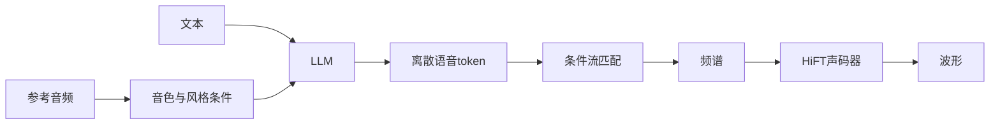

# CosyVoice 完整介绍

> 本文综合《CosyVoice 语音大模型发展历程与应用调研》与《CosyVoice模型发展与语音应用》两份资料整理而成，系统介绍 CosyVoice 的技术定位、版本演进、模型架构、性能表现、应用场景、竞品对比、部署生态与选型建议。若无特别说明，技术架构与评测数字以官方论文及 FunAudioLLM/CosyVoice 仓库为准；Fun-CosyVoice3.5 与场景案例主要来自应用调研材料。

---

## 1. 概述

CosyVoice 是阿里巴巴通义实验室（Tongyi Lab / SpeechLab@Tongyi）自 2024 年 7 月起持续开源迭代的**多语种零样本语音合成（Text-to-Speech, TTS）与声音克隆**大模型系列，隶属 FunAudioLLM 项目，采用 Apache 2.0 协议。名字取自 “Cozy”（舒适）与 “Voice”（声音），目标是让合成语音接近自然说话。

它不是传统的“文本前端 + 声学模型 + 声码器”级联系统，而是一条以大语言模型（Large Language Model, LLM）为中枢的三段式管线：

1. **监督语义 token**：先把语音压成与文本强对齐的离散语音令牌，而不是依赖语义模糊的无监督码本。
2. **LLM 生成**：以文本（及参考音色）为条件，自回归生成语音 token 序列。
3. **条件流匹配 + 声码器**：把 token 渲染为频谱，再还原为波形。

这条骨架从 1.0 沿用至今。各版本真正变化的，是 token 怎么学、LLM 用谁当骨干、流匹配能不能边读边说，以及数据和后训练能不能撑住真实场景。

| 版本 | 时间 | 参数量 | 核心突破 | 语言覆盖 |
|------|------|--------|----------|----------|
| **CosyVoice 1.0** | 2024-07 | 300M | 监督语义 token（S³），确立三段式路线 | 中、英、日、粤、韩 |
| **CosyVoice 2.0** | 2024-12 | 0.5B | 有限标量量化（Finite Scalar Quantization, FSQ）、预训练 LLM 骨干、块感知因果流匹配 | 中英日韩 + 部分中文方言 |
| **Fun-CosyVoice 3.0** | 论文 2025-05 / 开源 2025-12 | 0.5B 开源 / 1.5B 论文 | 多任务 tokenizer、可微分奖励优化（Differentiable Reward Optimization, DiffRO）、百万小时数据 | 9 语种 + 18 种中文方言 |
| **Fun-CosyVoice3.5** | 2026-03 | 1.5B | FreeStyle 自然语言指令、Tokenizer 帧率减半、组相对策略优化（Group Relative Policy Optimization, GRPO） | 13 语种 + 18 种中文方言 |

在语音方向，CosyVoice 已经从实验室零样本克隆演示，成长为可落地的全栈语音基座：覆盖智能客服与语音助手、有声书与短视频配音、数字人与直播、游戏 NPC、跨语种本地化和无障碍朗读。开源侧与 SenseVoice / Fun-ASR 组成“听 + 说”闭环；产品侧沉淀为阿里云百炼 API 与 CosyVoice Studio（CosyFlow / CosyCreative / CosyAgent）。

---

## 2. 技术背景与模型定位

### 2.1 LLM 时代 TTS 的三个缺口

2023 年前后，语音合成从“音素对齐 + 梅尔频谱预测”转向“离散语音 token + 语言模型”。这条路线把 TTS 写成和文本生成类似的 next-token 问题，零样本克隆和跨语种迁移变得容易，但也留下三个工程缺口：

1. **语义对齐不稳**。早期 LLM-TTS 多用无监督语音 token。码本能压缩声学，却不一定携带可读的语义，文本与语音容易对不齐，表现为漏读、错读、音色漂。
2. **实时交互不足**。不少高质量方案必须等完整文本到齐再合成。客服、助手、直播需要“边输入边出声”，首包延迟（第一个可播放音频包的等待时间）成为硬指标。
3. **真实世界覆盖不够**。干净朗读集上的自然度，推不到方言、中英混说、数字符号、情感指令和嘈杂参考音。缺的不只是参数量，还有数据多样性与后训练。

CosyVoice 的定位可以概括为：**用监督语义 token 把文本—语音对齐做实，用统一模型同时覆盖离线与流式，再用数据规模和后训练逼近真实场景，而不是单纯堆参数。**

### 2.2 在 FunAudioLLM 中的位置

CosyVoice 是通义 FunAudioLLM 的“说”侧核心，与“听”侧的 SenseVoice、Fun-ASR 配套。2025 年 12 月，团队同步开源 Fun-CosyVoice3-0.5B 与 Fun-ASR-Nano-0.8B，本地即可搭出识别—合成闭环。通义百聆（Tongyi Bailing）承接体验与发布，阿里云百炼提供托管 API。

因此，CosyVoice 既是一篇可复现的研究系列（三篇官方论文），也是一套可私有化部署的工业基座。选型时要同时看论文能力、开源权重和云端档位，三者并不完全等同。

### 2.3 它解决什么、不解决什么

CosyVoice 擅长：

- 约 3 秒参考音频的零样本音色克隆；
- 中文及中文方言、中英混说、跨语种保持音色；
- 流式合成（2.0 起首包约 150ms，3.5 应用材料称可再降到约 97.5ms）；
- 指令控制情感、语速、角色与细粒度副语言（笑声、呼吸等）。

它不是端到端语音对话大模型，也不自带自动语音识别（Automatic Speech Recognition, ASR）。完整“听—理解—说”需要另接 ASR、大模型对话和业务系统。声音克隆还涉及授权与滥用治理，见第 7 节。

---

## 3. 版本演进

四代演进始终守着同一骨架：**监督 token + LLM + 流匹配**。1.0 立路线，2.0 补实时，3.0 攻真实世界，3.5 降门槛与延迟。

### 3.1 CosyVoice 1.0：确立监督语义 token（2024-07）

2024 年 7 月开源 CosyVoice 1.0（300M），论文为 *CosyVoice: A Scalable Multilingual Zero-shot Text-to-speech Synthesizer based on Supervised Semantic Tokens*（arXiv 2407.05407）。

核心贡献是把**监督语义语音 token（Supervised Semantic Speech tokens, S³）**引入 TTS：在多语种 ASR 编码器中间插入矢量量化（Vector Quantization, VQ）瓶颈，用 CTC / ASR 损失端到端训练，使离散 token 携带显式语义并与文本对齐。系统采用 **LLM（文本 → token）+ 条件流匹配（token → 频谱）+ HiFi-GAN 类声码器（频谱 → 波形）**，无需单独的音素时长预测，约 3 秒参考音频即可零样本克隆。

骨干是自研 TransformerLM（300M），不是后来的 Qwen2。语言覆盖中、英、日、粤、韩。流匹配为非因果的 MaskedDiffWithXvec，流式能力受限。

开源后的工程补丁为 2.0 铺路：2024 年 8 月引入 Repetition Aware Sampling（RAS）稳定 LLM 生成，并支持带 KV cache 与 Scaled Dot-Product Attention（SDPA）的流式推理以优化实时因子（Real-Time Factor, RTF）；9 月发布 25Hz 帧率基础版与语音转换（Voice Conversion, VC）。

### 3.2 CosyVoice 2.0：补齐流式短板（2024-12）

2024 年 12 月发布 0.5B 的 CosyVoice 2.0，论文为 *CosyVoice 2: Scalable Streaming Speech Synthesis with Large Language Models*（arXiv 2412.10117）。针对 1.0 必须等完整文本、延迟偏高，做了三处系统改动：

- **FSQ 替换残差矢量量化（Residual Vector Quantization, RVQ）**，提高码本利用率，减轻码本坍塌；
- **直接以预训练文本 LLM（如 Qwen2.5-0.5B）为骨干**，语言学知识迁移更干净；
- **块感知因果流匹配（chunk-aware causal Flow Matching）**，同一套权重同时支持流式与非流式；默认文本与语音按 5:15 交错，并保留 5 个 token 的前瞻。

首包延迟约 150ms，音质接近无损。官方听感评分（Mean Opinion Score, MOS）从 1.0 的 5.4 提到约 5.53，达到该协议下的人类级自然度。语言扩展到中英日韩及粤、川、沪、津、汉等方言，并支持跨语言零样本克隆。1.0 用 X-vector 把语义和音色拆开处理，2.0 把这部分收进因果流匹配。后训练引入直接偏好优化（Direct Preference Optimization, DPO）。

### 3.3 Fun-CosyVoice 3.0：面向真实世界（2025-05 论文 / 2025-12 开源）

2025 年 5 月发布 *CosyVoice 3: Towards In-the-wild Speech Generation via Scaling-up and Post-training*（arXiv 2505.17589），同年 12 月开源 **Fun-CosyVoice3-0.5B-2512**（含强化学习版本）。论文实验还验证了 1.5B 规模。开源 0.5B 与论文 1.5B 之间存在能力差距，不能混为一谈。

3.0 针对 2.0 在语言覆盖、领域多样性、数据量、文本格式和后训练上的不足，主要做了四件事：

- **多任务监督 tokenizer**：在 MinMo（通义约 140 万小时语音理解模型）编码器中插入 FSQ，用约 53 万小时数据联合训练 ASR、语种识别（Language Identification, LID）、语音情感识别（Speech Emotion Recognition, SER）、音频事件检测（Audio Event Detection, AED）和说话人分析（Speaker Analysis, SA），让 token 带上情感、口音和风格。
- **DiffRO 后训练**：用 Token2Text（ASR 类）后验当奖励，在 token 上直接反传，而不是等波形合成后再打分。
- **规模扩展**：训练数据从万小时级扩到 100 万小时；覆盖 9 语种（中、英、日、韩、德、西、法、意、俄）和 18 种中文方言 / 口音。
- **工业可控性**：中文拼音 / 英文 CMU 音素发音修补、基于 LLM 的文本归一化（Text Normalization, TN）、约 5000 小时指令数据与 100+ 风格标签，以及 `[laughter]`、`[breath]` 等控制符。

2025 年 12 月的开源升级还报告：首包延迟相对再降 50%，中英混说词错误率（Word Error Rate, WER）相对下降 56.4%，困难集字符错误率（Character Error Rate, CER）相对下降约 26%，并同步开源 Fun-ASR-Nano。

### 3.4 Fun-CosyVoice3.5：指令更自由、延迟再降（2026-03）

应用调研材料将 2026 年 3 月的 Fun-CosyVoice3.5 视为 3.0 的工程与产品化升级，参数量按 1.5B 计。相对 3.0，公开描述集中在四点：

- 新增泰语、印尼语、葡萄牙语、越南语，语言从 9 种扩到 13 种，方言仍为 18 种；
- Tokenizer 帧率由 25Hz 降到 12.5Hz，首包延迟称降至约 97.5ms（相对前代降约 35%）；
- 引入 **FreeStyle**：用自然语言直接描述风格，例如“语气坚定一点”或“新闻播报，吐字清晰，带国泰民安的舒适感”；
- 用 GRPO 优化流匹配，并称生僻字读错率从 15.2% 降到 5.3%。

3.5 的细粒度客观表尚未像 3.0 那样进入官方 CV3-Eval 主表，下文把 3.5 数字单独书写，不与 3.0 开源评测混排。

### 3.5 版本对照

| 维度 | CosyVoice 1.0 | CosyVoice 2.0 | Fun-CosyVoice 3.0 | Fun-CosyVoice3.5 |
|------|---------------|---------------|-------------------|------------------|
| 发布时间 | 2024-07 | 2024-12 | 2025-12 开源（论文 2025-05） | 2026-03 |
| 参数量 | 300M | 0.5B | 0.5B 开源 / 1.5B 论文 | 1.5B |
| 语音 token | S³（VQ，码本 4096） | FSQ | MinMo 多任务监督 + FSQ | 沿用多任务 tokenizer，帧率 12.5Hz |
| LLM 骨干 | TransformerLM（300M） | Qwen2 预训练 LLM（0.5B） | CosyVoice3LM（0.5B / 1.5B） | 沿用 3.0 路线 |
| 流匹配 | MaskedDiffWithXvec（非因果） | CausalMaskedDiffWithXvec | CausalMaskedDiffWithDiT | 流匹配 + GRPO |
| 声码器 | HiFTGenerator | CausalHiFTGenerator | CausalHiFTGenerator | CausalHiFTGenerator |
| 帧率 | 50Hz（后有 25Hz 基础版） | 25Hz | 25Hz | 12.5Hz |
| 流式 / 首包 | 受限 | 约 150ms | 双向流式，约 150ms | 约 97.5ms（应用材料） |
| 语言 / 方言 | 中英日粤韩 | 中英日韩 + 部分方言 | 9 语种 + 18 方言 | 13 语种 + 18 方言 |
| 后训练 | 无 | DPO | DiffRO + 说话人微调 | DiffRO 路线 + GRPO |
| 控制能力 | 基础指令（strong / laughter） | Instruct2 自然语言 | 发音修补、TN、breath、vLLM | FreeStyle 自然语言指令 |
| 部署 | TorchScript JIT + TensorRT | vLLM + TensorRT（约 5GB 显存） | vLLM + TensorRT（建议 fp32） | 同上，并接入 Studio |

1.0–3.0 主要依据官方仓库与 DeepWiki 对代码变体的梳理；3.5 列依据应用调研，未逐项对应到公开代码模块名。

---

## 4. 技术架构

### 4.1 共用三段式管线

- **LLM**：读文本和说话人条件，自回归写出语音 token。不单独预测音素时长。
- **条件流匹配（Conditional Flow Matching, CFM）**：把离散 token 还原为连续频谱。1.0 非因果，2.0 起因果、可分块，3.0 换成因果 Diffusion Transformer（DiT）。
- **HiFT 声码器**：HiFi-GAN 一族的流式实现，把频谱变成可播放波形。推理时只走生成器。

参考音频既给音色，也提供风格线索。零样本克隆的本质，是让 LLM 和流匹配在短提示下复现说话人条件，而不是为每个声音单独训练一份声学模型。

### 4.2 监督语义 token（S³）

传统 LLM-TTS 的无监督 token 压缩了声学，语义却飘。CosyVoice 1.0 在多语 ASR 编码器中间加 VQ（单码本 4096 项），用识别损失监督量化，得到与文本对齐的 S³ token。

效果直接落在两头：内容更一致（少漏读、错读），音色更稳（克隆不像“会说话的别人”）。这也是后续扩数据、扩语种仍能保持可训练性的前提。S³ 是 1.0 的立身点，不是 3.0 才出现的技术。

### 4.3 FSQ 与预训练 LLM 骨干

2.0 用 FSQ 替换 RVQ：先把高维表征投到低维，再逐维有界取整，索引按 $(2K+1)^D$ 编码。码本利用更均匀，条件前缀更短，训练也更稳。

与此同时，文本—语音语言模型不再从零搭一套 300M Transformer，而是直接接 Qwen2 类预训练 LLM。文本侧的分词、句法与多语知识可以迁到 TTS，这是 2.0 自然度和流式能力的共同前提。3.0 的 CosyVoice3LM 继续这条“预训练语言模型当骨干”的路，只是按 0.5B / 1.5B 分档。

### 4.4 多任务监督 tokenizer

3.0 不再只拿 ASR 训 tokenizer。应用材料给出的任务数据量为：

| 监督任务 | 数据量 | 作用 |
|----------|--------|------|
| ASR | 约 36.5 万小时 | 内容与文本对齐 |
| LID | 约 8.5 万小时 | 语种与跨语言合成 |
| SER | 约 4.8 万小时 | 情感与语气 |
| AED | 约 2.1 万小时 | 环境音、笑声、呼吸等副语言 |
| SA | 约 1.1 万小时 | 把音色从语义里分开 |

合计约 53 万小时，与官方“多任务监督约 53 万小时”一致。编码器底座是 MinMo。结果是离散 token 既能读对字，也能带上情绪、口音和说话习惯。这是 3.0 以后“方言像方言、指令有情绪”的直接来源。

### 4.5 因果流匹配与双向流式

2.0 的块感知因果流匹配让**同一个模型**既能离线出整段，也能按块吐音频。实现上配合 KV cache 与 SDPA。3.0 进一步做成**文本流式输入 + 音频流式输出**的双向流式，首包约 150ms，适合助手、客服和直播。

应用材料称 3.5 把 tokenizer 降到 12.5Hz 后，序列更短、计算更少，首包约 97.5ms。帧率减半会缩短 LLM 要写的 token 数，这是延迟下降的主要结构原因；是否无损，仍要以具体听感和 CV3-Eval 类复测为准。

### 4.6 DiffRO、多任务奖励与 GRPO

TTS 的强化学习（Reinforcement Learning, RL）不好做：下游还要经过 CFM 和声码器，波形听感接近时，正负样本几乎分不开，而且奖励往往不可微。

DiffRO 的做法是：

1. 用 Token2Text（ASR 类）模型的后验当奖励，直接在语音 token 上打分；
2. 用 Gumbel-Softmax 采样，使离散 token 对损失可微；
3. 加 token 级 KL 散度，避免离开参考模型太远。

这样可以绕开“先合成再打分”的长循环。再配上多任务奖励（Multi-Task Reward, MTR），就能按指令压情感、语速等属性。方法不绑死 CosyVoice，也可迁到其他离散 token TTS。

2.0 的 DPO、3.0 的 DiffRO、3.5 的 GRPO（用于流匹配）是同一条后训练线上的不同工具：先对齐偏好，再在 token 或流匹配上做可算梯度的优化。

### 4.7 发音修补、文本归一化与指令控制

工业 TTS 常死在多音字、生僻字、数字和符号。3.0 起提供：

- **发音修补**：中文可用拼音（CatPhn / MixPhn）替换单字，英文可用 CMU 音素；
- **LLM 文本归一化**：用 Qwen-Max 一类模型做 TN / 逆 TN 自训练，数字、日期、符号不必再挂传统前端；
- **指令式生成**：指令数据从约 1500 小时扩到 5000 小时，覆盖 100+ 风格；支持 `<strong>`、`[laughter]`、`[breath]`；
- **FreeStyle（3.5）**：把参数化或标签式控制，换成整句自然语言描述，并支持“资深客服”“老兵”“孩童”一类角色设定。

应用材料还给出情感指令准确率：快乐约 100%，悲伤、愤怒等超过 83%。这些数字未进入 CV3-Eval 主表，宜当作能力说明，而不是和 CER 同一口径的基准。

---

## 5. 核心能力与性能

### 5.1 零样本声音克隆

1.0 已能用约 3 秒参考音频克隆音色。2.0 用 FSQ 稳住码本后，克隆更稳，跨语种也能尽量保住同一把声音。3.0 在困难集上把内容一致性和说话人相似度一起抬高。应用材料称 3.5 再用 GRPO 收紧流匹配，相似度和整体听感继续涨。

克隆质量通常看两件事：字有没有念对（CER / WER），以及像不像这个人（Speaker Similarity, SS）。CosyVoice 的产品叙事是“稳定还原”，不是闭源旗舰那种极致贴脸。

### 5.2 流式与实时

| 版本 | 流式形态 | 首包延迟（材料口径） |
|------|----------|----------------------|
| 1.0 | 非因果，工程上可做受限流式 | 高于 1 秒量级 |
| 2.0 | 流式 / 非流式统一，KV cache + SDPA | 约 150ms |
| 3.0 | 双向流式（text-in + audio-out） | 约 150ms；2025-12 称相对再降 50% |
| 3.5 | 12.5Hz tokenizer + 推理加速 | 约 97.5ms |

2.0 还报告 RTF < 0.2（合成快于自然语速）、每秒请求数（Queries Per Second, QPS）> 20，适合中高并发。具体 QPS 随显卡、批大小和是否 vLLM 变化很大，生产环境需要用自己的文本长度和并发复测。

### 5.3 多语种与方言

- **1.0**：中、英、日、粤、韩。
- **2.0**：中英日韩 + 粤、川、沪、津、汉等。
- **3.0**：9 语种 + 18 种中文方言 / 口音。
- **3.5**：再加泰、印尼、葡、越，共 13 语种。

跨语言克隆（用甲语言的声音说乙语言）从 2.0 起就是明确能力。3.0 / 3.5 还强调中英混说、日韩夹杂。短板也清楚：日语与中文混用容易因字符重叠误读，韩语通常好于日语；非中英的克隆往往弱于中英。

### 5.4 CV3-Eval 主表（3.0 开源）

官方 CV3-Eval 上，Fun-CosyVoice3 在内容一致性和说话人相似度上全面超过 CosyVoice2，并进入开源第一梯队。下表来自 FunAudioLLM/CosyVoice README。CER / WER 越低越好，SS 越高越好。

| 模型 | 开源 | 规模 | test-zh CER↓ | test-en WER↓ | test-hard CER↓ | test-zh SS↑ |
|------|------|------|--------------|--------------|----------------|-------------|
| 人类基准 | — | — | 1.26 | 2.14 | — | 75.5 |
| Seed-TTS（闭源） | 否 | — | 1.12 | 2.25 | 7.59 | 79.6 |
| MiniMax-Speech（闭源） | 否 | — | 0.83 | 1.65 | — | 78.3 |
| CosyVoice2-0.5B | 是 | 0.5B | 1.45 | 2.57 | 6.83 | 75.7 |
| Fun-CosyVoice3-0.5B | 是 | 0.5B | 1.21 | 2.24 | 6.71 | 78.0 |
| Fun-CosyVoice3-0.5B_RL | 是 | 0.5B | **0.81** | 1.68 | **5.44** | 77.4 |
| F5-TTS | 是 | 0.3B | 1.52 | 2.00 | 8.67 | 74.1 |
| Index-TTS2 | 是 | 1.5B | 1.03 | 2.23 | 7.12 | 76.5 |
| VoxCPM | 是 | 0.5B | 0.93 | 1.85 | 8.87 | 77.2 |
| GLM-TTS_RL | 是 | 1.5B | 0.89 | — | — | 76.4 |

读表要点：

- RL 版中文 CER 0.81%，低于人类 1.26%，也低于表中多数开源和部分闭源模型。
- test-hard CER 5.44%，相对 CosyVoice2 的 6.83% 约降 26%，说明数据和 DiffRO 对复杂文本、真实口吻更有效。
- 说话人相似度 77.4–78.0，接近或略超人类 75.5，但仍低于 Seed-TTS 的 79.6。
- 开源 0.5B 不是论文 1.5B。论文里相对 2.0 的 44% / 51% 提升以 1.5B 为基准。

### 5.5 不宜混用的两组听感数字

- **1.0 → 2.0**：官方 MOS 从 5.4 升到约 5.53（该协议下接近人类）。
- **应用材料中的 3.0 / 3.5**：另报 MOS 约 4.3–4.5。

两套分数量纲和听测协议不同，不能排成“越新越高”的一条曲线。内容一致性以 CV3-Eval 的 CER / WER 为准更稳。

### 5.6 3.5 补充指标（应用材料，非 CV3-Eval 主表）

| 指标 | 材料中的说法 |
|------|----------------|
| 首包延迟 | 约 97.5ms，相对前代降约 35% |
| 中文 CER | 约 0.81%（与 3.0 RL 开源数字同量级） |
| 生僻字读错率 | 15.2% → 5.3% |
| 语言数 | 13 语种客观指标仍称“业内领先” |

这些数字用于理解 3.5 的产品方向（更低延迟、更好念生僻字、更好用指令），落地前仍应用业务文本复测。

---

## 6. 竞品对比

CosyVoice 的行业位置，不是“所有维度第一”，而是**开源、流式、中文 / 方言和工程配套同时够用**。

### 6.1 和闭源旗舰：稳定还原，不是极致贴脸

相对 Seed-TTS，CosyVoice 的中文音色还原通常没有闭源旗舰细，但多语更稳、方言更全、流式延迟更明确，而且可以本地部署。相对 MiniMax-Speech，英文 WER 和部分表现力指标 CosyVoice 开源 0.5B 并不占优；优势在可复现、可私有化和与 Fun-ASR 的配套。

一句话：要“听起来像指定明星、且不必开源”时，闭源旗舰仍常是上限；要“可审计、可私有化、可流式、能讲方言”时，CosyVoice 更常进入短名单。

### 6.2 和开源 TTS：实时与中文方言

| 对比对象 | 对方特点 | CosyVoice 更合适的地方 |
|----------|----------|------------------------|
| F5-TTS | 轻量、非自回归 DiT，离线合成快 | 真流式、中文与方言、指令与克隆工具链 |
| Index-TTS2 / GLM-TTS | 参数更大，部分集合上 CER 接近 | 0.5B 即可达到第一梯队，部署更轻；方言与流式更完整 |
| VoxCPM | 干净中英 CER 很好 | 困难集（test-hard）和说话人相似度 CosyVoice RL 更稳 |
| GPT-SoVITS | 社区大、小样本微调灵活 | 零样本和跨语种更强，不必逐句微调 |

F5-TTS 适合离线批量、显存紧、不太要双向流式的场景。GPT-SoVITS 适合创作者为单一角色反复微调。CosyVoice 适合要 API 化、要流式、要多语种 / 多角色、又不想维护一堆微调权重的团队。

### 6.3 和“听”侧模型不要比错赛道

Whisper、Qwen3-ASR、Fun-ASR 解决的是识别。CosyVoice 解决的是合成。同属 FunAudioLLM 时，正确比法是：**Fun-ASR / SenseVoice 负责听，CosyVoice 负责说**，而不是拿 CER 和 TTS 的 CER 直接比——后者是“合成语音再识别”的内容一致性，不是识别模型的转写误差。

---

## 7. 应用场景

### 7.1 能力到场景的映射

| 应用场景 | 主要依赖的能力 | 典型形态 |
|----------|----------------|----------|
| 实时语音交互 | 双向流式、低首包延迟、低 RTF | 智能客服、语音助手、车载与终端对话 |
| 零样本声音克隆 | 约 3 秒参考音、跨语种保音色 | 品牌音色、个人声音包、配音声库 |
| 有声内容生产 | 长文本、多角色、情感指令 | 有声书、播客、新闻与小说 |
| 短视频 / 广告配音 | 语速情绪、方言、FreeStyle | 旁白、解说、宣传片 |
| 数字人与直播 | 流式 + 情感，便于口型同步 | 虚拟主播、讲解员、无人直播 |
| 游戏与角色配音 | 多风格、角色指令 | NPC、技能语音、角色包 |
| 跨语种本地化 | 9–13 语种 + 18 方言、跨语克隆 | 全球营销、多语宣传片 |
| 无障碍与教育 | 个性化朗读、方言、可接 ASR | 视障阅读、方言教材、口语示范 |
| 语音转换 | 1.0 起即有 VC | 换声、翻唱、主播变声 |

### 7.2 智能客服与品牌音色

银行、汽车 4S 店等场景用 3–10 秒坐席录音做出品牌音色，做回访、提醒和数字人接待。应用材料称相对传统棚录，制作成本可降一个数量级，并保持品牌声线一致。3.5 的情感指令还可以按投诉 / 咨询 / 复杂业务切换道歉、友好或专业语气。

跨境客服则把“母语坐席 + 机器翻译 + CosyVoice 多语合成”串起来：坐席仍说中文，客户听到的是自己的语言、且尽量是同一把声音。材料中的响应时间和满意度提升来自个案，复制时要单独测翻译质量和克隆授权。

### 7.3 有声书、播客与短视频

创作者用十余秒录音做个人声线，再靠情感标签或 FreeStyle 控制章节语气。平台侧可用同一说话人条件出多语种有声书，减少重复录棚。短视频更吃指令：促销用兴奋，提示用温和，方言口播用对应口音。

多角色长书仍建议在应用层做分轨和角色标记，而不是指望单次前向自动演完一台戏。Studio 的 CosyCreative 把“一句话出播客 / 有声书 / 分轨”做成产品能力，底层仍是这类合成模型。

### 7.4 数字人、直播与游戏

数字人和直播要的是稳定流式，而不是离线最高 MOS。2.0 起的 150ms 量级首包，加上情感和笑声 / 呼吸控制，方便和口型、动作对齐。游戏 NPC 可用短描述 + 风格指令批量出声线；应用材料中的独立游戏案例（百余个妖怪角色）说明的是**降配音成本**，不是取代主演级表演。

### 7.5 教育、方言与无障碍

教师录一段普通话，再合成川、粤等课程版，并按“耐心讲难点 / 活泼做练习”调语气，是 3.0 方言 + 情感控制的直接用法。无障碍朗读可以固定用户习惯的声线，避免每次换发音人。语言学习 App 则用多语种、可变语速和情绪做听力材料。这些场景对数字、专名和生僻字更敏感，3.0 的发音修补和 3.5 声称的生僻字改善值得优先验证。

### 7.6 合规与使用边界

声音克隆涉及个人信息与肖像权，必须获得本人授权。官方与生态都禁止侵权复刻、违规内容配音和骚扰外呼。本地开源部署能减少音频出域，但**责任仍在使用者**：深度伪造、未授权名人声线和自动外呼都不是模型许可范围。

建议在业务层至少做到：授权留痕、声纹 / 文本黑名单、合成内容水印或审计日志，以及人工复核高风险话术。

---

## 8. 生态、部署与工程实践

### 8.1 开源栈

CosyVoice 在 ModelScope 与 Hugging Face 发布，仓库提供训练、推理、微调和部署脚本。配套“听”侧是 SenseVoice 与 Fun-ASR。二次开发常见路径：

- 直接用官方推理脚本做零样本克隆；
- 用 vLLM 扛 LLM 段的并发；
- 用 TensorRT 加速流匹配 / 声码器；
- 对品牌音色做说话人微调（3.0 强调单语说话人可迁成多语）。

### 8.2 云端档位

阿里云百炼上的 Fun 语音家族大致分为：

| 档位 | 侧重 |
|------|------|
| Fun-CosyVoice V2 | 超低延迟，实时交互 |
| V3-Flash | 零样本克隆、表现力 |
| V3-Plus | 更高音质、专业制作 |

另提供 SSML 一类细粒度标记，便于和现有播报系统对接。通义百聆用于试用和开源发布说明，不是生产 SLA 本身。

### 8.3 CosyVoice Studio

2026 年推出的 CosyVoice Studio 把能力收成三个产品面，底层接 Qwen-Audio 语音大模型：

- **CosyFlow**：录音转写与结构化理解，支持约 6 小时长录音、多人声纹、自动摘要；
- **CosyCreative**：一句话生成播客 / 有声书 / 短视频配音，上千音色、克隆、多角色分轨；
- **CosyAgent**：零代码搭实时语音智能体，接企业知识库，做外呼、在线客服、门店咨询。

Studio 是应用层，不是又一个训练框架。要改模型结构或自训 tokenizer，仍应走开源仓库。

### 8.4 自建部署档位

| 方式 | 适合谁 | 备注 |
|------|--------|------|
| WebUI | 试用、演示、内容同学 | 零代码，不适合高并发 |
| FastAPI | 小流量业务 API | 接入快，要自己补队列和鉴权 |
| vLLM 加速服务 | 中型线上 | LLM 段吞吐更好，可做负载均衡 |
| TensorRT / TensorRT-LLM | 大型集群 | 应用材料称约 4 倍加速；3.0 的 DiT 流匹配在 fp16 上有兼容问题，生产建议 fp32 |
| 百炼云 API | 要 SLA、少运维 | 数据出域，需评估合规 |

2.0 / 3.0 开源推理常见显存大约 5GB 量级，具体随精度、并发和是否同时加载 tokenizer / 声码器变化。3.0 DiT 在 TensorRT 上优先 fp32，不要默认 fp16。

### 8.5 落地时的工程顺序

1. 先用目标语种、方言和中英混说的真实文本做 CER / 听感，不要只听官方 demo。
2. 再测首包延迟和 RTF：短句助手、长句播报、流式输入要分开看。
3. 品牌音色走授权录音 + 固定 prompt；不要用爬来的名人音。
4. 数字、多音字、商标名预置发音修补表。
5. 需要对话时，另接 Fun-ASR / SenseVoice 和业务 LLM，不要让 TTS 兼做理解。

---

## 9. 优势、局限与选型建议

### 9.1 优势

1. **技术路线清楚且连续**：四代都守监督 token + LLM + 流匹配，升级是补齐流式、数据和后训练，而不是换一套完全不同的模型。
2. **开源 0.5B 已达第一梯队内容一致性**：CV3-Eval 上 RL 版中文 CER 0.81%，困难集明显好于 2.0 和多数开源对照。
3. **流式是一等公民**：2.0 起同一模型兼离线与流式，延迟进入语音交互可用区间。
4. **中文方言和指令控制完整**：18 种方言、发音修补、TN、情感 / 角色 / FreeStyle，对国内内容和客服友好。
5. **工具链齐**：开源仓库、vLLM / TensorRT、百炼 API、Studio，从研究到产品不用换叙事。

### 9.2 局限

1. **开源与论文不是同一个模型**：0.5B 开源和 1.5B 论文在一致性和韵律上有差距；对外承诺不要按论文 1.5B 的相对提升来写 0.5B。
2. **语种不均**：中英最强；日语夹中文易误读；部分语种的跨语言克隆明显弱于中英。
3. **真实世界仍有边**：极噪参考音、极小语种、方言混杂、超长多角色戏剧，都不是当前开源权重的舒适区。
4. **工程坑**：3.0 DiT + TensorRT fp16 需避开；MOS 数字存在多套协议。
5. **合规风险与模型能力绑定**：克隆越像，未授权使用的危害越大。

### 9.3 适合优先采用

- 中文为主，需要方言、中英混说或品牌音色；
- 客服、助手、车载等必须流式出声；
- 要私有化，不能把音色和文本送到第三方；
- 内容工厂：有声书、短视频、数字人，需要指令和多角色，但不想为每个声音训一个模型；
- 已有或计划使用 Fun-ASR / 通义生态，希望听、说同一套工具链。

### 9.4 不建议当作默认最优

- 只要单一闭源音色的极致相似，且可以接受 API；
- 主要语种是 CosyVoice 覆盖很弱的小语种；
- 团队完全没有 GPU 推理和流式服务经验，又只是偶发配音（这时用云 API 或 Studio 即可，不必自建 3.0）；
- 需要端到端语音对话、实时打断和语义理解——那是语音 Agent 系统，TTS 只是其中一环。

### 9.5 版本怎么选

| 需求 | 更合适的选择 |
|------|----------------|
| 学习架构、复现 2024 年论文 | CosyVoice 1.0 / 2.0 论文与早期权重 |
| 实时客服 / 助手，要成熟开源 | CosyVoice 2.0 或 Fun-CosyVoice3-0.5B（流式） |
| 中文内容一致性、困难文本、方言 | Fun-CosyVoice3-0.5B_RL |
| 论文级上限、可接受更大模型 | 论文 1.5B 设定（若权重大于开源 0.5B） |
| 自然语言控风格、更多东南亚语种、更低首包 | Fun-CosyVoice3.5（按应用材料；上线前复测） |
| 只要调用、少运维 | 百炼 V2 / V3-Flash / V3-Plus |
| 业务同学做内容，不碰模型 | CosyVoice Studio |

---

## 10. 总结

CosyVoice 是通义实验室把 LLM-TTS 从演示推进到可服务真实世界的一条完整产品线。1.0 用监督语义 token 把文本和语音对齐做成可扩展的离散接口；2.0 用 FSQ、预训练 LLM 和因果流匹配补上实时交互；3.0 用百万小时数据、多任务 tokenizer 和 DiffRO 去啃方言、混说和野生文本；3.5 则把帧率、指令和产品入口再收一轮，让非算法用户也能用自然语言控声。

它的竞争力不在“某一个 MOS 世界第一”，而在**开源可部署、流式可用、中文与方言够用、评测和工具链公开**。和 Seed-TTS 比，它更像稳定还原加工程配套；和 F5-TTS、GPT-SoVITS 比，它更像要进生产的流式中文基座。

选型时记住三件事：开源 0.5B 不是论文 1.5B；克隆必须授权；完整语音产品还要自己接 ASR、对话和风控。用业务音频把 CER、相似度、首包和违禁声线测完，再决定是自建 Fun-CosyVoice3、走百炼，还是只开 Studio。

---

## 参考资料

1. Du, Z. et al. [CosyVoice: A Scalable Multilingual Zero-shot Text-to-speech Synthesizer based on Supervised Semantic Tokens](https://arxiv.org/abs/2407.05407). arXiv:2407.05407, 2024.
2. Du, Z. et al. [CosyVoice 2: Scalable Streaming Speech Synthesis with Large Language Models](https://arxiv.org/abs/2412.10117). arXiv:2412.10117, 2024.
3. Du, Z. et al. [CosyVoice 3: Towards In-the-wild Speech Generation via Scaling-up and Post-training](https://arxiv.org/abs/2505.17589). arXiv:2505.17589, 2025.
4. [FunAudioLLM / QwenAudio CosyVoice 官方仓库（README、评测表、Roadmap）](https://github.com/QwenAudio/CosyVoice).
5. [阿里云开发者社区：通义百聆语音双子星同步开源（2025-12）](https://developer.aliyun.com/article/1693370).
6. [DeepWiki：CosyVoice Model Versions and Evolution](https://deepwiki.com/FunAudioLLM/CosyVoice/3.1-model-variants-and-evolution).
7. [通义实验室 Fun 语音家族（Fun-CosyVoice V2 / V3-Flash / V3-Plus）](https://tongyi.aliyun.com/tongyi/landing/?family=fun).
8. [CosyVoice Studio 一站式 AI 语音平台](https://cosyvoice.net.cn).
9. 《CosyVoice 语音大模型发展历程与应用调研》
10. 《CosyVoice模型发展与语音应用》

> 注：CV3-Eval 数字来自官方仓库；Fun-CosyVoice3.5 的延迟、语种扩展、FreeStyle 与生僻字读错率来自应用调研材料，实际效果需以对应权重、文本和部署环境的复测为准。
