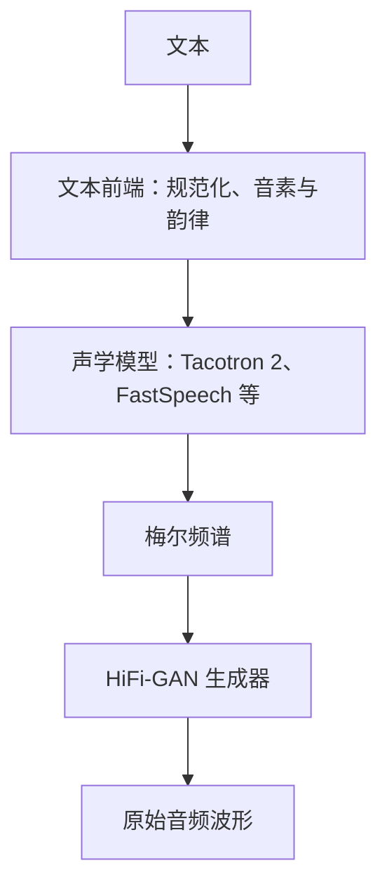
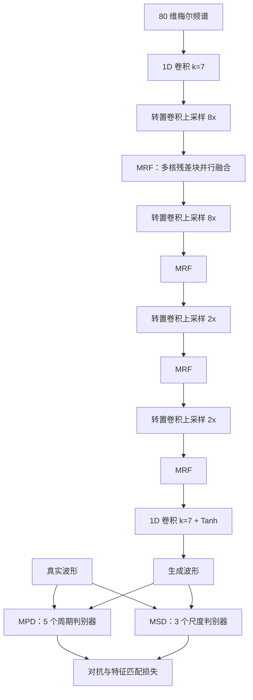
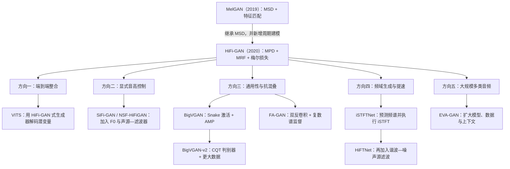

# HiFi-GAN 完整介绍

> 本文系统介绍 HiFi-GAN 的技术背景、数学目标、生成器与判别器架构、V1/V2/V3 配置、训练与推理流程、原论文实验、技术演进、应用场景、工程实践及当前选型价值。若无特别说明，“HiFi-GAN”均指 Kong、Kim、Bae 在 NeurIPS 2020 提出的梅尔频谱神经声码器。

---

## 1. 概述

HiFi-GAN 是 Kakao Enterprise 的 Jungil Kong、Jaehyeon Kim 和 Jaekyoung Bae 于 2020 年提出的生成对抗网络（GAN）神经声码器。它接收梅尔频谱，一次前向传播便可并行生成原始音频波形，不像 WaveNet 那样逐采样点生成，也不要求 WaveGlow 式的可逆网络。

HiFi-GAN 的设计可以概括为三点：

1. **多周期判别器（Multi-Period Discriminator，MPD）**：按不同周期重排波形，直接审查语音中的周期结构。
2. **多尺度判别器（Multi-Scale Discriminator，MSD）**：在原始、2 倍降采样和 4 倍降采样的波形上判断连续模式，补充长程与多尺度约束。
3. **多感受野融合（Multi-Receptive Field Fusion，MRF）**：在每一级上采样后并行使用不同卷积核和扩张率，使生成器同时建模短时瞬态与较长的谐波、包络模式。

训练时，生成器同时接受最小二乘 GAN、判别器特征匹配和梅尔频谱重建三类监督；推理时只保留生成器。原论文在 LJ Speech 的同一听测协议下报告：

- HiFi-GAN V1 的 MOS 为 $4.36\pm0.07$，真人录音为 $4.45\pm0.06$；
- V1 在单张 NVIDIA V100 上生成 22.05 kHz 音频的速度约为实时的 $167.86$ 倍；
- 仅 0.92M 参数的 V2 达到 $4.23\pm0.07$ MOS；
- V3 在论文所用 MacBook Pro CPU 上达到 $13.44$ 倍实时，在 V100 上达到 $1186.80$ 倍实时。

这些结果让 HiFi-GAN 成为一个关键转折点：GAN 声码器不再只是“速度快但音质较差”的替代品，而可以在同一实验中超过当时公开可复现的自回归和流模型。

今天，原始 HiFi-GAN 未必是所有场景的最高音质方案。BigVGAN、HiFTNet、Vocos 及后续通用声码器在跨域、抗混叠、高采样率或规模化训练上继续推进。但 HiFi-GAN 仍是使用最广泛的经典声码器之一，也是理解 VITS、BigVGAN、SiFi-GAN 和现代 GAN 音频生成器的重要基础。

---

## 2. 技术背景与模型定位

### 2.1 HiFi-GAN 之前的神经声码器

神经声码器的任务是把低时间分辨率的声学表示还原成高时间分辨率波形。以 22.05 kHz 音频为例，系统每秒要输出 22,050 个浮点采样，而常见梅尔频谱每秒只有约 86 帧。2016—2020 年间，主流方案大致分为四类。

| 路线 | 代表模型 | 生成方式 | 主要优势 | 主要问题 |
|---|---|---|---|---|
| 参数化或相位迭代 | WORLD、Griffin-Lim | 显式声源参数或迭代估相位 | 轻量、可解释 | 自然度和高频细节有限 |
| 自回归 | WaveNet、WaveRNN | 逐点预测下一个采样 | 音质高 | 串行依赖使推理很慢 |
| 蒸馏与流模型 | Parallel WaveNet、ClariNet、WaveGlow | 并行变换噪声 | 可并行，质量较高 | 需教师或可逆深层网络，训练、显存成本高 |
| GAN | MelGAN、Parallel WaveGAN、GAN-TTS | 前馈生成器一次输出波形 | 快、参数少、无需似然 | 早期模型的高频、谐波和稳定性仍落后 |

MelGAN 已证明“梅尔频谱 + 全卷积生成器 + 多尺度判别器”可以在不蒸馏的情况下高速工作；Parallel WaveGAN 则证明多分辨率频谱损失能显著稳定对抗式声码器。然而，当时公开 GAN 声码器的主观音质仍低于 WaveNet 和 WaveGlow。

HiFi-GAN 的关键观察不是简单加深网络，而是把语音的周期性作为归纳偏置：有声段由声带准周期振动产生，谐波结构对细小的波形误差十分敏感。普通时域判别器即使拥有大感受野，也未必会优先学习这种周期规律。MPD 因而成为模型最有辨识度的创新。

### 2.2 HiFi-GAN 在两阶段 TTS 中的位置

原版 HiFi-GAN 不是完整的文本转语音模型，而是两阶段 TTS 的后半段：



不同模块负责的问题不同：

- 文本前端决定读什么、如何切分和发音；
- 声学模型决定时长、音高走势、停顿、能量和大部分韵律；
- HiFi-GAN 根据梅尔条件补全相位与采样级细节，把频谱“渲染”为可播放波形。

因此，漏字、重复、停顿失控通常不是声码器单独造成的；金属音、嘶声、周期毛刺、发闷和频谱口径不匹配则更常与声码器有关。

### 2.3 它是确定性的条件波形生成器

设输入梅尔频谱为 $\mathbf{s}$，真实波形为 $\mathbf{x}$。原版生成器学习：

$$
\hat{\mathbf{x}}=G(\mathbf{s})
$$

它不显式估计 $p(\mathbf{x}\mid\mathbf{s})$ 的归一化概率密度，也不向生成器额外输入随机噪声。相同权重、相同梅尔和相同数值环境下，输出基本确定。

梅尔频谱丢失了相位和部分高频细节，从信息论上说，梅尔到波形并非严格一一对应。HiFi-GAN 并不是找回唯一“正确相位”，而是在训练分布和判别器约束下生成一个听感合理、且重新计算梅尔后接近输入的波形。

### 2.4 不应混淆的三个名称

文献中至少有三项容易混淆的工作：

| 名称 | 年份 | 团队 | 输入与输出 | 与本文主模型的关系 |
|---|---:|---|---|---|
| HiFi-GAN 声码器 | 2020 | Kakao Enterprise | 梅尔频谱 $\rightarrow$ 波形 | 本文主角，NeurIPS 2020 |
| HiFi-GAN 去噪/去混响模型 | 2020 | Su、Jin、Finkelstein | 受损波形/特征 $\rightarrow$ 增强波形 | 同名但独立的语音增强工作 |
| HiFi-GAN-2 | 2021 | Adobe Research、Princeton | 消费级录音 $\rightarrow$ 48 kHz 增强录音 | 上述增强路线的后续工作，不是声码器的 V2 |

此外，**HiFi-GAN V1、V2、V3 是同一篇声码器论文中的三档生成器配置**，不是按年份发布的三代模型。尤其不要把“HiFi-GAN V2（0.92M 参数）”与“HiFi-GAN-2（语音增强系统）”写成同一项技术。

---

## 3. 数学原理与训练目标

### 3.1 一个生成器、八个子判别器

HiFi-GAN 使用一个生成器和两组判别器：

- MPD 含 5 个子判别器，周期为 $[2,3,5,7,11]$；
- MSD 含 3 个子判别器，分别接收原始、约 2 倍和约 4 倍降采样波形。

因此训练目标实际会在 8 个子判别器上求和。判别器只看波形，不直接接收梅尔条件；输入与输出是否匹配，主要由梅尔重建损失保证。判别器输出也不是整句唯一标量，而是一组局部判断，属于音频版的 PatchGAN 思路。

### 3.2 最小二乘对抗损失

HiFi-GAN 采用 LSGAN，而非 MelGAN 的 hinge GAN。对第 $k$ 个子判别器 $D_k$，判别器希望真实波形得分接近 1，生成波形得分接近 0：

$$
\mathcal{L}_{\mathrm{Adv}}(D_k;G)
=
\mathbb{E}_{(\mathbf{x},\mathbf{s})}
\left[
\left(D_k(\mathbf{x})-1\right)^2
+
D_k\left(G(\mathbf{s})\right)^2
\right]
$$

生成器则让生成波形得分接近 1：

$$
\mathcal{L}_{\mathrm{Adv}}(G;D_k)
=
\mathbb{E}_{\mathbf{s}}
\left[
\left(D_k(G(\mathbf{s}))-1\right)^2
\right]
$$

最小二乘形式在样本已被判为“假”时仍能提供连续梯度，通常比原始二元交叉熵更适合这一训练配置。

### 3.3 梅尔频谱重建损失

仅靠无条件判别器，生成器可能产生“像真实语音、却不完全对应输入梅尔”的波形。为固定内容和粗粒度频谱，HiFi-GAN 重新从生成波形计算梅尔频谱：

$$
\mathcal{L}_{\mathrm{Mel}}(G)
=
\mathbb{E}_{(\mathbf{x},\mathbf{s})}
\left[
\left\|
\phi(\mathbf{x})-\phi(G(\mathbf{s}))
\right\|_1
\right]
$$

其中 $\phi$ 是波形到梅尔频谱的变换。它有两个作用：

1. 从训练早期便提供稳定、密集的重建梯度；
2. 约束音素内容、谱包络和整体能量，使输出忠于条件。

原版 HiFi-GAN 使用的是**梅尔频谱 L1 损失**，不是多分辨率 STFT 损失，也没有额外的“带通滤波先验”。多分辨率 STFT、复数谱和多尺度梅尔损失属于其他声码器或后续变体的设计。

### 3.4 判别器特征匹配损失

判别器的最终输出只表示局部真假，其各层中间特征则包含从细粒度波形纹理到较长模式的表示。特征匹配损失让真实与生成波形在这些内部表示上接近：

$$
\mathcal{L}_{\mathrm{FM}}(G;D_k)
=
\mathbb{E}_{(\mathbf{x},\mathbf{s})}
\left[
\sum_{i=1}^{T_k}
\frac{1}{N_i}
\left\|
D_k^{(i)}(\mathbf{x})
-
D_k^{(i)}(G(\mathbf{s}))
\right\|_1
\right]
$$

$D_k^{(i)}$ 表示第 $k$ 个子判别器的第 $i$ 层特征图，$N_i$ 是该层单元数。它可视为由判别器在线学习的多层感知距离，有助于减少 GAN 训练震荡和局部伪影。

### 3.5 最终目标

生成器目标为：

$$
\mathcal{L}_G
=
\sum_{k=1}^{8}
\left[
\mathcal{L}_{\mathrm{Adv}}(G;D_k)
+
\lambda_{\mathrm{fm}}\mathcal{L}_{\mathrm{FM}}(G;D_k)
\right]
+
\lambda_{\mathrm{mel}}\mathcal{L}_{\mathrm{Mel}}(G)
$$

判别器目标为：

$$
\mathcal{L}_D
=
\sum_{k=1}^{8}
\mathcal{L}_{\mathrm{Adv}}(D_k;G)
$$

原论文取：

$$
\lambda_{\mathrm{fm}}=2,\qquad
\lambda_{\mathrm{mel}}=45
$$

这三类目标各自解决不同问题：

| 损失 | 直接约束 | 主要作用 |
|---|---|---|
| LSGAN | 判别器的局部真假判断 | 提升波形真实感与高频细节 |
| 特征匹配 | 判别器各层表示 | 稳定训练，匹配多层时域模式 |
| 梅尔 L1 | 重新提取的梅尔频谱 | 保证条件一致性和频谱保真 |

把梅尔损失的权重 45 理解成“它比其他损失重要 45 倍”并不准确，因为三类损失的原始数值尺度不同。该权重是这套实现中的经验平衡。

---

## 4. 核心网络架构

### 4.1 总体结构

下图以 V1/V2 的四级上采样为例。V3 使用三级上采样，但总倍率仍为 256。



训练结束后，MPD 和 MSD 全部丢弃。部署成本只由生成器决定，这也是论文报告 V1/V2/V3 参数量与推理速度时最重要的口径。

### 4.2 生成器：逐级上采样

生成器是非因果、全卷积网络。以 V1 为例：

1. 输入形状约为 $[B,80,T_{\mathrm{mel}}]$；
2. 一个核大小为 7 的 1D 卷积把 80 维梅尔投影到 512 个通道；
3. 四个转置卷积按 $8,8,2,2$ 倍逐级上采样，总倍率为
   $8\times8\times2\times2=256$；
4. 每次上采样后通道数减半，并经过一个 MRF；
5. 最后经 Leaky ReLU、核大小为 7 的 1D 卷积和 Tanh，输出单通道 $[-1,1]$ 波形。

总上采样倍率必须与梅尔频谱的 hop size 一致。官方 22.05 kHz 配置的 hop size 为 256，因此每个梅尔帧对应 256 个波形采样。

生成器没有 U-Net 式编码器—解码器和跨层跳连，也没有额外噪声输入。网络中的残差连接位于 MRF 内部的残差块。

### 4.3 MRF：多感受野融合

每一级上采样后，特征会并行送入多个残差块。V1/V2 使用三个不同卷积核：

$$
k_r\in\{3,7,11\}
$$

每个 ResBlock1 内部包含三组残差单元。每组先使用扩张率分别为 $1,3,5$ 的卷积，再接扩张率为 1 的卷积。不同卷积核和扩张率组合使各分支看到不同长度的上下文。

对步长为 1 的串联卷积，一个简化的感受野计算为：

$$
R=1+\sum_l (k_l-1)d_l
$$

其中 $k_l$ 和 $d_l$ 分别为第 $l$ 层卷积核与扩张率。MRF 不是只用“核大小 3、扩张率 1/3/5 得到 3/7/11”这么简单；V1/V2 实际同时改变卷积核大小，并在每个残差块中堆叠多组卷积。

论文将 MRF 描述为各残差块输出求和；官方实现把三个输出相加后除以分支数，即取平均。两种表述的核心都是：**不串行选择单一感受野，而是在同一分辨率并行融合多种感受野。**

V3 使用更轻的 ResBlock2。每个残差块只有两个单卷积残差单元，三组核与扩张率分别为：

| 卷积核 | 扩张率 |
|---:|---|
| 3 | $[1,2]$ |
| 5 | $[2,6]$ |
| 7 | $[3,12]$ |

它用更少层数与更激进的扩张率保留较宽感受野，因此虽然 V3 参数量大于 V2，实际速度仍更快。

### 4.4 MPD：多周期判别器

MPD 由周期 $p\in\{2,3,5,7,11\}$ 的五个独立子判别器构成。对长度为 $T$ 的一维波形，若 $T$ 不能被 $p$ 整除，官方实现先在尾部做反射填充，再重排为：

$$
[B,1,T]\longrightarrow[B,1,T/p,p]
$$

以 $p=3$ 为例，连续波形

```text
x0, x1, x2, x3, x4, x5, x6, x7, x8, ...
```

重排后相当于：

```text
[x0, x1, x2]
[x3, x4, x5]
[x6, x7, x8]
...
```

随后使用核形状主要为 $(5,1)$、步长为 $(3,1)$ 的 2D 卷积。宽度方向核大小固定为 1，因此每一列代表的一组等间隔采样会被独立处理，而卷积权重在列之间共享。这样既突出周期模式，又能让梯度覆盖全部时间点。

选择互不相同的质数周期，是为了尽量减少各分支所见结构的重叠。这里的 $p$ 是重排因子，不等同于模型先估计出真实 $F_0$ 再选择一个精确声带周期；MPD 是用多组固定采样间隔建立周期敏感性。

每个 MPD 子判别器依次使用通道数约为：

```text
1 → 32 → 128 → 512 → 1024 → 1024 → 1
```

卷积后使用斜率为 0.1 的 Leaky ReLU，并采用权重归一化。最终输出被展平成多个局部真假分数。

MPD 不会“随机重排二维张量的行”。随机打乱反而会破坏需要识别的局部结构；原论文和官方实现均只是按固定周期重排。

### 4.5 MSD：多尺度判别器

MPD 擅长周期模式，但按等间隔样本观察信号。为了审查连续波形，HiFi-GAN 保留了来自 MelGAN 的 MSD：

| 子判别器 | 输入 | 侧重点 |
|---|---|---|
| $D_{S,1}$ | 原始波形 | 高频细节和连续局部结构 |
| $D_{S,2}$ | 一次平均池化后的波形 | 中尺度模式 |
| $D_{S,3}$ | 两次平均池化后的波形 | 更长上下文和低频包络 |

三个子判别器使用相同类型但不共享参数的 1D 卷积堆，包含大核和分组卷积。第一个原始尺度判别器使用谱归一化，另外两个使用权重归一化。

平均池化会平滑高频，因此 MSD 与 MPD 的角色互补：

- MSD 观察连续、逐级平滑的多尺度波形；
- MPD 观察未被低通平滑的等间隔样本，对周期与高频误差更敏感。

---

## 5. V1、V2、V3 三档配置

### 5.1 架构配置

| 配置 | 初始通道 $h_u$ | 上采样倍率 | 转置卷积核 $k_u$ | MRF 卷积核 $k_r$ | 残差块 |
|---|---:|---|---|---|---|
| V1 | 512 | $[8,8,2,2]$ | $[16,16,4,4]$ | $[3,7,11]$ | ResBlock1 |
| V2 | 128 | $[8,8,2,2]$ | $[16,16,4,4]$ | $[3,7,11]$ | ResBlock1 |
| V3 | 256 | $[8,8,4]$ | $[16,16,8]$ | $[3,5,7]$ | ResBlock2 |

三者总上采样倍率都是 256，并使用相同的 MPD、MSD 和训练目标。差异集中在生成器容量、层数和上采样级数。

### 5.2 参数、音质与速度

下表来自原论文同一组 LJ Speech 梅尔反演实验。速度使用 FP32、没有特定推理优化；GPU 为单张 V100，CPU 为 2.6 GHz Intel i7 的 MacBook Pro。

| 配置 | 生成器参数量 | MOS（95% CI） | CPU 生成速率 | GPU 生成速率 | 典型定位 |
|---|---:|---:|---:|---:|---|
| V1 | 13.92M | $4.36\pm0.07$ | 31.74 kHz，$1.43\times$ 实时 | 3701 kHz，$167.86\times$ | 优先音质 |
| V2 | 0.92M | $4.23\pm0.07$ | 214.97 kHz，$9.74\times$ | 16,863 kHz，$764.80\times$ | 极小参数量 |
| V3 | 1.46M | $4.05\pm0.08$ | 296.38 kHz，$13.44\times$ | 26,169 kHz，$1186.80\times$ | 优先低延迟 |

V2 参数最少，V3 却最快，原因是速度不只取决于参数量。V3 减少了上采样级数和残差层数，更适合并行硬件执行。

### 5.3 如何理解实时倍数与 RTF

若模型每秒生成 $v$ 个采样，目标采样率为 $f_s$，则：

$$
\text{实时倍数}=\frac{v}{f_s},
\qquad
\mathrm{RTF}=\frac{f_s}{v}
$$

实时倍数越大越快，RTF 越小越快。例如 V1 的 3701 kHz 在 22.05 kHz 音频上：

$$
\frac{3701}{22.05}\approx167.85
$$

文献和工程报告经常混用“RTF”“倍实时”和“kHz”。必须同时写清：

- 是 RTF 还是其倒数；
- 采样率；
- CPU/GPU 型号；
- 精度、batch、句长和是否使用编译优化。

---

## 6. 数据、训练与推理

### 6.1 原论文数据与声学特征

原论文主实验使用 LJ Speech：

- 13,100 条单说话人英语朗读；
- 总时长约 24 小时；
- 16-bit PCM；
- 采样率约 22.05 kHz。

未见说话人实验使用 VCTK：

- 约 44,200 条录音；
- 109 位英语说话人及多种口音；
- 总时长约 44 小时；
- 原始 44 kHz，实验降采样到 22 kHz；
- 随机留出 9 位说话人的全部语音作为未见说话人测试。

官方 22.05 kHz 配置的梅尔参数为：

| 项目 | 数值 |
|---|---:|
| 梅尔通道数 | 80 |
| FFT 点数 | 1024 |
| 窗长 | 1024 |
| hop size | 256 |
| 最低频率 | 0 Hz |
| 最高频率 | 8000 Hz |
| 训练波形片段 | 8192 samples，约 371.5 ms |

“80 维梅尔”并不足以保证兼容。不同库的窗函数、中心填充、幅度/功率定义、Mel 标度、对数压缩、归一化和频率上下限都可能不同。

### 6.2 优化配置

论文与官方配置中的基础训练参数包括：

| 项目 | 配置 |
|---|---|
| batch size | 16 |
| 优化器 | AdamW |
| 初始学习率 | $2\times10^{-4}$ |
| $\beta_1,\beta_2$ | $0.8,0.99$ |
| weight decay | $0.01$ |
| 学习率衰减 | 每个 epoch 乘 $0.999$ |
| Leaky ReLU 斜率 | $0.1$ |
| 特征匹配权重 | 2 |
| 梅尔损失权重 | 45 |

生成器、MPD 和 MSD 从头联合对抗训练，不要求预训练 WaveNet 教师，也不要求先训练一个可逆流。

### 6.3 单次训练迭代

一个简化迭代可以写成：

```text
1. 从真实波形裁剪片段，并取得对齐的真实梅尔 s
2. 生成波形 x_hat = G(s)
3. 把真实 x 和停止生成器梯度的 x_hat 送入 MPD、MSD
4. 用 LSGAN 更新两组判别器
5. 再计算生成波形的判别结果和各层特征
6. 计算对抗 + 特征匹配 + 梅尔 L1
7. 更新生成器
```

判别器太强时，生成器可能长期收不到有用梯度；判别器太弱时，又无法约束高频细节。HiFi-GAN 的梅尔损失和特征匹配显著缓和了这种博弈，但没有从理论上消除 GAN 的训练不稳定性。

### 6.4 推理流程

推理只需：

1. 取得与训练配置完全一致的梅尔频谱；
2. 切换生成器到评估模式；
3. 移除权重归一化的重参数化；
4. 一次或分块执行生成器前向；
5. 按目标位深保存波形，并裁掉为对齐而增加的填充。

官方仓库提供从真实波形提取梅尔再反演的脚本，也提供直接读取声学模型梅尔文件的端到端推理脚本。前者主要验证声码器上限，后者才接近真实 TTS 使用方式。

### 6.5 真实梅尔与预测梅尔失配

训练集梅尔由干净真实波形提取，声学模型预测的梅尔却往往过平滑、带对齐误差和分布偏移。于是常见现象是：

```text
真实波形提取的梅尔 → HiFi-GAN：很好听
声学模型预测的梅尔 → 同一 HiFi-GAN：发闷、嘶声或不稳定
```

原论文用 Tacotron 2 的 teacher-forcing 预测梅尔再微调声码器 100k 步，显著提高了端到端 MOS。这说明工程中应分别测试：

- oracle mel inversion：声码器对真实梅尔的反演能力；
- predicted mel synthesis：完整 TTS 链路中的稳健性。

二者不能用一个结果代替。

---

## 7. 原论文实验结果

### 7.1 评价指标与比较边界

- **MOS**：听音者按 1—5 分评价自然度或质量。受语料、问题措辞、听音设备、样本和参与者影响，只宜在同一听测协议内比较。
- **生成速率（kHz）**：每秒生成多少千个波形采样。
- **实时倍数**：生成速率除以采样率。
- **RTF**：推理耗时除以音频时长，与实时倍数互为倒数。
- **参数量**：这里重点指推理所需生成器；训练判别器不会随部署交付。

不同表格即使来自同一论文，也可能属于不同听测批次。比如主结果的真人 MOS 是 4.45，消融表的真人 MOS 是 4.57，不能把后者拿来计算主结果中 V1 与真人的差距。

### 7.2 LJ Speech 梅尔反演

测试输入是从未参与训练的真实语音中提取的真实梅尔频谱。

| 模型 | MOS（95% CI） | CPU | GPU | 参数量 |
|---|---:|---:|---:|---:|
| 真人录音 | $4.45\pm0.06$ | — | — | — |
| WaveNet（MoL） | $4.02\pm0.08$ | — | 0.07 kHz，$0.003\times$ | 24.73M |
| WaveGlow | $3.81\pm0.08$ | 4.72 kHz，$0.21\times$ | 501 kHz，$22.75\times$ | 87.73M |
| MelGAN | $3.79\pm0.09$ | 145.52 kHz，$6.59\times$ | 14,238 kHz，$645.73\times$ | 4.26M |
| HiFi-GAN V1 | $4.36\pm0.07$ | 31.74 kHz，$1.43\times$ | 3701 kHz，$167.86\times$ | 13.92M |
| HiFi-GAN V2 | $4.23\pm0.07$ | 214.97 kHz，$9.74\times$ | 16,863 kHz，$764.80\times$ | 0.92M |
| HiFi-GAN V3 | $4.05\pm0.08$ | 296.38 kHz，$13.44\times$ | 26,169 kHz，$1186.80\times$ | 1.46M |

这张表支持的准确结论是：

- 三档 HiFi-GAN 在该听测中都高于所用 WaveNet、WaveGlow 和 MelGAN 检查点；
- V1 与真人录音相差 0.09 MOS；
- V2 在参数量不到 1M 时仍达到接近真人的主观分数；
- V3 的 MOS 接近 WaveNet，但速度相差多个数量级；
- MelGAN 的 GPU 吞吐高于 V1，因此不能笼统说“V1 在所有速度指标上都快于所有旧 GAN”；HiFi-GAN 的突破是质量—速度组合。

这不是跨论文的永久排行榜。它只描述 2020 年作者在固定硬件、公开实现和同一听测中的结果。

### 7.3 组件消融

消融使用表达能力最低的 V3，并把各配置训练到 500k 步。

| 配置 | MOS（95% CI） |
|---|---:|
| 真人录音 | $4.57\pm0.04$ |
| 完整 V3 基线 | $4.10\pm0.05$ |
| 去掉 MPD | $2.28\pm0.09$ |
| 去掉 MSD | $3.74\pm0.05$ |
| 去掉 MRF，仅保留最宽残差块 | $3.92\pm0.05$ |
| 去掉梅尔频谱损失 | $3.25\pm0.05$ |
| MPD 周期改为 $[2,4,8,16,32]$ | $3.90\pm0.05$ |
| MelGAN | $2.88\pm0.08$ |
| MelGAN + MPD | $3.35\pm0.07$ |

可得到四个重要判断：

1. **MPD 贡献最大**：去掉后 MOS 从 4.10 降到 2.28。
2. **MSD 仍不可缺**：连续多尺度信息不能完全由 MPD 替代。
3. **MRF 不是纯粹堆参数**：保留单一最大感受野仍会下降。
4. **梅尔损失对质量和训练稳定都重要**：HiFi-GAN 不是“只靠 GAN”。

把 MPD 加到 MelGAN 后提升 0.47 MOS，也说明收益并非完全依赖 HiFi-GAN 自己的生成器。质数周期优于全为 2 的幂，支持了“减少周期分支重叠”的设计动机。

### 7.4 未见说话人泛化

作者在 VCTK 上训练模型，并把 9 位说话人完全留作测试：

| 模型 | 未见说话人 MOS（95% CI） |
|---|---:|
| 真人录音 | $3.79\pm0.07$ |
| WaveNet（MoL） | $3.52\pm0.08$ |
| WaveGlow | $3.52\pm0.08$ |
| MelGAN | $3.50\pm0.08$ |
| HiFi-GAN V1 | $3.77\pm0.07$ |
| HiFi-GAN V2 | $3.69\pm0.07$ |
| HiFi-GAN V3 | $3.61\pm0.07$ |

这里证明的是：在多说话人 VCTK 分布内训练后，模型能反演未参与训练的说话人梅尔。它不等于“用单说话人 LJ Speech 权重便可零样本克隆任意声音”，也不代表 HiFi-GAN 自己完成了说话人身份提取。

### 7.5 Tacotron 2 端到端实验

| 系统 | 未微调 MOS | 用预测梅尔微调后 MOS |
|---|---:|---:|
| 真人录音 | $4.23\pm0.07$ | — |
| WaveGlow | $3.69\pm0.08$ | $3.66\pm0.08$ |
| HiFi-GAN V1 | $3.91\pm0.08$ | $4.18\pm0.08$ |
| HiFi-GAN V2 | $3.88\pm0.08$ | $4.12\pm0.07$ |
| HiFi-GAN V3 | $3.89\pm0.08$ | $4.02\pm0.08$ |

HiFi-GAN 在未微调时已经高于表中的 WaveGlow；使用 Tacotron 2 teacher-forcing 产生的预测梅尔微调后，三档配置都超过 4.0。V1 达到 4.18，与该听测真人录音只差 0.05。

有趣的是，微调后波形重新计算出的梅尔与输入预测梅尔之间的逐点误差可能变大，主观质量却提高。这说明“最小梅尔误差”与“最好听感”不是完全相同的目标，对抗与特征匹配会允许模型修正声学模型的部分过平滑。

### 7.6 周期辨别能力实验

论文附录还用合成正弦信号测试 MPD 与 MSD 对稀有错误频率的辨别能力。当错误频率仅占 0.1% 时，MPD 的平均分类准确率仍约为 85.33%，MSD 接近随机水平的 50.42%。另一个 sinc 函数实验显示，平均池化会削弱 MSD 输入的高频幅度，而 MPD 保留了更多周期结构。

这些是解释性实验，不等同于真实语音 MOS，但它们说明 MPD 的收益并非一个无法解释的参数量效应。

---

## 8. 技术演进与继承谱系

### 8.1 时间线

| 时间 | 模型或事件 | 与 HiFi-GAN 的关系 |
|---|---|---|
| 2019 | MelGAN | 提供多尺度时域判别器和特征匹配基础 |
| 2020 | Parallel WaveGAN | 推动对抗声码器与频谱重建损失结合 |
| 2020.10 | HiFi-GAN | 引入 MPD 与 MRF，实现高质量、高效率组合 |
| 2021 | VITS | 将近似 HiFi-GAN V1 的生成器作为端到端 TTS 解码器 |
| 2022 | iSTFTNet | 用较低时间分辨率的复数谱预测和 iSTFT 减少生成计算 |
| 2022/2023 | Source-Filter HiFi-GAN（SiFi-GAN） | 在 HiFi-GAN 上加入声源—滤波器结构和 $F_0$ 控制 |
| 2022/2023 | BigVGAN | 用 Snake 周期激活和抗混叠 AMP 模块增强通用性 |
| 2023/2024 | HiFTNet | 在 iSTFT 路线加入谐波—噪声源滤波，发表于 ICASSP 2024 |
| 2024 | EVA-GAN | 沿大规模、多类音频和可扩展 GAN 方向推进 |
| 2024 | BigVGAN-v2 | 加入 MS-SB-CQTD、多尺度梅尔损失、更大数据与融合 CUDA 核 |
| 2024 | FA-GAN | 用双分支反卷积和复数谱监督抑制混叠与模糊伪影 |

这条谱系不是简单的“版本升级”。后续工作分别沿可控性、通用性、频域生成、抗混叠和规模化训练等不同轴线发展。

### 8.2 VITS：从独立声码器到端到端解码器

VITS 的解码器“本质上是 HiFi-GAN V1 生成器”，并继续使用对抗判别器。但两者不能简单写成“VITS 先输出梅尔，再调用 HiFi-GAN”：

- 原版 HiFi-GAN 输入 80 维梅尔；
- VITS 解码器输入由后验编码器、文本先验和流模型对齐得到的潜变量；
- VITS 联合优化文本、时长、潜变量和波形，不再以外部梅尔接口为边界。

HiFi-GAN 的卷积上采样与 MPD 因此从“独立声码器”变成端到端生成模型内部可复用的波形头。

### 8.3 SiFi-GAN 与 NSF-HiFiGAN：加入显式音高控制

原版 HiFi-GAN 只接收梅尔频谱，没有独立 $F_0$ 旋钮。对歌声合成和大幅移调，梅尔中的隐式音高信息不够稳。

Source-Filter HiFi-GAN（SiFi-GAN）把声源—滤波器理论引入 V1：

- source network 根据 $F_0$ 生成准周期激励表示；
- filter network 在多级上采样过程中接受声源表示并形成共振结构；
- 通过裁剪原 V1 容量控制额外计算量。

NSF-HiFiGAN 等工程变体也把神经源滤波器与 HiFi-GAN 式上采样结合，广泛用于歌声转换。它们解决的是可控基频和高音域稳定性，不是简单把原版模型训练得更久。

### 8.4 BigVGAN：周期激活、抗混叠与大规模训练

HiFi-GAN 的周期归纳偏置主要位于判别器。BigVGAN 把周期性直接放进生成器：

- 使用 Snake 周期激活，使网络更容易表示高频周期函数；
- 在激活前后做上采样、低通和下采样，形成抗混叠激活；
- 以 AMP（Anti-aliased Multi-Periodicity）块替换普通残差块；
- 用更大、多域数据和最高 112M 级模型提升未见说话人、语言、乐器及环境声泛化。

BigVGAN-v2 进一步引入多尺度子带 CQT 判别器（MS-SB-CQTD）、多尺度梅尔损失、更广数据，并提供融合的 CUDA 抗混叠激活核。官方报告该核在 A100 上相对未融合实现可加速约 1.5—3 倍。

因此，BigVGAN 的核心提升不是“HiFi-GAN 加宽”这么单一，而是生成器周期建模、抗混叠、判别器、损失和训练数据共同变化。

### 8.5 iSTFTNet 与 HiFTNet：把部分波形生成交还给信号处理

HiFi-GAN 在采样级分辨率上执行后几级卷积，计算量随采样率增长。iSTFTNet 减少上采样级数，让网络预测低分辨率的幅度与相位表示，再用逆短时傅里叶变换生成波形。

HiFTNet 在此基础上加入时频域的谐波—噪声源滤波，并使用估计的 $F_0$ 生成正弦源。其目标是以更小参数和更低计算保持高质量。

这条路线保留了 HiFi-GAN 式对抗训练和部分生成骨架，但输出空间从“直接采样级波形”转向“复数谱 + iSTFT”。

### 8.6 EVA-GAN 与 FA-GAN：规模化和伪影治理

EVA-GAN 是 2024 年发布的 arXiv 预印本。它把模型扩展到约 200M 参数，在约 36,000 小时、44.1 kHz 的多类音频上训练，并引入上下文感知模块与人工参与的伪影测量工具。该工作关注长上下文、音乐/歌声、高频连续性和域外稳健性，说明扩散模型兴起后，前馈 GAN 在高吞吐音频生成中仍有价值；其结论仍应按预印本证据强度理解。

FA-GAN 针对转置卷积和频谱细节提出：

- 双分支转置卷积估计并修正不均匀重叠；
- 抗混叠周期模块；
- 多分辨率复数谱实部、虚部损失；
- 时频域判别以增强相位感知。

这些改进直接对应原版 HiFi-GAN 的两个长期问题：上采样伪影和仅用梅尔幅度约束时的相位细节不足。

### 8.7 演进脉络

下图应从上向下阅读。第一条箭头表示架构继承；从 HiFi-GAN 分出的五条支路表示不同研究方向，**不是依次发布的版本**。



图中的核心关系是：MelGAN 提供多尺度判别和特征匹配基础；HiFi-GAN 加入 MPD、MRF 与梅尔损失；后续模型再分别解决端到端整合、音高可控、跨域泛化、频域效率和规模化训练。HiFi-GAN 的历史作用不是终结声码器研究，而是确立了一套可复用骨架。

---

## 9. 应用场景

### 9.1 两阶段 TTS

这是最直接、最成熟的用途。Tacotron 2、FastSpeech、FastPitch、Glow-TTS 等模型预测梅尔，HiFi-GAN 负责输出波形。

常见价值包括：

- 低延迟交互式语音合成；
- 云端高并发批量生成；
- 轻量 CPU 或端侧部署；
- 用同一个声码器服务梅尔口径一致的多个声学模型。

NVIDIA NeMo 提供过 FastPitch + HiFi-GAN 多说话人组合，ModelScope 等开源平台也有 Sambert-HifiGan 一类中文 TTS 配方。这类系统的情感、说话人或多语言能力主要来自声学模型和训练数据，不能全部归功于 HiFi-GAN。

### 9.2 端到端 TTS

VITS 及大量衍生系统把 HiFi-GAN 风格生成器和 MPD 内嵌到端到端模型中。此时“声码器”不再是一个可随意替换的梅尔接口，而是与潜变量、说话人条件和对齐模块联合训练。

这也是 HiFi-GAN 影响最深的方向之一：许多系统未直接加载官方检查点，却继承了其生成器和判别器。

### 9.3 语音转换与歌声转换

在语音转换或歌声转换中，上游模型先把内容、说话人、音高等因素映射到声学表示，HiFi-GAN 系生成器再渲染波形。

典型形式包括：

- HiFi-SVC：把 HiFi-GAN 式波形生成与音高建模用于歌声转换；
- so-vits-svc 等社区系统：使用 VITS 与 NSF-HiFiGAN 类解码器；
- 基于自监督语音表示的 SVC：把 Wav2Vec 2.0、HuBERT 等内容特征映射到声学表示，再交给 GAN 波形头；
- 高采样率歌声合成：显式 $F_0$ 或源滤波变体通常比原版更稳。

HiFi-GAN 在这里主要负责“发声”，不自动完成内容解耦、音色克隆或伴奏分离。

### 9.4 语音克隆与多说话人合成

一个典型克隆系统包含：

```text
参考音频 → 说话人编码器 → 说话人嵌入
文本 → 声学模型 + 说话人嵌入 → 梅尔频谱
梅尔频谱 → HiFi-GAN → 波形
```

HiFi-GAN 可以保留梅尔中已有的音色线索，但“从几秒参考音频识别并迁移身份”的能力属于说话人编码器和条件声学模型。原论文的 VCTK 留出实验证明未见说话人反演，不等同于一套完整零样本克隆方案。

### 9.5 通用音频与生成模型后端

只要上游能产生兼容梅尔，HiFi-GAN 原理上也能用于环境声、音乐和音效生成。但原版数据主要是语音，直接处理乐器、打击声、宽带噪声和 44.1/48 kHz 音频时可能出现域外失真。

现代文本到音频或扩散系统常使用 GAN 声码器做最后的梅尔反演。若覆盖音乐和环境声，通常应优先评估在多类音频上训练的 BigVGAN-v2 等通用模型，而不是假设 LJ Speech 权重天然通用。

### 9.6 神经语音重建与脑机接口

2026 年 eLife 的一项 ECoG 神经语音重建工作在声学路径中使用 LSTM 解码器与 HiFi-GAN，把皮层信号映射得到的时频表示还原为语音；另一条语言路径使用文本生成与语音克隆，两条路径再融合。

该研究报告在每位参与者约 20 分钟 ECoG 数据下，重建语音平均 MOS 约 4.0、WER 约 18.9%，相对传统方法的 MOS 提升约 37.4%。这展示了 HiFi-GAN 作为“可微、高质量波形渲染器”在 TTS 之外的价值，但完整性能来自双路径系统，不能单独归因于声码器。

### 9.7 语音增强与修复

原版声码器可以接在增强前端后：

```text
受损语音 → 增强模型预测干净梅尔 → HiFi-GAN → 修复波形
```

但它本身没有从噪声波形中分离干净语音的模块。真正以 HiFi-GAN 为名的去噪版和 HiFi-GAN-2 是另外的 waveform-to-waveform 增强架构。写论文、配置或模型卡时必须给出作者、年份和任务，避免名称误导。

---

## 10. 与其他声码器的比较

### 10.1 与 WaveNet

| 维度 | WaveNet | HiFi-GAN |
|---|---|---|
| 依赖 | 前一采样决定后一采样 | 所有位置卷积并行 |
| 训练目标 | 离散或混合物流似然 | 对抗 + 特征匹配 + 梅尔重建 |
| 推理 | 串行，原始实现很慢 | 单次前馈，可大幅超实时 |
| 质量控制 | 显式条件分布 | 判别器学习感知约束 |
| 风险 | 曝光偏差、部署延迟 | GAN 不稳、伪影、无显式似然 |

HiFi-GAN 不是把 WaveNet “并行化”，而是换了一套生成与训练范式。

### 10.2 与 WaveGlow

| 维度 | WaveGlow | HiFi-GAN |
|---|---|---|
| 核心结构 | 可逆流 | 任意前馈卷积生成器 |
| 潜变量 | 从高斯噪声经逆流生成 | 原版无额外噪声 |
| 目标 | 精确对数似然 | 对抗和重建组合 |
| 参数 | 原论文比较实现约 87.73M | V1/V2/V3 为 13.92/0.92/1.46M |
| 部署 | 并行但显存和计算较大 | 更轻，CPU 也可明显超实时 |

流模型的优势是目标清晰、可显式采样不同温度；HiFi-GAN 的优势是架构自由和质量—效率比。

### 10.3 与 MelGAN

HiFi-GAN 直接继承 MelGAN 的多尺度判别思想和特征匹配，但做了三项关键补充：

1. 用 MPD 显式审查周期结构；
2. 用 MRF 扩大并融合生成器感受野；
3. 加入高权重梅尔重建损失，稳定内容与频谱。

在 HiFi-GAN 论文的同一协议中，MelGAN MOS 为 3.79，HiFi-GAN V1 为 4.36。消融中给 MelGAN 加 MPD 便提升 0.47，说明 MPD 是跨生成器有效的部件。

### 10.4 与 Parallel WaveGAN、UnivNet

Parallel WaveGAN 以多分辨率 STFT 损失稳定对抗训练，频谱约束更显式；HiFi-GAN 主要使用梅尔 L1，并把创新重点放在 MPD。UnivNet 则使用多分辨率谱判别器，进一步强化时频域建模。

三者代表了两种互补思路：

- 改造生成器和时域判别器，让网络更懂周期；
- 直接在多个时频分辨率上施加损失或判别。

后来的 BigVGAN 等模型通常会组合两类思路。

### 10.5 与扩散声码器

DiffWave、WaveGrad 等扩散声码器通过多步去噪生成波形，训练通常比 GAN 稳定，细节与分布覆盖也有优势；代价是推理需要多次网络评估。蒸馏、少步采样虽能加速，但原始 HiFi-GAN 的单次前向仍更适合极低延迟。

选择取决于目标：

- 极致吞吐和实时交互：GAN 前馈生成器常占优；
- 可接受多步推理、追求稳定训练或概率建模：扩散路线更有吸引力；
- 实际部署还应比较现代优化后的实现，而不是只比较 2020 年论文数字。

### 10.6 与 BigVGAN、Vocos 和现代通用声码器

| 目标 | HiFi-GAN | 现代后续路线 |
|---|---|---|
| 经典 22.05 kHz 语音 | 成熟、快、检查点多 | 提升可能有限但更稳健 |
| 未见语言/说话人/音域 | 有一定能力，仍受训练域限制 | BigVGAN 强调大规模 OOD 泛化 |
| 44.1/48 kHz 音乐和环境声 | 需重新配置与训练 | BigVGAN-v2 等有专门通用检查点 |
| 上采样混叠 | 原版转置卷积可能产生伪影 | AMP、双反卷积、频域生成针对治理 |
| 显式频域输出 | 无 | Vocos、iSTFTNet、HiFTNet 直接预测频域表示 |

“后续模型更好”不能脱离设备、许可、检查点质量和任务分布。对固定说话人、固定梅尔口径和低算力系统，原版 HiFi-GAN 仍可能是更简单的工程选择。

---

## 11. 工程实践与优化建议

### 11.1 首先锁定梅尔口径

部署前应把下列字段写入模型配置或模型卡：

- 采样率；
- `n_fft`、`win_size`、`hop_size`；
- 窗函数和 `center`/padding 行为；
- 梅尔 bin 数、`fmin`、`fmax`；
- HTK 或 Slaney Mel 标度及归一化；
- 幅度谱还是功率谱；
- 对数底、动态范围压缩和最小截断值；
- 波形归一化、预加重、响度和静音处理。

上游和声码器“都是 80 维梅尔”仍可能完全不兼容。最佳做法是让声学模型与声码器共用同一个特征提取实现及配置文件。

### 11.2 训练与微调

- 先在真实梅尔上确认实现能收敛，再接预测梅尔。
- 迁移到新语言或说话人时，优先使用覆盖更广的预训练权重，再小学习率微调。
- 真实训练集应剔除削波、错误采样率、长静音和严重响度异常；GAN 会把数据缺陷也学成“真实”。
- 同时听固定验证句、观察梅尔误差和判别器输出，不能只看一个总 loss。
- 若 oracle mel 好听、预测 mel 差，应对预测梅尔微调或做联合训练，而不是盲目增加真实梅尔训练步数。
- 高采样率、歌声或大幅移调任务应加入匹配数据，并评估显式 $F_0$/源滤波变体。
- 从其他梅尔配置迁移时，不能只改生成器第一层；总上采样倍率、频率范围和全部数据预处理都要同步。

### 11.3 推理优化

- 在评估模式下移除 weight normalization，减少运行时重参数化开销。
- 使用 `no_grad`/inference mode，并根据设备测试 FP16、BF16、编译或推理引擎。
- 批处理按预计音频长度分桶，避免大量 padding。
- 记录首包延迟、整句 RTF、峰值显存和吞吐，不能只测长句平均速度。
- INT8 或低比特量化需要专门试听齿音、呼吸和清辅音，高频伪影往往比数值误差更早暴露。
- GPU 上 V1 可能已足够快；端侧应实测 V2/V3，因为算子实现和内存带宽会改变论文中的排序。

### 11.4 长音频与流式推理

原版生成器是非因果卷积网络，不是严格流式模型。直接把长音频切成互不重叠小块，会在边界产生爆音或音色跳变。

分块时需要：

1. 给每块保留大于有效感受野的左右上下文；
2. 只保留中间稳定区域；
3. 对相邻块做 overlap-add 或短交叉淡化；
4. 让梅尔帧边界与 256 倍上采样对齐；
5. 最后按期望样本长度裁剪。

真正要求低首包延迟时，应考虑因果改造、流式专用声码器或频域块生成方案，而不是把离线模型直接切块。

### 11.5 常见问题排查

| 现象 | 常见原因 | 优先检查 |
|---|---|---|
| 音频速度或音高整体错误 | 采样率、hop 与上采样倍率不一致 | 核对 $f_s$、hop、倍率乘积和保存采样率 |
| 爆音、近静音、严重失真 | 梅尔动态范围或归一化不匹配 | 对比同一波形在训练/推理脚本得到的梅尔 |
| 高频嘶声、金属音 | 预测梅尔 OOD、`fmax` 不同、量化或训练不足 | 先做 oracle mel，对预测梅尔微调 |
| 周期性蜂鸣或棋盘纹 | 转置卷积重叠、上采样改动不当 | 保持 kernel/stride 配置，检查抗混叠方案 |
| 元音发虚、$F_0$ 抖动 | 训练音域不足或缺少显式基频条件 | 补数据，评估 SiFi-GAN/NSF 路线 |
| 分块边界咔哒声 | 没有上下文和重叠融合 | 增加 overlap，丢弃边缘输出并交叉淡化 |
| oracle 好听、TTS 难听 | 真实梅尔与预测梅尔分布失配 | 用 teacher-forcing 预测梅尔微调 |
| 训练突然发散 | 判别器失衡、异常数据、学习率或数值精度 | 回听批次，检查两侧 loss 和梯度 |
| 响度异常或削波 | Tanh 后缩放、保存位深、数据归一化不一致 | 检查 $[-1,1]$ 到 PCM 的转换 |

### 11.6 复现实验时的注意事项

官方仓库易于阅读，但依赖和硬件基于 2020 年环境。复现时应保存：

- 代码 commit 与配置文件；
- PyTorch、CUDA、cuDNN 版本；
- 数据清单和切分；
- 随机种子；
- 检查点步数；
- 听测样本、问题与置信区间计算方式；
- 速度测试 batch、预热、句长和同步方法。

没有这些信息，单个 MOS 或“几百倍实时”很难被可靠复核。

---

## 12. 优势、局限与选型建议

### 12.1 核心优势

1. **质量—速度平衡出色**：在原论文同一协议中超过公开 WaveNet、WaveGlow 和 MelGAN。
2. **推理完全并行**：没有采样点级串行依赖，CPU/GPU 都可超实时。
3. **配置跨度大**：V1 重质量，V2 重体积，V3 重速度，共用同一判别器与损失。
4. **周期建模有效且可迁移**：MPD 消融效果显著，也能直接改善 MelGAN。
5. **训练不需要教师与可逆结构**：工程路径短，公开代码和检查点丰富。
6. **易嵌入其他系统**：既可作为独立梅尔声码器，也可改造成 VITS 式潜变量解码器。
7. **生态影响深**：大量 TTS、SVC、歌声和通用音频模型继承其部件。

### 12.2 主要局限

1. **梅尔瓶颈不可逆**：相位和细粒度信息已被压缩，生成器只能补出合理结果。
2. **特征口径敏感**：采样率、hop、Mel 标度或动态范围稍有不同就可能严重失真。
3. **预测梅尔分布偏移**：在真实梅尔上好听，不保证接任意声学模型仍好听。
4. **无显式 $F_0$ 控制**：大幅移调、歌声和极端音域更适合源滤波变体。
5. **转置卷积可能混叠**：高频可出现周期伪影，后续 AMP、频域生成和双反卷积专门解决此问题。
6. **GAN 训练和评价不够透明**：没有精确似然，损失下降不等于听感提升。
7. **原版跨域上限有限**：LJ/VCTK 结果不能直接外推到音乐、环境声和 48 kHz 专业音频。
8. **非因果**：离线吞吐很高，但严格流式首包延迟仍需结构改造。

### 12.3 场景选型

| 需求 | 建议 |
|---|---|
| 复现经典两阶段 TTS 或建立强 GAN 基线 | HiFi-GAN V1 |
| 固定域、极小模型体积 | 先评估 V2 |
| CPU/端侧低延迟 | 先评估 V3，并与 iSTFTNet/HiFTNet 实测 |
| 预测梅尔、高音质云端 TTS | V1 + 预测梅尔微调，或比较现代通用声码器 |
| 大幅音高控制、歌声转换 | SiFi-GAN、NSF-HiFiGAN 等显式 $F_0$ 路线 |
| 多语言、音乐、环境声、44.1/48 kHz | BigVGAN-v2 等多域高采样率检查点 |
| 端到端 TTS | VITS 系或其他联合训练模型 |
| 严格流式低首包延迟 | 因果/流式专用声码器，不直接照搬原版 |
| 研究相位和混叠 | FA-GAN、Vocos、iSTFT/复数谱路线 |

### 12.4 2026 年的科研价值

若把研究问题写成“在原版 HiFi-GAN 上换一个卷积或再加一个判别器”，新颖性空间已经很小。BigVGAN、SiFi-GAN、HiFTNet、FA-GAN 等已覆盖周期激活、抗混叠、音高控制、频域输出和相位监督。

仍有价值的方向主要是：

- **更稳**：预测谱、未见语言、噪声条件、极端音高和跨域鲁棒性；
- **更省**：特定移动芯片、低功耗 DSP/NPU、流式低首包延迟；
- **更广**：低资源语言、无障碍语音、神经语音接口和跨域歌声；
- **更可信**：统一听测、跨声码器特征口径、伪影诊断与可复现实验；
- **更可控**：把 $F_0$、声门、相位和说话风格从隐式梅尔条件中解耦。

科研比较不应只拿 WaveNet、WaveGlow、MelGAN 当对手。至少应包含与任务相符的 BigVGAN-v2、Vocos、HiFTNet、现代扩散或端到端基线，并单独评估域内、域外和真实预测条件。

### 12.5 几个容易误读的结论

- “接近真人 MOS”只成立于原论文固定的 LJ Speech 梅尔反演听测，不等于任意语言、设备和上游都不可区分。
- V3 比 V2 快但参数更多，说明参数量不是延迟的充分指标。
- MPD 的周期 $[2,3,5,7,11]$ 是固定重排因子，不是五个预设音高。
- HiFi-GAN 的未见说话人反演能力不等于零样本语音克隆能力。
- 原版损失没有多分辨率 STFT 项；把后续声码器的损失写回原模型会混淆贡献。
- HiFi-GAN-2 不是 HiFi-GAN V2。
- 使用 HiFi-GAN 风格解码器的系统，不代表完整系统的全部质量提升都来自声码器。

---

## 13. 历史影响与未来方向

HiFi-GAN 的历史位置可以概括为：**它让高保真 GAN 声码器从可行方案变成默认基线，并把周期建模确立为波形生成的核心问题。**

其影响至少有五层：

1. **改变质量—速度边界。** V1 在当时公开模型上达到接近真人的 MOS，V2/V3 又证明极小模型也能保持较高质量。
2. **建立 MPD 范式。** 多周期判别器被 VITS、BigVGAN 和大量音频生成系统继承或改造。
3. **证明生成器可按目标灵活缩放。** 同一判别器和损失可训练三种差异很大的生成器。
4. **连接独立声码器与端到端生成。** VITS 把其波形头直接嵌入统一模型，影响远超两阶段 TTS。
5. **暴露下一代问题。** 抗混叠、通用音频、显式 $F_0$、频域相位和 OOD 稳健性由此成为后续主线。

未来更可能出现的演进不是“HiFi-GAN V4”式单线升级，而是几类能力融合：

- GAN 的单步低延迟与扩散/流匹配的稳定训练结合；
- 时域周期判别与 CQT、STFT、复数谱判别结合；
- 通用大模型蒸馏到端侧小模型；
- 因果流式生成与跨块长上下文结合；
- 语音、歌声、音乐和环境声共享一个可控声码器；
- 声码器与音频 token、神经编解码器及语音大模型联合训练。

无论具体架构如何变化，HiFi-GAN 留下的基本问题仍然成立：高质量波形生成必须同时照顾条件忠实度、连续结构、周期结构和多时间尺度细节。

---

## 14. 总结

HiFi-GAN 用一套相对简洁的架构解决了早期神经声码器的核心矛盾。生成器以转置卷积把梅尔帧逐级展开为采样级波形，MRF 在每个尺度融合不同卷积核和扩张率；MSD 检查连续多尺度结构，MPD 则把波形按质数周期重排，专门约束语音的准周期模式。LSGAN、特征匹配和梅尔 L1 分别负责真实感、训练稳定与条件一致性。

原论文的实验不仅给出高 MOS 和高吞吐，也用消融说明 MPD 是最关键的增量，用 VCTK 验证未见说话人反演，用 Tacotron 2 预测梅尔微调展示真实 TTS 中的适配方式。V1/V2/V3 进一步说明，声码器可以在音质、参数量和延迟之间做清晰选择。

它的边界同样明确：梅尔信息有损、转置卷积可能混叠、原版缺少显式音高控制，GAN 训练与跨域评价也不够稳定。BigVGAN、SiFi-GAN、HiFTNet、FA-GAN 和 VITS 分别从通用性、可控性、频域效率、伪影治理和端到端训练补上这些缺口。

因此，今天学习 HiFi-GAN 的重点不只是复现一个 2020 年声码器，而是理解三件事：为什么周期结构对语音波形如此重要；为什么时域判别、频谱重建和特征匹配必须互补；以及一个独立声码器架构如何演化成现代语音与音频生成系统的通用波形解码骨架。

---

## 参考资料

1. Kong, J., Kim, J., Bae, J. [HiFi-GAN: Generative Adversarial Networks for Efficient and High Fidelity Speech Synthesis](https://arxiv.org/abs/2010.05646), NeurIPS 2020.
2. Official implementation. [jik876/hifi-gan](https://github.com/jik876/hifi-gan).
3. Kumar, K. et al. [MelGAN: Generative Adversarial Networks for Conditional Waveform Synthesis](https://arxiv.org/abs/1910.06711), NeurIPS 2019.
4. Yamamoto, R., Song, E., Kim, J.-M. [Parallel WaveGAN: A Fast Waveform Generation Model Based on Generative Adversarial Networks with Multi-Resolution Spectrogram](https://arxiv.org/abs/1910.11480), ICASSP 2020.
5. van den Oord, A. et al. [WaveNet: A Generative Model for Raw Audio](https://arxiv.org/abs/1609.03499), 2016.
6. Prenger, R., Valle, R., Catanzaro, B. [WaveGlow: A Flow-based Generative Network for Speech Synthesis](https://arxiv.org/abs/1811.00002), ICASSP 2019.
7. Mao, X. et al. [Least Squares Generative Adversarial Networks](https://arxiv.org/abs/1611.04076), ICCV 2017.
8. Kim, J., Kong, J., Son, J. [Conditional Variational Autoencoder with Adversarial Learning for End-to-End Text-to-Speech](https://arxiv.org/abs/2106.06103), ICML 2021.
9. Yoneyama, R., Wu, Y.-C., Toda, T. [Source-Filter HiFi-GAN: Fast and Pitch Controllable High-Fidelity Neural Vocoder](https://arxiv.org/abs/2210.15533), ICASSP 2023.
10. Lee, S. et al. [BigVGAN: A Universal Neural Vocoder with Large-Scale Training](https://arxiv.org/abs/2206.04658), ICLR 2023.
11. NVIDIA. [BigVGAN official implementation and BigVGAN-v2 release](https://github.com/NVIDIA/BigVGAN).
12. Kaneko, T. et al. [iSTFTNet: Fast and Lightweight Mel-Spectrogram Vocoder Incorporating Inverse Short-Time Fourier Transform](https://arxiv.org/abs/2203.02395), ICASSP 2022.
13. Li, Y. A., Han, C., Jiang, X., Mesgarani, N. [HiFTNet: A Fast High-Quality Neural Vocoder with Harmonic-plus-Noise Filter and Inverse Short Time Fourier Transform](https://arxiv.org/abs/2309.09493), ICASSP 2024.
14. Liao, S., Lan, S., Zachariah, A. G. [EVA-GAN: Enhanced Various Audio Generation via Scalable Generative Adversarial Networks](https://arxiv.org/abs/2402.00892), arXiv preprint, 2024.
15. Shen, R., Ren, Y., Sun, Z. [FA-GAN: Artifacts-free and Phase-aware High-fidelity GAN-based Vocoder](https://arxiv.org/abs/2407.04575), Interspeech 2024.
16. Gu, Y. et al. [Multi-Scale Sub-Band Constant-Q Transform Discriminator for High-Fidelity Vocoder](https://arxiv.org/abs/2311.14957), 2023.
17. Su, J., Jin, Z., Finkelstein, A. [HiFi-GAN: High-Fidelity Denoising and Dereverberation Based on Speech Deep Features in Adversarial Networks](https://arxiv.org/abs/2006.05694), Interspeech 2020.
18. Su, J., Jin, Z., Finkelstein, A. [HiFi-GAN-2: Studio-Quality Speech Enhancement via Generative Adversarial Networks Conditioned on Acoustic Features](https://doi.org/10.1109/WASPAA52581.2021.9632770), WASPAA 2021.
19. Zhou, Y. et al. [High-fidelity neural speech reconstruction through an efficient acoustic-linguistic dual-pathway framework](https://elifesciences.org/articles/109400), eLife 2026.
20. Zhou, Y., Lu, X. [HiFi-SVC: Fast High Fidelity Cross-Domain Singing Voice Conversion](https://ieeexplore.ieee.org/document/9746812), ICASSP 2022.
21. Jayashankar, T. et al. [Self-Supervised Representations for Singing Voice Conversion](https://arxiv.org/abs/2303.12197), ICASSP 2023.
22. NVIDIA NGC. [FastPitch and HiFi-GAN multi-speaker TTS model](https://catalog.ngc.nvidia.com/orgs/nvidia/teams/nemo/models/tts_en_multispeaker_fastpitchhifigan).
23. Kong, Z. et al. [DiffWave: A Versatile Diffusion Model for Audio Synthesis](https://arxiv.org/abs/2009.09761), ICLR 2021.
24. Siuzdak, H. [Vocos: Closing the Gap between Time-Domain and Fourier-Based Neural Vocoders for High-Quality Audio Synthesis](https://arxiv.org/abs/2306.00814), ICLR 2024.
