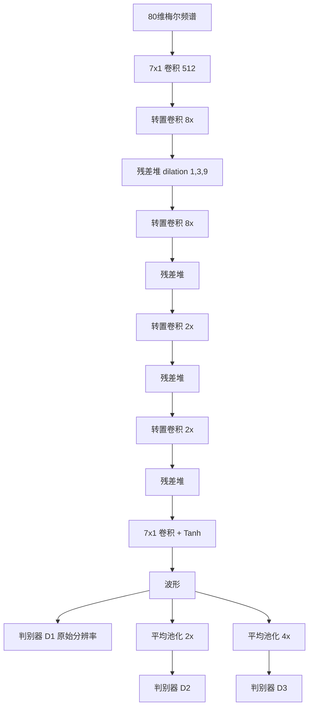

# MelGAN 完整介绍

> 本文系统介绍 MelGAN 的技术背景、对抗训练原理、网络架构、训练与推理流程、版本演进、性能特征、应用场景、跨模型对比及历史影响。

---

## 1. 概述

MelGAN 是 Lyrebird AI 与 Mila / University of Montreal 于 2019 年提出的基于生成对抗网络（GAN）的条件神经声码器。它接收梅尔频谱，用一组全卷积上采样网络一次性把帧级特征展开成原始音频波形。与 WaveNet 不同，MelGAN **不按时间顺序逐点生成采样**；与 WaveGlow 也不同，它不维护可逆流，也不优化精确似然。

MelGAN 的设计可以叙述成三句话：

1. 用非自回归全卷积生成器并行还原波形，参数量和显存都远低于当时的流模型。
2. 用多尺度窗口判别器从不同时间分辨率审视波形，迫使生成器同时照顾局部细节和较长上下文。
3. 用 hinge 对抗损失加特征匹配稳定训练，**不加波形 L1，也不加谱图损失**。

它要同时回应当时三条路线的短板：

| 前代方案 | 主要问题 | MelGAN 的回应 |
|---|---|---|
| WaveNet 等自回归声码器 | 音质高，但逐采样串行，原始推理远慢于实时 | 一次前向生成全部采样点 |
| Parallel WaveNet、ClariNet | 可并行，但需要教师—学生蒸馏 | 单一生成器，无需教师网络 |
| WaveGlow | 可并行且无需蒸馏，但参数多、显存高、训练贵 | 轻量卷积 + 对抗训练，单卡即可训 |

原始论文在 LJ Speech 上报告：未做硬件特化优化的 PyTorch 实现，可在 NVIDIA GTX 1080Ti 上以 2500 kHz 生成波形，在 Intel i9-7920X 单核 CPU 上以 51.9 kHz 生成，分别超过实时约 100 倍和 2 倍。同一套硬件上，它比当时测到的 WaveGlow 大约快一个数量级，参数量约为后者的 $1/20$。主观音质低于充分训练的 WaveNet / WaveGlow，但明显高于 Griffin-Lim，并足以作为两阶段 TTS 的可用后端。

这些数字都依赖特定硬件、采样率和实现，只能说明数量级，不能当作跨平台定额。

今天，原始 MelGAN 已不再是大多数低延迟 TTS 系统的首选声码器。HiFi-GAN、BigVGAN 等后续 GAN 模型通常听感更好、对预测梅尔更稳。MelGAN 的价值主要在于：它验证了**无需蒸馏、无需似然、仅靠对抗目标就能并行生成连贯波形**，并把多尺度判别和特征匹配变成后来整个 GAN 声码器谱系的标准零件。

---

## 2. 技术背景与模型定位

### 2.1 MelGAN 之前的波形生成

2019 年前后，把声学特征还原成波形主要有四类方法。

**参数化声码器。** Griffin-Lim 从线性谱迭代估计相位；WORLD、STRAIGHT 则按源—滤波器模型分别处理基频、谱包络和非周期成分。这类方法计算轻、可控性强，但高频细节和自然度通常有限，合成语音容易发闷或带机械感。

**自回归神经声码器。** WaveNet 直接建模采样点条件分布，音质明显超过传统声码器。代价是生成一秒 16 kHz 音频需要连续预测 16,000 次。MelGAN 论文在同一套 1080Ti 上测到公开 WaveNet 实现只有约 0.08 kHz，远低于实时。

**蒸馏并行化与流模型。** Parallel WaveNet 和 ClariNet 用逆自回归流做学生模型，推理可以并行，但训练要依赖自回归教师。WaveGlow 去掉教师，用可逆流直接优化似然，推理也很快，但 12 组耦合层和可逆 $1\times1$ 卷积使检查点常接近 90M 参数，训练通常需要多卡。

**早期音频 GAN。** WaveGAN 尝试并行生成原始波形，但主要面向短片段、 unconditionally 的音效；GANSynth 在 STFT 幅度和相位上做对抗合成，并不直接输出波形。Yamamoto 等人也曾把对抗损失加进蒸馏式并行 WaveNet，并报告**仅靠对抗损失不足以得到高保真波形**。在 MelGAN 之前，GAN 能否稳定地从梅尔频谱还原连贯语音，仍被普遍怀疑。

MelGAN 选择第四条路，但把目标收窄为条件梅尔反演：不要无条件长音频，不要教师网络，也不要可逆结构，只证明一套足够稳的生成器—判别器组合。

### 2.2 MelGAN 在 TTS 中的位置

MelGAN 本身不是完整的文本转语音系统。它位于两阶段 TTS 的末端：

```text
文本
  ↓
文本前端（规范化、音素、韵律）
  ↓
声学模型（Tacotron 2、FastSpeech、Text2mel 等）
  ↓
梅尔频谱
  ↓
MelGAN 声码器
  ↓
原始音频波形
```

声学模型负责发音、时长和韵律；MelGAN 负责把帧级频谱还原成采样级波形。因此：

- 漏读、复读、停顿异常通常来自上游声学模型，而不是声码器。
- 金属音、电流声、发闷、相位毛刺更常来自声码器，或梅尔特征口径不一致。
- 更换声学模型后，只要梅尔配置一致，理论上可以复用同一套 MelGAN。

原始论文用改进版 char2wav（Text2mel）接 MelGAN，也和 Tacotron 2 + WaveGlow 做过对照。后来更常见的组合是 **FastSpeech / FastSpeech 2 + MelGAN**，以及各类开源 TTS 配方里的轻量后端。FastSpeech 解决的是频谱并行生成，MelGAN 解决的是波形并行生成，二者不在同一层级。

### 2.3 它解决的不是识别问题

MelGAN 是生成模型。评价它应看自然度、保真度、RTF、参数量和训练稳定性，而不是 WER/CER。后续工作把它接到语音转换、增强、编码和歌声合成里，但“流水线末端有一个 MelGAN”不等于“这就是一套转换或增强模型”。真正的内容变换通常发生在梅尔域；声码器只负责把结果听得出来。

---

## 3. 数学原理：条件 GAN 波形生成

### 3.1 从梅尔频谱生成波形

设目标波形为 $\mathbf{x}$，条件为梅尔频谱 $\mathbf{s}$。生成式声码器需要一个可以从中采样的条件映射。MelGAN 不参数化 $p(\mathbf{x}\mid\mathbf{s})$ 的精确密度，而是学习一个前馈生成器：

$$
\hat{\mathbf{x}}=G(\mathbf{s})
$$

论文公式里仍写了可选噪声 $\mathbf{z}$，但实验发现：条件信息已经很强时，再喂一个全局噪声向量，听感几乎没有变化。这与图像条件 GAN 里“强条件可省略噪声”的观察一致。因此实用实现里，推理往往是**确定性前向**，同一段梅尔每次都会得到同一段波形。

```text
训练
真实波形 x, 梅尔 s  ──→  判别器 D  ──→  真 / 假 + 中间特征
生成波形 G(s)      ──↗
                         ↓
                   hinge 对抗损失
                 + 特征匹配损失

推理
梅尔 s  ──→  生成器 G  ──→  波形 x̂
```

因为生成器对所有时间位置同时计算，整段波形可以一次性并行生成，不必等待前一个采样点。

### 3.2 为什么 GAN 比似然更难，也更自由

WaveGlow 通过可逆变换直接最大化 $\log p(\mathbf{x}\mid\mathbf{s})$。目标唯一，训练相对稳，但网络必须可逆，参数和显存都贵。

GAN 放松了这条约束。生成器可以是任意前馈网络，判别器只提供“像不像真波形”的学习度量。代价是：

- 没有可精确计算的似然，无法用 NLL 判断是否过拟合分布；
- 生成器和判别器互相博弈，学习率、更新比例和损失权重都会影响是否模式崩塌；
- 评价必须依靠听感和代理指标，而不是一条标量 loss。

MelGAN 的贡献不是发明 GAN，而是证明：只要判别器看到多个时间尺度，并用特征匹配补上感知约束，这条更自由的路也能走通。

### 3.3 Hinge 对抗损失

MelGAN 使用 hinge 形式的 GAN 目标，而不是原始的交叉熵。对每个尺度的判别器 $D_k$（$k=1,2,3$）：

$$
\min_{D_k}
\mathbb{E}_{\mathbf{x}}
\bigl[\min(0,1-D_k(\mathbf{x}))\bigr]
+
\mathbb{E}_{\mathbf{s}}
\bigl[\min(0,1+D_k(G(\mathbf{s})))\bigr]
$$

生成器则最大化判别器对伪造样本的打分：

$$
\min_{G}
\mathbb{E}_{\mathbf{s}}
\Biggl[
\sum_{k=1}^{3}
-D_k\bigl(G(\mathbf{s})\bigr)
\Biggr]
$$

Hinge 损失给判别器一个间隔：真样本分数应大于 $1$，假样本分数应小于 $-1$。作者也试过 LSGAN，报告 hinge 略好。后续 HiFi-GAN 改回最小二乘对抗损失，说明具体形式可以换，关键仍是多尺度判别加辅助损失。

### 3.4 特征匹配，而不是波形 L1

仅靠对抗信号，生成器容易只骗过判别器的最终标量，不管中间层看到的纹理。MelGAN 因此加入特征匹配损失：让生成波形在每个判别器的每一层特征上，都靠近真实波形。

$$
\mathcal{L}_{\mathrm{FM}}(G,D_k)
=
\mathbb{E}_{\mathbf{x},\mathbf{s}}
\Biggl[
\sum_{i=1}^{T}
\frac{1}{N_i}
\bigl\|
D_k^{(i)}(\mathbf{x})
-
D_k^{(i)}(G(\mathbf{s}))
\bigr\|_1
\Biggr]
$$

其中 $D_k^{(i)}$ 是第 $k$ 个判别器第 $i$ 层的特征图，$N_i$ 是该层单元数。它相当于一种**由判别器学出来的感知损失**。

生成器的最终目标为：

$$
\min_{G}
\Biggl(
\mathbb{E}_{\mathbf{s}}
\Biggl[
\sum_{k=1}^{3}
-D_k\bigl(G(\mathbf{s})\bigr)
\Biggr]
+
\lambda
\sum_{k=1}^{3}
\mathcal{L}_{\mathrm{FM}}(G,D_k)
\Biggr)
$$

论文取 $\lambda=10$。

两件同样重要的“不加”：

- **不加波形空间的 L1。** 作者发现逐点对齐真实波形会引入金属音和高频伪影。梅尔到波形是一对多映射，强迫点对点重合并不合理。
- **不加谱图损失。** 这是原版 MelGAN 的明确主张：对抗加特征匹配已经够用。后续 Multi-band MelGAN 用多分辨率 STFT 损失替换特征匹配，说明这条主张可以被改进，但不能把后验做法写回 2019 年的原模型。

### 3.5 窗口判别为什么能保持连贯

每个判别器不是对整句打一个分，而是对重叠窗口做 Markov 式判断，类似图像里的 PatchGAN。窗口长度等于判别器感受野。损失在这些窗口上平均，生成器就必须让相邻片段在统计上接得住。再叠上三个时间尺度，低频包络和高频细节会分别被不同判别器盯住。

---

## 4. 核心网络架构

### 4.1 总体结构

官方论文中的 MelGAN 由一个全卷积生成器和三个权值不共享、结构相同的判别器组成。



输入梅尔的时间分辨率比波形低 256 倍，因此总上采样因子必须是 256。论文把它拆成 **$8\times 8\times 2\times 2$** 四段，而不是一次拉满。

### 4.2 生成器

附录给出的梅尔反演生成器大致如下：

| 阶段 | 操作 | 通道 |
|---|---|---:|
| 入口 | $7\times1$ 卷积，stride 1 | 512 |
| 上采样 1 | 转置卷积，kernel 16，stride 8 | 256 |
| | 残差堆 | 256 |
| 上采样 2 | 转置卷积，kernel 16，stride 8 | 128 |
| | 残差堆 | 128 |
| 上采样 3 | 转置卷积，kernel 4，stride 2 | 64 |
| | 残差堆 | 64 |
| 上采样 4 | 转置卷积，kernel 4，stride 2 | 32 |
| | 残差堆 | 32 |
| 出口 | $7\times1$ 卷积 + Tanh | 1 |

激活使用 Leaky ReLU。最后一层 Tanh 把波形限制在 $[-1,1]$。

每个残差堆包含三层扩张卷积，dilation 为 $1,3,9$，卷积核宽度为 3，堆叠后的感受野为 27 个当前分辨率时间步。扩张卷积的作用是：让时间上离得较远的输出共享足够重叠的输入，从而诱导长程相关。这和 WaveNet 用扩张卷积覆盖上下文是同一思路，但这里**不需要因果掩码**，因为整段波形一次生成。

论文强调两处容易出伪影的设计：

- **棋盘伪影。** 转置卷积的 kernel 必须是 stride 的整数倍。MelGAN 取 kernel $= 2\times$ stride。扩张卷积的 dilation 也按核宽的幂增长，避免感受野偏斜。
- **归一化。** InstanceNorm 会冲掉音高，听起来发金属声；对生成器做谱归一化也会伤害特征匹配。最终所有层使用**权重归一化**（weight normalization）：只重参数化权重的模长和方向，不标准化激活。

完整模型约 **4.26M** 参数。

### 4.3 多尺度判别器

三个判别器 $D_1,D_2,D_3$ 结构相同：

- $D_1$ 看原始波形；
- $D_2$ 看经核宽 4 的步长平均池化、下采样 2 倍后的波形；
- $D_3$ 再下采样到 4 倍。

下采样后的判别器看不到最高频，因此更偏向低频包络和韵律轮廓；$D_1$ 则更敏感齿音、呼吸和细碎噪声。消融表明：去掉多尺度后，呼吸段容易出现金属音，内部多说话人数据上甚至会跳过某些浊音片段。

单个判别器块是窗口式 1D 卷积网络，使用大核和分组卷积以控制参数：

| 层 | 设置 |
|---|---|
| 入口 | $15\times1$，stride 1，16 通道 |
| 下采样 1–4 | $41\times1$，stride 4，分组卷积，通道逐步升到 1024 |
| 过渡 | $5\times1$，1024 通道 |
| 出口 | $3\times1$，1 通道 |

判别器同样使用权重归一化。窗口式输出使模型可以处理变长音频，这也是它能直接接到任意长度梅尔上的原因。

### 4.4 条件注入与特征口径

MelGAN 的局部条件是 80 维梅尔频谱。论文配置与当时 Tacotron 2 / WaveGlow 常见设置对齐：hop size 256，因此四段上采样正好回到波形网格。

训练和推理必须使用同一套 STFT / Mel / 归一化参数。任何一项不一致，都可能造成失真、金属音或接近静音。MelGAN 论文本身以单说话人 LJ Speech 为主，但也在内部 6 人数据和公开 VCTK 上验证了**未见说话人**的梅尔反演。说话人 ID 不是一等公民；多说话人、情感或风格控制通常由上游声学模型承担。

---

## 5. 训练与推理流程

### 5.1 数据与切片

原始实验的主结果在 LJ Speech：约 24 小时、13,100 条单说话人朗读，采样率 22,050 Hz。未见说话人实验使用 VCTK。端到端 TTS 实验把 MelGAN 接到 Text2mel 预测的梅尔上，而不是只做 oracle 反演。

更一般的数据准备包括：

1. 统一采样率、位深和响度，波形归一化到 $[-1,1]$；
2. 按与推理完全相同的配置提取梅尔频谱；
3. 切除过长静音、削波和异常录音；
4. 保证频谱帧与波形采样点对齐，hop 与上采样倍数一致。

MelGAN 对底噪和特征口径都敏感。录音质量差时，判别器会把噪声也当成“真实分布”的一部分。

### 5.2 训练配置

论文中的基础配置如下：

| 项目 | 配置 |
|---|---|
| GPU | 单卡 NVIDIA RTX 2080Ti 即可 |
| 优化器 | Adam |
| 学习率 | $1\times10^{-4}$ |
| $\beta_1,\beta_2$ | $0.5$，$0.9$ |
| batch size | 16 |
| 特征匹配权重 $\lambda$ | 10 |
| 正则 | 全层权重归一化 |
| 损失 | hinge GAN + 特征匹配 |
| 充分收敛 | 约 250 万步（LJ Speech 反演主实验） |

这是相对 WaveGlow 很便宜的训练路径：不必 8 卡、也不必先训一个 WaveNet 教师。代价是对抗训练需要更仔细地听早期样本。资源不足时，常见做法是：

- 从公开英语检查点做迁移学习；
- 减小片段长度或 batch；
- 先只训生成器若干步，再打开判别器（后续 MB-MelGAN 把这种预训练写成标准流程）。

### 5.3 推理步骤

训练完成后，推理只是一次卷积前向：

1. 按与训练相同的配置提取或接收梅尔频谱；
2. 必要时把动态范围归一化到训练时的口径；
3. 生成器一次输出与梅尔时长对应的整段波形；
4. 把 $[-1,1]$ 的浮点波形写成目标位深。

没有潜变量采样，也没有逆流。短句的“每秒采样数”仍可能下降，因为固定的卷积开销要摊到更短的音频上。Griffin-Lim 和 WaveGlow 也有类似现象。

论文估计，在 GTX 1080Ti 全精度下可达 2500 kHz；CPU 单核约 51.9 kHz。作者认为半精度和量化还能再提速，但原文没有把这些优化写成主结果。

### 5.4 与蒸馏并行模型和流模型的差别

| 步骤 | Parallel WaveNet / ClariNet | WaveGlow | MelGAN |
|---|---|---|---|
| 网络数量 | 教师 + 学生 | 单一可逆流 | 生成器 + 多尺度判别器 |
| 训练目标 | 近似似然 + 复合损失 | 精确似然 | 对抗 + 特征匹配 |
| 推理 | 学生网络并行生成 | 逆流并行生成 | 一次前向 |
| 主要风险 | 蒸馏失败、模式崩塌 | 显存高、可逆结构约束大 | 对抗不稳、高频/金属伪影 |

这是 MelGAN 当时最重要的工程卖点：实现路径短，模型小，CPU 也有机会超过实时。

---

## 6. 技术演进与变体

### 6.1 2019：原始 MelGAN

2019 年 10 月，Kumar 等人发表 NeurIPS 论文，并开放 PyTorch 代码。它证明：不必使用 IAF 和教师模型，也不必使用可逆流，就能在 GPU 上大幅超实时、在 CPU 上超过实时地从梅尔频谱生成可用语音。同一工作还把生成器接到音乐翻译网络和 VQ-VAE 解码器上，说明这套对抗式波形头并不绑定某种特定条件。

### 6.2 效率轴：更快、更小

原始 MelGAN 已经很轻，后续仍继续压计算量。

**Multi-band MelGAN（Yang et al., 2020）。** 生成器输出多个子带，再经合成滤波器还原全带。论文还做了三处全带改进：生成器预训练、用多分辨率 STFT 损失替换特征匹配、加深残差堆以扩大感受野。在约 12 小时中文女声、16 kHz 的协议下：

| 模型 | GFLOPS | 参数量 | CPU RTF | 波形 MOS | TTS MOS |
|---|---:|---:|---:|---:|---:|
| 原版 MelGAN（复现） | 5.85 | 4.27M | 0.20 | $3.98\pm0.04$ | $3.87\pm0.06$ |
| FB-MelGAN | 7.60 | 4.87M | 0.22 | $4.35\pm0.05$ | $4.18\pm0.05$ |
| MB-MelGAN | 0.95 | 1.91M | 0.03 | $4.34\pm0.03$ | $4.22\pm0.04$ |

RTF 在 Intel Xeon E5-2630v3 上测得。多频带在提速的同时，也把“金属音”变成后来反复被讨论的副作用。

**Basis-MelGAN（Liu and Qian, 2021）。** 把波形分解为学到的基及其权重，生成器预测权重而不是逐采样点，计算量较当时的 HiFi-GAN V1 明显下降。

**StyleMelGAN（Mustafa et al., 2020）。** 用时间自适应归一化把低维噪声“风格化”为声学特征，并配合随机窗口判别器，目标是在 CPU/GPU 上都保持多倍实时。

### 6.3 质量与通用性轴

**VocGAN（Yang et al., 2020）。** 多尺度生成器加分层嵌套判别器，针对原版输出与输入梅尔一致性不足的问题。

**Universal MelGAN（Jang et al., 2020）。** 放大生成器通道，并加入多分辨率谱图判别器，缓解大模型在多说话人数据上的高频过平滑。在其韩语多说话人 TTS 协议下 MOS 为 $4.22\pm0.06$，V100 上 RTF 约 0.028；同一表中 FB-MelGAN 为 $3.43\pm0.09$。它用更大模型换跨说话人、情感和语言的稳定性，和 Basis-MelGAN 的压缩方向正好相反。

**Robust MeLGAN（Song et al., 2022）。** 建立在 Multi-band MelGAN 上，专门打金属音和预测谱失配。做法是把语音粗分为周期 / 非周期，只对非周期成分做网络 dropout，并在判别器侧对伪造样本做谐波偏移、谐波噪声和相位噪声增强。在其表达性口语 TTS 协议下，基线 MB-MelGAN 为 $3.19\pm0.11$，加上过平滑处理器后升至 $3.78\pm0.10$。

### 6.4 同期与后续的 GAN 声码器谱系

MelGAN 不是唯一路线，也不应把后面所有 GAN 声码器都叫作“MelGAN 变体”。

**Parallel WaveGAN（Yamamoto et al., 2020）** 几乎同时出现。它用轻量非自回归 WaveNet 作生成器，联合优化多分辨率谱图损失和对抗损失，1.44M 参数，在其日语协议下分析—合成 MOS 约 $4.06$，接 Transformer TTS 约 $4.16$，V100 上约 28.7 倍实时。多分辨率 STFT 损失随后被 MB-MelGAN 吸收。

**HiFi-GAN（Kong et al., 2020）** 保留多尺度判别器，另加多周期判别器（周期取 $2,3,5,7,11$）和多感受野融合生成器，并用梅尔谱损失稳定训练。它不是 MelGAN 的内部版本，而是把“对抗并行声码器”推到当时听感前沿的后续工作。其 LJ Speech 协议下，HiFi-GAN V1 MOS 为 $4.36\pm0.07$，同一表中 MelGAN 为 $3.79\pm0.09$。V1 约 13.92M 参数；更小的 V2 / V3 把体积压到约 1M 量级，并在 CPU 上达到十余倍实时。

**BigVGAN（Lee et al., 2022）** 引入周期激活和抗混叠表示，把 GAN 声码器训练到上亿参数，强调零样本跨说话人和多语言。工业系统此后更常直接选 HiFi-GAN 或 BigVGAN，而不是原版 MelGAN。

```text
2016  WaveNet：证明原始波形可直接建模
2017  Parallel WaveNet / ClariNet：蒸馏换并行
2018  WaveGlow：无蒸馏的可逆流声码器
2019  MelGAN：轻量 GAN 并行声码器
2020  Parallel WaveGAN、Multi-band MelGAN、HiFi-GAN、DiffWave
2021+ 端到端 TTS 与通用 GAN / 扩散声码器成为主流
```

---

## 7. 性能特征与指标解读

### 7.1 常用指标

- **MOS**：听音者对自然度的平均分。受语料、语言、听音人数和评分问题影响，只能在同一测试协议内比较。
- **RTF**：合成耗时 ÷ 音频时长。小于 1 表示快于实时。
- **生成速率（kHz）**：每秒能产出的采样点数。22.05 kHz 音频上，2500 kHz 约等于 113 倍实时；51.9 kHz 约等于 2.4 倍实时。引用时必须写明采样率和硬件。
- **PESQ / STOI / MCD**：客观指标，便于对比增强或编码任务，但不能替代听感。
- **参数量、FLOPs、显存**：反映部署成本。GAN 声码器通常在这三项上轻于流模型。

跨论文的 MOS 不能拼成总榜。原版 MelGAN 在自己的 LJ Speech 反演实验里是 $3.61$；在 Multi-band MelGAN 的中文协议里复现基线是 $3.98$；在 HiFi-GAN 的 LJ Speech 协议里是 $3.79$。三个数字描述的不是同一次听音。

### 7.2 原始论文中的消融

作者在 LJ Speech 上把各组件逐项去掉，训练约 500 个 epoch，用 MOS 看每一项的归纳偏置：

| 配置 | MOS（95% 置信区间） |
|---|---:|
| 使用谱归一化 | $1.33\pm0.07$ |
| 使用波形 L1 | $2.59\pm0.11$ |
| 去掉窗口判别 | $2.29\pm0.10$ |
| 去掉扩张卷积 | $2.60\pm0.10$ |
| 去掉多尺度判别 | $2.93\pm0.11$ |
| 去掉权重归一化 | $3.03\pm0.10$ |
| 完整 MelGAN（未充分收敛） | $3.09\pm0.11$ |

结论比分数本身更重要：谱归一化和波形 L1 会明显毁掉听感；多尺度、扩张卷积和权重归一化都不是可有可无的装饰。

### 7.3 原始论文中的音质

充分训练（约 250 万步）后的 oracle 梅尔反演：

| 模型 | MOS（95% 置信区间） |
|---|---:|
| Griffin-Lim | $1.57\pm0.04$ |
| MelGAN | $3.61\pm0.06$ |
| WaveNet | $4.05\pm0.05$ |
| WaveGlow | $4.11\pm0.05$ |
| 真人录音 | $4.52\pm0.04$ |

更准确的说法是：**在同一套 LJ Speech 协议下，MelGAN 明显强于 Griffin-Lim，但仍低于当时充分训练的 WaveNet 和 WaveGlow**。作者自己也写明，差距有望被后续 GAN 工作补上。一年后的 HiFi-GAN 基本完成了这件事。

VCTK 未见说话人反演：

| 模型 | MOS（95% 置信区间） |
|---|---:|
| Griffin-Lim | $1.72\pm0.07$ |
| MelGAN | $3.49\pm0.09$ |
| 真人录音 | $4.19\pm0.08$ |

这说明 MelGAN 学到的是相对说话人不变的“梅尔 → 波形”映射，而不是把某个说话人的音色背下来。它仍不是声音克隆模型。

端到端 TTS（预测梅尔，不是 oracle 梅尔）：

| 系统 | MOS（95% 置信区间） |
|---|---:|
| Text2mel + Griffin-Lim | $1.43\pm0.04$ |
| Tacotron 2 + WaveGlow | $3.52\pm0.04$ |
| Text2mel + MelGAN | $3.72\pm0.04$ |
| Text2mel + WaveGlow | $4.10\pm0.03$ |
| 真人录音 | $4.46\pm0.04$ |

预测梅尔会把声学模型误差传给声码器。论文里的 MelGAN 没有在预测梅尔上再微调；Tacotron 2 论文中的 WaveNet 则常常需要这一步。比较时要把这个条件写清楚。

### 7.4 原始论文中的速度

同一套硬件（GPU: GTX 1080Ti；CPU: i9-7920X 单核）：

| 模型 | 参数量 | CPU | GPU |
|---|---:|---:|---:|
| WaveNet（Shen et al. 实现） | 24.7M | 0.0627 kHz | 0.0787 kHz |
| ClariNet | 10.0M | 1.96 kHz | 221 kHz |
| WaveGlow | 87.9M | 1.58 kHz | 223 kHz |
| MelGAN | 4.26M | 51.9 kHz | 2500 kHz |

论文据此称 MelGAN 比当时最快的竞品大约快 10 倍（GPU）和 25 倍（CPU）。WaveGlow 自己的论文在 V100 上报告过约 520 kHz，和这张表不是同一设备，不能直接对打。

### 7.5 后续工作中的参考数字

这些数字来自不同论文，不能与上表直接拼榜：

- Multi-band MelGAN 把计算量从 5.85 GFLOPS 降到 0.95 GFLOPS，CPU RTF 从 0.20 降到 0.03，并在其中文 TTS 协议下达到 $4.22\pm0.04$。
- HiFi-GAN 在自己的 LJ Speech 协议下把 MelGAN 基线测成 $3.79\pm0.09$，V1 / V2 / V3 分别为 $4.36$、$4.23$、$4.05$；V3 在 MacBook Pro CPU 上约 13.4 倍实时，V100 上约 1187 倍实时。
- Universal MelGAN 在韩语多说话人 TTS 上为 $4.22\pm0.06$，并在未见说话人、情感和语言集合上明显好于 FB-MelGAN。
- Robust MeLGAN 在表达性口语 TTS 上把 MB-MelGAN 从约 3.2 提到约 3.8，说明金属音主要在预测谱条件下暴露。

引用这些结果时，应同时写出数据集、采样率和是否使用预测梅尔。

---

## 8. 与主流声码器的跨模型对比

### 8.1 与参数化声码器

| 维度 | Griffin-Lim / WORLD | MelGAN |
|---|---|---|
| 建模对象 | 相位迭代或源—滤波器参数 | 条件波形的对抗映射 |
| 音质 | 易机械、发闷，高频易失真 | 明显高于 Griffin-Lim，仍低于后期 GAN |
| 速度 | 很快，CPU 也可跑 | GPU 上极快，CPU 也可超实时 |
| 可控性 | 基频、谱包络可显式调节 | 主要跟随梅尔，少显式声源旋钮 |
| 部署 | 模型几乎为零 | 检查点只有数兆参数 |

需要解释性或极低算力时，WORLD 仍有用。需要自然度时，MelGAN 明显强于 Griffin-Lim。

### 8.2 与 WaveNet

| 维度 | WaveNet | MelGAN |
|---|---|---|
| 生成机制 | 逐采样自回归 | 全卷积一次生成 |
| 卷积 | 因果扩张卷积 | 非因果扩张残差堆 |
| 训练 | 交叉熵或混合分布似然 | 对抗 + 特征匹配 |
| 推理并行 | 低 | 高 |
| 论文对比速度（1080Ti） | 0.08 kHz | 2500 kHz |
| 实现复杂度 | 推理要缓存或定制内核 | 训练要盯对抗，推理图很直 |

MelGAN 没有在音质上超过 WaveNet，但把推理从“无法实时”推进到“CPU 也可超实时”，并且省掉了蒸馏。

### 8.3 与 WaveGlow

| 维度 | WaveGlow | MelGAN |
|---|---|---|
| 训练 | 最大似然，较稳定 | 对抗训练，需调参 |
| 音质（MelGAN 论文，LJ 反演） | $4.11\pm0.05$ | $3.61\pm0.06$ |
| 速度（MelGAN 论文，1080Ti） | 223 kHz | 2500 kHz |
| 模型体积 | 87.9M | 4.26M |
| 显存 | 高 | 低 |
| 主要短板 | 资源占用、可逆约束 | 当时听感偏低、高频伪影 |

综合看，WaveGlow 赢在训练目标和 2019 年的绝对听感，MelGAN 赢在部署成本。2020 年之后，若没有“必须用似然流模型”的理由，新系统很少再在二者之间犹豫，而是直接看 HiFi-GAN。

这与仓库中 [WaveGlow完整介绍.md](WaveGlow完整介绍.md) 的判断一致：GAN 声码器通常更小、更快、更省显存。

### 8.4 与 HiFi-GAN 和扩散声码器

| 维度 | MelGAN | HiFi-GAN | DiffWave |
|---|---|---|---|
| 判别 / 生成机制 | 多尺度判别 | 多尺度 + 多周期判别 | 多步去噪 |
| 辅助损失 | 特征匹配 | 特征匹配 + 梅尔谱损失 | 噪声预测 |
| 音质 | 早期 GAN 可用水平 | 多数现代评测更高 | 通常很高，但看采样步数 |
| 速度 | 极快 | 通常同样极快 | 多步采样，默认更慢 |
| 今日定位 | 轻量基线 / 教学模型 | 两阶段 TTS 常见默认 | 高音质离线或加速变体 |

HiFi-GAN 论文在同一协议下把 MelGAN 和 WaveNet、WaveGlow 放在一张表里，结论很清楚：到 2020 年底，GAN 已经不必再为“快但明显更差”辩护。DiffWave 等扩散声码器把上限再往后推，但默认多步采样不适合低延迟交互；后来的一致性模型和一步扩散，走的仍是“把慢而稳的生成器蒸馏成快模型”的老问题。

### 8.5 和声学模型、端到端系统的关系

这些名字不在同一层级，不宜平铺对比：

- **Tacotron 2 / FastSpeech 2**：声学模型，输出梅尔频谱，常接 MelGAN、WaveGlow 或 HiFi-GAN。
- **VITS**：把对齐、潜变量和波形生成并进一个端到端模型，内部的对抗解码器更接近 HiFi-GAN，而不是单独部署 MelGAN。
- **MelGAN-VC**：谱图域转换模型，名字里有 MelGAN，但主任务是音色转换，不是声码器本身。

---

## 9. 应用场景

### 9.1 两阶段 TTS 的后端声码器

这是本职工作。典型用法是：

- 研究或演示：Tacotron 2 / Text2mel 预测梅尔，MelGAN 还原波形；
- 需要稳定对齐的生产研究栈：FastSpeech 2 + MelGAN 或 MB-MelGAN；
- 资源受限的 CPU 演示：原版或 Multi-band 变体。

适合对延迟和体积敏感、可以接受略低于 HiFi-GAN 听感的场景。不适合把 2019 年的原版当成当前最高音质引擎。

声码器音质高度依赖上游谱预测。预测谱过平滑时，原版 MelGAN 更容易出现抖动和金属音；这正是 MB-MelGAN、Universal MelGAN 和 Robust MeLGAN 要补的短板。

### 9.2 语音转换

在这些任务里，MelGAN 仍然只做“频谱 → 波形”。真正的音色转换发生在梅尔域：

```text
源语音
  ↓
提取梅尔频谱
  ↓
谱图域转换（CycleGAN、MelGAN-VC、说话人嵌入等）
  ↓
MelGAN
  ↓
目标波形
```

MelGAN-VC（Pasini, 2019）在谱图上做非平行域转换，再还原波形，并声称可处理任意长度，也可迁到音乐风格迁移。VCC 参赛系统和低资源儿童语音合成里，也常见“转换模型 + MelGAN”的拼装。转换语音的自然度和说话人相似度仍然很难同时保证；这主要是转换器的问题，不是声码器单独能解决的。

### 9.3 语音增强、耳语重建与辅助沟通

SE-MelGAN 几乎不改原结构，把带噪或退化条件映射回干净波形。耳语到正常语音的工作则先在特征域补上缺失的谐波结构，再交给 MelGAN 或 HiFi-GAN 出声。这类系统有时报告 MOS 和下游 ASR WER 同时改善，但数字不能和 TTS 听音混用：输入已经不是标准朗读梅尔。

阅读障碍辅助发音、喉切除或无声接口等应用，同样是“前端特征模型 + 神经声码器”。MelGAN 的价值是 CPU 上也能立刻出声，从而形成反馈环；它并不自动理解儿童发音或病理语音。

### 9.4 低码率编码与歌声

把 StyleMelGAN 改成流式解码器后，已有工作在约 1.6 kbit/s 下重建宽带语音，并进一步发展为端到端神经编码器（NESC）。编码端只传紧凑特征，解码端用对抗生成补全波形。

歌声合成对长时值和高频更苛刻。Multi-Singer、SingGAN 等把多频带生成器和对抗训练接到多歌手数据上。原版 MelGAN 可以直接当基线，但很少是最终方案。

### 9.5 评测基线

由于开源早、体积小、推理快，MelGAN 长期出现在声码器对比表中。新模型常常报告相对 MelGAN 的 MOS、RTF 和参数量。作为基线时应注意：对比的是 2019 年的第一代 GAN 声码器，不是 2024 年的最佳生产模型。

---

## 10. 工程实践与优化建议

### 10.1 何时仍适合使用 MelGAN

可以优先考虑的情况：

- 需要一个结构简单、单卡可训、CPU 也能超实时的教学或演示后端；
- 已有公开检查点，只做中等规模微调；
- 端侧或嵌入式对参数量和 FLOPs 极敏感，可以接受 MB-MelGAN 一类的听感；
- 要复现 2019–2020 年的两阶段 TTS 论文；
- 需要一个被广泛引用的 GAN 声码器基线。

若目标是当前云端高并发高音质 TTS，应先评估 HiFi-GAN、BigVGAN 或端到端系统。

### 10.2 特征口径

这是落地时最常见的失败点。必须锁定：

- 采样率；
- FFT / win / hop；
- 梅尔下限、上限和 bin 数；
- 幅度是幅度谱、功率谱还是对数梅尔；
- 是否做预加重、响度归一和静音裁剪。

hop 必须和上采样倍数一致。官方生成器按 256 倍设计；换成 12.5 ms 帧移或 24 kHz 配置时，要改转置卷积的 stride，而不是强行插值一段对不齐的梅尔。

声学模型若在另一套脚本里提特征，即使“都是 80 维梅尔”，也可能完全不能用。正确做法是让声学模型和声码器共用同一套特征函数。

### 10.3 训练与微调

- 从公开检查点开始，通常比随机初始化便宜。
- 先听 oracle 梅尔，再听预测梅尔。只在真实谱上收敛、到 TTS 就金属音，是预期现象，不是实现写错。
- 对抗训练要同时看生成器和判别器的损失，而不是只看一个标量下降。判别器过强时，生成器梯度会碎。
- 不要加波形 L1 来“加快收敛”。原论文消融已经说明它会引入金属音。
- 若必须提高稳定性，优先考虑后验已验证的辅助项：多分辨率 STFT、梅尔谱损失，或生成器预训练。
- 用预测梅尔做联合微调或微调声码器，比继续在 oracle 梅尔上堆步数更有效。

### 10.4 推理与部署

- 优先整句或分句 batch 前向，不要按采样点循环。
- 原版在普通 CPU 上就有机会超过实时；先测 RTF，再决定要不要上 GPU。
- 长文本应在声学模型侧分句，再逐句合成波形。
- 在线服务按音频时长而不是请求个数分配 batch 权重。
- INT8 / TensorRT 可以再压延迟，但要抽听量化后的齿音和呼吸，GAN 声码器对相位伪影敏感。

### 10.5 常见问题

| 现象 | 常见原因 | 排查方向 |
|---|---|---|
| 金属音、谐波摩擦 | InstanceNorm、波形 L1、多频带伪影，或预测谱过平滑 | 改回权重归一化；去掉波形 L1；对预测梅尔微调；考虑 Robust / HiFi-GAN |
| 高频嘶声、棋盘纹 | 转置卷积 kernel 与 stride 不匹配 | 保持 kernel $= 2\times$ stride |
| 爆音、直流或接近静音 | 训练/推理梅尔参数不一致 | 逐项核对 FFT、hop、归一化 |
| 发闷、齿音含糊 | hop 或上采样倍数错误，或动态范围被压扁 | 检查 256 倍对齐和特征缩放 |
| 节奏漂移 | 声学模型时长错误，或帧移不一致 | 先听 oracle 梅尔，再查前端 |
| 训练损失震荡、模式崩塌 | 判别器过强或过弱 | 调学习率、更新频率，加 STFT / 梅尔损失 |
| oracle 好听、TTS 难听 | 只拟合了真实谱 | 用预测梅尔微调声码器 |
| 男声发虚、F0 不稳 | 训练数据偏女声或高 F0 | 增加低 F0 数据，或换通用声码器 |

---

## 11. 优势、局限与选型建议

### 11.1 核心优势

1. **并行生成**：从原理上取消逐采样依赖，GPU 和 CPU 都能吃满卷积。
2. **模型很小**：约 4.26M 参数，检查点远轻于 WaveGlow。
3. **训练门槛低**：单卡、无需教师、无需可逆中间量。
4. **条件接口简单**：只吃梅尔频谱，容易接不同声学模型。
5. **范式清楚**：多尺度判别和特征匹配被整个 GAN 声码器谱系继承。

### 11.2 主要局限

1. **2019 年的听感上限低于 WaveNet / WaveGlow**：原论文自己的 LJ 反演表已经写明。
2. **对预测梅尔敏感**：TTS 场景比 oracle 反演更容易出现抖动和金属音。
3. **对抗训练不如似然稳定**：需要听音和调损失，不能只看 NLL。
4. **原版没有显式周期建模**：元音谐波结构弱于后来的多周期判别器。
5. **综合成本已被后续模型超过**：同样音质目标下，HiFi-GAN 通常是更好的默认值。
6. **确定性生成缺少多样本**：同一梅尔没有随机相位或风格抽签。

### 11.3 场景选型

| 目标场景 | 优先方案 | 理由 |
|---|---|---|
| 复现 2019–2020 年两阶段 TTS | Tacotron 2 / FastSpeech + MelGAN | 文献和检查点最多 |
| CPU 或嵌入式实时合成 | MB-MelGAN、HiFi-GAN V3 | 更小的 FLOPs 或经过裁剪的生成器 |
| 云端高并发高音质 | HiFi-GAN、BigVGAN | 听感更好，速度仍然很快 |
| 需要稳定似然的声码器研究 | WaveGlow / WaveFlow | 目标可精确计算 |
| 预测谱失配、表达性语音 | Robust MeLGAN、HiFi-GAN | 原版金属音更明显 |
| 端到端统一训练 | VITS 或后续 S2S 模型 | 不再单独部署声码器 |
| 语音增强 / 转换研究 | 前端特征模型 + 任意神经声码器 | MelGAN 只负责波形还原 |

### 11.4 不应混淆的几个结论

- MelGAN 很快，是相对 2018–2019 年的自回归 WaveNet 和大型流模型而言；相对 2020 年后的 HiFi-GAN V3，它并不自动更快。
- 原论文 MOS 低于 WaveGlow，不等于 GAN 路线注定更差；一年后的 HiFi-GAN 已经反向超越。
- 能接到多说话人声学模型，不等于自己具备零样本克隆能力。
- 开源框架里还能找到 MelGAN，不等于新业务应该默认选它。
- HiFi-GAN、VocGAN、MelGAN-VC 都借用了 MelGAN 的零件或名字，不要把它们都叫作 MelGAN。
- “仅靠对抗损失即可训练”是 2019 年的研究主张，不是今天的最佳工程实践。后来的谱图损失和梅尔损失已经被反复证明有用。

---

## 12. 历史影响与未来方向

MelGAN 的历史位置可以放在一句话里：它是**第一套被广泛承认的、无需蒸馏也能稳定工作的 GAN 并行声码器**。

具体影响有四层。

1. **把条件 GAN 从“音频上很难用”变成默认工具箱。** 多尺度窗口判别、特征匹配、权重归一化和谨慎的转置卷积，成为后续工作的共同起点。
2. **压低并行声码器的部署门槛。** 单卡训练、数兆参数、CPU 超实时，使实验室和开源社区都能把神经声码器接到 FastSpeech 一类声学模型上，而不必先准备 8 卡和 WaveGlow 检查点。
3. **把争论从“GAN 能不能出波形”推进到“损失和判别器怎么设计”。** Parallel WaveGAN 的谱图损失、HiFi-GAN 的多周期判别、Universal / Robust 路线的通用性和金属音治理，都是在 MelGAN 打开的问题里继续挖。
4. **暴露了纯对抗目标的上限。** 高频细节、预测谱失配和跨域稳定性，单靠特征匹配不够。后来的模型几乎都重新引入某种谱图约束。

后续研究很少再把“再做一个原版 MelGAN”当作主线，而是把零件拆开使用：

- 判别器结构（多尺度、多周期、谱图判别）；
- 生成器上采样（多频带、基分解、iSTFT 头、抗混叠）；
- 损失组合（STFT、梅尔谱、特征匹配、对抗）；
- 与端到端 TTS 的联合训练（VITS 及后续模型）。

对工程系统而言，更现实的方向是：把 MelGAN 留在需要轻量基线或复现经典流水线的位置，把增量业务放到 HiFi-GAN、BigVGAN 或端到端模型上。仍值得做的研究，是低算力设备上的实时合成、预测谱条件下的稳健性，以及把声码器嵌进转换 / 增强流水线时的端到端收益——这些空白在现有文献里仍然清楚。

---

## 13. 总结

MelGAN 用对抗训练把梅尔频谱条件生成从“逐点猜测下一个采样”或“可逆地展开整段波形”改成“一次卷积前向”。它用多尺度判别器补上不同时间尺度的评判，用特征匹配补上可学习的感知约束，并用权重归一化和扩张残差堆避免最常见的金属音和棋盘伪影。在 2019 年，这是体积、速度和可复现性之间一次非常干净的折中。

它的上限同样清楚。原版听感低于当时最好的自回归和流模型；纯对抗目标在预测梅尔和高频非周期成分上不够稳。当 HiFi-GAN 用更自由的生成器和更有针对性的判别器达到更高听感、并保持同样量级的速度时，MelGAN 作为生产默认方案的理由就变弱了。

因此，今天阅读 MelGAN，重点不应是“还要不要上线 2019 年的原版”，而是理解三件事：并行声码器为什么必须取消时间串行依赖；对抗训练怎样用判别器代替精确似然；以及后来的谱图损失、多周期判别和端到端系统分别补上了哪一条短板。把这三点看清，再看 WaveGlow、HiFi-GAN、VITS 和现代语音大模型，脉络会清楚得多。

---

## 参考资料

1. Kumar, K. et al. [MelGAN: Generative Adversarial Networks for Conditional Waveform Synthesis](https://arxiv.org/abs/1910.06711), NeurIPS 2019.
2. Official implementation. [descriptinc/melgan-neurips](https://github.com/descriptinc/melgan-neurips).
3. van den Oord, A. et al. [WaveNet: A Generative Model for Raw Audio](https://arxiv.org/abs/1609.03499), 2016.
4. van den Oord, A. et al. [Parallel WaveNet: Fast High-Fidelity Speech Synthesis](https://proceedings.mlr.press/v80/oord18a.html), ICML 2018.
5. Ping, W., Peng, K., Chen, J. [ClariNet: Parallel Wave Generation in End-to-End Text-to-Speech](https://arxiv.org/abs/1807.07281), 2018.
6. Prenger, R., Valle, R., Catanzaro, B. [WaveGlow: A Flow-based Generative Network for Speech Synthesis](https://arxiv.org/abs/1811.00002), 2018.
7. Shen, J. et al. [Natural TTS Synthesis by Conditioning WaveNet on Mel Spectrogram Predictions](https://arxiv.org/abs/1712.05884), 2017.
8. Goodfellow, I. et al. [Generative Adversarial Nets](https://arxiv.org/abs/1406.2661), NeurIPS 2014.
9. Larsen, A. B. L. et al. [Autoencoding beyond pixels using a learned similarity metric](https://arxiv.org/abs/1512.09300), 2016.
10. Salimans, T., Kingma, D. P. [Weight Normalization: A Simple Reparameterization to Accelerate Training of Deep Neural Networks](https://arxiv.org/abs/1602.07868), 2016.
11. Donahue, C., McAuley, J., Puckette, M. [Adversarial Audio Synthesis](https://arxiv.org/abs/1802.04208), ICLR 2019.
12. Engel, J. et al. [GANSynth: Adversarial Neural Audio Synthesis](https://arxiv.org/abs/1902.08710), ICLR 2019.
13. Yang, G. et al. [Multi-band MelGAN: Faster Waveform Generation for High-Quality Text-to-Speech](https://arxiv.org/abs/2005.05106), 2020.
14. Yamamoto, R., Song, E., Kim, J.-M. [Parallel WaveGAN: A Fast Waveform Generation Model Based on Generative Adversarial Networks with Multi-Resolution Spectrogram](https://arxiv.org/abs/1910.11480), ICASSP 2020.
15. Kong, J., Kim, J., Bae, J. [HiFi-GAN: Generative Adversarial Networks for Efficient and High Fidelity Speech Synthesis](https://arxiv.org/abs/2010.05646), NeurIPS 2020.
16. Yang, J. et al. [VocGAN: A High-Fidelity Real-time Vocoder with a Hierarchically-nested Adversarial Network](https://arxiv.org/abs/2007.15256), Interspeech 2020.
17. Jang, W., Lim, D., Yoon, J. [Universal MelGAN: A Robust Neural Vocoder for High-Fidelity Waveform Generation in Multiple Domains](https://arxiv.org/abs/2011.09631), 2020.
18. Mustafa, A., Pia, N., Fuchs, G. [StyleMelGAN: An Efficient High-fidelity Adversarial Vocoder with Temporal Adaptive Normalization](https://arxiv.org/abs/2011.01557), 2020.
19. Liu, Z., Qian, Y. [Basis-MelGAN: Efficient Neural Vocoder Based on Audio Decomposition](https://arxiv.org/abs/2106.13419), 2021.
20. Song, K. et al. [Robust MeLGAN: A Robust Universal Neural Vocoder for High-Fidelity TTS](https://arxiv.org/abs/2210.17349), ISCSLP 2022.
21. Lee, S. et al. [BigVGAN: A Universal Neural Vocoder with Large-Scale Training](https://arxiv.org/abs/2206.04658), 2022.
22. Kong, Z. et al. [DiffWave: A Versatile Diffusion Model for Audio Synthesis](https://arxiv.org/abs/2009.09761), ICLR 2021.
23. Pasini, M. [MelGAN-VC: Voice Conversion and Audio Style Transfer on Arbitrarily Long Samples Using Spectrograms](https://arxiv.org/abs/1910.03713), 2019.
24. Chkhetiani, L., Bezhanidze, L. [SE-MelGAN - Speaker Agnostic Rapid Speech Enhancement](https://arxiv.org/abs/2006.07637), 2020.
25. Mustafa, A. et al. [A Streamwise GAN Vocoder for Wideband Speech Coding at Very Low Bit Rate](https://arxiv.org/abs/2108.04051), WASPAA 2021.
26. Pia, N. et al. [NESC: Robust Neural End-2-End Speech Coding with GANs](https://arxiv.org/abs/2207.03282), 2022.
27. Huang, R. et al. [Multi-Singer: Fast Multi-Singer Singing Voice Vocoder with A Large-Scale Corpus](https://arxiv.org/abs/2112.10358), ACM MM 2022.
28. Huang, R. et al. [SingGAN: Generative Adversarial Network For High-Fidelity Singing Voice Generation](https://arxiv.org/abs/2110.07468), ACM MM 2022.
29. Kim, J., Kong, J., Son, J. [Conditional Variational Autoencoder with Adversarial Learning for End-to-End Text-to-Speech](https://arxiv.org/abs/2106.06103), 2021.
30. Ren, Y. et al. [FastSpeech: Fast, Robust and Controllable Text to Speech](https://arxiv.org/abs/1905.09263), NeurIPS 2019.
31. Albadawy, E. A. et al. [VocBench: A Neural Vocoder Benchmark for Speech Synthesis](https://arxiv.org/abs/2110.12941), Interspeech 2021.
32. Govalkar, P. et al. [A Comparison of Recent Neural Vocoders for Speech Signal Reconstruction](https://isca-speech.org/archive/pdfs/ssw_2019/govalkar19_ssw.pdf), SSW 2019.
33. Tan, X. et al. [A Survey on Neural Speech Synthesis](https://arxiv.org/abs/2106.15561), 2021.
