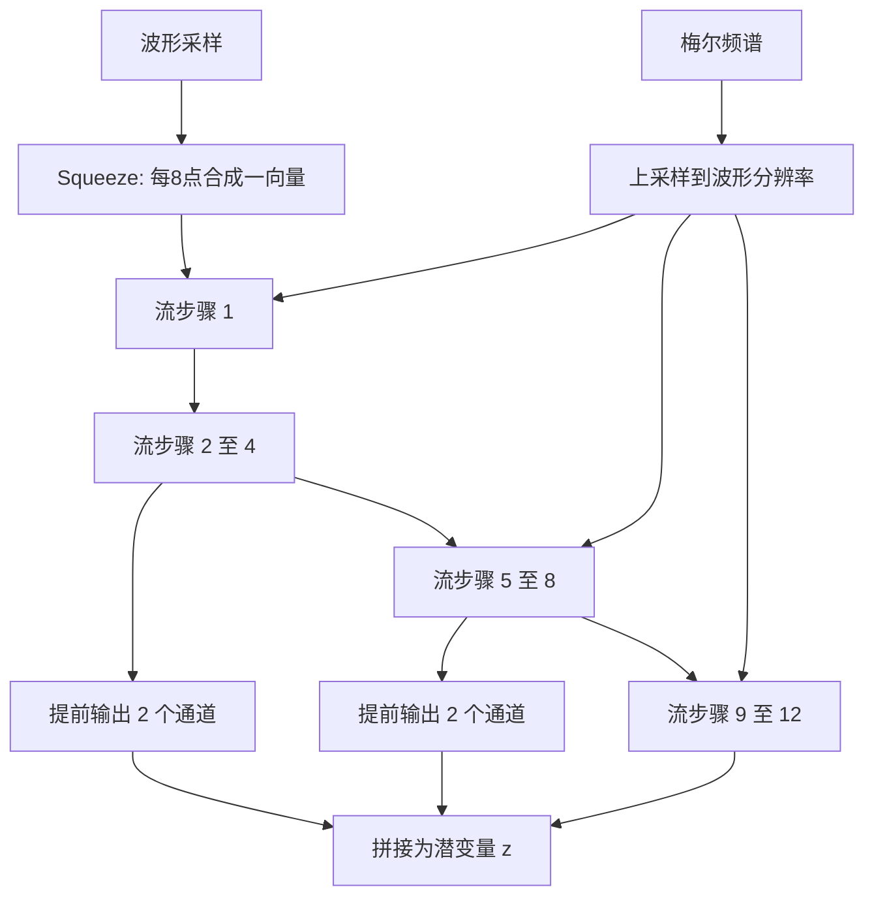

# WaveGlow 完整介绍

> 本文系统介绍 WaveGlow 的技术背景、归一化流原理、网络架构、训练与推理流程、版本演进、性能特征、应用场景、跨模型对比及历史影响。

---

## 1. 概述

WaveGlow 是 NVIDIA 于 2018 年提出的基于归一化流（normalizing flow）的条件神经声码器。它接收梅尔频谱，通过一组可逆变换把高斯噪声映射为原始音频波形。与 WaveNet 不同，WaveGlow **不按时间顺序逐点生成采样**，整段波形可以在 GPU 上并行算出。

WaveGlow 的设计可以概括为两句话：

1. 用 Glow 的可逆流保证变换可逆，从而直接优化数据似然，不必蒸馏，也不必对抗训练。
2. 用 WaveNet 风格的扩张卷积耦合网络，在可逆约束下保留对语音细节的建模能力。

它要同时回应当时两条主流路线的短板：

| 前代方案 | 主要问题 | WaveGlow 的回应 |
|---|---|---|
| WaveNet 等自回归声码器 | 音质高，但逐采样串行，原始推理远慢于实时 | 用可逆流一次生成全部采样点 |
| Parallel WaveNet、ClariNet | 可并行，但需要教师—学生蒸馏和复合损失 | 单一网络、单一似然损失 |

原始论文在 LJ Speech 上报告：未优化的 PyTorch 实现可在 NVIDIA V100 上以约 520 kHz 生成波形，主观音质与当时公开的 WaveNet 实现相当。后续混合精度实现把速度进一步提高到约 55 倍实时。这些数字都依赖特定硬件和实现，只能说明数量级，不能当作跨平台定额。

今天，WaveGlow 已不再是大多数低延迟 TTS 系统的首选声码器。HiFi-GAN 等 GAN 声码器通常更小、更快、更省显存。WaveGlow 的价值主要在于：它验证了**无需蒸馏的并行神经声码器**可行，并提供了一个训练稳定、概率目标清晰的经典基线。

---

## 2. 技术背景与模型定位

### 2.1 WaveGlow 之前的波形生成

2018 年前后，把声学特征还原成波形主要有三类方法。

**参数化声码器。** Griffin-Lim 从频谱迭代估计相位；WORLD、STRAIGHT 则按源—滤波器模型分别处理基频、谱包络和非周期成分。这类方法计算轻、可控性强，但高频细节和自然度通常有限。

**自回归神经声码器。** WaveNet 直接建模采样点条件分布，音质明显超过传统声码器。代价是生成一秒 16 kHz 音频需要连续预测 16,000 次。原始论文对比的公开 WaveNet 实现在当时硬件上只有约 0.11 kHz，远低于实时。

**蒸馏并行化。** Parallel WaveNet 和 ClariNet 用逆自回归流（IAF）做学生模型，推理可以并行，但训练要依赖自回归教师，并使用复合损失抑制模式崩塌。实现和复现成本都明显高于单一似然模型。

WaveGlow 选择第三条路的目标，但去掉教师网络：约束网络可逆，从而把“从噪声生成波形”和“从波形计算似然”变成同一组变换的正反方向。

### 2.2 WaveGlow 在 TTS 中的位置

WaveGlow 本身不是完整的文本转语音系统。它位于两阶段 TTS 的末端：

```text
文本
  ↓
文本前端（规范化、音素、韵律）
  ↓
声学模型（Tacotron 2、Flowtron、FastSpeech 2 等）
  ↓
梅尔频谱
  ↓
WaveGlow 声码器
  ↓
原始音频波形
```

声学模型负责发音、时长和韵律；WaveGlow 负责把帧级频谱还原成采样级波形。因此：

- 漏读、复读、停顿异常通常来自上游声学模型，而不是声码器。
- 爆音、电流声、发闷、相位毛刺更常来自声码器或梅尔特征口径不一致。
- 更换声学模型后，只要梅尔配置一致，理论上可以复用同一套 WaveGlow。

最常见的组合是 **Tacotron 2 + WaveGlow**。NVIDIA 后来也把它和 Flowtron、FastPitch、FastSpeech 2 一起放进 NeMo 等工具链。Flowtron 与 WaveGlow 同属流模型家族，风格控制更细；FastSpeech 2 则提供非自回归频谱，再交给 WaveGlow 出波形。

### 2.3 它解决的不是识别问题

WaveGlow 是生成模型。评价它应看自然度、保真度、RTF、显存和训练稳定性，而不是 WER/CER。扩张卷积后来被增强、转换、编码等任务借用，但“网络里有 WaveNet 式模块”不等于“这就是一套 ASR 模型”。

---

## 3. 数学原理：可逆归一化流

### 3.1 从简单分布生成复杂波形

设目标波形为 $\mathbf{x}$，条件为梅尔频谱 $\mathbf{c}$。生成式声码器需要一个可以从中采样的条件分布 $p_\theta(\mathbf{x}\mid\mathbf{c})$。

WaveGlow 不直接参数化这个复杂分布，而是先从标准高斯采样潜变量，再经过一串可逆变换：

$$
\mathbf{z}\sim\mathcal{N}(\mathbf{0},\mathbf{I})
$$

$$
\mathbf{x}=f_0\circ f_1\circ\cdots\circ f_k(\mathbf{z};\mathbf{c})
$$

训练时走相反方向：把真实波形映回潜空间，并最大化 $\mathbf{x}$ 的对数似然。

```text
训练（正向，数据 → 潜变量）
波形 x, 梅尔 c  ──→  可逆流 f^{-1}  ──→  高斯潜变量 z
                                            ↓
                                      最大化 log p(x|c)

推理（反向，潜变量 → 数据）
高斯噪声 z, 梅尔 c  ──→  可逆流 f  ──→  波形 x
```

因为每一步都可逆，整段波形可以一次性并行生成，不必等待前一个采样点。

### 3.2 变量替换与 Jacobian

任意可逆映射的密度可由变量替换公式写出：

$$
\log p_\theta(\mathbf{x}\mid\mathbf{c})
=
\log p_\theta(\mathbf{z}\mid\mathbf{c})
+
\sum_{i=1}^{k}
\log\bigl|\det J(f_i^{-1}(\mathbf{x};\mathbf{c}))\bigr|
$$

其中 $\mathbf{z}=f_k^{-1}\circ\cdots\circ f_0^{-1}(\mathbf{x};\mathbf{c})$，$J$ 是该层的 Jacobian。

两项的含义不同：

- **高斯对数似然** 惩罚潜变量的 $\ell_2$ 范数，迫使变换后的 $\mathbf{z}$ 接近球形高斯。
- **对数 Jacobian 行列式** 奖励变换对体积的扩张，并阻止网络把 $\mathbf{x}$ 乘成接近零来“骗过”高斯项。

如果网络不可逆，Jacobian 行列式无法稳定计算，似然也就无法直接优化。这就是 WaveGlow 必须使用耦合层和可逆 $1\times1$ 卷积的原因。

### 3.3 仿射耦合层为什么可逆

直接让任意深度网络可逆很难。仿射耦合把输入沿通道拆成两半，只变换其中一半：

$$
\mathbf{x}_a,\mathbf{x}_b=\operatorname{split}(\mathbf{x})
$$

$$
(\log\mathbf{s},\mathbf{t})=\operatorname{WN}(\mathbf{x}_a,\mathbf{c})
$$

$$
\mathbf{x}_b'=\mathbf{s}\odot\mathbf{x}_b+\mathbf{t}
$$

$$
f_{\text{coupling}}^{-1}(\mathbf{x})=\operatorname{concat}(\mathbf{x}_a,\mathbf{x}_b')
$$

$\operatorname{WN}(\cdot)$ 不必可逆，因为它的输入 $\mathbf{x}_a$ 原样传到输出。反向时先用同一半通道重算 $\mathbf{s}$ 和 $\mathbf{t}$，再做：

$$
\mathbf{x}_b=\frac{\mathbf{x}_b'-\mathbf{t}}{\mathbf{s}}
$$

该层的体积变化只来自缩放系数，因此：

$$
\log\bigl|\det J(f_{\text{coupling}}^{-1}(\mathbf{x}))\bigr|=\log|\mathbf{s}|
$$

计算成本是逐元素求和，不必对完整 Jacobian 矩阵求行列式。

### 3.4 可逆 $1\times1$ 卷积

如果通道分组固定不变，同一半通道永远不能直接交互。Glow 的做法是在每个耦合层前插入可逆 $1\times1$ 卷积，混合通道：

$$
f_{\text{conv}}^{-1}(\mathbf{x})=\mathbf{W}\mathbf{x}
$$

$$
\log\bigl|\det J(f_{\text{conv}}^{-1}(\mathbf{x}))\bigr|=\log|\det\mathbf{W}|
$$

$\mathbf{W}$ 初始化为正交矩阵，从而保证起步时可逆。对数行列式会进入损失函数，训练中也会抑制 $\mathbf{W}$ 退化成奇异矩阵。

### 3.5 最终训练目标

把各层贡献加在一起，WaveGlow 的对数似然为：

$$
\log p_\theta(\mathbf{x}\mid\mathbf{c})
=
-\frac{\mathbf{z}(\mathbf{x})^{\mathsf{T}}\mathbf{z}(\mathbf{x})}{2\sigma^{2}}
+
\sum_j\log\mathbf{s}_j(\mathbf{x},\mathbf{c})
+
\sum_k\log|\det\mathbf{W}_k|
$$

第一项来自球形高斯，后两项分别来自仿射耦合和 $1\times1$ 卷积。整个模型只有这一个目标，不需要感知损失、对抗损失或教师蒸馏。

论文训练时取 $\sigma=\sqrt{0.5}$；推理时从标准差为 $0.6$ 的高斯采样 $\mathbf{z}$。略小于训练假设的采样方差，往往能减少偶然噪声、提高听感。这与 Glow 等似然模型的常见做法一致。

---

## 4. 核心网络架构

### 4.1 总体结构

官方论文中的 WaveGlow 由 12 个流步骤堆叠而成。每个步骤包含：可逆 $1\times1$ 卷积 + 仿射耦合层。耦合网络 $\operatorname{WN}$ 是非因果的 WaveNet 风格模块。



原始论文和官方实现使用 **12 个耦合层和 12 个可逆 $1\times1$ 卷积**。

### 4.2 Squeeze

原始波形是一维时间序列。Squeeze 把相邻 8 个采样点排成一个 8 维向量，相当于把时间轴变短、通道轴变宽。这样做有两个作用：

- 让后续 $1\times1$ 卷积和通道分割有足够的通道可混合；
- 降低序列长度，使扩张卷积能以更低成本覆盖局部波形结构。

与 Glow 的多尺度结构不同，WaveGlow 在提前输出通道时不再做第二次 squeeze，因此越往后向量越“短”，但时间网格本身不再二次压缩。

### 4.3 一个流步骤

每个流步骤的数据路径是：

```text
输入向量
  ↓
可逆 1×1 卷积（混合通道）
  ↓
沿通道一分为二：x_a | x_b
  ↓
WN(x_a, 上采样梅尔) → (log s, t)
  ↓
x_b' = s ⊙ x_b + t
  ↓
拼接 (x_a, x_b')
```

$\operatorname{WN}$ 使用 8 层扩张卷积，卷积核宽度为 3，**不是因果卷积**。因为流模型一次看到整段波形，不必像 WaveNet 那样禁止看未来。模块内部仍保留：

- 门控 $\tanh$ 激活；
- 残差连接，通道数 512；
- 跳跃连接，通道数 256；
- 在每层门控非线性之前加入上采样后的梅尔频谱。

梅尔条件只进入耦合网络，不破坏可逆性。

### 4.4 提前输出

并非所有通道都要走完 12 层。论文在每 4 个耦合层后提前输出 2 个通道，把它们直接送入最终的 $\mathbf{z}$。剩余通道继续向后变换。

这样做接近 Glow / RealNVP 的多尺度思想：

- 让网络在多个时间尺度上“结算”信息；
- 给浅层提供更短的梯度路径；
- 降低后半段网络的通道宽度和计算量。

### 4.5 条件注入

WaveGlow 的局部条件是 80 维梅尔频谱。论文配置为：

| 参数 | 取值 |
|---|---|
| 梅尔维度 | 80 |
| FFT 大小 | 1024 |
| 窗长 | 1024 |
| hop size | 256 |
| 滤波器 | librosa 默认 Mel 滤波，HTK 标度 |

梅尔帧率远低于波形采样率，因此必须先上采样到采样点分辨率，再加到各层门控单元之前。训练和推理必须使用同一套 STFT / Mel / 归一化参数。任何一项不一致，都可能造成失真、爆音或接近静音。

WaveGlow 论文本身以单说话人 LJ Speech 为主，没有把说话人 ID 做成一等公民。多说话人、情感或风格控制通常由上游声学模型承担；声码器只负责忠实还原频谱。

---

## 5. 训练与推理流程

### 5.1 数据与切片

原始实验使用 LJ Speech：约 24 小时、13,100 条单说话人朗读，采样率 22,050 Hz。训练时随机截取 16,000 点片段，即约 0.73 秒。

更一般的数据准备包括：

1. 统一采样率、位深和响度；
2. 按与推理完全相同的配置提取梅尔频谱；
3. 切除过长静音、削波和异常录音；
4. 保证频谱帧与波形采样点对齐。

WaveGlow 对底噪和特征口径都敏感。录音质量差时，模型会把噪声也当成波形分布的一部分。

### 5.2 训练配置

论文中的基础配置如下：

| 项目 | 配置 |
|---|---|
| GPU | 8 × NVIDIA GV100 |
| 优化器 | Adam |
| 初始学习率 | $1\times10^{-4}$，平台期后降为 $5\times10^{-5}$ |
| batch size | 24 |
| 迭代次数 | 约 580,000 |
| 正则 | 权重归一化（weight normalization） |
| 损失 | 式 (最终训练目标) 中的负对数似然 |

训练稳定，是因为目标唯一且可精确计算。代价是流模型必须维护可逆中间量，显存和迭代次数都偏高。资源不足时，常见做法是：

- 从公开英语检查点做迁移学习；
- 使用混合精度（AMP / Apex）；
- 减小片段长度或 batch；
- 改用 Efficient WaveGlow 等轻量化变体。

混合精度把大部分计算放到 FP16，关键统计量保留 FP32，并配合损失缩放防止梯度下溢。NVIDIA 后续实现据此把推理速度从约 23–25 倍实时提升到约 55 倍实时。具体倍数随 GPU、序列长度和内核优化变化。

### 5.3 推理步骤

训练完成后，推理只是采样加反向变换：

1. 按目标时长确定潜变量长度；
2. 从 $\mathcal{N}(\mathbf{0},0.6^{2}\mathbf{I})$ 采样 $\mathbf{z}$；
3. 把梅尔频谱上采样到波形分辨率；
4. 按相反顺序执行：逆仿射耦合、逆 $1\times1$ 卷积、逆 squeeze；
5. 还原为一维波形。

所有时间位置同时计算。短句的“每秒采样数”会下降，因为串行的流层数不变，但摊到的音频更短。Griffin-Lim 和 Parallel WaveNet 也有类似现象。

论文估计，按算术量看，在 GV100 上充分优化后的理论上限约为 2,000 kHz。未优化的 PyTorch 实现约为 520 kHz，说明当时仍有工程空间。

### 5.4 与蒸馏并行模型的差别

| 步骤 | Parallel WaveNet / ClariNet | WaveGlow |
|---|---|---|
| 网络数量 | 教师 + 学生 | 单一网络 |
| 训练目标 | 近似似然 + 复合损失 | 精确似然 |
| 推理 | 学生网络并行生成 | 逆流并行生成 |
| 主要风险 | 蒸馏失败、模式崩塌 | 显存高、可逆结构约束大 |

这是 WaveGlow 当时最重要的工程卖点：实现路径短，收敛行为可预期。

---

## 6. 技术演进与变体

### 6.1 2018：原始 WaveGlow

2018 年 10 月，Prenger、Valle 和 Catanzaro 发表论文，并开放 PyTorch 代码与 LJ Speech 检查点。它证明：不必使用 IAF 和教师模型，也能在 GPU 上超实时地从梅尔频谱生成接近 WaveNet 的语音。

### 6.2 2019：混合精度与工业集成

NVIDIA 随后补上混合精度推理、多 batch 并行，并把模型纳入迁移学习工具和语音 SDK。官方材料给出过约 40% 的显存下降和约 55 倍实时的速度。这些优化没有改生成机制，只是把已有计算图跑得更满。

### 6.3 2020：Efficient WaveGlow

INTERSPEECH 2020 的 Efficient WaveGlow（EWG）针对原模型参数多、训练贵的问题，做了三处结构收缩：

1. 用 FFTNet 风格的扩张卷积替换 WaveNet 风格变换网络；
2. 对音频和局部条件使用分组卷积；
3. 在每个耦合层内共享局部条件。

论文报告，生成一秒音频的 FLOPs 和参数量均可降到原来的约 $1/12$，音质接近原版。这是 WaveGlow 家族里最重要的轻量化节点。

### 6.4 同期变体

| 变体 | 核心改动 | 意图 |
|---|---|---|
| MelGlow | 用位置可变卷积替换部分固定卷积 | 降低计算，保持音质 |
| ExcitGlow | 把源—滤波器激励与流模型结合 | 加强发声机制先验 |
| 多说话人 / 跨语言微调 | 先在高资源数据上预训练，再小数据适配 | 降低低资源语种成本 |

这些工作说明：流式声码器可以继续改耦合网络，但可逆性和显存结构仍然在。轻量化能缓解，很难从根上消掉。

### 6.5 2020 年以后：工程集成，研究重心转移

此后 WaveGlow 的论文创新明显变少。主要进展是：

- 进入 NVIDIA NeMo，与 Tacotron 2、FastPitch 等一键组合；
- 支持 TensorRT 图优化和半精度；
- NGC 等模型库提供多语种可部署检查点。

与此同时，MelGAN、HiFi-GAN、BigVGAN 和各类扩散声码器成为新系统的默认选项。WaveGlow 更多作为历史基线和特定高算力场景的备选。

```text
2016  WaveNet：证明原始波形可直接建模
2017  Parallel WaveNet / ClariNet：蒸馏换并行
2018  WaveGlow：无蒸馏的可逆流声码器
2019  MelGAN：轻量 GAN 并行声码器
2020  HiFi-GAN、Efficient WaveGlow、DiffWave
2021+ 端到端 TTS 与通用 GAN / 扩散声码器成为主流
```

---

## 7. 性能特征与指标解读

### 7.1 常用指标

- **MOS**：听音者对自然度或愉悦度的平均分。受语料、语言、听音人数和评分问题影响，只能在同一测试协议内比较。
- **RTF**：合成耗时 ÷ 音频时长。小于 1 表示快于实时。
- **生成速率（kHz）**：每秒能产出的采样点数。22.05 kHz 音频上，520 kHz 约等于 23.6 倍实时；1,200 kHz 约等于 54 倍实时。引用时必须写明采样率和硬件。
- **PESQ / STOI / MCD**：客观指标，便于对比增强或编码任务，但不能替代听感。
- **参数量、FLOPs、显存**：反映部署成本。流模型通常在这三项上重于后来的 GAN 声码器。

### 7.2 原始论文中的音质

论文在 Amazon Mechanical Turk 上对 40 条未参训语句做 MOS，约 1,000 个评分，结果如下：

| 模型 | MOS（95% 置信区间） |
|---|---:|
| Griffin-Lim | $3.823\pm0.1349$ |
| WaveNet（公开实现） | $3.885\pm0.1238$ |
| WaveGlow | $3.961\pm0.1343$ |
| 真人录音 | $4.274\pm0.1340$ |

作者也写明：三者绝对分接近，差异只有弱显著性；WaveGlow 的更大优势在训练简单和推理速度快。真人录音仍然明显更高。因此不宜把“3.96 > 3.89”解读成全面超越 WaveNet，更准确的说法是：**在同一套 LJ Speech 协议下，听感与强 WaveNet 基线相当**。

### 7.3 原始论文中的速度

| 模型 | 论文报告的生成速率 | 说明 |
|---|---:|---|
| 公开 WaveNet 实现 | 0.11 kHz | 远慢于实时 |
| Griffin-Lim（60 次迭代） | 507 kHz | 需要完整线性谱，不是梅尔谱 |
| WaveGlow（未优化 PyTorch，V100） | 约 520 kHz | 10 秒语句上的测量 |
| WaveGlow 算术量估计上限 | 约 2,000 kHz | GV100，充分优化后的理论上限 |

后续 NVIDIA 博文和工具链在混合精度下给出过约 1,200 kHz、约 55 倍实时的数字。短句会更慢；更强的内核和更大的 batch 会更快。

### 7.4 后续工作中的参考数字

这些数字来自不同论文和复现，不能与上表直接拼成总榜：

- Tacotron 2 + WaveGlow 在若干中文或英文复现中 MOS 约 3.7–3.9，接近当时高资源语种的可用水平。
- 库尔德语等低资源实验中，经迁移学习后 MOS 约 3.72，说明声码器可以跟着少量目标语数据适配。
- Efficient WaveGlow 把参数量和 FLOPs 降一个数量级后，MOS 仍可落在 3.85–3.95 附近。
- 低码率编码实验中，用 WaveGlow 从量化 MFCC 重建语音，PESQ 约 2.52–2.75，MOS 约 2.96–3.25，优于部分传统低码率编码器。

引用这些结果时，应同时写出数据集、采样率和是否使用预测梅尔（而不是 oracle 梅尔）。预测梅尔会把声学模型误差传给声码器，MOS 通常低于论文里的频谱反演实验。

---

## 8. 与主流声码器的跨模型对比

### 8.1 与参数化声码器

| 维度 | Griffin-Lim / WORLD | WaveGlow |
|---|---|---|
| 建模对象 | 相位迭代或源—滤波器参数 | 条件波形分布 |
| 音质 | 易机械、发闷，高频易失真 | 接近早期神经声码器 |
| 速度 | 很快，CPU 也可跑 | GPU 上超实时，CPU/端侧不友好 |
| 可控性 | 基频、谱包络可显式调节 | 主要跟随梅尔，少显式声源旋钮 |
| 部署 | 模型几乎为零 | 检查点常超过 300 MB |

需要解释性或极低算力时，WORLD 仍有用。需要自然度时，WaveGlow 明显强于 Griffin-Lim。

### 8.2 与 WaveNet

| 维度 | WaveNet | WaveGlow |
|---|---|---|
| 生成机制 | 逐采样自回归 | 可逆流一次生成 |
| 卷积 | 因果扩张卷积 | 耦合网络内非因果扩张卷积 |
| 训练 | 交叉熵或混合分布似然 | 精确流似然 |
| 推理并行 | 低 | 高 |
| 论文对比速度 | 0.11 kHz | 约 520 kHz |
| 实现复杂度 | 推理要缓存或定制内核 | 训练图更重，推理图更直 |

WaveGlow 没有在音质上拉开数量级差距，但把推理从“无法实时”推进到“GPU 上大幅超实时”，并且省掉了蒸馏。

### 8.3 与 GAN 声码器

| 维度 | WaveGlow | MelGAN | HiFi-GAN |
|---|---|---|---|
| 训练 | 最大似然，较稳定 | 对抗训练，需调参 | 对抗 + 多尺度/多周期损失 |
| 音质 | 与早期 WaveNet 相当 | 通常略低 | 多数现代评测中更高或相当 |
| 速度 | 快 | 通常更快 | 通常更快 |
| 模型体积 | 大 | 约小一个数量级 | 明显更小 |
| 显存 | 高 | 低 | 中低 |
| 主要短板 | 资源占用、可逆约束 | 训练不稳、细节不足 | 对抗训练和域外波动 |

公开复现里常见的粗数量级是：MelGAN 体积约为 WaveGlow 的 $1/6$，速度可到 3 倍左右；HiFi-GAN 体积约为 $1/3$，速度可到 2 倍左右，显存也明显更低。这些比例随实现变化，只适合说明趋势。

综合看，WaveGlow 赢在训练目标和实现路径，输在部署成本。2020 年之后的新系统，若没有“必须用似然流模型”的理由，通常会优先选 HiFi-GAN 或后续 GAN / 扩散声码器。

### 8.4 和声学模型、端到端系统的关系

这些名字不在同一层级，不宜平铺对比：

- **Tacotron 2 / FastSpeech 2**：声学模型，输出梅尔频谱，常接 WaveGlow 或 HiFi-GAN。
- **Flowtron**：流式声学模型，和 WaveGlow 搭配更自然，但仍是“频谱 → 波形”两段。
- **VITS**：把对齐、潜变量和波形生成并进一个端到端模型，不再单独部署 WaveGlow。
- **Glow-TTS**：流模型用在文本—频谱对齐，不是 WaveGlow 的声码器变体。

---

## 9. 应用场景

### 9.1 两阶段 TTS 的后端声码器

这是本职工作。典型用法是：

- 研究或演示：Tacotron 2 预测梅尔，WaveGlow 还原波形；
- 需要稳定对齐的生产研究栈：FastSpeech 2 / FastPitch + WaveGlow；
- 风格或情感实验：Flowtron + WaveGlow。

适合对音质要求高、后端有中高端 GPU、并且可以接受较大检查点的场景。不适合把 WaveGlow 当成端侧离线引擎。

### 9.2 低资源语言与迁移学习

WaveGlow 对目标语种的音系没有硬编码规则，适配成本主要在数据和梅尔口径。已有工作用英语或汉语检查点初始化，再在梵语、库尔德语等小数据上微调，作为 Tacotron 2 流水线的后端。声码器往往比声学模型更容易迁移，因为波形局部统计比文本—语音对齐更通用。

多说话人预训练后再适配未见说话人，也能减轻男性低基频等薄弱方向上的退化。这仍取决于预训练数据覆盖，不是架构自动具备零样本克隆能力。

### 9.3 语音修复、增强与转换

在这些任务里，WaveGlow 仍然只做“频谱 → 波形”。真正的修复、去噪或音色转换发生在梅尔域：

```text
受损或源语音
  ↓
提取 / 修复 / 转换梅尔频谱
  ↓
WaveGlow
  ↓
目标波形
```

2019 年的参数重合成研究表明，神经声码器比传统声码器更能保住说话人细节。WaveGlow 也曾被用到闭锁综合征患者的低质量语音重建、超声波舌面图像到语音的映射，以及唇动到语音等跨模态实验。这些结果说明它对条件频谱的还原能力强，并不说明它单独构成一套增强或转换系统。

### 9.4 低码率编码与辅助沟通

把 WaveGlow 当作生成式解码器时，编码端只传量化后的 MFCC 或紧凑声学特征，解码端补全波形。低码率（约 1–2 kbps）实验显示，听感可以优于部分传统参数编码器。听障辅助研究则把它和 Tacotron 2 结合，用更长窗口和未来帧预测来补偿传统后处理延迟。

### 9.5 评测基线

由于开源早、训练稳、音质可复现，WaveGlow 长期出现在声码器对比表中。新模型常常报告相对 WaveGlow 的 MOS、RTF 和参数量。作为基线时应注意：对比的是 2018 年的流模型，不是 2024 年的最佳生产声码器。

---

## 10. 工程实践与优化建议

### 10.1 何时仍适合使用 WaveGlow

可以优先考虑的情况：

- 需要一个似然目标清晰、不依赖对抗训练的研究基线；
- 已有 NVIDIA 检查点或 NeMo 配方，只做中等规模微调；
- 服务端有 V100 / A100 级 GPU，显存不是第一约束；
- 要和 Tacotron 2 / Flowtron 复现经典两阶段系统；
- 需要精确似然，而不是只要感知损失。

若目标是手机、车机、CPU 或高并发低成本 TTS，应先评估 HiFi-GAN、BigVGAN 或端到端系统。

### 10.2 特征口径

这是 WaveGlow 落地时最常见的失败点。必须锁定：

- 采样率；
- FFT / win / hop；
- 梅尔下限、上限和 bin 数；
- 幅度是幅度谱、功率谱还是对数梅尔；
- 是否做预加重、响度归一和静音裁剪。

声学模型若在另一套脚本里提特征，即使“都是 80 维梅尔”，也可能完全不能用。正确做法是让声学模型和声码器共用同一套特征函数。

### 10.3 训练与迁移

- 从官方 LJ Speech 或 NGC 检查点开始，通常比随机初始化便宜得多。
- 跨语言迁移时，先冻结或小学习率微调声码器，再放开。
- 混合精度能明显加速，但要打开损失缩放，并抽听早期样本，防止数值溢出造成爆音。
- 监控潜变量范数和 $\log|\mathbf{s}|$，而不是只看一个标量 loss。
- 推理 $\sigma$ 可在 0.5–0.7 之间微调：过大偏噪，过小偏闷。

### 10.4 推理与部署

- 优先在 GPU 上跑整句或分句 batch，不要按采样点循环。
- 用 TensorRT 做层融合和 FP16。
- INT8 不是总是更快：在缺少高效内核的设备上，量化反而可能更慢。
- 长文本应在声学模型侧分句，再逐句合成波形，避免超长梅尔占满显存。
- 在线服务按音频时长而不是请求个数分配 batch 权重。
- 不要假设 CPU 或普通移动 SoC 能实时跑原版 WaveGlow。

### 10.5 常见问题

| 现象 | 常见原因 | 排查方向 |
|---|---|---|
| 爆音、直流偏移或接近静音 | 训练/推理梅尔参数不一致 | 逐项核对 FFT、hop、归一化 |
| 发音对但有电流声 | 推理 $\sigma$ 过大，或混合精度溢出 | 降低采样方差，检查 FP16 |
| 发闷、高频缺失 | $\sigma$ 过小，或梅尔动态范围被压扁 | 调整采样方差和特征缩放 |
| 节奏漂移、齿音错位 | hop size 或上采样倍数错误 | 检查 256 hop 与上采样层 |
| 男声不自然、F0 偏低发虚 | 训练数据偏女声或高 F0 | 增加低 F0 数据或做说话人适配 |
| 显存爆炸 | 句子过长、batch 过大 | 分句、减片段、开 checkpoint |
| 训练 loss 下降但听感差 | 只拟合了 oracle 梅尔 | 用预测梅尔做联合微调或微调声码器 |
| TensorRT / INT8 更慢 | 目标硬件缺少对应内核 | 改回 FP16，或换更轻的声码器 |

---

## 11. 优势、局限与选型建议

### 11.1 核心优势

1. **并行生成**：从原理上取消逐采样依赖，GPU 利用率高。
2. **训练目标单一**：精确似然，不必蒸馏或对抗，复现门槛相对低。
3. **音质达到早期神经声码器水平**：在 LJ Speech 协议下与公开 WaveNet 实现相当。
4. **条件接口简单**：只吃梅尔频谱，容易接不同声学模型。
5. **生态完整**：官方代码、检查点、NeMo 和 TensorRT 路径齐全。

### 11.2 主要局限

1. **显存和参数量大**：可逆结构要保留中间量，检查点常超过 300 MB。
2. **对特征口径极其敏感**：训练和推理必须严格同构。
3. **训练贵**：原论文用 8 卡训练约 58 万步。
4. **端侧不友好**：原版很难在普通 CPU 或手机上实时运行。
5. **综合成本已被后续模型超过**：同样音质目标下，HiFi-GAN 通常更便宜。
6. **可逆性限制网络自由度**：想再加深或改成任意注意力块，会碰到体积和可逆约束。

### 11.3 场景选型

| 目标场景 | 优先方案 | 理由 |
|---|---|---|
| 复现 2018–2019 年两阶段 TTS | Tacotron 2 + WaveGlow | 文献和检查点最多 |
| 需要稳定似然的声码器研究 | WaveGlow / WaveFlow | 目标可精确计算 |
| 云端高并发实时合成 | HiFi-GAN、BigVGAN | 更快、更小、更省显存 |
| 低资源语种学术系统 | 预训练 WaveGlow 微调 | 迁移路径成熟 |
| 端侧或 CPU | 轻量 GAN、sherpa-onnx 等 | 原版 WaveGlow 不合适 |
| 端到端统一训练 | VITS 或后续 S2S 模型 | 不再单独部署声码器 |
| 语音增强 / 转换研究 | 前端特征模型 + 任意神经声码器 | WaveGlow 只负责波形还原 |

### 11.4 不应混淆的几个结论

- WaveGlow 很快，是相对 2018 年的自回归 WaveNet 而言；相对 2020 年后的 GAN 声码器，它并不算轻。
- MOS 略高于某次测试中的 WaveNet，不等于在所有数据和听音协议上全面胜出。
- 能接多语种声学模型，不等于自己具备零样本跨语言或声音克隆能力。
- 开源框架里还能找到 WaveGlow，不等于新业务应该默认选它。
- 流模型可以做 TTS 的很多阶段（Glow-TTS、Flowtron、VITS 的流模块），不要把它们都叫作 WaveGlow。

---

## 12. 历史影响与未来方向

WaveGlow 的历史位置可以放在一句话里：它是**第一个广泛使用的、无需蒸馏的并行神经声码器**。

具体影响有四层。

1. **把 Glow 从图像搬到波形。** squeeze、可逆 $1\times1$ 卷积、仿射耦合和提前输出，成为音频流模型的标准零件。
2. **降低并行声码器的复现门槛。** 单一损失使实验室和开源社区都能训练，而不必先训练一个 WaveNet 教师。
3. **固化“梅尔频谱 + 神经声码器”流水线。** Tacotron 2 + WaveGlow 在 2018–2020 年几乎是默认演示组合，也反过来推动声学模型研究把梅尔当作稳定接口。
4. **暴露了流模型的成本墙。** 高显存和可逆约束，是后来 GAN 和扩散路线被迅速接受的重要原因。

后续研究很少再把“再做一个更大的 WaveGlow”当作主线，而是把流的思想拆开使用：

- 文本—频谱对齐里的流（Glow-TTS）；
- 端到端模型里的可逆或标准化流模块（Wave-Tacotron、部分 VITS 变体）；
- 轻量化耦合网络（EWG、MelGlow）；
- 与扩散、GAN 的混合生成。

对工程系统而言，更现实的方向是：把 WaveGlow 留在需要似然或需要复现经典流水线的位置，把增量业务放到更轻的声码器或端到端模型上。

---

## 13. 总结

WaveGlow 用可逆归一化流把梅尔频谱条件生成从“逐点猜测下一个采样”改成“一次可逆地展开整段波形”。它保留了 WaveNet 式耦合网络对局部声学细节的建模能力，又去掉了自回归推理和教师蒸馏。在 2018 年，这是音质、速度和训练稳定性之间一次非常干净的折中。

它的上限同样清楚。可逆性带来精确似然，也带来大参数、高显存和对特征口径的苛刻要求。当 HiFi-GAN 用更自由的生成器和感知损失达到相近或更好的听感时，WaveGlow 作为生产默认方案的理由就变弱了。

因此，今天阅读 WaveGlow，重点不应是“还要不要上线原版模型”，而是理解三件事：并行声码器为什么必须取消时间串行依赖；精确似然为什么要求可逆结构；以及后来的 GAN、扩散和端到端系统分别放松了哪一条约束。把这三点看清，再看 Tacotron、FastSpeech、VITS 和现代语音大模型，脉络会清楚得多。

---

## 参考资料

1. Prenger, R., Valle, R., Catanzaro, B. [WaveGlow: A Flow-based Generative Network for Speech Synthesis](https://arxiv.org/abs/1811.00002), 2018.
2. Kingma, D. P., Dhariwal, P. [Glow: Generative Flow with Invertible 1x1 Convolutions](https://arxiv.org/abs/1807.03039), 2018.
3. van den Oord, A. et al. [WaveNet: A Generative Model for Raw Audio](https://arxiv.org/abs/1609.03499), 2016.
4. van den Oord, A. et al. [Parallel WaveNet: Fast High-Fidelity Speech Synthesis](https://proceedings.mlr.press/v80/oord18a.html), ICML 2018.
5. Ping, W., Peng, K., Chen, J. [ClariNet: Parallel Wave Generation in End-to-End Text-to-Speech](https://arxiv.org/abs/1807.07281), 2018.
6. Dinh, L., Sohl-Dickstein, J., Bengio, S. [Density Estimation Using Real NVP](https://arxiv.org/abs/1605.08803), 2016.
7. Rezende, D. J., Mohamed, S. [Variational Inference with Normalizing Flows](https://arxiv.org/abs/1505.05770), 2015.
8. Shen, J. et al. [Natural TTS Synthesis by Conditioning WaveNet on Mel Spectrogram Predictions](https://arxiv.org/abs/1712.05884), 2017.
9. NVIDIA. [WaveGlow](https://github.com/NVIDIA/waveglow).
10. NVIDIA. [WaveGlow: a Flow-based Generative Network for Speech Synthesis](https://research.nvidia.com/labs/adlr/WaveGlow/).
11. NVIDIA. [Generate Natural Sounding Speech from Text in Real-Time](https://developer.nvidia.com/blog/generate-natural-sounding-speech-from-text-in-real-time/), 2019.
12. NVIDIA. [NeMo TTS Models](https://docs.nvidia.com/nemo-framework/user-guide/latest/nemotoolkit/tts/models.html).
13. Song, W. et al. [Efficient WaveGlow: An Improved WaveGlow Vocoder with Enhanced Speed](https://www.isca-archive.org/interspeech_2020/song20_interspeech.html), INTERSPEECH 2020.
14. Zeng, Z. et al. [MelGlow: Efficient Waveform Generative Network Based on Location-Variable Convolution](https://arxiv.org/abs/2012.01684), 2020.
15. Kumar, K. et al. [MelGAN: Generative Adversarial Networks for Conditional Waveform Synthesis](https://arxiv.org/abs/1910.06711), 2019.
16. Kong, J., Kim, J., Bae, J. [HiFi-GAN: Generative Adversarial Networks for Efficient and High Fidelity Speech Synthesis](https://arxiv.org/abs/2010.05646), 2020.
17. Valle, R. et al. [Flowtron: an Autoregressive Flow-based Generative Network for Text-to-Speech Synthesis](https://arxiv.org/abs/2005.05957), 2020.
18. Kim, J. et al. [Glow-TTS: A Generative Flow for Text-to-Speech via Monotonic Alignment Search](https://arxiv.org/abs/2005.11129), 2020.
19. Kim, J., Kong, J., Son, J. [Conditional Variational Autoencoder with Adversarial Learning for End-to-End Text-to-Speech](https://arxiv.org/abs/2106.06103), 2021.
20. Govalkar, P. et al. [A Comparison of Recent Neural Vocoders for Speech Signal Reconstruction](https://isca-speech.org/archive/pdfs/ssw_2019/govalkar19_ssw.pdf), SSW 2019.
21. Maiti, S., Mandel, M. I. [Parametric Resynthesis with Neural Vocoders](https://arxiv.org/abs/1906.06762), 2019.
22. Csapó, T. G. et al. [Ultrasound-based Articulatory-to-Acoustic Mapping with WaveGlow Speech Synthesis](https://arxiv.org/abs/2008.03152), 2020.
23. Mustafa, A. et al. [Low Bit-Rate Wideband Speech Coding: A Deep Generative Model based Approach](https://arxiv.org/abs/2102.02640), 2021.
24. Naeem, T. et al. [Enhancing Kurdish Text-to-Speech with Native Corpus Training: A High-Quality WaveGlow Vocoder Approach](https://arxiv.org/abs/2409.13734), 2024.
25. Tan, X. et al. [A Survey on Neural Speech Synthesis](https://arxiv.org/abs/2106.15561), 2021.
